# API Reference

<cite>
**Referenced Files in This Document**
- [README.md](file://README.md)
- [package.json](file://package.json)
- [middleware.ts](file://middleware.ts)
- [app/ssr/client.tsx](file://app/ssr/client.tsx)
- [app/ssr/profile.ts](file://app/ssr/profile.ts)
- [app/ssr/audit.ts](file://app/ssr/audit.ts)
- [app/ssr/projects.ts](file://app/ssr/projects.ts)
- [app/ssr/tenders.ts](file://app/ssr/tenders.ts)
- [app/ssr/documents.ts](file://app/ssr/documents.ts)
- [app/ssr/storage.ts](file://app/ssr/storage.ts)
- [app/ssr/comms.ts](file://app/ssr/comms.ts)
- [app/ssr/notifications.ts](file://app/ssr/notifications.ts)
- [app/projects/export/route.ts](file://app/projects/export/route.ts)
- [app/tenders/export/route.ts](file://app/tenders/export/route.ts)
- [supabase/migrations/001_day1_schema.sql](file://supabase/migrations/001_day1_schema.sql)
- [supabase/migrations/002_day1_rls.sql](file://supabase/migrations/002_day1_rls.sql)
- [supabase/migrations/003_storage_policies.sql](file://supabase/migrations/003_storage_policies.sql)
</cite>

## Table of Contents
1. [Introduction](#introduction)
2. [Project Structure](#project-structure)
3. [Core Components](#core-components)
4. [Architecture Overview](#architecture-overview)
5. [Detailed Component Analysis](#detailed-component-analysis)
6. [Dependency Analysis](#dependency-analysis)
7. [Performance Considerations](#performance-considerations)
8. [Troubleshooting Guide](#troubleshooting-guide)
9. [Conclusion](#conclusion)
10. [Appendices](#appendices)

## Introduction
This document provides comprehensive API documentation for MCE Command Center’s server-side interfaces. It covers:
- Supabase client methods for database queries, mutations, and storage operations
- Server actions implementing business logic for projects, tenders, documents, communications, notifications, and audit logging
- Authentication and session management via Clerk and Supabase
- Document operations including upload workflows, signed URL generation, and storage integration
- Notification system APIs for alert generation, acknowledgment processing, and audit tracking
- Request/response schemas, error handling, authentication requirements, rate limiting, and security considerations
- Practical usage examples and integration patterns

## Project Structure
The backend APIs are implemented as Next.js Server Actions located under app/ssr. These actions encapsulate:
- Supabase client creation and authentication
- Profile upsert and audit logging
- Business logic for CRUD operations and document workflows
- Export routes for CSV exports

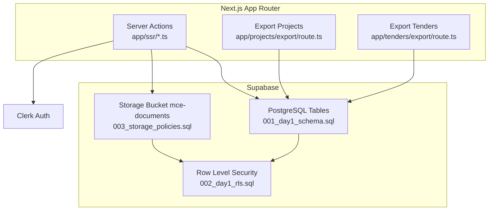

**Diagram sources**
- [app/ssr/projects.ts](file://app/ssr/projects.ts#L1-L43)
- [app/ssr/tenders.ts](file://app/ssr/tenders.ts#L1-L43)
- [app/ssr/documents.ts](file://app/ssr/documents.ts#L1-L114)
- [app/ssr/storage.ts](file://app/ssr/storage.ts#L1-L35)
- [app/ssr/comms.ts](file://app/ssr/comms.ts#L1-L38)
- [app/ssr/notifications.ts](file://app/ssr/notifications.ts#L1-L27)
- [app/ssr/audit.ts](file://app/ssr/audit.ts#L1-L29)
- [app/ssr/profile.ts](file://app/ssr/profile.ts#L1-L31)
- [app/projects/export/route.ts](file://app/projects/export/route.ts)
- [app/tenders/export/route.ts](file://app/tenders/export/route.ts)
- [supabase/migrations/001_day1_schema.sql](file://supabase/migrations/001_day1_schema.sql#L1-L227)
- [supabase/migrations/002_day1_rls.sql](file://supabase/migrations/002_day1_rls.sql#L1-L348)
- [supabase/migrations/003_storage_policies.sql](file://supabase/migrations/003_storage_policies.sql#L1-L55)

**Section sources**
- [README.md](file://README.md#L1-L158)
- [package.json](file://package.json#L1-L32)

## Core Components
- Supabase client initialization with Clerk JWT tokens for user-scoped requests
- Service role client for privileged operations (e.g., profile upsert)
- Server Actions for:
  - Project management (create)
  - Tender management (create)
  - Document lifecycle (prepare upload, signed download, extraction job)
  - Communication events (add tender comms)
  - Notifications (acknowledge)
  - Audit logging (write audit)
  - Profile upsert (ensure profile exists and is current)
- Export routes for CSV exports of projects and tenders

Key responsibilities:
- Authentication: Clerk-managed sessions; Supabase client configured with Clerk JWT
- Authorization: Supabase RLS enforces role-based access per entity
- Data integrity: Upsert profile, audit logs, and constrained inserts
- Storage: Signed URLs for upload/download; bucket-level policies

**Section sources**
- [app/ssr/client.tsx](file://app/ssr/client.tsx#L1-L25)
- [app/ssr/profile.ts](file://app/ssr/profile.ts#L1-L31)
- [app/ssr/audit.ts](file://app/ssr/audit.ts#L1-L29)
- [app/ssr/projects.ts](file://app/ssr/projects.ts#L1-L43)
- [app/ssr/tenders.ts](file://app/ssr/tenders.ts#L1-L43)
- [app/ssr/documents.ts](file://app/ssr/documents.ts#L1-L114)
- [app/ssr/storage.ts](file://app/ssr/storage.ts#L1-L35)
- [app/ssr/comms.ts](file://app/ssr/comms.ts#L1-L38)
- [app/ssr/notifications.ts](file://app/ssr/notifications.ts#L1-L27)
- [app/projects/export/route.ts](file://app/projects/export/route.ts)
- [app/tenders/export/route.ts](file://app/tenders/export/route.ts)

## Architecture Overview
High-level flow:
- Clerk authenticates users and supplies JWTs
- Supabase client fetches JWT and signs requests
- Server Actions perform validated mutations and return structured results
- Storage operations use signed URLs for secure transfers
- RLS policies enforce access control on all resources

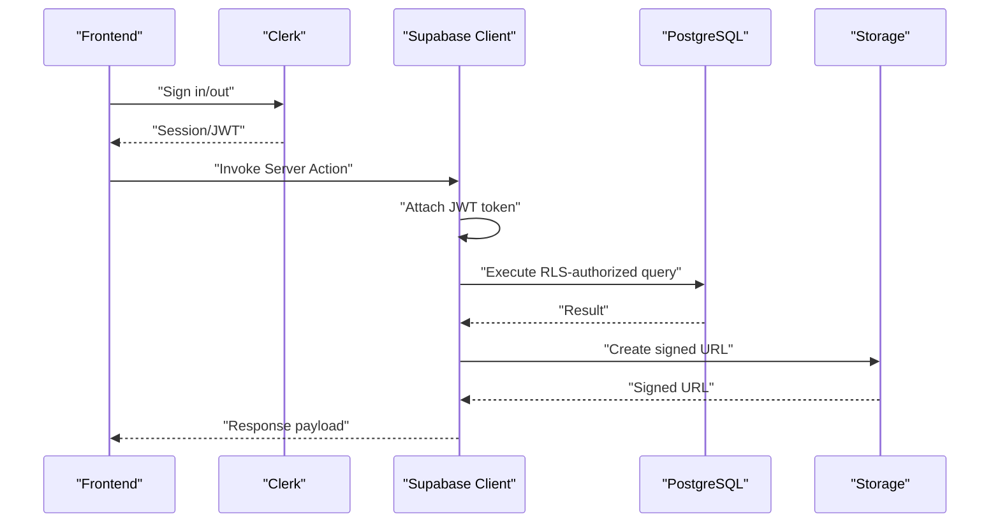

**Diagram sources**
- [app/ssr/client.tsx](file://app/ssr/client.tsx#L1-L25)
- [app/ssr/profile.ts](file://app/ssr/profile.ts#L1-L31)
- [app/ssr/documents.ts](file://app/ssr/documents.ts#L1-L114)
- [supabase/migrations/002_day1_rls.sql](file://supabase/migrations/002_day1_rls.sql#L1-L348)
- [supabase/migrations/003_storage_policies.sql](file://supabase/migrations/003_storage_policies.sql#L1-L55)

## Detailed Component Analysis

### Authentication and Session Management
- Clerk manages user sessions and redirects; Supabase client is initialized with Clerk’s JWT via the accessToken callback
- Service role client uses the service role key for privileged operations (e.g., profile upsert)
- Profile upsert ensures a profiles row exists for the authenticated Clerk user

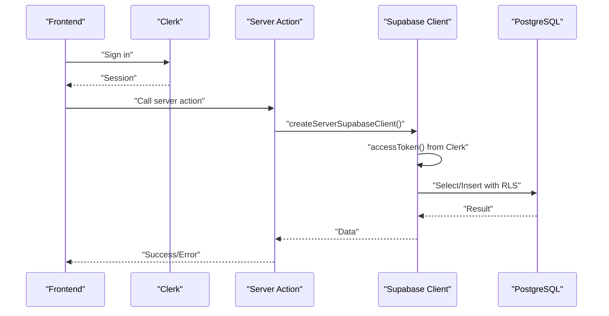

**Diagram sources**
- [app/ssr/client.tsx](file://app/ssr/client.tsx#L1-L25)
- [app/ssr/profile.ts](file://app/ssr/profile.ts#L1-L31)
- [supabase/migrations/002_day1_rls.sql](file://supabase/migrations/002_day1_rls.sql#L1-L348)

**Section sources**
- [app/ssr/client.tsx](file://app/ssr/client.tsx#L1-L25)
- [app/ssr/profile.ts](file://app/ssr/profile.ts#L1-L31)

### Project Management API
- Endpoint: Server action createProject
- Purpose: Create a project owned by the authenticated user and log audit
- Authentication: Required
- Authorization: Requires PM or admin role
- Request body:
  - code: string
  - name: string
  - status: string (enum: active, on_hold, completed)
- Response:
  - Success: void (revalidates "/projects")
  - Error: throws descriptive error message
- Audit: Logs create action on project entity

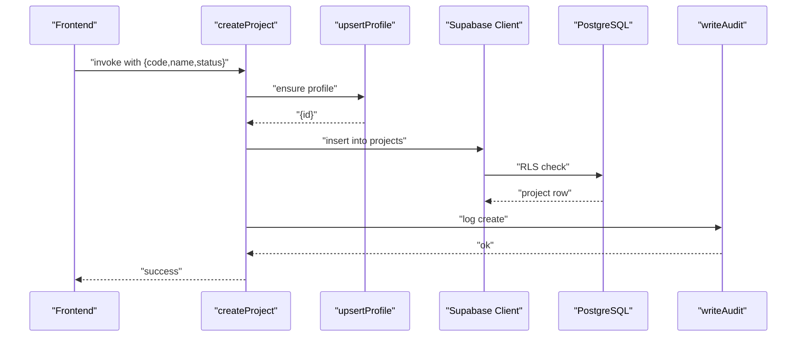

**Diagram sources**
- [app/ssr/projects.ts](file://app/ssr/projects.ts#L1-L43)
- [app/ssr/profile.ts](file://app/ssr/profile.ts#L1-L31)
- [app/ssr/audit.ts](file://app/ssr/audit.ts#L1-L29)
- [supabase/migrations/001_day1_schema.sql](file://supabase/migrations/001_day1_schema.sql#L95-L110)
- [supabase/migrations/002_day1_rls.sql](file://supabase/migrations/002_day1_rls.sql#L147-L163)

**Section sources**
- [app/ssr/projects.ts](file://app/ssr/projects.ts#L1-L43)
- [supabase/migrations/001_day1_schema.sql](file://supabase/migrations/001_day1_schema.sql#L95-L110)
- [supabase/migrations/002_day1_rls.sql](file://supabase/migrations/002_day1_rls.sql#L147-L163)

### Tender Management API
- Endpoint: Server action createTender
- Purpose: Create a tender owned by the authenticated user and log audit
- Authentication: Required
- Authorization: Requires PM or admin role
- Request body:
  - reference: string
  - deadline_at: string (ISO timestamp)
  - status: string (enum: new, in_review, submitted, awarded, lost)
- Response:
  - Success: void (revalidates "/tenders")
  - Error: throws descriptive error message
- Audit: Logs create action on tender entity

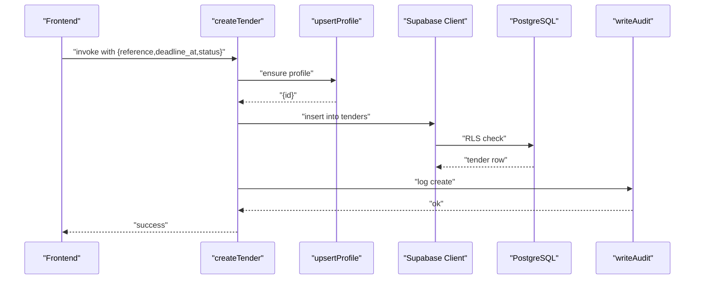

**Diagram sources**
- [app/ssr/tenders.ts](file://app/ssr/tenders.ts#L1-L43)
- [app/ssr/profile.ts](file://app/ssr/profile.ts#L1-L31)
- [app/ssr/audit.ts](file://app/ssr/audit.ts#L1-L29)
- [supabase/migrations/001_day1_schema.sql](file://supabase/migrations/001_day1_schema.sql#L130-L144)
- [supabase/migrations/002_day1_rls.sql](file://supabase/migrations/002_day1_rls.sql#L203-L222)

**Section sources**
- [app/ssr/tenders.ts](file://app/ssr/tenders.ts#L1-L43)
- [supabase/migrations/001_day1_schema.sql](file://supabase/migrations/001_day1_schema.sql#L130-L144)
- [supabase/migrations/002_day1_rls.sql](file://supabase/migrations/002_day1_rls.sql#L203-L222)

### Document Operations API
- Endpoints:
  - prepareDocumentUpload: Creates document metadata and returns a signed upload URL
  - createSignedDownload: Generates a short-lived signed download URL
  - createSignedUpload: Legacy helper to create a signed upload URL for the bucket
- Authentication: Required
- Authorization: Depends on project/tender edit permissions; uploader must match the document’s uploaded_by_profile_id
- Storage: Uses bucket "mce-documents" with private access and RLS policies

Request/response schemas:

- prepareDocumentUpload
  - Request body:
    - fileName: string
    - fileType: string (MIME type)
    - fileSize: number (bytes)
    - projectId?: string
    - tenderId?: string
    - docType?: string
    - sensitivity?: "confidential" | "restricted"
    - title?: string
  - Response:
    - documentId: string
    - signedUrl: string
    - path: string
  - Errors:
    - Missing project or tender linkage
    - Failed to create document record
    - Unable to create signed upload URL
    - Extraction job creation failure

- createSignedDownload
  - Request body:
    - referenceId: string (document id, project id, or tender id)
  - Response:
    - signedUrl: string
  - Errors:
    - Document not found
    - Unable to create signed URL

- createSignedUpload (legacy)
  - Request body:
    - filename: string
  - Response:
    - signedUrl: string
    - path: string
  - Errors:
    - Unable to create signed upload URL

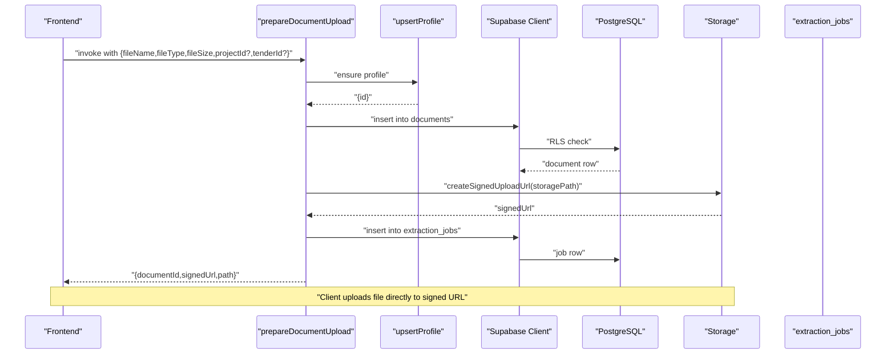

**Diagram sources**
- [app/ssr/documents.ts](file://app/ssr/documents.ts#L1-L114)
- [app/ssr/storage.ts](file://app/ssr/storage.ts#L1-L35)
- [supabase/migrations/001_day1_schema.sql](file://supabase/migrations/001_day1_schema.sql#L164-L181)
- [supabase/migrations/003_storage_policies.sql](file://supabase/migrations/003_storage_policies.sql#L1-L55)

**Section sources**
- [app/ssr/documents.ts](file://app/ssr/documents.ts#L1-L114)
- [app/ssr/storage.ts](file://app/ssr/storage.ts#L1-L35)
- [supabase/migrations/001_day1_schema.sql](file://supabase/migrations/001_day1_schema.sql#L164-L181)
- [supabase/migrations/003_storage_policies.sql](file://supabase/migrations/003_storage_policies.sql#L1-L55)

### Communication Events API
- Endpoint: Server action addTenderComms
- Purpose: Log a communication event associated with a tender
- Authentication: Required
- Authorization: Must be able to view the tender; actor must match current profile
- Request body:
  - tenderId: string
  - channel: string (enum: email, call, meeting, other)
  - notes: string
  - outcome?: string
- Response:
  - Success: void (logs audit)
  - Error: throws descriptive error message
- Audit: Logs create action on tender_comms entity

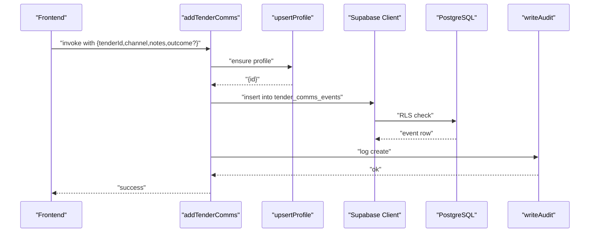

**Diagram sources**
- [app/ssr/comms.ts](file://app/ssr/comms.ts#L1-L38)
- [app/ssr/profile.ts](file://app/ssr/profile.ts#L1-L31)
- [app/ssr/audit.ts](file://app/ssr/audit.ts#L1-L29)
- [supabase/migrations/001_day1_schema.sql](file://supabase/migrations/001_day1_schema.sql#L153-L162)
- [supabase/migrations/002_day1_rls.sql](file://supabase/migrations/002_day1_rls.sql#L245-L258)

**Section sources**
- [app/ssr/comms.ts](file://app/ssr/comms.ts#L1-L38)
- [supabase/migrations/001_day1_schema.sql](file://supabase/migrations/001_day1_schema.sql#L153-L162)
- [supabase/migrations/002_day1_rls.sql](file://supabase/migrations/002_day1_rls.sql#L245-L258)

### Notifications API
- Endpoint: Server action acknowledgeNotification
- Purpose: Mark a notification as acknowledged by the recipient
- Authentication: Required
- Authorization: Must own or admin-access the notification
- Request body:
  - notificationId: string
- Response:
  - Success: void (logs audit)
  - Error: throws descriptive error message
- Audit: Logs ack action on notification entity

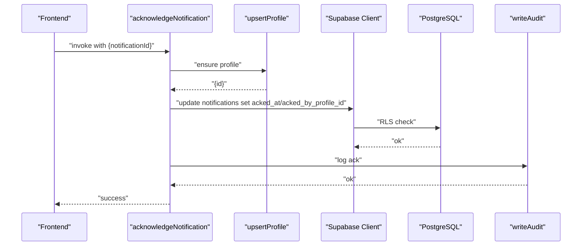

**Diagram sources**
- [app/ssr/notifications.ts](file://app/ssr/notifications.ts#L1-L27)
- [app/ssr/profile.ts](file://app/ssr/profile.ts#L1-L31)
- [app/ssr/audit.ts](file://app/ssr/audit.ts#L1-L29)
- [supabase/migrations/001_day1_schema.sql](file://supabase/migrations/001_day1_schema.sql#L193-L206)
- [supabase/migrations/002_day1_rls.sql](file://supabase/migrations/002_day1_rls.sql#L303-L317)

**Section sources**
- [app/ssr/notifications.ts](file://app/ssr/notifications.ts#L1-L27)
- [supabase/migrations/001_day1_schema.sql](file://supabase/migrations/001_day1_schema.sql#L193-L206)
- [supabase/migrations/002_day1_rls.sql](file://supabase/migrations/002_day1_rls.sql#L303-L317)

### Audit Logging API
- Endpoint: Server action writeAudit
- Purpose: Write an audit log entry for an action performed by the current profile
- Authentication: Required
- Authorization: Actor must match current profile
- Request body:
  - action: string (enum: create, update, delete, upload, ack)
  - entityType: string (enum: project, milestone, tender, tender_comms, document, notification)
  - entityId: string | null
  - metadata: object (optional)
- Response:
  - Success: void
  - Error: throws descriptive error message

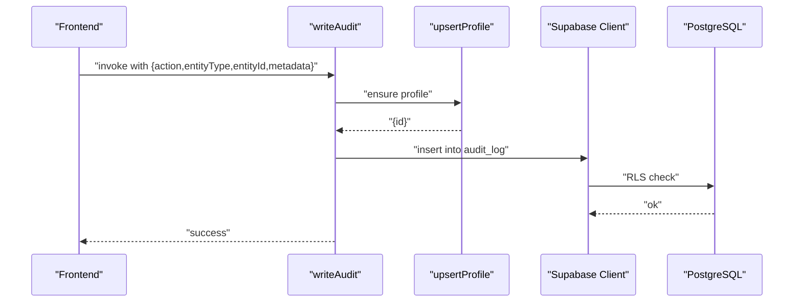

**Diagram sources**
- [app/ssr/audit.ts](file://app/ssr/audit.ts#L1-L29)
- [app/ssr/profile.ts](file://app/ssr/profile.ts#L1-L31)
- [supabase/migrations/001_day1_schema.sql](file://supabase/migrations/001_day1_schema.sql#L208-L216)
- [supabase/migrations/002_day1_rls.sql](file://supabase/migrations/002_day1_rls.sql#L318-L331)

**Section sources**
- [app/ssr/audit.ts](file://app/ssr/audit.ts#L1-L29)
- [supabase/migrations/001_day1_schema.sql](file://supabase/migrations/001_day1_schema.sql#L208-L216)
- [supabase/migrations/002_day1_rls.sql](file://supabase/migrations/002_day1_rls.sql#L318-L331)

### Export Routes API
- Projects export: GET /projects/export
- Tenders export: GET /tenders/export
- Purpose: Download CSV exports of projects and tenders
- Authentication: Required (enforced by middleware and RLS)
- Authorization: Depends on view permissions per RLS policies
- Response:
  - Success: CSV stream
  - Error: throws descriptive error message

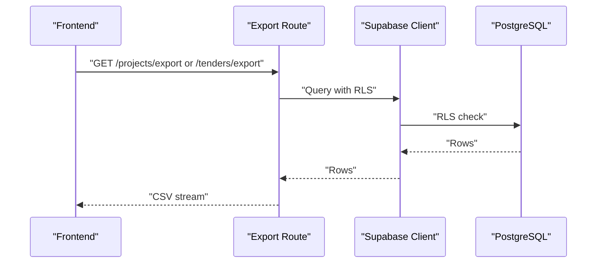

**Diagram sources**
- [app/projects/export/route.ts](file://app/projects/export/route.ts)
- [app/tenders/export/route.ts](file://app/tenders/export/route.ts)
- [supabase/migrations/002_day1_rls.sql](file://supabase/migrations/002_day1_rls.sql#L147-L163)

**Section sources**
- [app/projects/export/route.ts](file://app/projects/export/route.ts)
- [app/tenders/export/route.ts](file://app/tenders/export/route.ts)
- [supabase/migrations/002_day1_rls.sql](file://supabase/migrations/002_day1_rls.sql#L147-L163)

## Dependency Analysis
- Frontend invokes server actions via Next.js App Router
- Server actions depend on:
  - Clerk for authentication
  - Supabase client configured with Clerk JWT for user-scoped operations
  - Service role client for privileged operations (e.g., profile upsert)
- Supabase enforces:
  - Row-level security policies for all tables
  - Storage policies for bucket access
- Export routes rely on Supabase queries with RLS

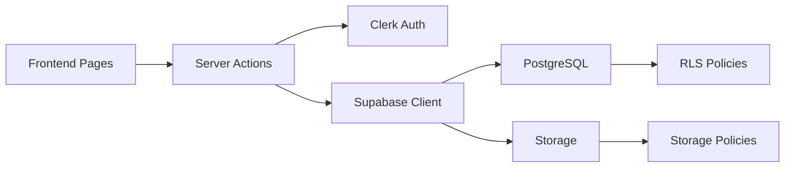

**Diagram sources**
- [app/ssr/client.tsx](file://app/ssr/client.tsx#L1-L25)
- [supabase/migrations/002_day1_rls.sql](file://supabase/migrations/002_day1_rls.sql#L1-L348)
- [supabase/migrations/003_storage_policies.sql](file://supabase/migrations/003_storage_policies.sql#L1-L55)

**Section sources**
- [app/ssr/client.tsx](file://app/ssr/client.tsx#L1-L25)
- [supabase/migrations/002_day1_rls.sql](file://supabase/migrations/002_day1_rls.sql#L1-L348)
- [supabase/migrations/003_storage_policies.sql](file://supabase/migrations/003_storage_policies.sql#L1-L55)

## Performance Considerations
- Minimize round-trips by batching related operations within a single server action
- Use targeted selects with indexes (e.g., tenders by deadline, documents by project/tender)
- Prefer signed URLs for direct storage uploads to reduce server bandwidth
- Revalidation occurs after mutations; avoid unnecessary revalidation paths
- Export routes should stream CSV to reduce memory usage

## Troubleshooting Guide
Common issues and resolutions:
- Build fails: invalid Clerk key
  - Ensure NEXT_PUBLIC_CLERK_PUBLISHABLE_KEY is valid
- RLS denied / empty data
  - Confirm the signed-in user has a profiles row and correct role assignments
- Document upload fails
  - Verify bucket mce-documents exists and is private
  - Confirm migrations were applied in order
  - Ensure the document metadata row exists before upload
- Signed URL fails
  - Verify storage policies are applied
  - Ensure the requesting user has access to the linked project/tender

**Section sources**
- [README.md](file://README.md#L141-L158)

## Conclusion
MCE Command Center’s server-side API is built around Next.js Server Actions and Supabase with Clerk authentication. The design emphasizes:
- Strong authentication and authorization via Clerk and Supabase RLS
- Clear separation of concerns: profile management, audit logging, and business logic
- Secure document workflows using signed URLs and bucket policies
- Extensible audit trail for compliance and traceability

## Appendices

### Data Models Overview
```mermaid
erDiagram
PROFILES {
uuid id PK
text clerk_user_id UK
text email
text display_name
enum role
timestamptz created_at
timestamptz updated_at
}
CLIENTS {
uuid id PK
text name
text classification
text notes
timestamptz created_at
timestamptz updated_at
}
PROJECTS {
uuid id PK
text code UK
text name
uuid client_id FK
uuid pm_profile_id FK
text stage
date start_date
date end_date
date dlp_date
integer progress_pct
enum status
text[] tags
timestamptz created_at
timestamptz updated_at
}
PROJECT_MEMBERS {
uuid project_id FK
uuid profile_id FK
enum member_role
timestamptz created_at
}
PROJECT_MILESTONES {
uuid id PK
uuid project_id FK
text title
date due_date
uuid owner_profile_id FK
enum status
timestamptz created_at
}
TENDERS {
uuid id PK
uuid client_id FK
uuid project_id FK
text reference
text title
timestamptz deadline_at
enum status
numeric value_amount
text value_currency
uuid owner_profile_id FK
timestamptz next_followup_at
timestamptz created_at
timestamptz updated_at
}
TENDER_MEMBERS {
uuid tender_id FK
uuid profile_id FK
timestamptz created_at
}
TENDER_COMMS_EVENTS {
uuid id PK
uuid tender_id FK
uuid actor_profile_id FK
timestamptz occurred_at
enum channel
text outcome
text notes
timestamptz created_at
}
DOCUMENTS {
uuid id PK
text doc_type
enum sensitivity
uuid project_id FK
uuid tender_id FK
text title
text storage_bucket
text storage_path
text mime_type
bigint size_bytes
uuid uploaded_by_profile_id FK
timestamptz created_at
uuid version_group_id
integer version_number
}
EXTRACTION_JOBS {
uuid id PK
uuid document_id FK
text job_type
text status
timestamptz started_at
timestamptz finished_at
jsonb result_json
text error_message
}
NOTIFICATIONS {
uuid id PK
uuid recipient_profile_id FK
enum severity
enum type
text message
enum audit_entity entity_type
uuid entity_id
boolean ack_required
timestamptz acked_at
uuid acked_by_profile_id FK
timestamptz read_at
timestamptz created_at
}
AUDIT_LOG {
uuid id PK
uuid actor_profile_id FK
enum action
enum entity_type
uuid entity_id
timestamptz occurred_at
jsonb metadata
}
PROFILES ||--o{ PROJECTS : "pm"
CLIENTS ||--o{ PROJECTS : "owns"
PROFILES ||--o{ PROJECT_MEMBERS : "member_of"
PROJECTS ||--o{ PROJECT_MEMBERS : "has"
PROFILES ||--o{ PROJECT_MILESTONES : "owner"
CLIENTS ||--o{ TENDERS : "owns"
PROFILES ||--o{ TENDERS : "owner"
PROJECTS ||--o{ TENDERS : "linked_to"
PROFILES ||--o{ TENDER_MEMBERS : "member_of"
TENDERS ||--o{ TENDER_MEMBERS : "has"
TENDERS ||--o{ TENDER_COMMS_EVENTS : "has"
PROFILES ||--o{ TENDER_COMMS_EVENTS : "actor"
PROFILES ||--o{ DOCUMENTS : "uploaded"
DOCUMENTS ||--o{ EXTRACTION_JOBS : "triggers"
PROFILES ||--o{ NOTIFICATIONS : "recipient"
PROFILES ||--o{ AUDIT_LOG : "actor"
```

**Diagram sources**
- [supabase/migrations/001_day1_schema.sql](file://supabase/migrations/001_day1_schema.sql#L76-L227)

### Authentication and Authorization Summary
- Authentication: Clerk-managed sessions; Supabase client attaches Clerk JWT
- Authorization: Supabase RLS policies define who can view/edit projects, tenders, documents, and notifications
- Roles: super_admin, chairman_vp, dept_head, pm, engineer, finance, viewer
- Access checks:
  - Projects: PM, project members, or admins
  - Tenders: owner, project view access, or admins
  - Documents: uploader or editors of linked project/tender
  - Notifications: recipient or admins

**Section sources**
- [app/ssr/client.tsx](file://app/ssr/client.tsx#L1-L25)
- [supabase/migrations/002_day1_rls.sql](file://supabase/migrations/002_day1_rls.sql#L1-L348)

### Rate Limiting and Security Considerations
- Rate limiting: Not implemented at the application level; consider platform-level limits and implement API quotas as needed
- Security:
  - Never expose SUPABASE_SERVICE_ROLE_KEY to the client
  - Use signed URLs for storage uploads/downloads
  - Enforce RLS on all tables and storage policies
  - Audit sensitive actions (create, upload, ack)

**Section sources**
- [README.md](file://README.md#L74-L91)
- [app/ssr/storage.ts](file://app/ssr/storage.ts#L1-L35)
- [supabase/migrations/003_storage_policies.sql](file://supabase/migrations/003_storage_policies.sql#L1-L55)

### API Versioning and Compatibility
- No explicit API versioning is present in the codebase
- Backward compatibility: RLS and storage policies protect against breaking changes
- Deprecation: No deprecated endpoints observed; maintain append-only audit and comms tables

**Section sources**
- [supabase/migrations/002_day1_rls.sql](file://supabase/migrations/002_day1_rls.sql#L332-L348)

### Practical Usage Examples
- Create a project:
  - Invoke createProject with {code, name, status}
  - Expect success or error thrown on failure
- Upload a document:
  - Call prepareDocumentUpload with {fileName, fileType, fileSize, projectId or tenderId}
  - Use returned signedUrl to upload directly to storage
  - On success, an extraction job is created automatically
- Acknowledge a notification:
  - Call acknowledgeNotification with notificationId
  - On success, the notification is marked acknowledged
- Export data:
  - Navigate to /projects/export or /tenders/export to download CSV

**Section sources**
- [app/ssr/projects.ts](file://app/ssr/projects.ts#L1-L43)
- [app/ssr/tenders.ts](file://app/ssr/tenders.ts#L1-L43)
- [app/ssr/documents.ts](file://app/ssr/documents.ts#L1-L114)
- [app/ssr/notifications.ts](file://app/ssr/notifications.ts#L1-L27)
- [app/projects/export/route.ts](file://app/projects/export/route.ts)
- [app/tenders/export/route.ts](file://app/tenders/export/route.ts)