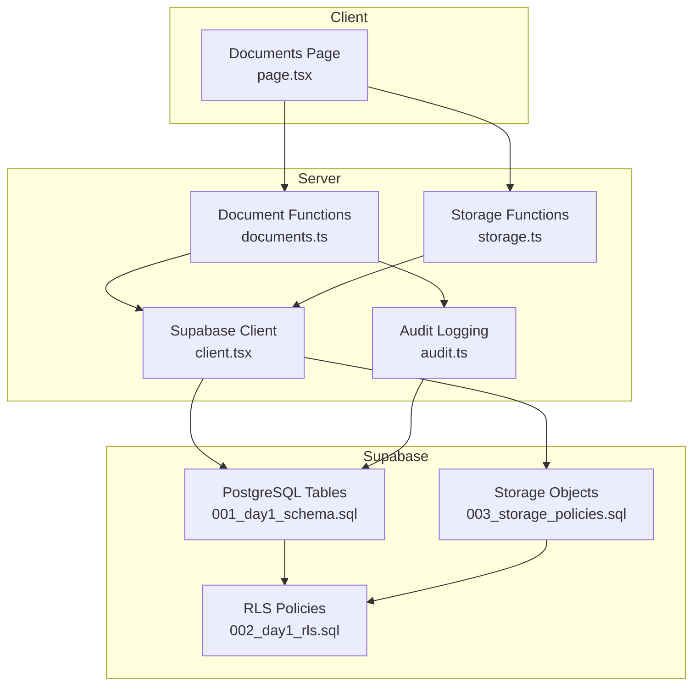
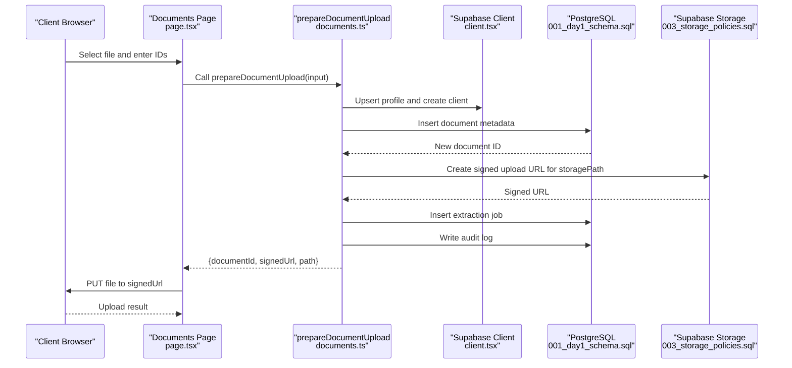
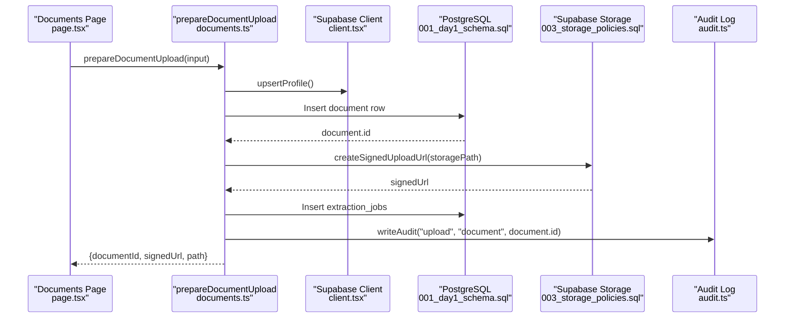
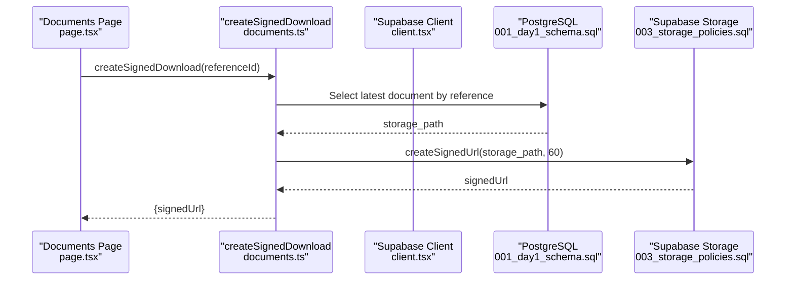
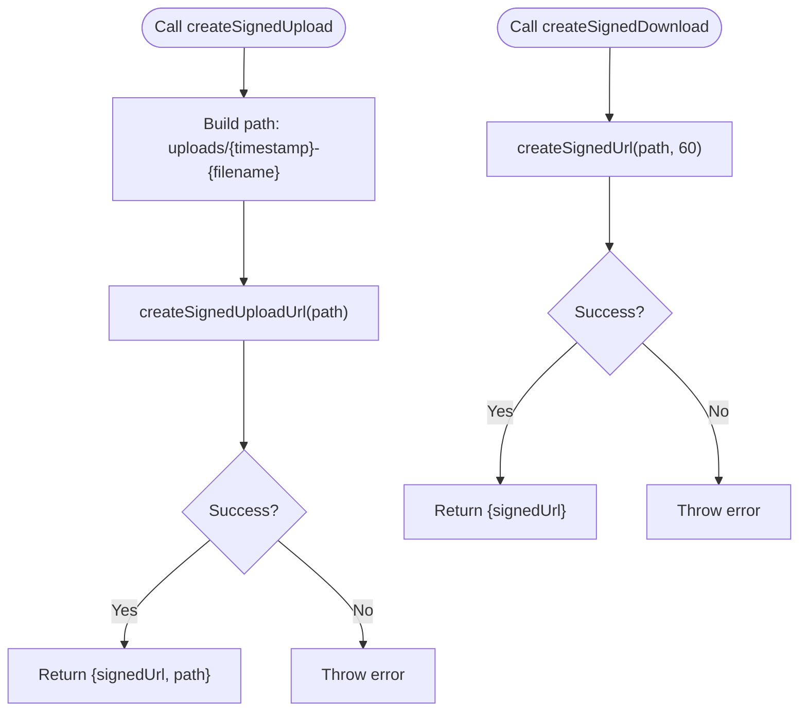
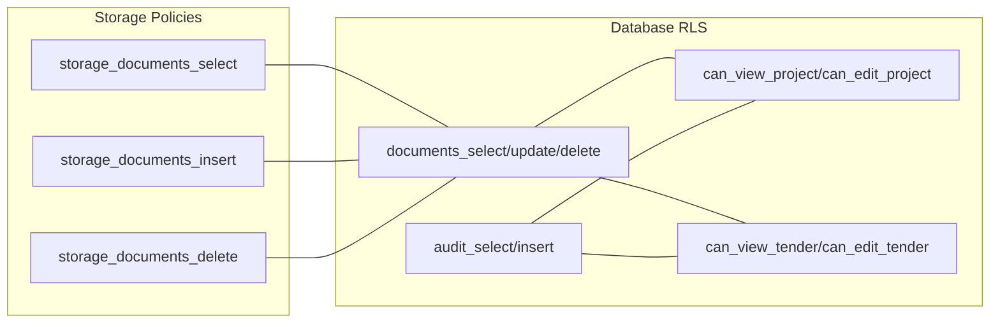
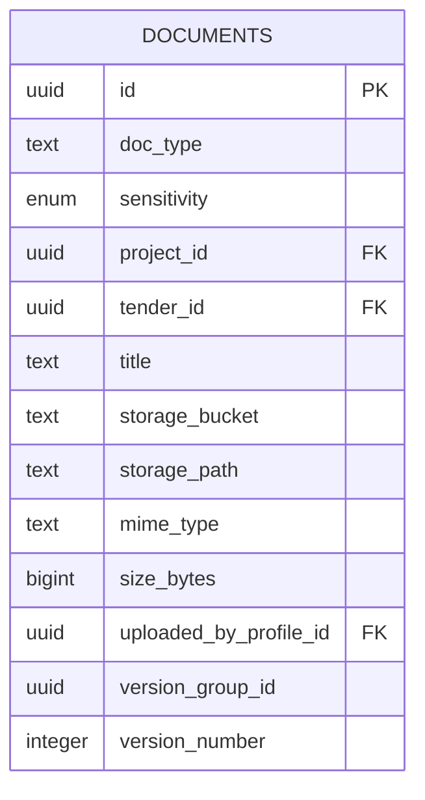
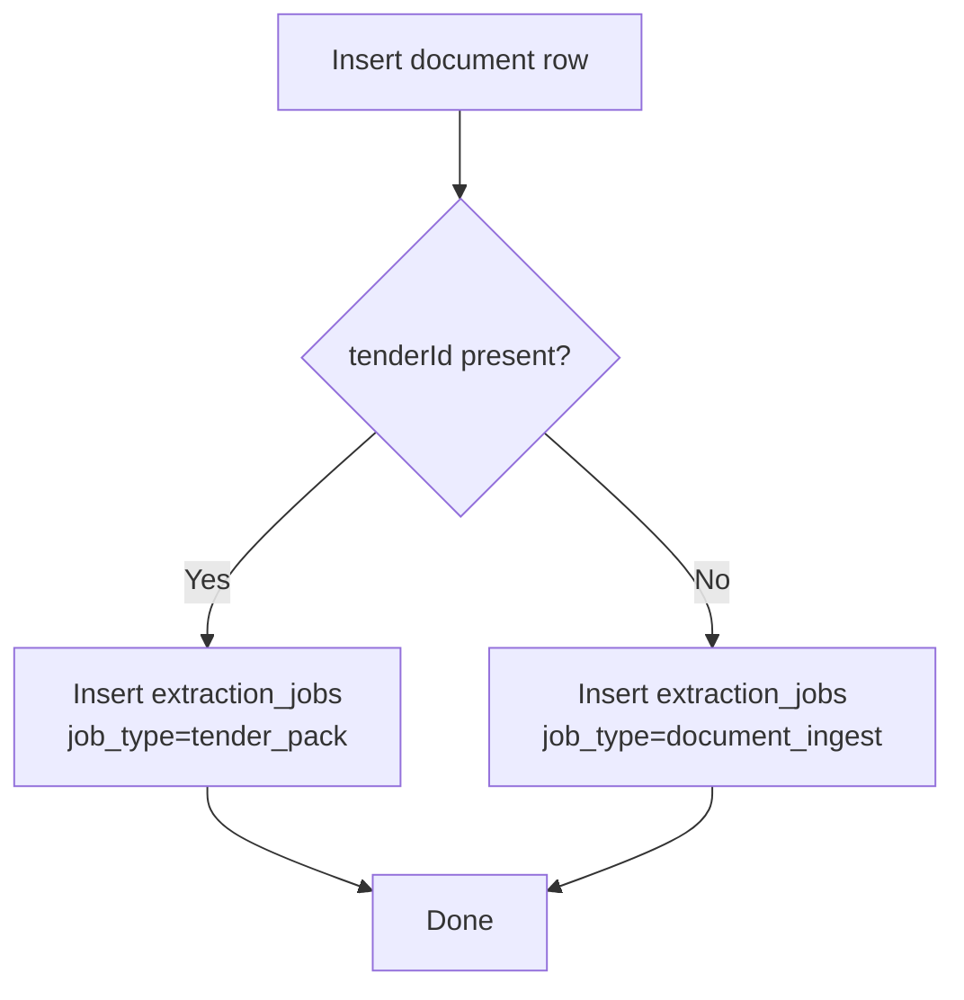
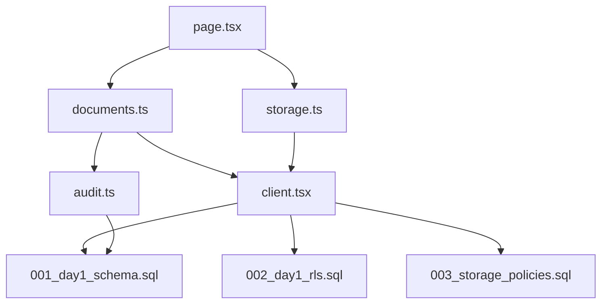

# Document Operations API

<cite>
**Referenced Files in This Document**
- [documents.ts](file://app/ssr/documents.ts)
- [storage.ts](file://app/ssr/storage.ts)
- [client.tsx](file://app/ssr/client.tsx)
- [audit.ts](file://app/ssr/audit.ts)
- [001_day1_schema.sql](file://supabase/migrations/001_day1_schema.sql)
- [002_day1_rls.sql](file://supabase/migrations/002_day1_rls.sql)
- [003_storage_policies.sql](file://supabase/migrations/003_storage_policies.sql)
- [page.tsx](file://app/documents/page.tsx)
- [.env.local.example](file://.env.local.example)
- [middleware.ts](file://middleware.ts)
</cite>

## Table of Contents
1. [Introduction](#introduction)
2. [Project Structure](#project-structure)
3. [Core Components](#core-components)
4. [Architecture Overview](#architecture-overview)
5. [Detailed Component Analysis](#detailed-component-analysis)
6. [Dependency Analysis](#dependency-analysis)
7. [Performance Considerations](#performance-considerations)
8. [Troubleshooting Guide](#troubleshooting-guide)
9. [Conclusion](#conclusion)
10. [Appendices](#appendices)

## Introduction
This document provides comprehensive API documentation for document management operations in MCE Command Center. It covers the end-to-end lifecycle of document uploads, metadata creation, signed URL generation, file validation, storage integration with Supabase Storage, retrieval, access control enforcement, version management, processing pipeline, and audit trail integration. It also includes request/response schemas, error handling, security considerations, and practical examples.

## Project Structure
The document management system is implemented using Next.js App Router with server-side functions and Supabase for database and storage. Key components:
- Client-side UI for initiating uploads and downloads
- Server-side functions for document metadata persistence, signed URL generation, and audit logging
- Supabase database schema with Row Level Security (RLS) policies
- Supabase Storage policies enforcing access controls per document context

**Diagram sources**
- [page.tsx](file://app/documents/page.tsx#L1-L90)
- [documents.ts](file://app/ssr/documents.ts#L1-L114)
- [storage.ts](file://app/ssr/storage.ts#L1-L35)
- [client.tsx](file://app/ssr/client.tsx#L1-L25)
- [audit.ts](file://app/ssr/audit.ts#L1-L29)
- [001_day1_schema.sql](file://supabase/migrations/001_day1_schema.sql#L164-L191)
- [002_day1_rls.sql](file://supabase/migrations/002_day1_rls.sql#L259-L301)
- [003_storage_policies.sql](file://supabase/migrations/003_storage_policies.sql#L1-L55)

**Section sources**
- [page.tsx](file://app/documents/page.tsx#L1-L90)
- [documents.ts](file://app/ssr/documents.ts#L1-L114)
- [storage.ts](file://app/ssr/storage.ts#L1-L35)
- [client.tsx](file://app/ssr/client.tsx#L1-L25)
- [audit.ts](file://app/ssr/audit.ts#L1-L29)
- [001_day1_schema.sql](file://supabase/migrations/001_day1_schema.sql#L164-L191)
- [002_day1_rls.sql](file://supabase/migrations/002_day1_rls.sql#L259-L301)
- [003_storage_policies.sql](file://supabase/migrations/003_storage_policies.sql#L1-L55)

## Core Components
- Document preparation and upload: Creates metadata, generates signed upload URL, enqueues extraction job, writes audit entry.
- Signed download generation: Resolves latest document by reference and creates a time-limited signed URL.
- Storage utilities: Generic helpers for signed upload and download URLs.
- Access control: Enforced via PostgreSQL RLS and Supabase Storage policies.
- Audit trail: Records upload actions with contextual metadata.

Key responsibilities:
- Metadata creation: Inserts document record with type, sensitivity, project/tender linkage, MIME type, size, and uploader identity.
- Signed URL generation: Uses Supabase Storage to create short-lived upload URLs for direct client uploads.
- Extraction pipeline: Triggers extraction jobs based on document context (tender pack vs. generic document).
- Retrieval: Supports lookup by document ID, project ID, or tender ID with version-aware selection.
- Security: Enforces access checks for both database rows and storage objects.

**Section sources**
- [documents.ts](file://app/ssr/documents.ts#L11-L86)
- [storage.ts](file://app/ssr/storage.ts#L6-L34)
- [001_day1_schema.sql](file://supabase/migrations/001_day1_schema.sql#L164-L191)
- [002_day1_rls.sql](file://supabase/migrations/002_day1_rls.sql#L259-L301)
- [003_storage_policies.sql](file://supabase/migrations/003_storage_policies.sql#L1-L55)
- [audit.ts](file://app/ssr/audit.ts#L6-L28)

## Architecture Overview
The document workflow integrates client UI, server functions, Supabase database, and Supabase Storage with strict access control enforced at both layers.

**Diagram sources**
- [page.tsx](file://app/documents/page.tsx#L12-L36)
- [documents.ts](file://app/ssr/documents.ts#L21-L86)
- [client.tsx](file://app/ssr/client.tsx#L4-L14)
- [001_day1_schema.sql](file://supabase/migrations/001_day1_schema.sql#L164-L191)
- [003_storage_policies.sql](file://supabase/migrations/003_storage_policies.sql#L22-L39)

## Detailed Component Analysis

### Document Upload Workflow
End-to-end flow for preparing a document upload, including metadata creation, signed URL generation, and extraction job scheduling.

**Diagram sources**
- [page.tsx](file://app/documents/page.tsx#L15-L22)
- [documents.ts](file://app/ssr/documents.ts#L21-L86)
- [client.tsx](file://app/ssr/client.tsx#L4-L14)
- [001_day1_schema.sql](file://supabase/migrations/001_day1_schema.sql#L164-L191)
- [003_storage_policies.sql](file://supabase/migrations/003_storage_policies.sql#L57-L63)
- [audit.ts](file://app/ssr/audit.ts#L17-L23)

**Section sources**
- [documents.ts](file://app/ssr/documents.ts#L11-L86)
- [page.tsx](file://app/documents/page.tsx#L12-L36)

### Document Retrieval and Signed Download
Retrieval supports fetching the latest document by ID, project ID, or tender ID, then generating a time-limited signed URL for download.

**Diagram sources**
- [page.tsx](file://app/documents/page.tsx#L38-L42)
- [documents.ts](file://app/ssr/documents.ts#L88-L113)
- [client.tsx](file://app/ssr/client.tsx#L4-L14)
- [001_day1_schema.sql](file://supabase/migrations/001_day1_schema.sql#L164-L191)
- [003_storage_policies.sql](file://supabase/migrations/003_storage_policies.sql#L104-L110)

**Section sources**
- [documents.ts](file://app/ssr/documents.ts#L88-L113)
- [page.tsx](file://app/documents/page.tsx#L38-L42)

### Storage Utilities
Generic helpers for signed upload and download URLs, useful for ad-hoc operations outside the main document workflow.

**Diagram sources**
- [storage.ts](file://app/ssr/storage.ts#L6-L34)

**Section sources**
- [storage.ts](file://app/ssr/storage.ts#L6-L34)

### Access Control and Security
Access control is enforced at two layers:
- Database (PostgreSQL): RLS policies on documents and audit tables, plus helper functions for current user roles and permissions.
- Storage (Supabase): RLS policies on storage.objects ensuring only authorized users can select, insert, or delete within the configured bucket.

**Diagram sources**
- [002_day1_rls.sql](file://supabase/migrations/002_day1_rls.sql#L259-L301)
- [003_storage_policies.sql](file://supabase/migrations/003_storage_policies.sql#L3-L54)

**Section sources**
- [002_day1_rls.sql](file://supabase/migrations/002_day1_rls.sql#L259-L301)
- [003_storage_policies.sql](file://supabase/migrations/003_storage_policies.sql#L1-L55)

### Version Management
The schema defines version fields for documents, enabling version grouping and numbering. While the current upload workflow does not explicitly increment versions, the presence of version fields indicates support for future versioning features.

**Diagram sources**
- [001_day1_schema.sql](file://supabase/migrations/001_day1_schema.sql#L164-L180)

**Section sources**
- [001_day1_schema.sql](file://supabase/migrations/001_day1_schema.sql#L164-L180)

### Extraction Jobs and Metadata Indexing
On successful metadata creation, an extraction job is inserted into the extraction_jobs table. This enables downstream processing (e.g., text extraction, OCR, indexing) based on job_type.

**Diagram sources**
- [documents.ts](file://app/ssr/documents.ts#L66-L69)
- [001_day1_schema.sql](file://supabase/migrations/001_day1_schema.sql#L182-L191)

**Section sources**
- [documents.ts](file://app/ssr/documents.ts#L65-L73)
- [001_day1_schema.sql](file://supabase/migrations/001_day1_schema.sql#L182-L191)

## Dependency Analysis
The document operations depend on:
- Supabase client initialization with Clerk JWT for authentication
- Database schema for documents and extraction_jobs
- Storage policies for bucket-level access control
- Audit logging for compliance and traceability

**Diagram sources**
- [page.tsx](file://app/documents/page.tsx#L1-L90)
- [documents.ts](file://app/ssr/documents.ts#L1-L114)
- [storage.ts](file://app/ssr/storage.ts#L1-L35)
- [client.tsx](file://app/ssr/client.tsx#L1-L25)
- [audit.ts](file://app/ssr/audit.ts#L1-L29)
- [001_day1_schema.sql](file://supabase/migrations/001_day1_schema.sql#L164-L191)
- [002_day1_rls.sql](file://supabase/migrations/002_day1_rls.sql#L259-L301)
- [003_storage_policies.sql](file://supabase/migrations/003_storage_policies.sql#L1-L55)

**Section sources**
- [page.tsx](file://app/documents/page.tsx#L1-L90)
- [documents.ts](file://app/ssr/documents.ts#L1-L114)
- [storage.ts](file://app/ssr/storage.ts#L1-L35)
- [client.tsx](file://app/ssr/client.tsx#L1-L25)
- [audit.ts](file://app/ssr/audit.ts#L1-L29)
- [001_day1_schema.sql](file://supabase/migrations/001_day1_schema.sql#L164-L191)
- [002_day1_rls.sql](file://supabase/migrations/002_day1_rls.sql#L259-L301)
- [003_storage_policies.sql](file://supabase/migrations/003_storage_policies.sql#L1-L55)

## Performance Considerations
- Signed URL lifetimes: Downloads use a short TTL (e.g., 60 seconds) to minimize exposure windows.
- Batch operations: Consider batching multiple uploads or downloads to reduce round trips.
- Index utilization: Queries leverage indexes on project_id, tender_id, and audit lookups; ensure IDs are provided to maximize performance.
- Storage path construction: Timestamp prefixes avoid collisions and improve ordering.

[No sources needed since this section provides general guidance]

## Troubleshooting Guide
Common errors and resolutions:
- Missing project or tender context during upload preparation: Ensure either projectId or tenderId is provided.
- Document not found during download: Verify the referenceId corresponds to a document ID, project ID, or tender ID; the system selects the latest document by creation time.
- Access denied: Confirm the user has appropriate permissions via RLS policies; administrators, project members, or tender members can access documents within their scope.
- Storage permission denied: Ensure the storage path matches an existing document record and the user meets the insert/delete criteria defined in storage policies.

**Section sources**
- [documents.ts](file://app/ssr/documents.ts#L26-L28)
- [documents.ts](file://app/ssr/documents.ts#L100-L101)
- [002_day1_rls.sql](file://supabase/migrations/002_day1_rls.sql#L259-L301)
- [003_storage_policies.sql](file://supabase/migrations/003_storage_policies.sql#L22-L39)

## Conclusion
MCE Command Center’s document management system provides a secure, auditable, and extensible framework for uploading, retrieving, and processing documents. It leverages Supabase for robust access control and storage, with clear separation of concerns between client UI, server functions, and backend services.

[No sources needed since this section summarizes without analyzing specific files]

## Appendices

### Request/Response Schemas

- prepareDocumentUpload(input)
  - Request body fields:
    - fileName: string
    - fileType: string
    - fileSize: number
    - projectId?: string
    - tenderId?: string
    - docType?: string
    - sensitivity?: "confidential" | "restricted"
    - title?: string
  - Response fields:
    - documentId: string
    - signedUrl: string
    - path: string
  - Example request payload:
    - { "fileName": "report.pdf", "fileType": "application/pdf", "fileSize": 1048576, "projectId": "proj-uuid" }
  - Example response payload:
    - { "documentId": "doc-uuid", "signedUrl": "https://bucket.supabase.co...", "path": "projects/proj-uuid/1700000000-report.pdf" }

- createSignedDownload(referenceId)
  - Request parameters:
    - referenceId: string (document ID, project ID, or tender ID)
  - Response fields:
    - signedUrl: string
  - Example request:
    - GET /api/document/download?referenceId=proj-uuid
  - Example response:
    - { "signedUrl": "https://bucket.supabase.co/..." }

- createSignedUpload(filename)
  - Request parameters:
    - filename: string
  - Response fields:
    - signedUrl: string
    - path: string
  - Example response:
    - { "signedUrl": "https://bucket.supabase.co/...", "path": "uploads/1700000000-file.txt" }

- createSignedDownloadByPath(path)
  - Request parameters:
    - path: string (storage path)
  - Response fields:
    - signedUrl: string
  - Example response:
    - { "signedUrl": "https://bucket.supabase.co/..." }

**Section sources**
- [documents.ts](file://app/ssr/documents.ts#L11-L86)
- [documents.ts](file://app/ssr/documents.ts#L88-L113)
- [storage.ts](file://app/ssr/storage.ts#L6-L34)

### File Format Restrictions and Size Limitations
- File formats: No explicit server-side format filtering is implemented in the referenced code; enforcement should be applied at the client or via external systems.
- Size limits: No explicit size checks are present in the referenced code; consider implementing client-side validation and backend constraints as needed.

[No sources needed since this section provides general guidance]

### Security Considerations
- Authentication: Middleware enforces Clerk authentication for protected routes.
- Authorization: RLS policies and storage policies restrict access based on user roles and document context.
- Signed URLs: Short-lived URLs minimize risk exposure; ensure clients do not cache or share URLs.
- Audit trail: Upload actions are recorded with metadata for compliance and monitoring.

**Section sources**
- [middleware.ts](file://middleware.ts#L1-L20)
- [002_day1_rls.sql](file://supabase/migrations/002_day1_rls.sql#L259-L301)
- [003_storage_policies.sql](file://supabase/migrations/003_storage_policies.sql#L1-L55)
- [audit.ts](file://app/ssr/audit.ts#L6-L28)

### Practical Examples

- Complete upload workflow:
  - Client collects file and IDs, calls prepareDocumentUpload, receives signedUrl and path, performs PUT upload, and optionally refreshes UI state.
  - Reference: [page.tsx](file://app/documents/page.tsx#L12-L36), [documents.ts](file://app/ssr/documents.ts#L21-L86)

- Download workflow:
  - Client calls createSignedDownload with a project or tender ID, opens the returned signed URL in a new tab.
  - Reference: [page.tsx](file://app/documents/page.tsx#L38-L42), [documents.ts](file://app/ssr/documents.ts#L88-L113)

- Access control pattern:
  - Users gain access by being members of a project or tender, or by having administrative roles; storage policies further constrain operations to authorized users.
  - Reference: [002_day1_rls.sql](file://supabase/migrations/002_day1_rls.sql#L37-L113), [003_storage_policies.sql](file://supabase/migrations/003_storage_policies.sql#L3-L54)

- Environment configuration:
  - Required environment variables include Clerk and Supabase credentials.
  - Reference: [.env.local.example](file://.env.local.example#L1-L11)

**Section sources**
- [page.tsx](file://app/documents/page.tsx#L12-L42)
- [documents.ts](file://app/ssr/documents.ts#L21-L113)
- [002_day1_rls.sql](file://supabase/migrations/002_day1_rls.sql#L37-L113)
- [003_storage_policies.sql](file://supabase/migrations/003_storage_policies.sql#L3-L54)
- [.env.local.example](file://.env.local.example#L1-L11)