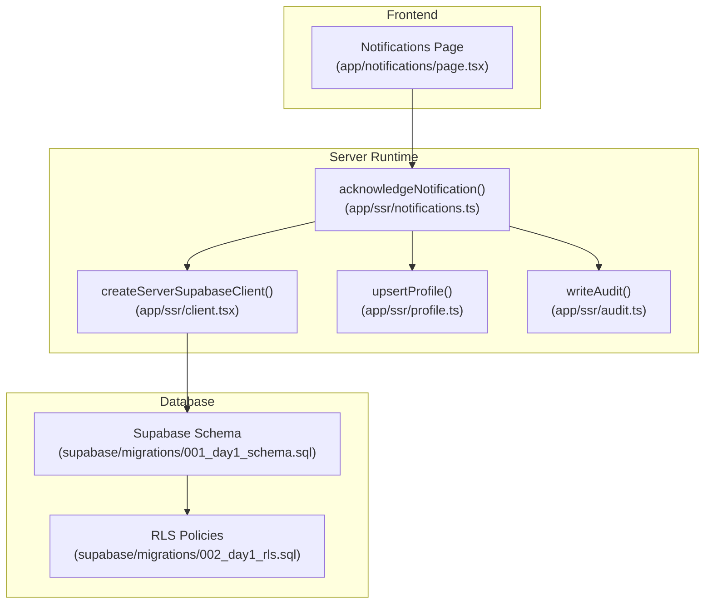
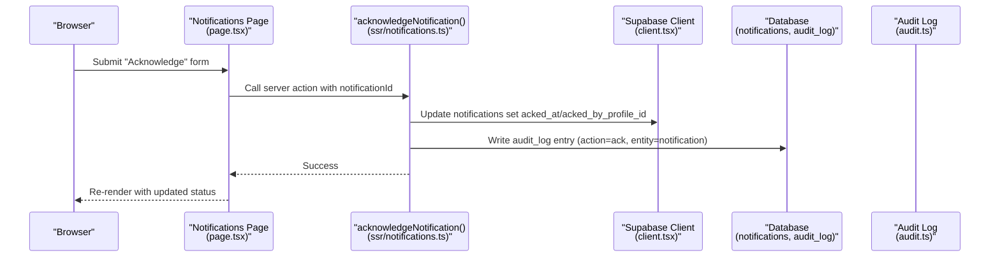
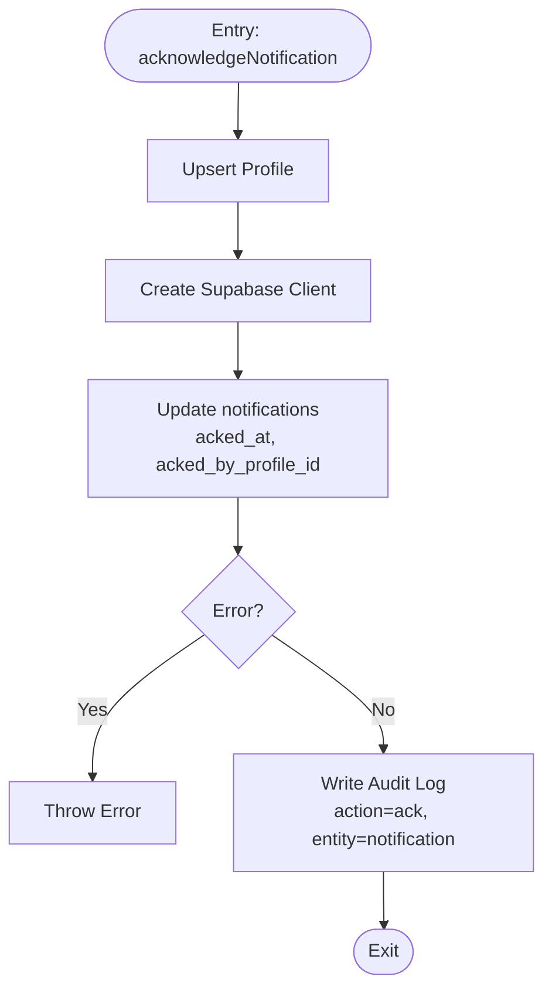
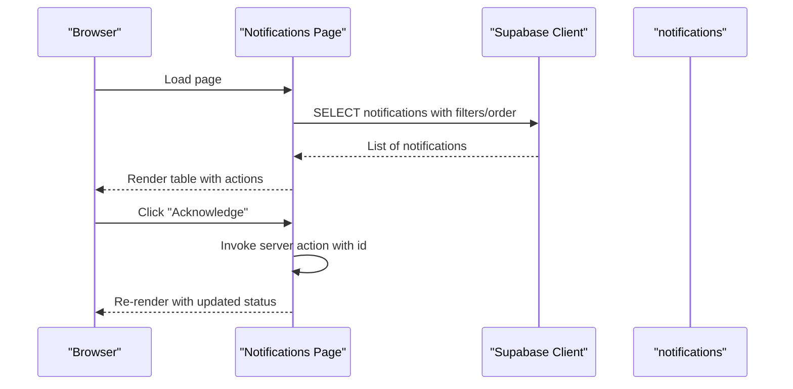
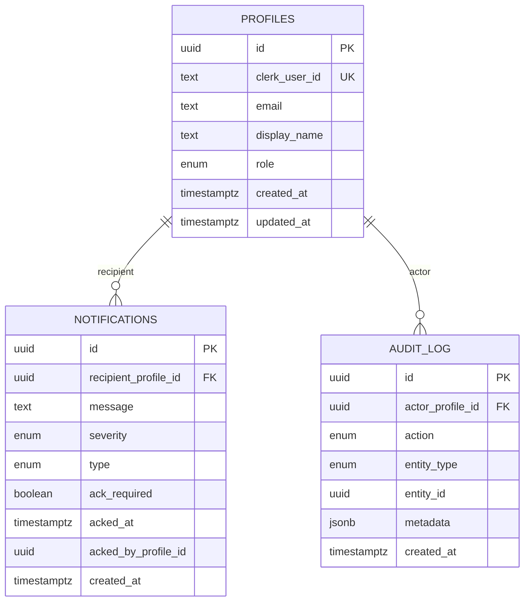
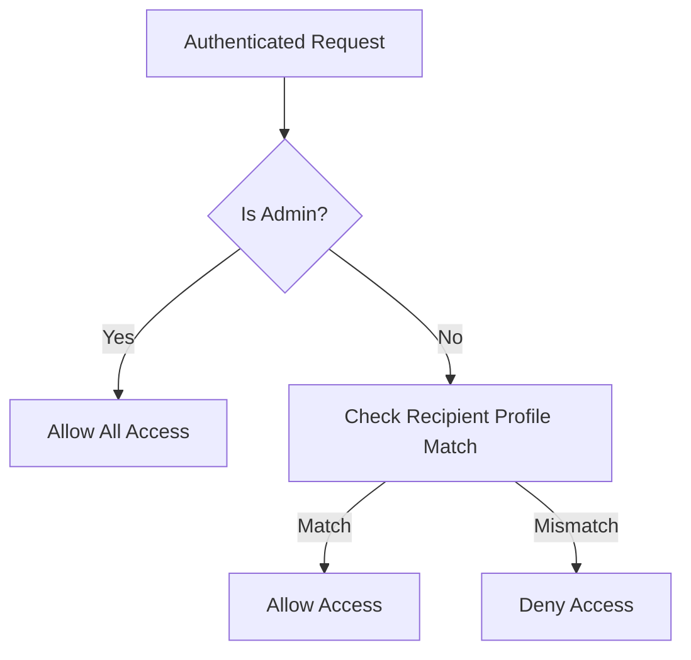
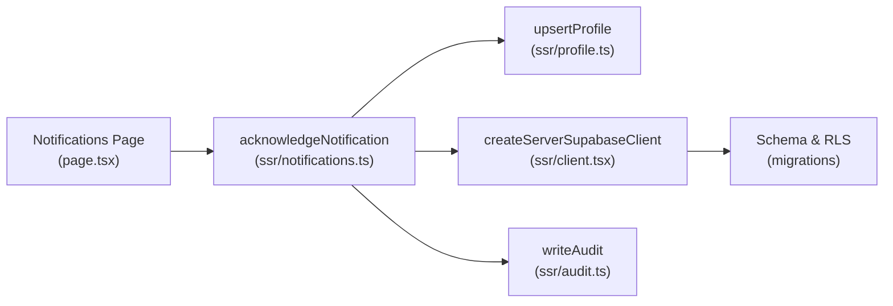
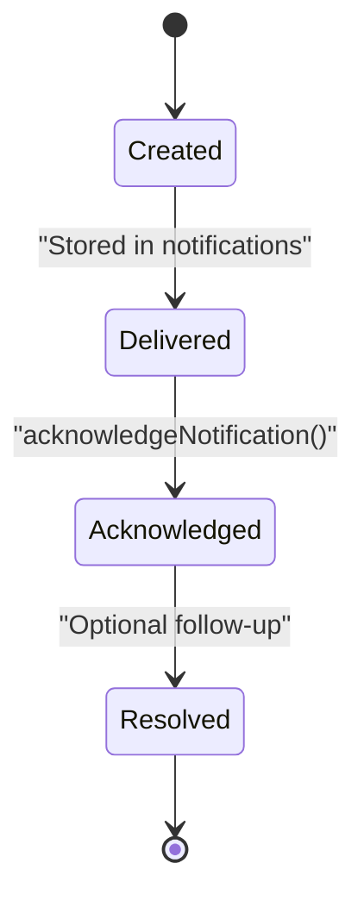

# Notification System API

<cite>
**Referenced Files in This Document**
- [app/ssr/notifications.ts](file://app/ssr/notifications.ts)
- [app/notifications/page.tsx](file://app/notifications/page.tsx)
- [app/ssr/client.tsx](file://app/ssr/client.tsx)
- [app/ssr/profile.ts](file://app/ssr/profile.ts)
- [app/ssr/audit.ts](file://app/ssr/audit.ts)
- [app/dashboard/page.tsx](file://app/dashboard/page.tsx)
- [supabase/migrations/001_day1_schema.sql](file://supabase/migrations/001_day1_schema.sql)
- [supabase/migrations/002_day1_rls.sql](file://supabase/migrations/002_day1_rls.sql)
</cite>

## Table of Contents
1. [Introduction](#introduction)
2. [Project Structure](#project-structure)
3. [Core Components](#core-components)
4. [Architecture Overview](#architecture-overview)
5. [Detailed Component Analysis](#detailed-component-analysis)
6. [Dependency Analysis](#dependency-analysis)
7. [Performance Considerations](#performance-considerations)
8. [Troubleshooting Guide](#troubleshooting-guide)
9. [Conclusion](#conclusion)
10. [Appendices](#appendices)

## Introduction
This document provides comprehensive API documentation for the notification system in MCE Command Center. It covers notification generation methods, alert creation workflows, acknowledgment processing, notification types and severity levels, distribution mechanisms, real-time updates, email notifications, in-app alert systems, lifecycle management (creation, delivery, acknowledgment tracking, resolution), request/response schemas, filtering and access control, and integration with audit trails. Practical examples demonstrate notification creation for project milestones, tender deadlines, and system alerts.

## Project Structure
The notification system spans frontend pages, server-side functions, Supabase database schema, and Row Level Security policies. Key areas:
- Frontend: Notifications listing page and acknowledgment form submission
- Server runtime: Notification acknowledgment handler and Supabase client utilities
- Backend: Supabase schema defining notification types/severities and RLS policies
- Audit: Centralized audit logging for notification acknowledgments

**Diagram sources**
- [app/notifications/page.tsx](file://app/notifications/page.tsx#L1-L68)
- [app/ssr/notifications.ts](file://app/ssr/notifications.ts#L1-L27)
- [app/ssr/client.tsx](file://app/ssr/client.tsx#L1-L25)
- [app/ssr/profile.ts](file://app/ssr/profile.ts#L1-L31)
- [app/ssr/audit.ts](file://app/ssr/audit.ts#L1-L29)
- [supabase/migrations/001_day1_schema.sql](file://supabase/migrations/001_day1_schema.sql#L46-L74)
- [supabase/migrations/002_day1_rls.sql](file://supabase/migrations/002_day1_rls.sql#L303-L316)

**Section sources**
- [app/notifications/page.tsx](file://app/notifications/page.tsx#L1-L68)
- [app/ssr/notifications.ts](file://app/ssr/notifications.ts#L1-L27)
- [app/ssr/client.tsx](file://app/ssr/client.tsx#L1-L25)
- [app/ssr/profile.ts](file://app/ssr/profile.ts#L1-L31)
- [app/ssr/audit.ts](file://app/ssr/audit.ts#L1-L29)
- [supabase/migrations/001_day1_schema.sql](file://supabase/migrations/001_day1_schema.sql#L46-L74)
- [supabase/migrations/002_day1_rls.sql](file://supabase/migrations/002_day1_rls.sql#L303-L316)

## Core Components
- Notification acknowledgment handler: Updates notification record with acknowledgment metadata and writes an audit log entry.
- Notifications listing page: Fetches notifications for the current user, renders severity and acknowledgment status, and provides an acknowledgment action when required.
- Supabase client utilities: Creates authenticated server clients using Clerk tokens and service role keys.
- Profile upsert: Ensures a user’s profile exists and returns the profile identifier.
- Audit logging: Records actor, action, entity, and metadata for compliance tracking.

Key responsibilities:
- Enforce access control via RLS so users can only view/update their own notifications.
- Track acknowledgment timestamps and actors for accountability.
- Support real-time visibility of critical unacknowledged notifications on the dashboard.

**Section sources**
- [app/ssr/notifications.ts](file://app/ssr/notifications.ts#L7-L26)
- [app/notifications/page.tsx](file://app/notifications/page.tsx#L4-L9)
- [app/ssr/client.tsx](file://app/ssr/client.tsx#L4-L14)
- [app/ssr/profile.ts](file://app/ssr/profile.ts#L6-L29)
- [app/ssr/audit.ts](file://app/ssr/audit.ts#L6-L28)
- [supabase/migrations/002_day1_rls.sql](file://supabase/migrations/002_day1_rls.sql#L303-L316)

## Architecture Overview
The notification system integrates Clerk authentication, Supabase for persistence and RLS, and centralized audit logging. The acknowledgment flow updates the notification record and logs the action.

**Diagram sources**
- [app/notifications/page.tsx](file://app/notifications/page.tsx#L11-L18)
- [app/ssr/notifications.ts](file://app/ssr/notifications.ts#L7-L26)
- [app/ssr/client.tsx](file://app/ssr/client.tsx#L4-L14)
- [app/ssr/audit.ts](file://app/ssr/audit.ts#L6-L28)
- [supabase/migrations/001_day1_schema.sql](file://supabase/migrations/001_day1_schema.sql#L225-L226)

## Detailed Component Analysis

### Notification Acknowledgment Handler
Purpose:
- Mark a notification as acknowledged by the current user.
- Store acknowledgment timestamp and actor profile ID.
- Emit an audit log entry for compliance.

Processing logic:
- Resolve current user profile via upsertProfile.
- Create authenticated Supabase client.
- Update the notification row with acknowledgment metadata.
- On success, write audit log with action "ack", entity "notification", and entity ID.

**Diagram sources**
- [app/ssr/notifications.ts](file://app/ssr/notifications.ts#L7-L26)
- [app/ssr/profile.ts](file://app/ssr/profile.ts#L6-L29)
- [app/ssr/client.tsx](file://app/ssr/client.tsx#L4-L14)
- [app/ssr/audit.ts](file://app/ssr/audit.ts#L6-L28)

**Section sources**
- [app/ssr/notifications.ts](file://app/ssr/notifications.ts#L7-L26)
- [app/ssr/profile.ts](file://app/ssr/profile.ts#L6-L29)
- [app/ssr/client.tsx](file://app/ssr/client.tsx#L4-L14)
- [app/ssr/audit.ts](file://app/ssr/audit.ts#L6-L28)

### Notifications Listing Page
Purpose:
- Display notifications for the current user with severity and acknowledgment status.
- Provide an acknowledgment action when required and not yet acknowledged.

Key behaviors:
- Fetch notifications ordered by creation time descending.
- Render message, severity, ack requirement, and acknowledgment state.
- Submit acknowledgment via a server action when conditions are met.

**Diagram sources**
- [app/notifications/page.tsx](file://app/notifications/page.tsx#L4-L9)
- [app/notifications/page.tsx](file://app/notifications/page.tsx#L11-L18)

**Section sources**
- [app/notifications/page.tsx](file://app/notifications/page.tsx#L4-L9)
- [app/notifications/page.tsx](file://app/notifications/page.tsx#L11-L18)

### Supabase Schema and Types
Defines notification types, severities, and indexes supporting efficient queries and access control.

- Enumerations:
  - notification_severity: info, warn, critical
  - notification_type: tender_deadline, milestone_due, followup_due, system
- Tables:
  - notifications: stores messages, severity, ack flags, recipients, and audit fields
  - profiles: user identity and roles
  - audit_log: append-only audit trail
- Indexes:
  - notifications_recipient_idx: supports per-user filtering
  - audit_entity_idx: supports audit queries

**Diagram sources**
- [supabase/migrations/001_day1_schema.sql](file://supabase/migrations/001_day1_schema.sql#L46-L74)
- [supabase/migrations/001_day1_schema.sql](file://supabase/migrations/001_day1_schema.sql#L76-L84)
- [supabase/migrations/001_day1_schema.sql](file://supabase/migrations/001_day1_schema.sql#L225-L226)

**Section sources**
- [supabase/migrations/001_day1_schema.sql](file://supabase/migrations/001_day1_schema.sql#L46-L74)
- [supabase/migrations/001_day1_schema.sql](file://supabase/migrations/001_day1_schema.sql#L76-L84)
- [supabase/migrations/001_day1_schema.sql](file://supabase/migrations/001_day1_schema.sql#L225-L226)

### Access Control and Real-Time Updates
Row Level Security ensures:
- Users can only SELECT/UPDATE their own notifications.
- Admins can access all notifications.
- Audit logs are append-only and protected.

Real-time integration:
- The dashboard queries critical unacknowledged notifications to surface them immediately.
- The notifications page lists recent items ordered by creation time.

**Diagram sources**
- [supabase/migrations/002_day1_rls.sql](file://supabase/migrations/002_day1_rls.sql#L303-L316)
- [app/dashboard/page.tsx](file://app/dashboard/page.tsx#L58-L60)

**Section sources**
- [supabase/migrations/002_day1_rls.sql](file://supabase/migrations/002_day1_rls.sql#L303-L316)
- [app/dashboard/page.tsx](file://app/dashboard/page.tsx#L58-L60)

### Audit Trail Integration
Every acknowledgment triggers an audit log entry with:
- action: ack
- entity_type: notification
- entity_id: notification identifier
- metadata: optional structured data (e.g., related identifiers)

This enables compliance tracking and historical review of notification acknowledgments.

**Section sources**
- [app/ssr/audit.ts](file://app/ssr/audit.ts#L6-L28)
- [app/ssr/notifications.ts](file://app/ssr/notifications.ts#L25-L25)

## Dependency Analysis
The notification system exhibits clear separation of concerns:
- Frontend depends on server actions for state-changing operations.
- Server actions depend on profile upsert, Supabase client, and audit logging.
- Database schema defines types, tables, and indexes; RLS policies enforce access control.

**Diagram sources**
- [app/notifications/page.tsx](file://app/notifications/page.tsx#L1-L2)
- [app/ssr/notifications.ts](file://app/ssr/notifications.ts#L1-L6)
- [app/ssr/profile.ts](file://app/ssr/profile.ts#L1-L5)
- [app/ssr/client.tsx](file://app/ssr/client.tsx#L1-L4)
- [app/ssr/audit.ts](file://app/ssr/audit.ts#L1-L5)
- [supabase/migrations/001_day1_schema.sql](file://supabase/migrations/001_day1_schema.sql#L46-L74)
- [supabase/migrations/002_day1_rls.sql](file://supabase/migrations/002_day1_rls.sql#L303-L316)

**Section sources**
- [app/notifications/page.tsx](file://app/notifications/page.tsx#L1-L2)
- [app/ssr/notifications.ts](file://app/ssr/notifications.ts#L1-L6)
- [app/ssr/profile.ts](file://app/ssr/profile.ts#L1-L5)
- [app/ssr/client.tsx](file://app/ssr/client.tsx#L1-L4)
- [app/ssr/audit.ts](file://app/ssr/audit.ts#L1-L5)
- [supabase/migrations/001_day1_schema.sql](file://supabase/migrations/001_day1_schema.sql#L46-L74)
- [supabase/migrations/002_day1_rls.sql](file://supabase/migrations/002_day1_rls.sql#L303-L316)

## Performance Considerations
- Indexes on recipient and audit entity fields support efficient filtering and querying.
- Acknowledgment updates are single-row writes with minimal overhead.
- Dashboard queries limit critical notifications to reduce payload size.
- Consider adding database-level triggers or scheduled jobs for generating notifications from events (e.g., deadlines, milestones) to offload work from request handlers.

[No sources needed since this section provides general guidance]

## Troubleshooting Guide
Common issues and resolutions:
- Authentication errors during profile upsert: Ensure Clerk authentication is configured and accessible server-side.
- Supabase client initialization failures: Verify environment variables for public and service role keys.
- RLS access denials: Confirm the current user matches the notification recipient or has admin privileges.
- Audit write failures: Validate audit_log insert permissions and prevent-update triggers.

Operational checks:
- Verify notification acknowledgment timestamps and actor IDs after successful updates.
- Confirm audit entries appear with expected action and entity metadata.

**Section sources**
- [app/ssr/profile.ts](file://app/ssr/profile.ts#L8-L10)
- [app/ssr/client.tsx](file://app/ssr/client.tsx#L5-L13)
- [supabase/migrations/002_day1_rls.sql](file://supabase/migrations/002_day1_rls.sql#L303-L316)
- [app/ssr/audit.ts](file://app/ssr/audit.ts#L25-L27)

## Conclusion
The notification system in MCE Command Center provides a secure, auditable, and user-focused mechanism for acknowledging alerts. It leverages Clerk authentication, Supabase RLS, and centralized audit logging to ensure accountability and compliance. The current implementation focuses on acknowledgment processing and listing; future enhancements could include automated notification generation from system events, email distribution hooks, and expanded filtering capabilities.

[No sources needed since this section summarizes without analyzing specific files]

## Appendices

### Notification Lifecycle
- Creation: Triggered externally (e.g., deadline approaching, milestone due). Not covered in current code; see Implementation Notes below.
- Delivery: Stored in notifications table with recipient and severity.
- Acknowledgment: Via server action updating acked_at and acked_by_profile_id.
- Resolution: Handled implicitly by marking acknowledgment; future extensions may include resolved status.

[No sources needed since this diagram shows conceptual workflow, not actual code structure]

### Implementation Notes
- Notification generation: Not present in the current codebase. Recommended approach:
  - Use database triggers or scheduled jobs to scan due dates and insert notifications.
  - Populate fields: recipient_profile_id, message, severity, type, ack_required.
- Email notifications: Not implemented. Recommended approach:
  - Integrate with a mail provider in server actions or background jobs.
- Filtering and preferences: Not implemented. Recommended approach:
  - Add user preferences table and filter queries by severity/type and recipient.
- Batch processing: Not implemented. Recommended approach:
  - Use server actions or cron jobs to bulk acknowledge or resolve notifications.
- Error handling: Current handler throws on database errors; consider retry/backoff and structured error responses for production.

[No sources needed since this section provides general guidance]

### Example Workflows

#### Tender Deadline Notification
- Trigger: Approaching deadline detected by scheduler.
- Fields populated: type=tender_deadline, severity=critical/warn/info, ack_required=true/false, message text, recipient.
- Acknowledgment: User clicks Acknowledge; system records acked_at and actor.

#### Milestone Due Notification
- Trigger: Upcoming milestone detected by scheduler.
- Fields populated: type=milestone_due, severity=warn/info, ack_required=false, message text, recipient.
- Acknowledgment: Optional; user may acknowledge or ignore.

#### System Alert Notification
- Trigger: System event (e.g., maintenance window).
- Fields populated: type=system, severity=info/critical, ack_required=true, message text, recipients.
- Acknowledgment: Required for critical alerts.

[No sources needed since this section provides general guidance]

### Request/Response Schemas

Note: The current codebase exposes a single server action for acknowledgment. The following schemas describe the expected request/response for the acknowledgment operation and the listing endpoint.

- Endpoint: POST /notifications (server action)
  - Path: [app/notifications/page.tsx](file://app/notifications/page.tsx#L11-L18)
  - Request body: multipart/form-data
    - Field: id (string, required)
  - Response: 200 OK on success; throws error on failure
  - Status codes:
    - 200: Acknowledgment recorded
    - 400: Missing notification id
    - 500: Database or audit error

- Endpoint: GET /notifications (data fetch)
  - Path: [app/notifications/page.tsx](file://app/notifications/page.tsx#L5-L9)
  - Query parameters: None
  - Response: Array of notifications with fields:
    - id (string)
    - message (string)
    - severity (enum: info, warn, critical)
    - ack_required (boolean)
    - acked_at (timestamp or null)
    - created_at (timestamp)
  - Status codes:
    - 200: Success
    - 401: Unauthorized
    - 403: Access denied by RLS

- Audit Log Entry (on acknowledgment)
  - Path: [app/ssr/audit.ts](file://app/ssr/audit.ts#L17-L23)
  - Fields:
    - actor_profile_id (uuid)
    - action (enum: ack)
    - entity_type (enum: notification)
    - entity_id (uuid)
    - metadata (jsonb)

**Section sources**
- [app/notifications/page.tsx](file://app/notifications/page.tsx#L11-L18)
- [app/notifications/page.tsx](file://app/notifications/page.tsx#L5-L9)
- [app/ssr/audit.ts](file://app/ssr/audit.ts#L17-L23)