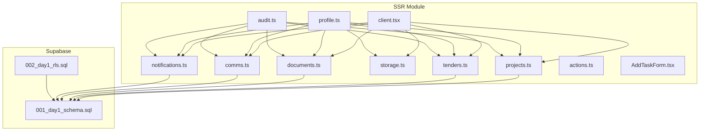
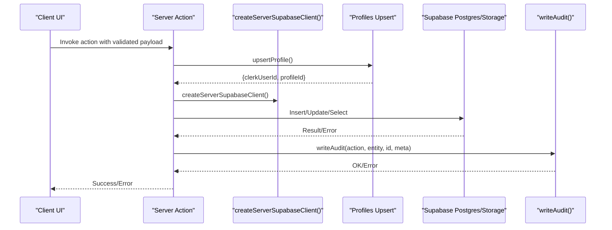
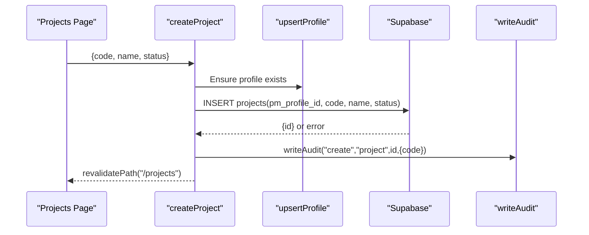
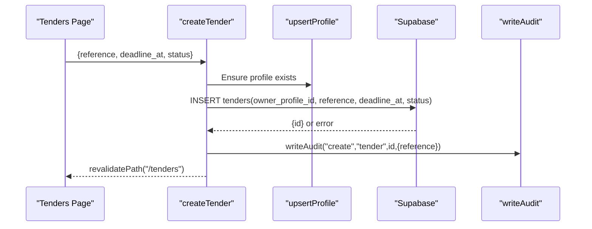
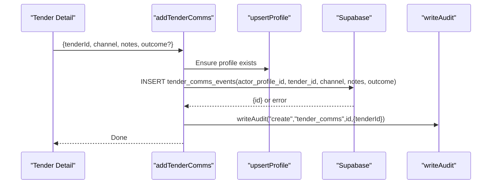
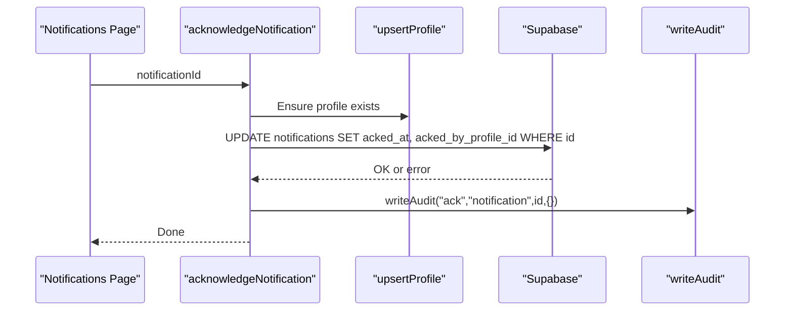
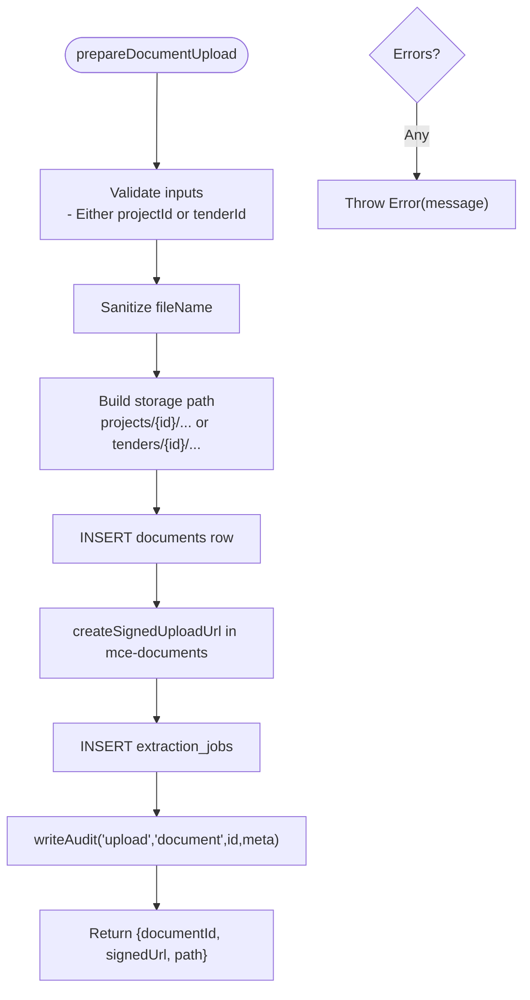
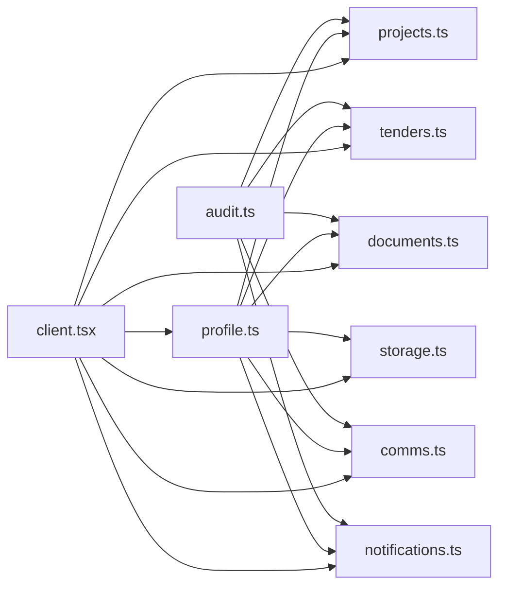

# Server Actions & Business Logic

<cite>
**Referenced Files in This Document**
- [README.md](file://README.md)
- [client.tsx](file://app/ssr/client.tsx)
- [profile.ts](file://app/ssr/profile.ts)
- [audit.ts](file://app/ssr/audit.ts)
- [projects.ts](file://app/ssr/projects.ts)
- [tenders.ts](file://app/ssr/tenders.ts)
- [documents.ts](file://app/ssr/documents.ts)
- [comms.ts](file://app/ssr/comms.ts)
- [notifications.ts](file://app/ssr/notifications.ts)
- [storage.ts](file://app/ssr/storage.ts)
- [actions.ts](file://app/ssr/actions.ts)
- [AddTaskForm.tsx](file://app/ssr/AddTaskForm.tsx)
- [001_day1_schema.sql](file://supabase/migrations/001_day1_schema.sql)
- [002_day1_rls.sql](file://supabase/migrations/002_day1_rls.sql)
</cite>

## Table of Contents
1. [Introduction](#introduction)
2. [Project Structure](#project-structure)
3. [Core Components](#core-components)
4. [Architecture Overview](#architecture-overview)
5. [Detailed Component Analysis](#detailed-component-analysis)
6. [Dependency Analysis](#dependency-analysis)
7. [Performance Considerations](#performance-considerations)
8. [Troubleshooting Guide](#troubleshooting-guide)
9. [Conclusion](#conclusion)
10. [Appendices](#appendices)

## Introduction
This document describes the server actions and business logic that power MCE Command Center’s core workflows: project and tender management, document lifecycle, communication logging, notifications, and audit trails. It focuses on the server action functions exposed under app/ssr, detailing function signatures, parameter validation, transaction handling, and audit trail integration. It also explains how server actions relate to database operations, error propagation, and access control enforcement via Clerk and Supabase Row Level Security (RLS).

## Project Structure
The server actions live in the SSR module under app/ssr. They are organized by domain:
- Authentication and identity: profile.ts
- Audit logging: audit.ts
- Domain operations:
  - Projects: projects.ts
  - Tenders: tenders.ts
  - Documents: documents.ts, storage.ts
  - Communications: comms.ts
  - Notifications: notifications.ts
- Supporting utilities: client.tsx, actions.ts, AddTaskForm.tsx
- Database schema and RLS: supabase/migrations/001_day1_schema.sql, 002_day1_rls.sql

**Diagram sources**
- [client.tsx](file://app/ssr/client.tsx#L1-L25)
- [profile.ts](file://app/ssr/profile.ts#L1-L31)
- [audit.ts](file://app/ssr/audit.ts#L1-L29)
- [projects.ts](file://app/ssr/projects.ts#L1-L43)
- [tenders.ts](file://app/ssr/tenders.ts#L1-L43)
- [documents.ts](file://app/ssr/documents.ts#L1-L114)
- [storage.ts](file://app/ssr/storage.ts#L1-L35)
- [comms.ts](file://app/ssr/comms.ts#L1-L38)
- [notifications.ts](file://app/ssr/notifications.ts#L1-L27)
- [001_day1_schema.sql](file://supabase/migrations/001_day1_schema.sql#L1-L151)
- [002_day1_rls.sql](file://supabase/migrations/002_day1_rls.sql#L303-L347)

**Section sources**
- [README.md](file://README.md#L1-L158)
- [client.tsx](file://app/ssr/client.tsx#L1-L25)
- [001_day1_schema.sql](file://supabase/migrations/001_day1_schema.sql#L1-L151)
- [002_day1_rls.sql](file://supabase/migrations/002_day1_rls.sql#L303-L347)

## Core Components
- Identity and access:
  - upsertProfile: Ensures a profiles row exists for the current Clerk user and returns identifiers.
- Audit:
  - writeAudit: Records actor, action, entity, and metadata into audit_log.
- Project management:
  - createProject: Inserts a project with PM linkage and emits audit.
- Tender management:
  - createTender: Inserts a tender with owner linkage and emits audit.
- Documents:
  - prepareDocumentUpload: Creates document metadata, generates signed upload URL, enqueues extraction job, and audits.
  - createSignedDownload: Generates a short-lived download URL for a document reference.
  - createSignedUpload: Utility to create a signed upload URL for arbitrary paths.
- Communications:
  - addTenderComms: Logs a communication event against a tender and audits.
- Notifications:
  - acknowledgeNotification: Marks a notification acknowledged by the current user and audits.
- Utilities:
  - createServerSupabaseClient / createServiceSupabaseClient: Auth clients for app and service roles.
  - addTask: Minimal example action inserting a task.

**Section sources**
- [profile.ts](file://app/ssr/profile.ts#L1-L31)
- [audit.ts](file://app/ssr/audit.ts#L1-L29)
- [projects.ts](file://app/ssr/projects.ts#L1-L43)
- [tenders.ts](file://app/ssr/tenders.ts#L1-L43)
- [documents.ts](file://app/ssr/documents.ts#L1-L114)
- [storage.ts](file://app/ssr/storage.ts#L1-L35)
- [comms.ts](file://app/ssr/comms.ts#L1-L38)
- [notifications.ts](file://app/ssr/notifications.ts#L1-L27)
- [client.tsx](file://app/ssr/client.tsx#L1-L25)
- [actions.ts](file://app/ssr/actions.ts#L1-L19)
- [AddTaskForm.tsx](file://app/ssr/AddTaskForm.tsx#L1-L31)

## Architecture Overview
Server actions execute on the server, leveraging Clerk for authentication and Supabase for data persistence. Access control is enforced by Clerk session tokens and Supabase RLS policies. Audit logs capture all auditable actions.

**Diagram sources**
- [client.tsx](file://app/ssr/client.tsx#L1-L25)
- [profile.ts](file://app/ssr/profile.ts#L1-L31)
- [audit.ts](file://app/ssr/audit.ts#L1-L29)
- [projects.ts](file://app/ssr/projects.ts#L1-L43)
- [tenders.ts](file://app/ssr/tenders.ts#L1-L43)
- [documents.ts](file://app/ssr/documents.ts#L1-L114)
- [comms.ts](file://app/ssr/comms.ts#L1-L38)
- [notifications.ts](file://app/ssr/notifications.ts#L1-L27)

## Detailed Component Analysis

### Identity and Access Control
- upsertProfile:
  - Purpose: Create or update a profiles row for the authenticated Clerk user.
  - Inputs: None (uses Clerk session).
  - Outputs: { clerkUserId, profileId }.
  - Errors: Propagates underlying Supabase errors; throws if not authenticated.
  - RLS impact: Subsequent server actions rely on current_profile_id() via session.

**Section sources**
- [profile.ts](file://app/ssr/profile.ts#L1-L31)
- [client.tsx](file://app/ssr/client.tsx#L1-L25)

### Audit Trail
- writeAudit:
  - Purpose: Persist an audit event with actor, action, entity, and optional metadata.
  - Inputs: action, entity_type, entity_id, metadata.
  - Outputs: None.
  - Errors: Throws on insert failure.
  - Constraints: Prevent updates/deletes via RLS trigger.

**Section sources**
- [audit.ts](file://app/ssr/audit.ts#L1-L29)
- [002_day1_rls.sql](file://supabase/migrations/002_day1_rls.sql#L341-L347)

### Project Management Operations
- createProject:
  - Purpose: Create a project with PM linkage and emit audit.
  - Inputs: { code, name, status }.
  - Validation: Requires authenticated profile via upsertProfile.
  - Persistence: Inserts into projects; sets pm_profile_id from profile.
  - Transactionality: Single insert; no explicit transaction block.
  - Audit: writeAudit("create", "project", id, { code }).
  - Revalidation: revalidatePath("/projects") to refresh UI cache.

**Diagram sources**
- [projects.ts](file://app/ssr/projects.ts#L1-L43)
- [profile.ts](file://app/ssr/profile.ts#L1-L31)
- [audit.ts](file://app/ssr/audit.ts#L1-L29)

**Section sources**
- [projects.ts](file://app/ssr/projects.ts#L1-L43)

### Tender Management Operations
- createTender:
  - Purpose: Create a tender with owner linkage and emit audit.
  - Inputs: { reference, deadline_at, status }.
  - Validation: Requires authenticated profile via upsertProfile.
  - Persistence: Inserts into tenders; sets owner_profile_id from profile.
  - Transactionality: Single insert; no explicit transaction block.
  - Audit: writeAudit("create", "tender", id, { reference }).
  - Revalidation: revalidatePath("/tenders").

**Diagram sources**
- [tenders.ts](file://app/ssr/tenders.ts#L1-L43)
- [profile.ts](file://app/ssr/profile.ts#L1-L31)
- [audit.ts](file://app/ssr/audit.ts#L1-L29)

**Section sources**
- [tenders.ts](file://app/ssr/tenders.ts#L1-L43)

### Tender Communication Logging
- addTenderComms:
  - Purpose: Log a communication event against a tender and audit.
  - Inputs: { tenderId, channel, notes, outcome? }.
  - Validation: Requires authenticated profile; ensures tenderId present.
  - Persistence: Inserts into tender_comms_events with actor_profile_id.
  - Audit: writeAudit("create", "tender_comms", id, { tenderId }).
  - Constraints: RLS prevents updates/deletes on tender_comms_events.

**Diagram sources**
- [comms.ts](file://app/ssr/comms.ts#L1-L38)
- [profile.ts](file://app/ssr/profile.ts#L1-L31)
- [audit.ts](file://app/ssr/audit.ts#L1-L29)
- [002_day1_rls.sql](file://supabase/migrations/002_day1_rls.sql#L341-L347)

**Section sources**
- [comms.ts](file://app/ssr/comms.ts#L1-L38)
- [002_day1_rls.sql](file://supabase/migrations/002_day1_rls.sql#L341-L347)

### Notification Acknowledgement
- acknowledgeNotification:
  - Purpose: Mark a notification acknowledged by the current user and audit.
  - Inputs: notificationId.
  - Validation: Requires authenticated profile; validates existence via RLS.
  - Persistence: UPDATE notifications with acked_at and acked_by_profile_id.
  - Audit: writeAudit("ack", "notification", id, {}).

**Diagram sources**
- [notifications.ts](file://app/ssr/notifications.ts#L1-L27)
- [profile.ts](file://app/ssr/profile.ts#L1-L31)
- [audit.ts](file://app/ssr/audit.ts#L1-L29)
- [002_day1_rls.sql](file://supabase/migrations/002_day1_rls.sql#L303-L316)

**Section sources**
- [notifications.ts](file://app/ssr/notifications.ts#L1-L27)
- [002_day1_rls.sql](file://supabase/migrations/002_day1_rls.sql#L303-L316)

### Document Lifecycle and Extraction Jobs
- prepareDocumentUpload:
  - Purpose: Create document metadata, generate signed upload URL, enqueue extraction job, and audit.
  - Inputs: { fileName, fileType, fileSize, projectId?, tenderId?, docType?, sensitivity?, title? }.
  - Validation: Requires either projectId or tenderId; sanitizes fileName.
  - Persistence:
    - Insert into documents with computed storage_path and uploader profile.
    - Insert into extraction_jobs with job_type derived from context.
  - Storage: Uses Supabase Storage bucket "mce-documents".
  - Audit: writeAudit("upload", "document", id, { path, projectId, tenderId }).
  - Returns: { documentId, signedUrl, path }.

- createSignedDownload:
  - Purpose: Generate a short-lived signed URL for a document by id, project id, or tender id.
  - Inputs: referenceId.
  - Persistence: SELECT storage_path, then createSignedUrl with expiry.

- createSignedUpload (utility):
  - Purpose: Create a signed upload URL for arbitrary paths.
  - Inputs: filename.
  - Returns: { signedUrl, path }.

**Diagram sources**
- [documents.ts](file://app/ssr/documents.ts#L1-L114)
- [audit.ts](file://app/ssr/audit.ts#L1-L29)

**Section sources**
- [documents.ts](file://app/ssr/documents.ts#L1-L114)
- [storage.ts](file://app/ssr/storage.ts#L1-L35)

### Example: Client Integration
- AddTaskForm integrates a server action:
  - Client form calls addTask on submit.
  - addTask is a minimal server action that inserts into tasks and logs.

**Section sources**
- [AddTaskForm.tsx](file://app/ssr/AddTaskForm.tsx#L1-L31)
- [actions.ts](file://app/ssr/actions.ts#L1-L19)

## Dependency Analysis
- Cohesion:
  - Each module encapsulates a single responsibility (identity, audit, domain operations).
- Coupling:
  - All actions depend on createServerSupabaseClient and upsertProfile.
  - Audit actions depend on writeAudit.
- External dependencies:
  - Clerk for authentication.
  - Supabase for database and storage.
  - RLS policies enforce access control.

**Diagram sources**
- [client.tsx](file://app/ssr/client.tsx#L1-L25)
- [profile.ts](file://app/ssr/profile.ts#L1-L31)
- [audit.ts](file://app/ssr/audit.ts#L1-L29)
- [projects.ts](file://app/ssr/projects.ts#L1-L43)
- [tenders.ts](file://app/ssr/tenders.ts#L1-L43)
- [documents.ts](file://app/ssr/documents.ts#L1-L114)
- [storage.ts](file://app/ssr/storage.ts#L1-L35)
- [comms.ts](file://app/ssr/comms.ts#L1-L38)
- [notifications.ts](file://app/ssr/notifications.ts#L1-L27)

**Section sources**
- [client.tsx](file://app/ssr/client.tsx#L1-L25)
- [profile.ts](file://app/ssr/profile.ts#L1-L31)
- [audit.ts](file://app/ssr/audit.ts#L1-L29)
- [projects.ts](file://app/ssr/projects.ts#L1-L43)
- [tenders.ts](file://app/ssr/tenders.ts#L1-L43)
- [documents.ts](file://app/ssr/documents.ts#L1-L114)
- [storage.ts](file://app/ssr/storage.ts#L1-L35)
- [comms.ts](file://app/ssr/comms.ts#L1-L38)
- [notifications.ts](file://app/ssr/notifications.ts#L1-L27)

## Performance Considerations
- Batch reads: Prefer fetching related data concurrently (e.g., using Promise.all) to reduce latency.
- Caching: Use Next.js revalidation after mutations to keep UI fresh without stale data.
- Storage URLs: Signed URLs are short-lived; regenerate as needed to avoid expiration.
- Audit volume: Keep metadata concise to minimize storage overhead.

[No sources needed since this section provides general guidance]

## Troubleshooting Guide
- Authentication failures:
  - Ensure Clerk session is present; upsertProfile throws if not authenticated.
- RLS denials:
  - Verify current user has a profiles row and appropriate role.
  - Confirm RLS policies for target tables (e.g., notifications, audit_log).
- Document upload issues:
  - Confirm bucket "mce-documents" exists and is private.
  - Ensure document metadata is inserted before generating signed URL.
- Audit insert failures:
  - writeAudit throws on error; check actor_profile_id resolution and metadata shape.
- Communication events:
  - RLS triggers prevent updates/deletes; ensure only creation is attempted.

**Section sources**
- [profile.ts](file://app/ssr/profile.ts#L1-L31)
- [002_day1_rls.sql](file://supabase/migrations/002_day1_rls.sql#L303-L347)
- [documents.ts](file://app/ssr/documents.ts#L1-L114)
- [audit.ts](file://app/ssr/audit.ts#L1-L29)

## Conclusion
MCE Command Center’s server actions implement a clean separation of concerns: identity and access control via Clerk and Supabase, robust audit logging, and domain-specific operations for projects, tenders, documents, communications, and notifications. The actions consistently validate inputs, propagate errors, integrate with audit trails, and leverage RLS for secure access control. Extending the system involves adding new server actions that reuse the shared utilities and adhere to the established patterns.

[No sources needed since this section summarizes without analyzing specific files]

## Appendices

### API Reference: Server Actions

- Identity
  - upsertProfile()
    - Purpose: Upsert profile for Clerk user.
    - Returns: { clerkUserId, profileId }.
    - Errors: Propagates Supabase errors; throws if not authenticated.

- Audit
  - writeAudit(action, entityType, entityId, metadata)
    - Purpose: Write audit event.
    - Returns: None.
    - Errors: Throws on insert failure.

- Projects
  - createProject(input: { code, name, status })
    - Purpose: Create project with PM linkage.
    - Returns: None.
    - Side effects: Audit, revalidatePath("/projects").

- Tenders
  - createTender(input: { reference, deadline_at, status })
    - Purpose: Create tender with owner linkage.
    - Returns: None.
    - Side effects: Audit, revalidatePath("/tenders").

- Documents
  - prepareDocumentUpload(input: { fileName, fileType, fileSize, projectId?, tenderId?, docType?, sensitivity?, title? })
    - Purpose: Create metadata, generate signed upload URL, enqueue extraction job.
    - Returns: { documentId, signedUrl, path }.
    - Errors: Throws on any step failure.
  - createSignedDownload(referenceId)
    - Purpose: Generate short-lived download URL.
    - Returns: { signedUrl }.
  - createSignedUpload(filename)
    - Purpose: Utility to create signed upload URL for arbitrary path.
    - Returns: { signedUrl, path }.

- Communications
  - addTenderComms(input: { tenderId, channel, notes, outcome? })
    - Purpose: Log communication event and audit.
    - Returns: None.
    - Errors: Throws on insert failure.

- Notifications
  - acknowledgeNotification(notificationId)
    - Purpose: Acknowledge notification and audit.
    - Returns: None.
    - Errors: Throws on update failure.

- Utilities
  - createServerSupabaseClient()
  - createServiceSupabaseClient()

**Section sources**
- [profile.ts](file://app/ssr/profile.ts#L1-L31)
- [audit.ts](file://app/ssr/audit.ts#L1-L29)
- [projects.ts](file://app/ssr/projects.ts#L1-L43)
- [tenders.ts](file://app/ssr/tenders.ts#L1-L43)
- [documents.ts](file://app/ssr/documents.ts#L1-L114)
- [storage.ts](file://app/ssr/storage.ts#L1-L35)
- [comms.ts](file://app/ssr/comms.ts#L1-L38)
- [notifications.ts](file://app/ssr/notifications.ts#L1-L27)
- [client.tsx](file://app/ssr/client.tsx#L1-L25)

### Data Model Notes
- Enumerations and constraints are defined in the schema migration.
- Audit action and entity types are constrained to specific values.
- RLS policies govern visibility and mutation permissions.

**Section sources**
- [001_day1_schema.sql](file://supabase/migrations/001_day1_schema.sql#L3-L74)
- [002_day1_rls.sql](file://supabase/migrations/002_day1_rls.sql#L303-L347)