# Supabase Client API

<cite>
**Referenced Files in This Document**
- [package.json](file://package.json)
- [README.md](file://README.md)
- [app/layout.tsx](file://app/layout.tsx)
- [app/ssr/client.tsx](file://app/ssr/client.tsx)
- [app/ssr/actions.ts](file://app/ssr/actions.ts)
- [app/ssr/projects.ts](file://app/ssr/projects.ts)
- [app/ssr/tenders.ts](file://app/ssr/tenders.ts)
- [app/ssr/documents.ts](file://app/ssr/documents.ts)
- [app/ssr/storage.ts](file://app/ssr/storage.ts)
- [app/ssr/notifications.ts](file://app/ssr/notifications.ts)
</cite>

## Table of Contents
1. [Introduction](#introduction)
2. [Project Structure](#project-structure)
3. [Core Components](#core-components)
4. [Architecture Overview](#architecture-overview)
5. [Detailed Component Analysis](#detailed-component-analysis)
6. [Dependency Analysis](#dependency-analysis)
7. [Performance Considerations](#performance-considerations)
8. [Troubleshooting Guide](#troubleshooting-guide)
9. [Conclusion](#conclusion)
10. [Appendices](#appendices)

## Introduction
This document provides comprehensive API documentation for the Supabase client methods used in MCE Command Center. It focuses on:
- Initialization and configuration of two client variants: server-side and service-level clients
- Authentication token management and session handling
- Database operations (queries, inserts, updates), storage operations (signed URLs), and audit logging
- Practical usage patterns across server actions and pages
- Security implications, performance considerations, and best practices

## Project Structure
The Supabase client is centralized in a single module and consumed by server actions across the application. The client module exports two factory functions:
- createServerSupabaseClient(): builds a client authenticated as the current signed-in user via Clerk tokens
- createServiceSupabaseClient(): builds a client using the service role key for privileged operations

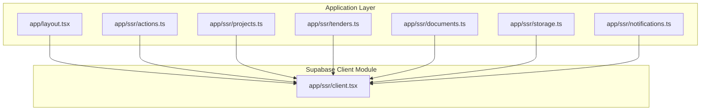

**Diagram sources**
- [app/layout.tsx](file://app/layout.tsx#L1-L46)
- [app/ssr/client.tsx](file://app/ssr/client.tsx#L1-L25)
- [app/ssr/actions.ts](file://app/ssr/actions.ts#L1-L19)
- [app/ssr/projects.ts](file://app/ssr/projects.ts#L1-L43)
- [app/ssr/tenders.ts](file://app/ssr/tenders.ts#L1-L43)
- [app/ssr/documents.ts](file://app/ssr/documents.ts#L1-L114)
- [app/ssr/storage.ts](file://app/ssr/storage.ts#L1-L35)
- [app/ssr/notifications.ts](file://app/ssr/notifications.ts#L1-L27)

**Section sources**
- [app/ssr/client.tsx](file://app/ssr/client.tsx#L1-L25)
- [app/layout.tsx](file://app/layout.tsx#L1-L46)

## Core Components
This section documents the two primary client factories and their configuration options.

- createServerSupabaseClient()
  - Purpose: Create a client authenticated as the current signed-in user via Clerk
  - Authentication token management:
    - Uses an accessToken callback to fetch the current user’s JWT from Clerk
    - Ensures requests carry the user’s identity and permissions
  - Session handling:
    - Defaults to Clerk-managed sessions; the client inherits Clerk’s session lifecycle
  - Client configuration options:
    - NEXT_PUBLIC_SUPABASE_URL: Supabase project URL
    - NEXT_PUBLIC_SUPABASE_KEY: Public/anon key
    - Options:
      - accessToken(): returns a promise resolving to the current user’s token
  - Use cases:
    - User-scoped database reads/writes
    - Storage operations requiring user context
    - Real-time subscriptions scoped to the current user
  - Security implications:
    - Operates under the signed-in user’s permissions (Row Level Security applies)
    - Never exposes the service role key to the client

- createServiceSupabaseClient()
  - Purpose: Create a client using the service role key for privileged operations
  - Authentication token management:
    - Uses SUPABASE_SERVICE_ROLE_KEY as the secret key
    - Disables session persistence (persistSession: false)
  - Session handling:
    - No persistent session; intended for server-side tasks
  - Client configuration options:
    - NEXT_PUBLIC_SUPABASE_URL: Supabase project URL
    - SUPABASE_SERVICE_ROLE_KEY: Secret service role key
    - Options:
      - auth: { persistSession: false }
  - Use cases:
    - Background jobs, migrations, or admin operations
    - Bulk operations bypassing user-level checks
  - Security implications:
    - Grants elevated privileges; must remain server-only
    - Do not expose to client environments

**Section sources**
- [app/ssr/client.tsx](file://app/ssr/client.tsx#L4-L14)
- [app/ssr/client.tsx](file://app/ssr/client.tsx#L16-L24)
- [README.md](file://README.md#L74-L90)

## Architecture Overview
The application uses a layered approach:
- UI and pages render under ClerkProvider, ensuring user context is available
- Server actions consume createServerSupabaseClient() for user-scoped operations
- Some server actions orchestrate storage operations and audit logging
- The service client is reserved for privileged server-side tasks

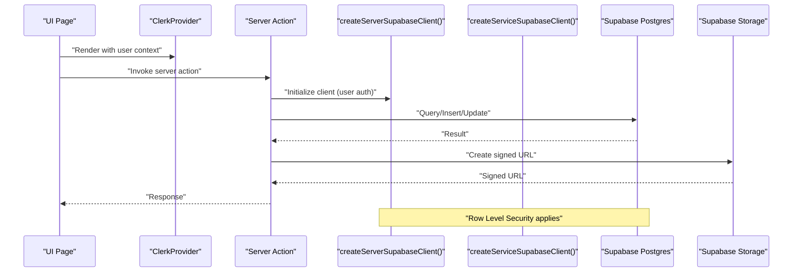

**Diagram sources**
- [app/layout.tsx](file://app/layout.tsx#L1-L46)
- [app/ssr/client.tsx](file://app/ssr/client.tsx#L1-L25)
- [app/ssr/projects.ts](file://app/ssr/projects.ts#L1-L43)
- [app/ssr/tenders.ts](file://app/ssr/tenders.ts#L1-L43)
- [app/ssr/documents.ts](file://app/ssr/documents.ts#L1-L114)
- [app/ssr/storage.ts](file://app/ssr/storage.ts#L1-L35)

## Detailed Component Analysis

### Server Client Factory: createServerSupabaseClient()
- Responsibilities:
  - Provide a Supabase client authenticated as the current user
  - Supply tokens via Clerk’s auth() method
- Configuration:
  - URL: NEXT_PUBLIC_SUPABASE_URL
  - Key: NEXT_PUBLIC_SUPABASE_KEY
  - Options:
    - accessToken(): resolves to the current user’s token
- Typical usage pattern:
  - Call inside server actions to perform user-scoped database and storage operations
- Error handling:
  - Propagate errors from database/storage operations
  - Revalidate paths after successful writes
- Security:
  - Enforces Row Level Security based on the signed-in user
  - Avoid exposing service role key

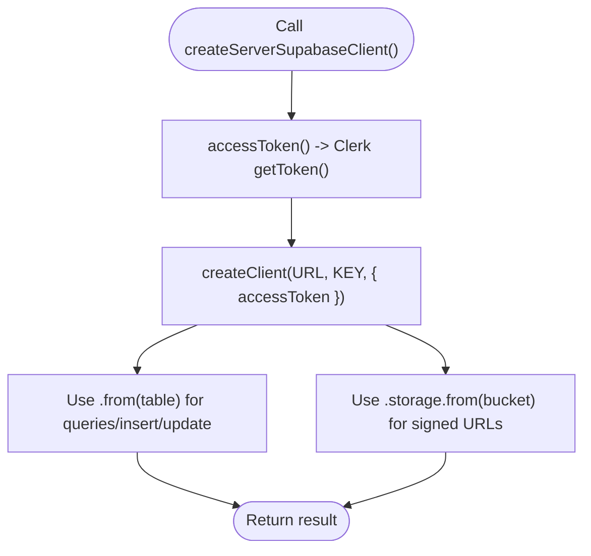

**Diagram sources**
- [app/ssr/client.tsx](file://app/ssr/client.tsx#L4-L14)

**Section sources**
- [app/ssr/client.tsx](file://app/ssr/client.tsx#L4-L14)

### Service Client Factory: createServiceSupabaseClient()
- Responsibilities:
  - Provide a client with service role privileges
  - Disable session persistence for server-only tasks
- Configuration:
  - URL: NEXT_PUBLIC_SUPABASE_URL
  - Key: SUPABASE_SERVICE_ROLE_KEY
  - Options:
    - auth: { persistSession: false }
- Typical usage pattern:
  - Used for privileged operations or background tasks
- Security:
  - Must remain server-only; never expose to client
  - Use for administrative or batch operations

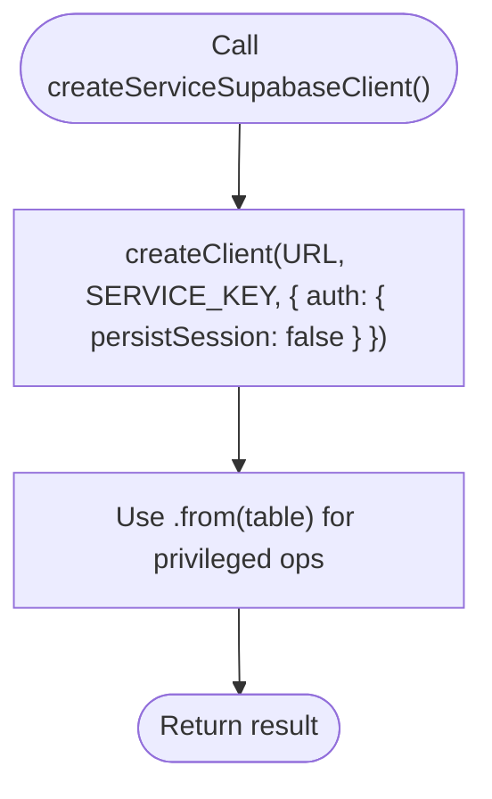

**Diagram sources**
- [app/ssr/client.tsx](file://app/ssr/client.tsx#L16-L24)

**Section sources**
- [app/ssr/client.tsx](file://app/ssr/client.tsx#L16-L24)
- [README.md](file://README.md#L74-L90)

### Database Operations: Projects
- Function: createProject(input)
- Parameters:
  - input.code: string
  - input.name: string
  - input.status: string
- Behavior:
  - Upsert profile to ensure user context
  - Insert a project row with the current user’s profile ID as the project manager
  - Audit creation event
  - Revalidate "/projects"
- Error handling:
  - Throws descriptive errors if profile not found or insert fails
- Authentication:
  - User-scoped via createServerSupabaseClient()

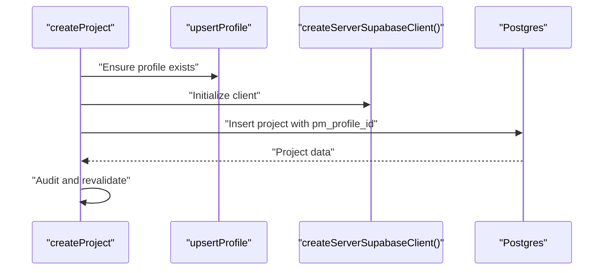

**Diagram sources**
- [app/ssr/projects.ts](file://app/ssr/projects.ts#L8-L42)

**Section sources**
- [app/ssr/projects.ts](file://app/ssr/projects.ts#L8-L42)

### Database Operations: Tenders
- Function: createTender(input)
- Parameters:
  - input.reference: string
  - input.deadline_at: string
  - input.status: string
- Behavior:
  - Upsert profile to ensure user context
  - Insert a tender row with the current user’s profile ID as the owner
  - Audit creation event
  - Revalidate "/tenders"
- Error handling:
  - Throws descriptive errors if profile not found or insert fails
- Authentication:
  - User-scoped via createServerSupabaseClient()

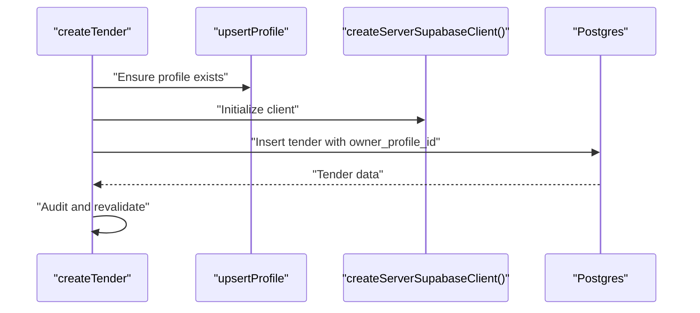

**Diagram sources**
- [app/ssr/tenders.ts](file://app/ssr/tenders.ts#L8-L42)

**Section sources**
- [app/ssr/tenders.ts](file://app/ssr/tenders.ts#L8-L42)

### Storage Operations: Documents
- Function: prepareDocumentUpload(input)
- Parameters:
  - input.fileName: string
  - input.fileType: string
  - input.fileSize: number
  - input.projectId?: string
  - input.tenderId?: string
  - input.docType?: string
  - input.sensitivity?: "confidential" | "restricted"
  - input.title?: string
- Behavior:
  - Upsert profile to ensure user context
  - Insert a document metadata row
  - Create a signed upload URL for the storage bucket
  - Queue an extraction job
  - Audit upload event
- Returns:
  - { documentId, signedUrl, path }
- Error handling:
  - Throws descriptive errors for missing inputs, insert failures, or URL generation issues
- Authentication:
  - User-scoped via createServerSupabaseClient()

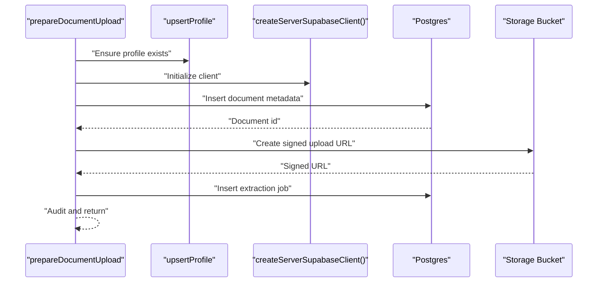

**Diagram sources**
- [app/ssr/documents.ts](file://app/ssr/documents.ts#L11-L86)

**Section sources**
- [app/ssr/documents.ts](file://app/ssr/documents.ts#L11-L86)

### Storage Operations: Signed Download
- Function: createSignedDownload(referenceId: string)
- Behavior:
  - Find a document by id, project id, or tender id
  - Create a short-lived signed download URL
- Returns:
  - { signedUrl }
- Error handling:
  - Throws descriptive errors if document not found or URL generation fails
- Authentication:
  - User-scoped via createServerSupabaseClient()

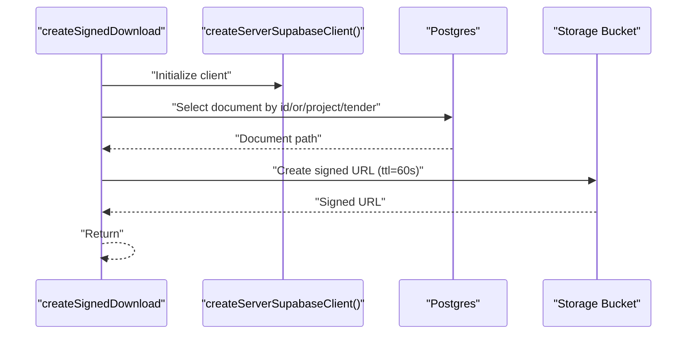

**Diagram sources**
- [app/ssr/documents.ts](file://app/ssr/documents.ts#L88-L113)

**Section sources**
- [app/ssr/documents.ts](file://app/ssr/documents.ts#L88-L113)

### Storage Operations: Generic Upload/Download Utilities
- Function: createSignedUpload(filename: string)
  - Creates a signed upload URL for a generic path
  - Returns { signedUrl, path }
- Function: createSignedDownload(path: string)
  - Creates a signed download URL for a given path
  - Returns { signedUrl }
- Error handling:
  - Throws descriptive errors if URL generation fails
- Authentication:
  - User-scoped via createServerSupabaseClient()

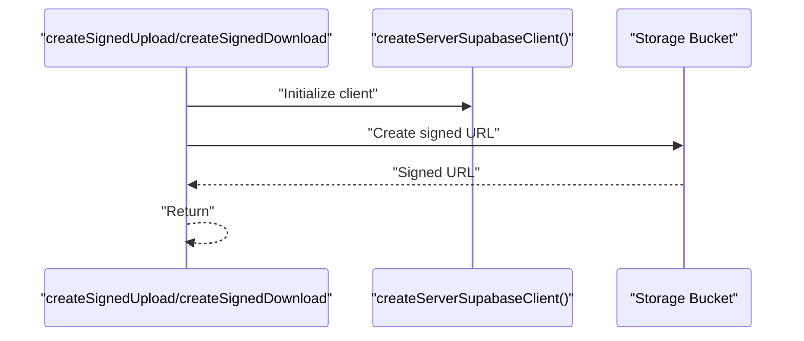

**Diagram sources**
- [app/ssr/storage.ts](file://app/ssr/storage.ts#L6-L34)

**Section sources**
- [app/ssr/storage.ts](file://app/ssr/storage.ts#L6-L34)

### Notification Acknowledgement
- Function: acknowledgeNotification(notificationId: string)
- Behavior:
  - Upsert profile to ensure user context
  - Update notification with acknowledgment timestamp and profile
  - Audit acknowledgment event
- Error handling:
  - Throws descriptive errors if update fails
- Authentication:
  - User-scoped via createServerSupabaseClient()

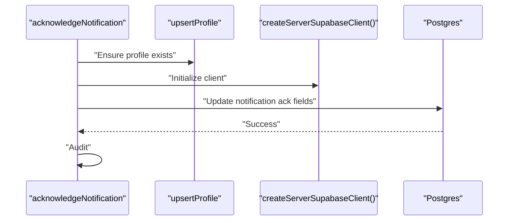

**Diagram sources**
- [app/ssr/notifications.ts](file://app/ssr/notifications.ts#L7-L26)

**Section sources**
- [app/ssr/notifications.ts](file://app/ssr/notifications.ts#L7-L26)

### Additional Server Action Example
- Function: addTask(name: string)
- Behavior:
  - Initialize server client
  - Insert a task row
  - Log success or throw error
- Authentication:
  - User-scoped via createServerSupabaseClient()

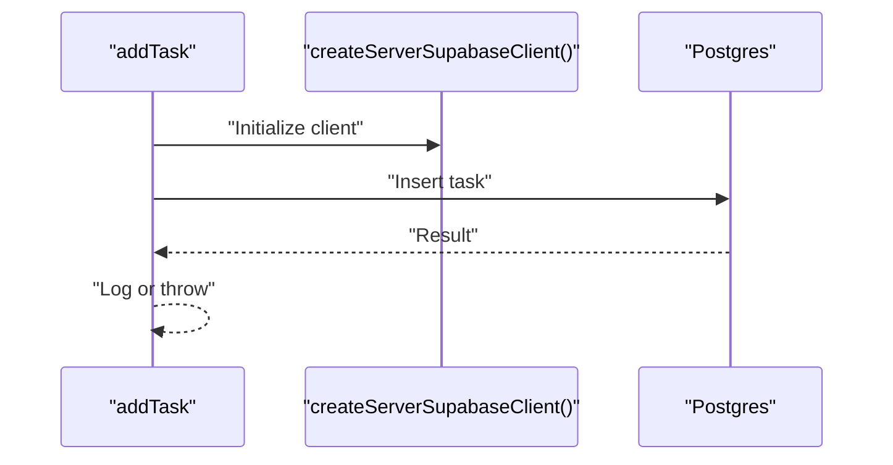

**Diagram sources**
- [app/ssr/actions.ts](file://app/ssr/actions.ts#L7-L18)

**Section sources**
- [app/ssr/actions.ts](file://app/ssr/actions.ts#L7-L18)

## Dependency Analysis
- Runtime dependencies:
  - @supabase/supabase-js: client library used by the application
  - @clerk/nextjs: provides authentication context for user-scoped client
- Environment variables:
  - NEXT_PUBLIC_SUPABASE_URL, NEXT_PUBLIC_SUPABASE_KEY, SUPABASE_SERVICE_ROLE_KEY
- Internal dependencies:
  - app/ssr/client.tsx is imported by all server actions that require database or storage access

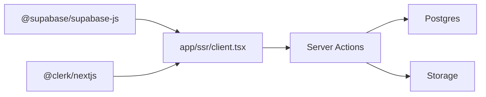

**Diagram sources**
- [package.json](file://package.json#L11-L19)
- [app/ssr/client.tsx](file://app/ssr/client.tsx#L1-L2)

**Section sources**
- [package.json](file://package.json#L11-L19)
- [README.md](file://README.md#L74-L90)

## Performance Considerations
- Client reuse:
  - Prefer constructing the client per request or per action to avoid long-lived connections
  - Avoid global singleton clients in server actions unless you manage concurrency carefully
- Token acquisition:
  - The accessToken callback retrieves the current token on demand; cache tokens only if you control refresh and expiration
- Batch operations:
  - Group related database operations within a single action to minimize round-trips
- Storage:
  - Use signed URLs for direct client uploads/downloads to reduce server bandwidth
- Real-time:
  - For real-time subscriptions, initialize the client once per subscription lifecycle and close appropriately
- Caching:
  - Use Next.js caching APIs (e.g., revalidatePath) to invalidate stale data after writes

[No sources needed since this section provides general guidance]

## Troubleshooting Guide
- Build fails: invalid Clerk key
  - Ensure NEXT_PUBLIC_CLERK_PUBLISHABLE_KEY is valid and configured
- RLS denied / empty data
  - Confirm the signed-in user has a profiles row and appropriate role assignment
- Document upload fails
  - Verify the bucket mce-documents exists, is private, and storage policies are applied
  - Ensure a document metadata row exists before attempting upload
- Signed URL fails
  - Verify storage policies and that the requesting user has access to the linked project/tender
- Service role key exposure
  - Do not expose SUPABASE_SERVICE_ROLE_KEY to client environments; keep it server-only

**Section sources**
- [README.md](file://README.md#L141-L157)

## Conclusion
MCE Command Center uses a clear separation between user-scoped and service-level Supabase clients:
- createServerSupabaseClient() ensures user context and Row Level Security are enforced for all user-facing operations
- createServiceSupabaseClient() provides privileged access for server-only tasks and must be guarded strictly
By following the documented patterns for database queries, mutations, and storage operations, developers can implement secure, efficient, and maintainable features across the application.

[No sources needed since this section summarizes without analyzing specific files]

## Appendices

### API Reference Summary

- createServerSupabaseClient()
  - Parameters: none
  - Returns: Supabase client authenticated as the current user
  - Authentication: Clerk accessToken callback
  - Use cases: user-scoped database and storage operations
  - Security: subject to Row Level Security

- createServiceSupabaseClient()
  - Parameters: none
  - Returns: Supabase client using service role key
  - Authentication: service role key
  - Use cases: privileged server-only operations
  - Security: elevated privileges; server-only

- Database Methods (common patterns)
  - .from(table).select(...).single() -> { data, error }
  - .from(table).insert(payload).select("id").single() -> { data, error }
  - .from(table).update(changes).eq("id", id) -> { error }
  - Error handling: check error and throw descriptive messages

- Storage Methods (common patterns)
  - .storage.from(bucket).createSignedUploadUrl(path) -> { data, error }
  - .storage.from(bucket).createSignedUrl(path, ttlSeconds) -> { data, error }
  - Error handling: check error and throw descriptive messages

- Real-time Subscriptions
  - Initialize client with createServerSupabaseClient()
  - Use .from(table).on(channel, filter).subscribe(handler)
  - Manage lifecycle: subscribe on mount, unsubscribe on unmount

- Environment Variables
  - NEXT_PUBLIC_SUPABASE_URL: Supabase project URL
  - NEXT_PUBLIC_SUPABASE_KEY: Public/anon key
  - SUPABASE_SERVICE_ROLE_KEY: Secret service role key
  - NEXT_PUBLIC_CLERK_PUBLISHABLE_KEY: Clerk publishable key
  - CLERK_SECRET_KEY: Clerk secret key

**Section sources**
- [app/ssr/client.tsx](file://app/ssr/client.tsx#L4-L24)
- [app/ssr/projects.ts](file://app/ssr/projects.ts#L16-L38)
- [app/ssr/tenders.ts](file://app/ssr/tenders.ts#L25-L38)
- [app/ssr/documents.ts](file://app/ssr/documents.ts#L36-L63)
- [app/ssr/storage.ts](file://app/ssr/storage.ts#L11-L27)
- [README.md](file://README.md#L74-L90)