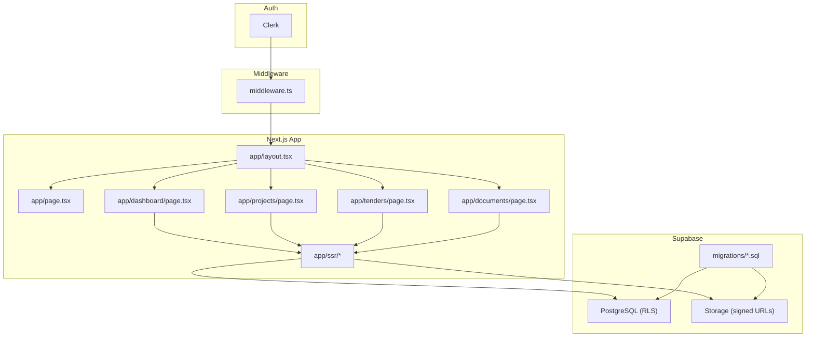
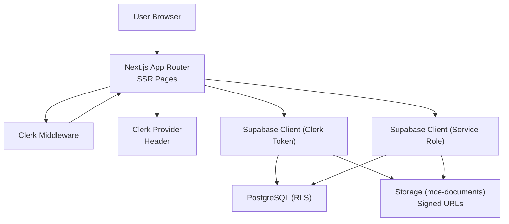
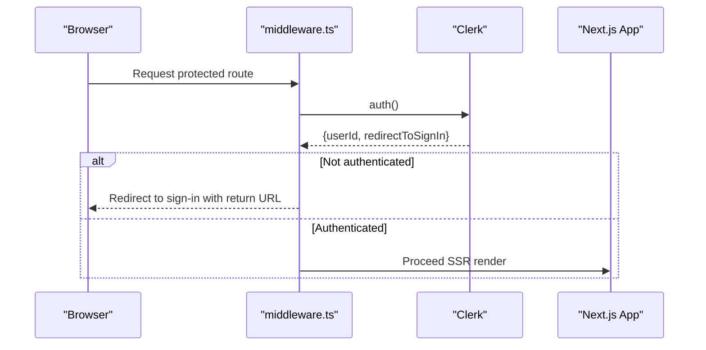
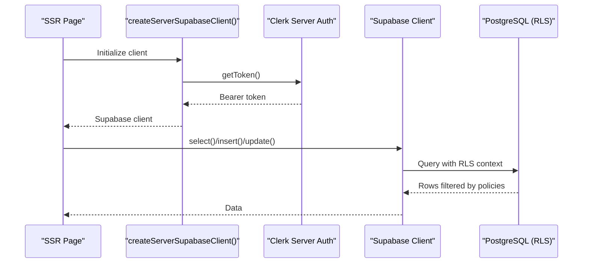
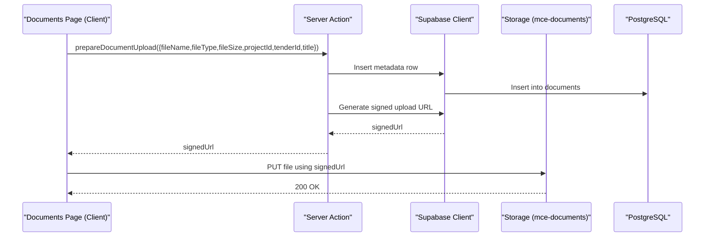
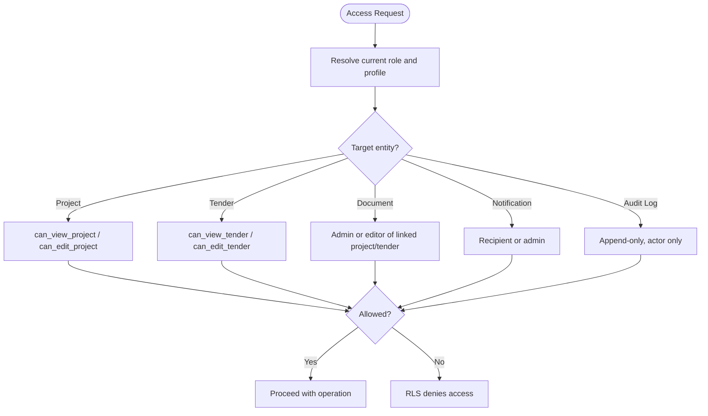
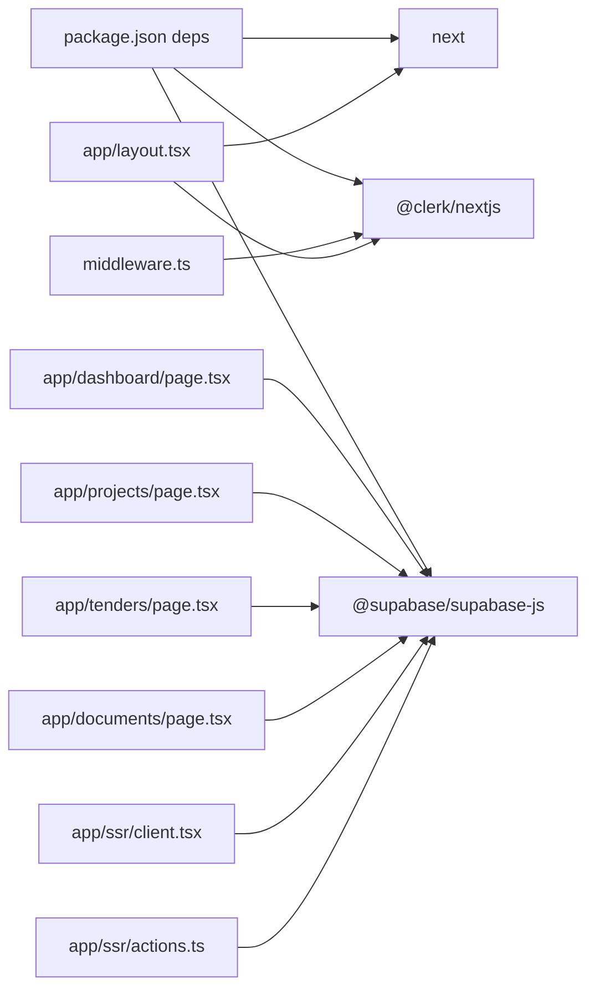

# Architecture Overview

<cite>
**Referenced Files in This Document**
- [README.md](file://README.md)
- [package.json](file://package.json)
- [middleware.ts](file://middleware.ts)
- [next.config.js](file://next.config.js)
- [app/layout.tsx](file://app/layout.tsx)
- [app/page.tsx](file://app/page.tsx)
- [app/dashboard/page.tsx](file://app/dashboard/page.tsx)
- [app/projects/page.tsx](file://app/projects/page.tsx)
- [app/tenders/page.tsx](file://app/tenders/page.tsx)
- [app/documents/page.tsx](file://app/documents/page.tsx)
- [app/ssr/client.tsx](file://app/ssr/client.tsx)
- [app/ssr/actions.ts](file://app/ssr/actions.ts)
- [supabase/migrations/001_day1_schema.sql](file://supabase/migrations/001_day1_schema.sql)
- [supabase/migrations/002_day1_rls.sql](file://supabase/migrations/002_day1_rls.sql)
- [supabase/migrations/003_storage_policies.sql](file://supabase/migrations/003_storage_policies.sql)
</cite>

## Table of Contents
1. [Introduction](#introduction)
2. [Project Structure](#project-structure)
3. [Core Components](#core-components)
4. [Architecture Overview](#architecture-overview)
5. [Detailed Component Analysis](#detailed-component-analysis)
6. [Dependency Analysis](#dependency-analysis)
7. [Performance Considerations](#performance-considerations)
8. [Troubleshooting Guide](#troubleshooting-guide)
9. [Conclusion](#conclusion)
10. [Appendices](#appendices)

## Introduction
This document describes the architecture of MCE Command Center, a production-credible internal tracker built on Next.js App Router with Server-Side Rendering (SSR), Clerk authentication, and Supabase backend services. It explains how frontend pages and SSR components integrate with Clerk’s authentication middleware and Supabase’s PostgreSQL and Storage layers, including Row-Level Security (RLS) policies and signed URL workflows. It also outlines the security model (role-based access control, RLS, and session management), infrastructure requirements, scalability considerations, and deployment topology.

## Project Structure
The application follows a Next.js App Router layout with:
- App shell and authentication provider in the root layout
- Public and protected pages under app/
- SSR utilities and Supabase client factories under app/ssr/
- Supabase schema and policies under supabase/migrations/

**Diagram sources**
- [app/layout.tsx](file://app/layout.tsx#L1-L46)
- [middleware.ts](file://middleware.ts#L1-L20)
- [app/dashboard/page.tsx](file://app/dashboard/page.tsx#L1-L157)
- [app/projects/page.tsx](file://app/projects/page.tsx#L1-L65)
- [app/tenders/page.tsx](file://app/tenders/page.tsx#L1-L65)
- [app/documents/page.tsx](file://app/documents/page.tsx#L1-L90)
- [app/ssr/client.tsx](file://app/ssr/client.tsx#L1-L25)
- [supabase/migrations/001_day1_schema.sql](file://supabase/migrations/001_day1_schema.sql#L1-L227)
- [supabase/migrations/002_day1_rls.sql](file://supabase/migrations/002_day1_rls.sql#L1-L348)
- [supabase/migrations/003_storage_policies.sql](file://supabase/migrations/003_storage_policies.sql#L1-L55)

**Section sources**
- [README.md](file://README.md#L1-L158)
- [package.json](file://package.json#L1-L32)
- [next.config.js](file://next.config.js#L1-L7)
- [app/layout.tsx](file://app/layout.tsx#L1-L46)
- [middleware.ts](file://middleware.ts#L1-L20)

## Core Components
- Authentication Middleware: Enforces Clerk-based session checks for protected routes and redirects unauthenticated users to sign-in.
- SSR Client Factories: Provide authenticated Supabase clients configured with Clerk JWT tokens and service-role credentials.
- Pages and SSR Actions: Implement SSR data fetching and mutations against Supabase with RLS enforcement.
- Supabase Schema and Policies: Define typed domains, entities, indexes, and RLS policies for role-based access control.
- Storage Policies: Control document visibility and upload permissions via signed URLs and RLS on storage.objects.

Key implementation references:
- Clerk provider and header rendering: [app/layout.tsx](file://app/layout.tsx#L1-L46)
- Authentication middleware: [middleware.ts](file://middleware.ts#L1-L20)
- Supabase client with Clerk token: [app/ssr/client.tsx](file://app/ssr/client.tsx#L1-L25)
- SSR mutation example: [app/ssr/actions.ts](file://app/ssr/actions.ts#L1-L19)
- Dashboard SSR data fetching: [app/dashboard/page.tsx](file://app/dashboard/page.tsx#L1-L157)
- Projects page SSR query: [app/projects/page.tsx](file://app/projects/page.tsx#L1-L65)
- Tenders page SSR query: [app/tenders/page.tsx](file://app/tenders/page.tsx#L1-L65)
- Documents page client-side upload flow: [app/documents/page.tsx](file://app/documents/page.tsx#L1-L90)
- Supabase schema: [supabase/migrations/001_day1_schema.sql](file://supabase/migrations/001_day1_schema.sql#L1-L227)
- RLS policies: [supabase/migrations/002_day1_rls.sql](file://supabase/migrations/002_day1_rls.sql#L1-L348)
- Storage policies: [supabase/migrations/003_storage_policies.sql](file://supabase/migrations/003_storage_policies.sql#L1-L55)

**Section sources**
- [app/layout.tsx](file://app/layout.tsx#L1-L46)
- [middleware.ts](file://middleware.ts#L1-L20)
- [app/ssr/client.tsx](file://app/ssr/client.tsx#L1-L25)
- [app/ssr/actions.ts](file://app/ssr/actions.ts#L1-L19)
- [app/dashboard/page.tsx](file://app/dashboard/page.tsx#L1-L157)
- [app/projects/page.tsx](file://app/projects/page.tsx#L1-L65)
- [app/tenders/page.tsx](file://app/tenders/page.tsx#L1-L65)
- [app/documents/page.tsx](file://app/documents/page.tsx#L1-L90)
- [supabase/migrations/001_day1_schema.sql](file://supabase/migrations/001_day1_schema.sql#L1-L227)
- [supabase/migrations/002_day1_rls.sql](file://supabase/migrations/002_day1_rls.sql#L1-L348)
- [supabase/migrations/003_storage_policies.sql](file://supabase/migrations/003_storage_policies.sql#L1-L55)

## Architecture Overview
High-level system context:
- Next.js App Router renders pages with SSR and integrates Clerk for authentication.
- Protected routes are gated by middleware; authenticated sessions are used to configure Supabase clients.
- Supabase enforces RLS on PostgreSQL tables and Storage buckets; signed URLs enable secure uploads/downloads.
- Roles and membership determine access to projects, tenders, and documents.

**Diagram sources**
- [app/layout.tsx](file://app/layout.tsx#L1-L46)
- [middleware.ts](file://middleware.ts#L1-L20)
- [app/ssr/client.tsx](file://app/ssr/client.tsx#L1-L25)
- [supabase/migrations/001_day1_schema.sql](file://supabase/migrations/001_day1_schema.sql#L1-L227)
- [supabase/migrations/002_day1_rls.sql](file://supabase/migrations/002_day1_rls.sql#L1-L348)
- [supabase/migrations/003_storage_policies.sql](file://supabase/migrations/003_storage_policies.sql#L1-L55)

## Detailed Component Analysis

### Authentication Middleware and Session Management
- Purpose: Redirect unauthenticated users to sign-in for non-public routes; otherwise proceed.
- Behavior: Uses Clerk’s server-side middleware with a route matcher for public paths.
- Impact: Ensures all SSR queries downstream run with an authenticated session.

**Diagram sources**
- [middleware.ts](file://middleware.ts#L1-L20)

**Section sources**
- [middleware.ts](file://middleware.ts#L1-L20)

### SSR Client Configuration and Supabase Access
- Clerk-token client: Creates a Supabase client that supplies the current Clerk JWT as the access token for database requests.
- Service-role client: Creates a Supabase client using the server-only service role key for privileged operations (e.g., admin tasks, bulk operations).
- Usage pattern: Pages and server actions import the factory and call Supabase methods; RLS policies enforce access.

**Diagram sources**
- [app/ssr/client.tsx](file://app/ssr/client.tsx#L1-L25)
- [app/dashboard/page.tsx](file://app/dashboard/page.tsx#L1-L157)
- [app/projects/page.tsx](file://app/projects/page.tsx#L1-L65)
- [app/tenders/page.tsx](file://app/tenders/page.tsx#L1-L65)

**Section sources**
- [app/ssr/client.tsx](file://app/ssr/client.tsx#L1-L25)
- [app/dashboard/page.tsx](file://app/dashboard/page.tsx#L1-L157)
- [app/projects/page.tsx](file://app/projects/page.tsx#L1-L65)
- [app/tenders/page.tsx](file://app/tenders/page.tsx#L1-L65)

### Data Flow: Document Upload and Download
- Upload flow:
  - Client-side page collects file and target IDs.
  - Calls server action to prepare a signed upload URL and metadata row creation.
  - Uploads file directly to Supabase Storage using the signed URL.
  - On success, the page reports completion.
- Download flow:
  - Client-side page requests a signed download URL for a given project.
  - Opens the signed URL in a new tab.

**Diagram sources**
- [app/documents/page.tsx](file://app/documents/page.tsx#L1-L90)
- [app/ssr/client.tsx](file://app/ssr/client.tsx#L1-L25)
- [supabase/migrations/003_storage_policies.sql](file://supabase/migrations/003_storage_policies.sql#L1-L55)

**Section sources**
- [app/documents/page.tsx](file://app/documents/page.tsx#L1-L90)
- [app/ssr/client.tsx](file://app/ssr/client.tsx#L1-L25)
- [supabase/migrations/003_storage_policies.sql](file://supabase/migrations/003_storage_policies.sql#L1-L55)

### Security Model: Roles, RLS, and Session Management
- Roles: Enumerated in schema; roles include super_admin, chairman_vp, dept_head, pm, engineer, finance, viewer.
- Profile linkage: Clerk user IDs map to profiles; current_clerk_user_id(), current_profile_id(), current_profile_role() derive context.
- Access checks:
  - Projects: PM, members, or admins can view/edit; admins elevated roles can edit.
  - Tenders: Owner, PM via linked project, members, or admins can view/edit; owners can insert with self as owner.
  - Documents: Admins or editors of linked project/tender can view/update/delete; inserts constrained to uploader and linked entity.
  - Notifications: Recipients or admins can view/update own records.
  - Audit log: Append-only triggers prevent updates/deletes; actors can insert/read own entries.
- Storage: Select/insert/delete policies tie to document metadata and role checks.

**Diagram sources**
- [supabase/migrations/002_day1_rls.sql](file://supabase/migrations/002_day1_rls.sql#L1-L348)
- [supabase/migrations/003_storage_policies.sql](file://supabase/migrations/003_storage_policies.sql#L1-L55)
- [supabase/migrations/001_day1_schema.sql](file://supabase/migrations/001_day1_schema.sql#L1-L227)

**Section sources**
- [supabase/migrations/001_day1_schema.sql](file://supabase/migrations/001_day1_schema.sql#L1-L227)
- [supabase/migrations/002_day1_rls.sql](file://supabase/migrations/002_day1_rls.sql#L1-L348)
- [supabase/migrations/003_storage_policies.sql](file://supabase/migrations/003_storage_policies.sql#L1-L55)

### Real-Time Updates and Audit Logging
- Real-time: Supabase subscriptions can be used to subscribe to table changes; the current implementation focuses on SSR reads and signed URL operations.
- Audit logging: Dedicated audit_log table captures create/update/delete/upload/ack events with actor and metadata; append-only triggers prevent tampering.

Recommendations:
- Integrate Supabase Realtime subscriptions in pages requiring live updates.
- Use audit_log for compliance and operational insights.

**Section sources**
- [supabase/migrations/001_day1_schema.sql](file://supabase/migrations/001_day1_schema.sql#L208-L216)
- [supabase/migrations/002_day1_rls.sql](file://supabase/migrations/002_day1_rls.sql#L332-L348)

## Dependency Analysis
- Frontend runtime dependencies include Next.js, Clerk, and Supabase client libraries.
- Middleware depends on Clerk server SDK.
- SSR pages depend on Clerk server auth and Supabase client factories.
- Supabase schema and policies define the data model and access controls.

**Diagram sources**
- [package.json](file://package.json#L1-L32)
- [middleware.ts](file://middleware.ts#L1-L20)
- [app/layout.tsx](file://app/layout.tsx#L1-L46)
- [app/dashboard/page.tsx](file://app/dashboard/page.tsx#L1-L157)
- [app/projects/page.tsx](file://app/projects/page.tsx#L1-L65)
- [app/tenders/page.tsx](file://app/tenders/page.tsx#L1-L65)
- [app/documents/page.tsx](file://app/documents/page.tsx#L1-L90)
- [app/ssr/client.tsx](file://app/ssr/client.tsx#L1-L25)
- [app/ssr/actions.ts](file://app/ssr/actions.ts#L1-L19)

**Section sources**
- [package.json](file://package.json#L1-L32)
- [middleware.ts](file://middleware.ts#L1-L20)
- [app/layout.tsx](file://app/layout.tsx#L1-L46)
- [app/ssr/client.tsx](file://app/ssr/client.tsx#L1-L25)

## Performance Considerations
- SSR data fetching: Use targeted selects and limit joins; leverage indexes on frequently queried columns (e.g., deadlines, due dates).
- Parallel queries: Fetch independent datasets concurrently to reduce latency.
- Signed URL uploads: Offload uploads to Supabase Storage to avoid proxying through the app server.
- Caching: Consider short-lived caching for read-heavy dashboards; invalidate on write operations.
- Database tuning: Ensure RLS evaluation overhead is minimized by selective indexing and avoiding broad scans.

[No sources needed since this section provides general guidance]

## Troubleshooting Guide
Common issues and resolutions:
- Build fails due to invalid Clerk keys: Verify publishable and secret keys in environment variables.
- RLS denied or empty data: Confirm the signed-in user has a profiles row and correct role assignment.
- Document upload fails: Ensure the mce-documents bucket exists, is private, and storage policies are applied; create metadata row before upload.
- Signed URL failures: Confirm storage policies and that the requesting user has access to the linked project/tender.

**Section sources**
- [README.md](file://README.md#L141-L158)

## Conclusion
MCE Command Center combines Next.js SSR, Clerk authentication, and Supabase with RLS to deliver a secure, scalable internal tracker. The architecture enforces role-based access control at the database and storage layers, while Clerk middleware ensures authenticated sessions for protected routes. The documented flows for SSR data access and document signing provide a solid foundation for extending real-time capabilities and operational observability.

[No sources needed since this section summarizes without analyzing specific files]

## Appendices

### Infrastructure Requirements
- Node.js 18+ and npm
- Supabase project with Postgres and Storage
- Clerk application with Supabase integration enabled
- Environment variables for Clerk and Supabase keys

**Section sources**
- [README.md](file://README.md#L18-L91)

### Deployment Topology
- Application: Deployed on Vercel with environment variables configured.
- Auth: Clerk handles authentication and redirects.
- Backend: Supabase hosts PostgreSQL and Storage; apply migrations in order.

**Section sources**
- [README.md](file://README.md#L107-L114)