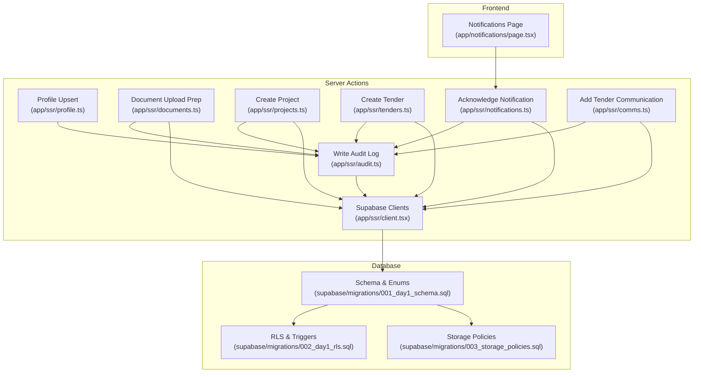
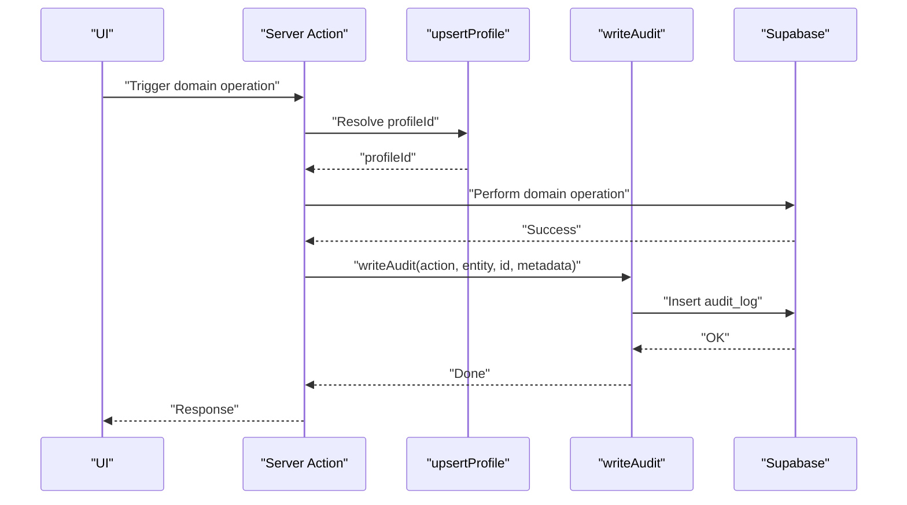
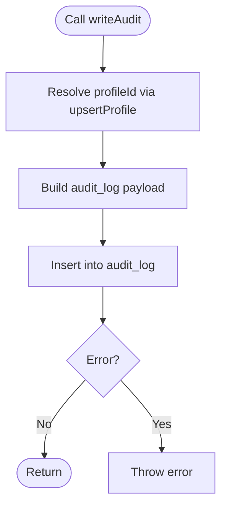
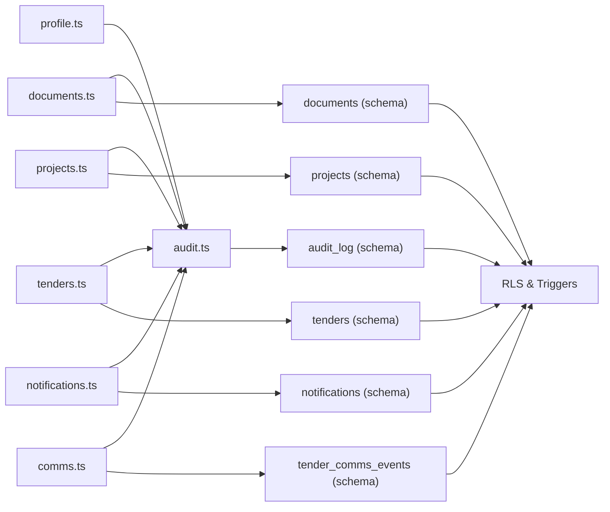

# Audit and Compliance

<cite>
**Referenced Files in This Document**
- [audit.ts](file://app/ssr/audit.ts)
- [profile.ts](file://app/ssr/profile.ts)
- [client.tsx](file://app/ssr/client.tsx)
- [documents.ts](file://app/ssr/documents.ts)
- [projects.ts](file://app/ssr/projects.ts)
- [tenders.ts](file://app/ssr/tenders.ts)
- [notifications.ts](file://app/ssr/notifications.ts)
- [comms.ts](file://app/ssr/comms.ts)
- [001_day1_schema.sql](file://supabase/migrations/001_day1_schema.sql)
- [002_day1_rls.sql](file://supabase/migrations/002_day1_rls.sql)
- [003_storage_policies.sql](file://supabase/migrations/003_storage_policies.sql)
- [notifications/page.tsx](file://app/notifications/page.tsx)
</cite>

## Table of Contents
1. [Introduction](#introduction)
2. [Project Structure](#project-structure)
3. [Core Components](#core-components)
4. [Architecture Overview](#architecture-overview)
5. [Detailed Component Analysis](#detailed-component-analysis)
6. [Dependency Analysis](#dependency-analysis)
7. [Performance Considerations](#performance-considerations)
8. [Security and Integrity Measures](#security-and-integrity-measures)
9. [Audit Report Generation and Export](#audit-report-generation-and-export)
10. [Data Retention Policies](#data-retention-policies)
11. [User Interface Components](#user-interface-components)
12. [Practical Audit Scenarios](#practical-audit-scenarios)
13. [Troubleshooting Guide](#troubleshooting-guide)
14. [Conclusion](#conclusion)

## Introduction
This document describes the Audit and Compliance system implemented in the application. It explains how audit logs track create, update, delete, upload, and acknowledgment events across entities such as projects, tenders, documents, communications, and notifications. It also documents the compliance-enabling change tracking (who, what, when, why), security measures preventing tampering and unauthorized access, and the current capabilities for viewing, filtering, and exporting audit data. Finally, it outlines integration points with data retention and highlights areas for future enhancements.

## Project Structure
The audit and compliance features are implemented across:
- Server-side action modules under app/ssr that orchestrate domain operations and emit audit events
- Supabase database schema and Row Level Security (RLS) policies that define audit data structure and access controls
- Frontend pages that present notifications and related audit-aware views

**Diagram sources**
- [notifications/page.tsx](file://app/notifications/page.tsx#L1-L68)
- [profile.ts](file://app/ssr/profile.ts#L1-L31)
- [audit.ts](file://app/ssr/audit.ts#L1-L29)
- [documents.ts](file://app/ssr/documents.ts#L1-L114)
- [projects.ts](file://app/ssr/projects.ts#L1-L43)
- [tenders.ts](file://app/ssr/tenders.ts#L1-L43)
- [notifications.ts](file://app/ssr/notifications.ts#L1-L27)
- [comms.ts](file://app/ssr/comms.ts#L1-L37)
- [client.tsx](file://app/ssr/client.tsx#L1-L25)
- [001_day1_schema.sql](file://supabase/migrations/001_day1_schema.sql#L1-L227)
- [002_day1_rls.sql](file://supabase/migrations/002_day1_rls.sql#L1-L348)
- [003_storage_policies.sql](file://supabase/migrations/003_storage_policies.sql#L1-L55)

**Section sources**
- [audit.ts](file://app/ssr/audit.ts#L1-L29)
- [profile.ts](file://app/ssr/profile.ts#L1-L31)
- [client.tsx](file://app/ssr/client.tsx#L1-L25)
- [documents.ts](file://app/ssr/documents.ts#L1-L114)
- [projects.ts](file://app/ssr/projects.ts#L1-L43)
- [tenders.ts](file://app/ssr/tenders.ts#L1-L43)
- [notifications.ts](file://app/ssr/notifications.ts#L1-L27)
- [comms.ts](file://app/ssr/comms.ts#L1-L37)
- [001_day1_schema.sql](file://supabase/migrations/001_day1_schema.sql#L1-L227)
- [002_day1_rls.sql](file://supabase/migrations/002_day1_rls.sql#L1-L348)
- [003_storage_policies.sql](file://supabase/migrations/003_storage_policies.sql#L1-L55)
- [notifications/page.tsx](file://app/notifications/page.tsx#L1-L68)

## Core Components
- Audit logging service: centralized writeAudit function that captures actor, action, entity, and metadata.
- Profile management: upsertProfile ensures a user’s profile exists and returns the profile ID used as the actor identifier.
- Domain actions: createProject, createTender, prepareDocumentUpload, acknowledgeNotification, addTenderComms emit audit events after successful operations.
- Database schema: audit_log table with typed enums for actions and entities, plus supporting tables for projects, tenders, documents, and notifications.
- RLS and immutability: row-level security policies and triggers enforce append-only semantics for audit logs and sensitive communication events.

**Section sources**
- [audit.ts](file://app/ssr/audit.ts#L6-L28)
- [profile.ts](file://app/ssr/profile.ts#L6-L30)
- [projects.ts](file://app/ssr/projects.ts#L12-L40)
- [tenders.ts](file://app/ssr/tenders.ts#L12-L40)
- [documents.ts](file://app/ssr/documents.ts#L11-L86)
- [notifications.ts](file://app/ssr/notifications.ts#L7-L25)
- [comms.ts](file://app/ssr/comms.ts#L7-L36)
- [001_day1_schema.sql](file://supabase/migrations/001_day1_schema.sql#L208-L216)
- [002_day1_rls.sql](file://supabase/migrations/002_day1_rls.sql#L318-L347)

## Architecture Overview
The audit architecture follows a pattern:
- Server action orchestrates a domain operation
- On success, it calls writeAudit with action, entity type, entity ID, and optional metadata
- writeAudit resolves the current profile ID and inserts a record into audit_log
- RLS policies govern who can see or add audit entries
- Triggers prevent updates/deletes to maintain append-only integrity

**Diagram sources**
- [audit.ts](file://app/ssr/audit.ts#L6-L28)
- [profile.ts](file://app/ssr/profile.ts#L6-L30)
- [documents.ts](file://app/ssr/documents.ts#L11-L86)
- [projects.ts](file://app/ssr/projects.ts#L12-L40)
- [tenders.ts](file://app/ssr/tenders.ts#L12-L40)
- [notifications.ts](file://app/ssr/notifications.ts#L7-L25)
- [comms.ts](file://app/ssr/comms.ts#L7-L36)
- [001_day1_schema.sql](file://supabase/migrations/001_day1_schema.sql#L208-L216)
- [002_day1_rls.sql](file://supabase/migrations/002_day1_rls.sql#L318-L347)

## Detailed Component Analysis

### Audit Logging Service
- Purpose: Provide a single interface to record audit events with actor, action, entity, and metadata.
- Implementation: Resolves current profile via upsertProfile, constructs audit_log payload, and inserts into the audit_log table.
- Error handling: Propagates database errors as exceptions.

**Diagram sources**
- [audit.ts](file://app/ssr/audit.ts#L6-L28)
- [profile.ts](file://app/ssr/profile.ts#L6-L30)

**Section sources**
- [audit.ts](file://app/ssr/audit.ts#L6-L28)

### Profile Management
- Purpose: Ensure a Clerk-authenticated user has a corresponding profile record and return the profile ID.
- Implementation: Upserts profiles keyed by Clerk user ID, selects the ID for subsequent operations.

**Section sources**
- [profile.ts](file://app/ssr/profile.ts#L6-L30)

### Document Upload Pipeline
- Purpose: Prepare document metadata, create a signed upload URL, schedule extraction jobs, and emit an audit event for uploads.
- Audit coverage: Records upload action with entity type document and metadata including path and associated project/tender identifiers.

**Section sources**
- [documents.ts](file://app/ssr/documents.ts#L11-L86)
- [001_day1_schema.sql](file://supabase/migrations/001_day1_schema.sql#L164-L180)

### Project Creation
- Purpose: Create a project and emit a create audit event with identifying metadata (e.g., project code).

**Section sources**
- [projects.ts](file://app/ssr/projects.ts#L12-L40)

### Tender Creation
- Purpose: Create a tender and emit a create audit event with identifying metadata (e.g., reference).

**Section sources**
- [tenders.ts](file://app/ssr/tenders.ts#L12-L40)

### Notification Acknowledgment
- Purpose: Mark a notification as acknowledged and emit an acknowledgment audit event for the notification entity.

**Section sources**
- [notifications.ts](file://app/ssr/notifications.ts#L7-L25)

### Tender Communication Event
- Purpose: Add a communication event for a tender and emit a create audit event for the tender_comms entity.

**Section sources**
- [comms.ts](file://app/ssr/comms.ts#L7-L36)

### Database Schema and Types
- audit_action enum: create, update, delete, upload, ack
- audit_entity enum: project, milestone, tender, tender_comms, document, notification
- audit_log table: stores actor, action, entity, occurred timestamp, and JSON metadata
- Supporting tables: projects, tenders, documents, notifications, tender_comms_events

**Section sources**
- [001_day1_schema.sql](file://supabase/migrations/001_day1_schema.sql#L59-L74)
- [001_day1_schema.sql](file://supabase/migrations/001_day1_schema.sql#L208-L216)

### Row Level Security and Immutability
- RLS policies:
  - Profiles: self-read/update
  - Projects/Tenders/Documents/Notifications: role-based visibility and edit controls
  - Audit log: append-only insert by actor; select by admin or actor
- Triggers:
  - Prevent updates/deletes on audit_log and tender_comms_events to maintain append-only integrity

**Section sources**
- [002_day1_rls.sql](file://supabase/migrations/002_day1_rls.sql#L318-L347)

## Dependency Analysis
Key dependencies and relationships:
- Server actions depend on upsertProfile to resolve actor identity
- Server actions depend on createServerSupabaseClient to execute database operations
- writeAudit depends on upsertProfile and the audit_log table schema
- RLS policies depend on current_clerk_user_id and current_profile_id functions
- Storage policies depend on audit_log-linked document records

**Diagram sources**
- [audit.ts](file://app/ssr/audit.ts#L1-L29)
- [profile.ts](file://app/ssr/profile.ts#L1-L31)
- [documents.ts](file://app/ssr/documents.ts#L1-L114)
- [projects.ts](file://app/ssr/projects.ts#L1-L43)
- [tenders.ts](file://app/ssr/tenders.ts#L1-L43)
- [notifications.ts](file://app/ssr/notifications.ts#L1-L27)
- [comms.ts](file://app/ssr/comms.ts#L1-L37)
- [001_day1_schema.sql](file://supabase/migrations/001_day1_schema.sql#L208-L216)
- [002_day1_rls.sql](file://supabase/migrations/002_day1_rls.sql#L318-L347)

**Section sources**
- [audit.ts](file://app/ssr/audit.ts#L1-L29)
- [profile.ts](file://app/ssr/profile.ts#L1-L31)
- [documents.ts](file://app/ssr/documents.ts#L1-L114)
- [projects.ts](file://app/ssr/projects.ts#L1-L43)
- [tenders.ts](file://app/ssr/tenders.ts#L1-L43)
- [notifications.ts](file://app/ssr/notifications.ts#L1-L27)
- [comms.ts](file://app/ssr/comms.ts#L1-L37)
- [001_day1_schema.sql](file://supabase/migrations/001_day1_schema.sql#L208-L216)
- [002_day1_rls.sql](file://supabase/migrations/002_day1_rls.sql#L318-L347)

## Performance Considerations
- Audit writes occur synchronously with domain operations; consider batching or asynchronous queues for high-volume environments.
- Index on (entity_type, entity_id) supports targeted queries; ensure appropriate filters are used to avoid full scans.
- Metadata stored as JSONB allows flexible auditing but may increase storage; keep metadata concise and indexed where queried frequently.

[No sources needed since this section provides general guidance]

## Security and Integrity Measures
- Append-only enforcement: Triggers prevent updates/deletes on audit_log and tender_comms_events.
- Actor binding: writeAudit uses the current authenticated profile ID; RLS policies restrict audit insert to the actor.
- Access control: RLS policies limit who can view audit entries (admin or actor) and who can perform domain operations.
- Authentication bridge: createServerSupabaseClient obtains tokens from Clerk to authenticate server-side Supabase calls.

**Section sources**
- [002_day1_rls.sql](file://supabase/migrations/002_day1_rls.sql#L332-L347)
- [audit.ts](file://app/ssr/audit.ts#L12-L23)
- [client.tsx](file://app/ssr/client.tsx#L4-L14)

## Audit Report Generation and Export
Current capabilities:
- Notifications page displays a simple table of notifications with acknowledgment status, enabling basic visibility of ack events.
- There is no dedicated audit log viewer or export endpoint in the current codebase.

Recommendations for future development:
- Implement a server action to query audit_log with filters (actor, action, entity, date range) and pagination.
- Provide CSV/JSON export endpoints for compliance reporting.
- Add UI components for filtering by action type, entity type, date range, and actor profile.

[No sources needed since this section provides general guidance]

## Data Retention Policies
- The schema and policies do not define explicit retention periods for audit_log.
- Implement retention at the application level by adding a scheduled job to purge old audit records after the organization’s compliance period.
- Consider partitioning or archiving strategies for long-term retention.

[No sources needed since this section provides general guidance]

## User Interface Components
- Notifications page: Lists notifications, severity, acknowledgment requirement, and acknowledgment status. Includes an inline acknowledgment action that emits an ack audit event.
- Project/Tender detail pages display recent documents, aiding correlation of document-related audit events.

**Section sources**
- [notifications/page.tsx](file://app/notifications/page.tsx#L1-L68)

## Practical Audit Scenarios
- User access tracking: When a user accesses the notifications page, their profile is upserted and bound to subsequent actions. While direct page access does not currently emit an audit event, the profile resolution establishes actor context for later actions.
- Data modification histories:
  - Creating a project emits a create audit event with identifying metadata (e.g., project code).
  - Creating a tender emits a create audit event with identifying metadata (e.g., reference).
  - Uploading a document emits an upload audit event with metadata including path and associated project/tender identifiers.
  - Acknowledging a notification emits an ack audit event for the notification entity.
  - Adding a tender communication event emits a create audit event for the tender_comms entity.
- Compliance reporting: Use the audit_log table to reconstruct timelines of changes per entity, filtered by actor and time window.

**Section sources**
- [projects.ts](file://app/ssr/projects.ts#L12-L40)
- [tenders.ts](file://app/ssr/tenders.ts#L12-L40)
- [documents.ts](file://app/ssr/documents.ts#L11-L86)
- [notifications.ts](file://app/ssr/notifications.ts#L7-L25)
- [comms.ts](file://app/ssr/comms.ts#L7-L36)

## Troubleshooting Guide
Common issues and resolutions:
- Authentication failures during profile upsert: Ensure Clerk authentication is configured and the user is signed in.
- Audit insert failures: Confirm the current user maps to a valid profile and that RLS allows insert for the actor.
- Storage URL creation failures: Verify storage policies and that the user has access to the linked project/tender.
- Notification acknowledgment errors: Confirm the notification exists, belongs to the user, and is not already acknowledged.

**Section sources**
- [profile.ts](file://app/ssr/profile.ts#L8-L10)
- [audit.ts](file://app/ssr/audit.ts#L25-L27)
- [003_storage_policies.sql](file://supabase/migrations/003_storage_policies.sql#L1-L55)
- [notifications/page.tsx](file://app/notifications/page.tsx#L11-L18)

## Conclusion
The application implements a robust foundation for audit and compliance through centralized audit logging, typed actions and entities, append-only enforcement, and role-based access controls. Current UI surfaces include notification acknowledgment and document listings, while dedicated audit log browsing and export are not yet implemented. Organizations can extend the system by adding audit query/export endpoints, retention policies, and UI filters to meet regulatory requirements.