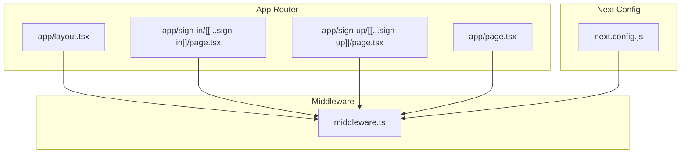
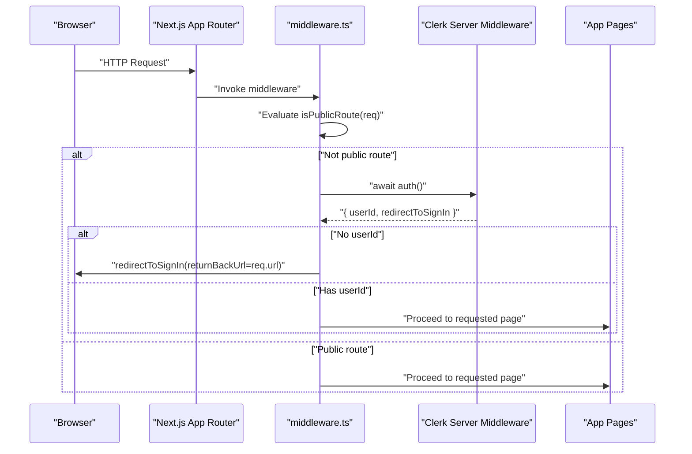
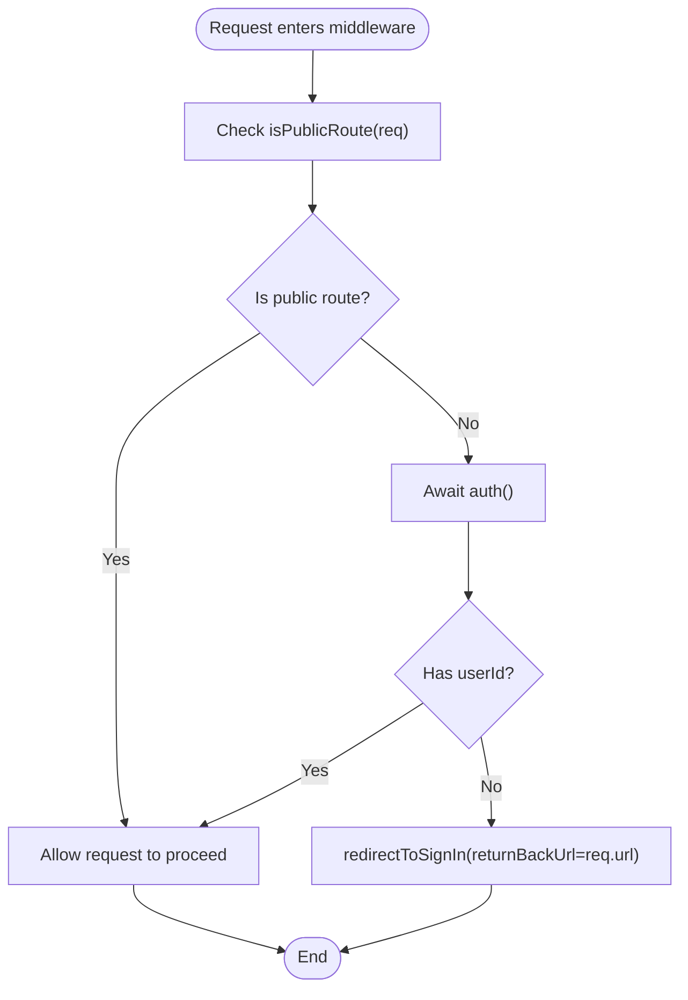
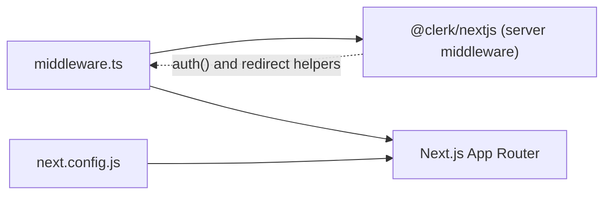

# Access Control Middleware

<cite>
**Referenced Files in This Document**
- [middleware.ts](file://middleware.ts)
- [layout.tsx](file://app/layout.tsx)
- [page.tsx](file://app/page.tsx)
- [package.json](file://package.json)
- [next.config.js](file://next.config.js)
- [app/sign-in/[[...sign-in]]/page.tsx](file://app/sign-in/[[...sign-in]]/page.tsx)
- [app/sign-up/[[...sign-up]]/page.tsx](file://app/sign-up/[[...sign-up]]/page.tsx)
</cite>

## Table of Contents
1. [Introduction](#introduction)
2. [Project Structure](#project-structure)
3. [Core Components](#core-components)
4. [Architecture Overview](#architecture-overview)
5. [Detailed Component Analysis](#detailed-component-analysis)
6. [Dependency Analysis](#dependency-analysis)
7. [Performance Considerations](#performance-considerations)
8. [Troubleshooting Guide](#troubleshooting-guide)
9. [Conclusion](#conclusion)

## Introduction
This document explains the access control middleware implementation in MCE Command Center. It focuses on how authentication is enforced across protected routes while allowing public access to designated endpoints, how the route matcher defines public routes, how the authentication check validates user sessions and redirects unauthenticated users to sign-in with return URL preservation, and how the matcher configuration excludes static assets, API routes, and webhook endpoints from authentication requirements. It also provides practical examples of route protection patterns, guidance for extending middleware with custom authorization logic, middleware execution order, performance considerations, and debugging techniques.

## Project Structure
The middleware is implemented in a single file and integrates with Next.js App Router pages and Clerk authentication. Key elements:
- Middleware definition and configuration in middleware.ts
- Public authentication pages under app/sign-in and app/sign-up
- Root layout that wraps the app with ClerkProvider and exposes sign-in link
- Next.js configuration for output tracing

**Diagram sources**
- [middleware.ts](file://middleware.ts#L1-L20)
- [layout.tsx](file://app/layout.tsx#L1-L46)
- [page.tsx](file://app/page.tsx#L1-L29)
- [next.config.js](file://next.config.js#L1-L7)

**Section sources**
- [middleware.ts](file://middleware.ts#L1-L20)
- [layout.tsx](file://app/layout.tsx#L1-L46)
- [page.tsx](file://app/page.tsx#L1-L29)
- [next.config.js](file://next.config.js#L1-L7)

## Core Components
- Authentication middleware: Uses Clerk’s server middleware to enforce authentication on protected routes and redirect unauthenticated users to sign-in with return URL preservation.
- Route matcher: Defines public routes including the home page and authentication pages.
- Matcher configuration: Excludes static assets, API/trpc routes, and webhook endpoints from middleware processing.

Key behaviors:
- Protected routes require a valid user session; otherwise, users are redirected to sign-in with the current URL preserved as the return address.
- Public routes bypass authentication checks.
- Static assets and API/trpc endpoints are excluded from middleware processing to avoid unnecessary overhead.

**Section sources**
- [middleware.ts](file://middleware.ts#L1-L20)

## Architecture Overview
The middleware sits between incoming requests and the App Router pages. It evaluates whether a request should be subject to authentication based on the route matcher and the configured exclusion patterns.

**Diagram sources**
- [middleware.ts](file://middleware.ts#L5-L12)

## Detailed Component Analysis

### Middleware Configuration and Execution
- Imports: Uses Clerk’s server middleware and a route matcher factory to define public routes.
- Public route definition: A route matcher identifies the home page and authentication pages as public.
- Authentication enforcement: For non-public routes, the middleware awaits the auth() function, checks for a user ID, and redirects to sign-in with the current URL as the return address if no user is present.
- Matcher configuration: The matcher array excludes Next.js internal paths and static asset extensions, and also excludes API/trpc routes.

**Diagram sources**
- [middleware.ts](file://middleware.ts#L3-L12)

**Section sources**
- [middleware.ts](file://middleware.ts#L1-L20)

### Route Matcher for Public Routes
- Purpose: Define which routes are publicly accessible without requiring authentication.
- Implementation pattern: A route matcher is created with patterns for the home page and authentication pages.
- Usage: The middleware conditionally enforces authentication only when the request does not match the public route patterns.

Practical examples of public route patterns:
- Home page route
- Authentication sign-in route
- Authentication sign-up route

These patterns ensure that visitors can access the landing and authentication pages without being redirected to sign-in.

**Section sources**
- [middleware.ts](file://middleware.ts#L3-L3)

### Authentication Check Logic
- Session validation: The middleware awaits the auth() function to obtain the user ID and a redirect helper.
- Unauthenticated redirect: If no user ID is present, the middleware triggers a redirect to the Clerk sign-in page with the current request URL as the return address.
- Return URL preservation: The redirect preserves the original URL so users can return after signing in.

This mechanism ensures a seamless sign-in experience while protecting all non-public routes.

**Section sources**
- [middleware.ts](file://middleware.ts#L7-L11)

### Matcher Configuration for Exclusions
- Static assets exclusion: The matcher excludes Next.js internal paths and common static asset extensions to prevent middleware from processing assets unnecessarily.
- API/trpc exclusion: API and trpc routes are excluded from middleware processing, allowing direct access to backend endpoints.
- Webhook endpoints: Webhook endpoints are implicitly covered by the static asset exclusion pattern, ensuring they remain accessible.

These exclusions optimize performance by avoiding middleware processing for static resources and API endpoints.

**Section sources**
- [middleware.ts](file://middleware.ts#L14-L19)

### Integration with Clerk’s auth() Function
- Clerk server middleware: The middleware leverages Clerk’s server-side auth() to validate sessions and obtain redirect helpers.
- Seamless integration: The auth() function returns a user ID and a redirect helper suitable for enforcing authentication.
- Return URL handling: The redirect helper accepts a return URL parameter to preserve the intended destination after sign-in.

This integration provides robust, server-side authentication enforcement aligned with Clerk’s recommended patterns.

**Section sources**
- [middleware.ts](file://middleware.ts#L7-L11)

### Practical Examples of Route Protection Patterns
- Home page: Public route; accessible without authentication.
- Authentication pages: Public routes; accessible without authentication.
- Protected pages: Enforced authentication via middleware; unauthenticated users are redirected to sign-in with return URL preservation.

These patterns demonstrate how to selectively protect routes while keeping essential pages publicly accessible.

**Section sources**
- [middleware.ts](file://middleware.ts#L3-L3)
- [page.tsx](file://app/page.tsx#L1-L29)

### Extending Middleware with Custom Authorization Logic
Recommended approaches for adding role-based or custom authorization:
- Access user metadata: Use Clerk’s auth() to retrieve user information and enforce role-based policies.
- Conditional redirection: Redirect users to appropriate pages based on roles or permissions.
- Per-route authorization: Apply additional checks inside the middleware for specific routes or path segments.

Note: The current middleware focuses on session validation and public route handling. Extend it by incorporating user roles and permissions alongside the existing auth() flow.

[No sources needed since this section provides general guidance]

### Middleware Execution Order
- Middleware runs before the App Router resolves pages.
- The matcher configuration determines which requests reach the middleware.
- Public routes bypass middleware checks; protected routes trigger authentication validation.

This order ensures efficient routing and minimal overhead for public and static content.

**Section sources**
- [middleware.ts](file://middleware.ts#L14-L19)

## Dependency Analysis
The middleware depends on Clerk’s Next.js server middleware and Next.js configuration. The project’s dependency manifest includes Clerk and Next.js packages.

**Diagram sources**
- [middleware.ts](file://middleware.ts#L1-L1)
- [package.json](file://package.json#L11-L19)
- [next.config.js](file://next.config.js#L1-L7)

**Section sources**
- [package.json](file://package.json#L11-L19)
- [middleware.ts](file://middleware.ts#L1-L1)

## Performance Considerations
- Matcher exclusions: Excluding static assets and API/trpc routes reduces middleware overhead.
- Minimal checks: The middleware performs a single route match and optional auth() call per request.
- Next.js output tracing: The Next.js configuration sets the output tracing root to improve build performance.

[No sources needed since this section provides general guidance]

## Troubleshooting Guide
Common issues and debugging techniques:
- Unexpected redirects to sign-in:
  - Verify the route matches the public route patterns.
  - Confirm the request URL is not being incorrectly treated as a protected route.
- Static assets failing to load:
  - Ensure the matcher excludes static asset extensions and Next.js internal paths.
- API/trpc endpoints blocked:
  - Confirm the matcher excludes API/trpc routes.
- Return URL not preserved:
  - Verify the redirect helper is invoked with the current request URL.

Debugging steps:
- Log the request URL and matched route patterns during middleware execution.
- Temporarily relax the matcher to isolate whether the issue is with public vs. protected routing.
- Inspect Clerk’s auth() response for user ID presence and redirect helper behavior.

[No sources needed since this section provides general guidance]

## Conclusion
The access control middleware in MCE Command Center enforces authentication on protected routes while allowing public access to designated endpoints. It leverages Clerk’s server middleware, a route matcher for public routes, and a matcher configuration that excludes static assets, API/trpc routes, and webhook endpoints. The implementation preserves return URLs for a smooth sign-in experience and provides a foundation for extending middleware with custom authorization logic.