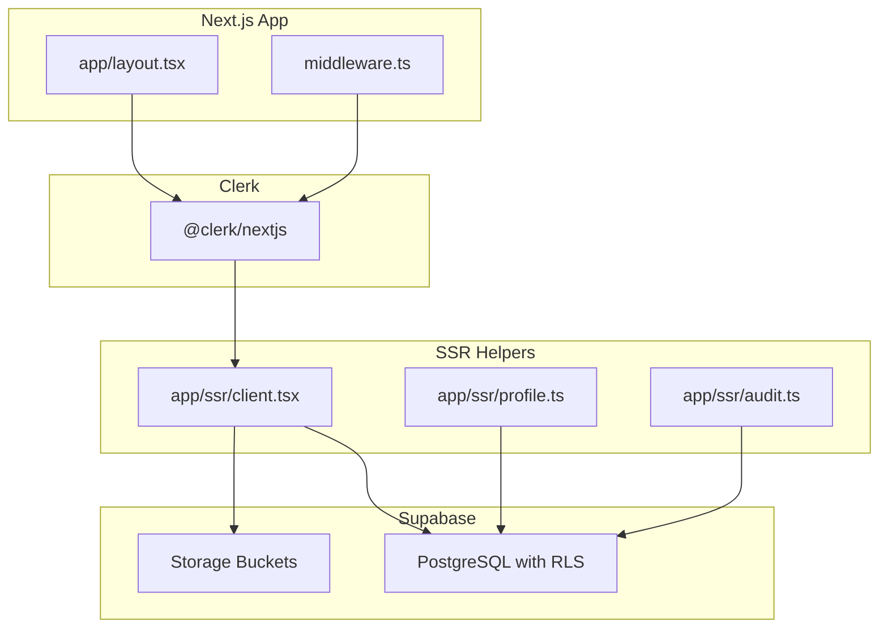
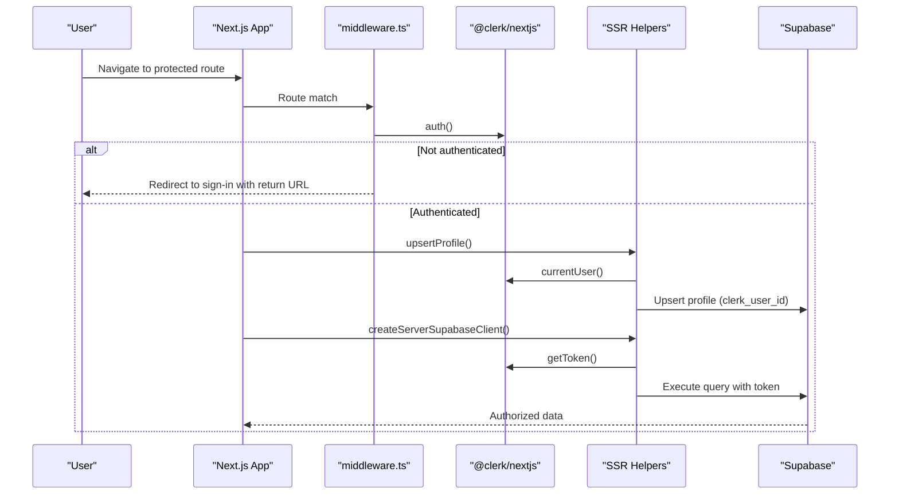
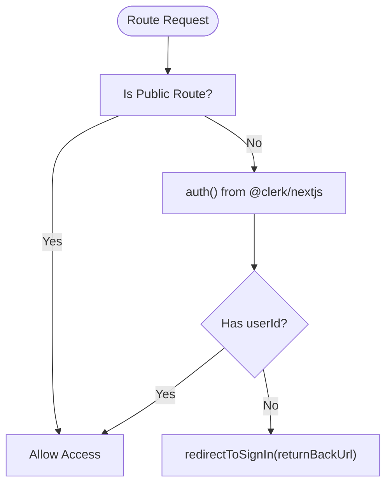
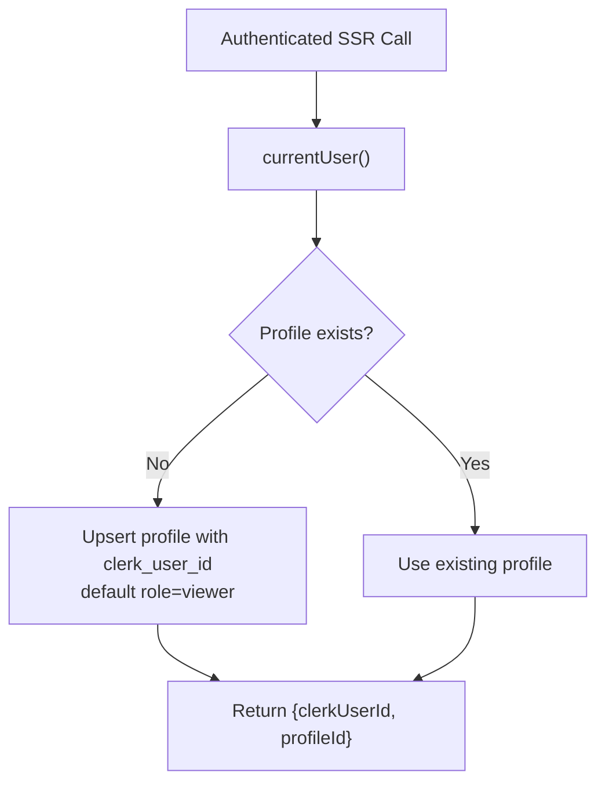
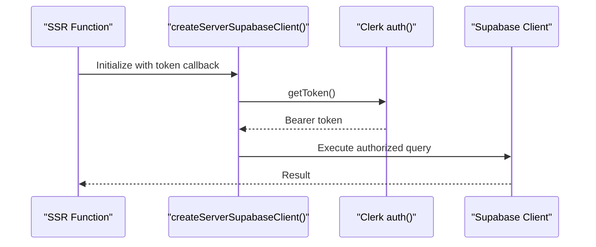
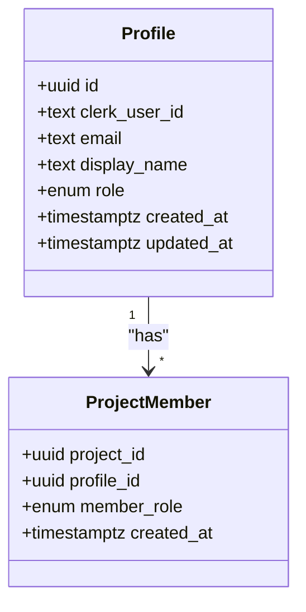
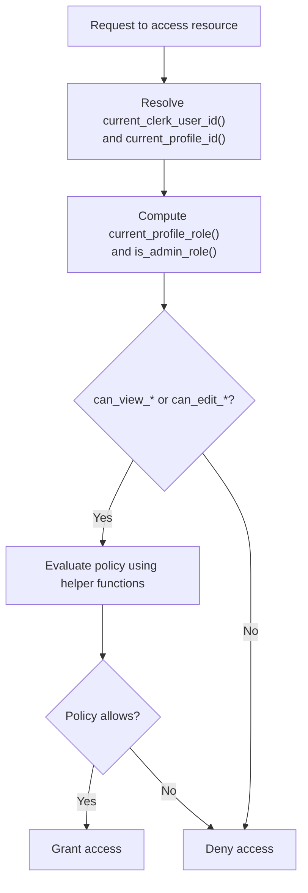
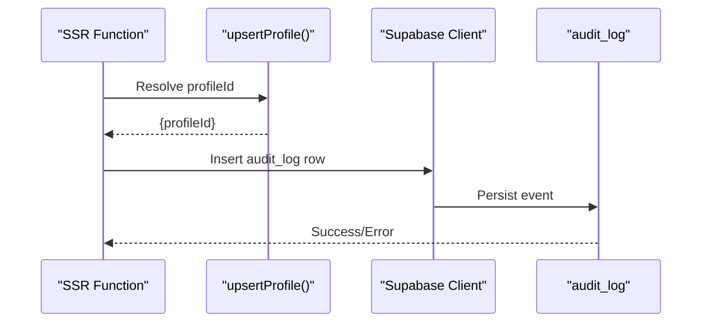
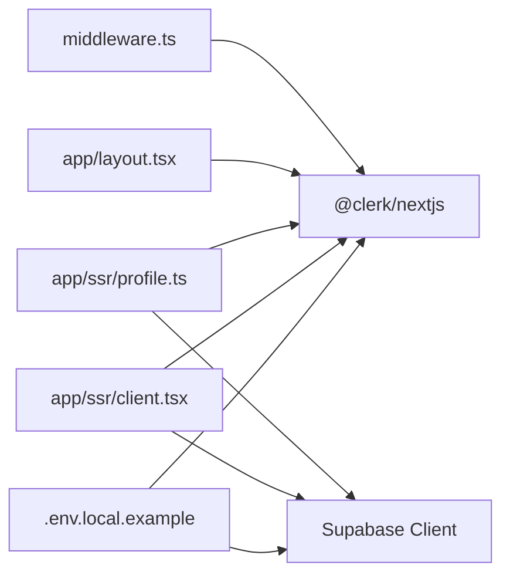

# Authentication & Authorization

<cite>
**Referenced Files in This Document**
- [middleware.ts](file://middleware.ts)
- [package.json](file://package.json)
- [001_day1_schema.sql](file://supabase/migrations/001_day1_schema.sql)
- [002_day1_rls.sql](file://supabase/migrations/002_day1_rls.sql)
- [003_storage_policies.sql](file://supabase/migrations/003_storage_policies.sql)
- [profile.ts](file://app/ssr/profile.ts)
- [client.tsx](file://app/ssr/client.tsx)
- [layout.tsx](file://app/layout.tsx)
- [.env.local.example](file://.env.local.example)
- [setup-supabase.js](file://scripts/setup-supabase.js)
- [audit.ts](file://app/ssr/audit.ts)
</cite>

## Table of Contents
1. [Introduction](#introduction)
2. [Project Structure](#project-structure)
3. [Core Components](#core-components)
4. [Architecture Overview](#architecture-overview)
5. [Detailed Component Analysis](#detailed-component-analysis)
6. [Dependency Analysis](#dependency-analysis)
7. [Performance Considerations](#performance-considerations)
8. [Troubleshooting Guide](#troubleshooting-guide)
9. [Conclusion](#conclusion)
10. [Appendices](#appendices)

## Introduction
This document explains the authentication and authorization model for MCE Command Center. It covers Clerk integration for user management and session handling, the internal user role system, middleware-based access control, authentication flow from sign-in/sign-up to authenticated sessions, profile management, and Row Level Security (RLS) policies that govern data access. It also provides practical examples of role-based access patterns, manual role assignment via SQL, and troubleshooting guidance for common authentication issues.

## Project Structure
The authentication and authorization system spans three layers:
- Frontend Next.js with Clerk provider and middleware
- Supabase database with RLS policies and storage policies
- SSR helpers that bridge Clerk and Supabase

**Diagram sources**
- [layout.tsx](file://app/layout.tsx#L1-L46)
- [middleware.ts](file://middleware.ts#L1-L20)
- [client.tsx](file://app/ssr/client.tsx#L1-L25)
- [profile.ts](file://app/ssr/profile.ts#L1-L31)
- [audit.ts](file://app/ssr/audit.ts#L1-L28)

**Section sources**
- [layout.tsx](file://app/layout.tsx#L1-L46)
- [middleware.ts](file://middleware.ts#L1-L20)
- [client.tsx](file://app/ssr/client.tsx#L1-L25)
- [profile.ts](file://app/ssr/profile.ts#L1-L31)
- [audit.ts](file://app/ssr/audit.ts#L1-L28)

## Core Components
- Clerk integration: Provides authentication, session management, and user identity. The app wraps the UI in a Clerk provider and enforces protected routes via middleware.
- Supabase RLS: Enforces fine-grained access control on tables and storage using PostgreSQL policies and helper functions.
- Profile synchronization: On first authenticated request, the app upserts a local profile record linked to Clerk’s user ID.
- Token bridging: Supabase client fetches an access token from Clerk to authorize database requests.
- Audit logging: Writes audit events associated with the current profile.

**Section sources**
- [layout.tsx](file://app/layout.tsx#L1-L46)
- [middleware.ts](file://middleware.ts#L1-L20)
- [profile.ts](file://app/ssr/profile.ts#L1-L31)
- [client.tsx](file://app/ssr/client.tsx#L1-L25)
- [audit.ts](file://app/ssr/audit.ts#L1-L28)

## Architecture Overview
The authentication and authorization flow integrates Clerk and Supabase as follows:
- Clerk handles sign-in/sign-up and sets session cookies.
- Middleware protects private routes and redirects unauthenticated users to sign-in.
- SSR helpers synchronize Clerk identity to the internal profile and issue Supabase queries with Clerk-derived tokens.
- Supabase policies enforce access per user role and project/team membership.

**Diagram sources**
- [middleware.ts](file://middleware.ts#L5-L12)
- [profile.ts](file://app/ssr/profile.ts#L6-L30)
- [client.tsx](file://app/ssr/client.tsx#L4-L14)

## Detailed Component Analysis

### Clerk Integration and Session Handling
- Provider setup: The root layout initializes Clerk and renders a signed-in/out state with a user button.
- Middleware enforcement: A route matcher excludes public routes (home, sign-in, sign-up). For protected routes, the middleware awaits Clerk auth and redirects to sign-in with the original URL preserved.
- Environment configuration: Clerk publishable and secret keys, redirect URLs, and after-sign-in URLs are configured in environment variables.

**Diagram sources**
- [middleware.ts](file://middleware.ts#L3-L12)
- [layout.tsx](file://app/layout.tsx#L17-L44)
- [.env.local.example](file://.env.local.example#L1-L11)

**Section sources**
- [layout.tsx](file://app/layout.tsx#L1-L46)
- [middleware.ts](file://middleware.ts#L1-L20)
- [.env.local.example](file://.env.local.example#L1-L11)

### Profile Management and Role Assignment
- Profile creation/upsert: On first authenticated SSR call, the app retrieves the current Clerk user and upserts a profile record keyed by Clerk’s user ID. The profile defaults to a base role and stores display name and email.
- Role field: Profiles carry a role enum with values including super_admin, chairman_vp, dept_head, pm, engineer, finance, and viewer.
- Manual role assignment: Administrators can update a profile’s role via SQL to grant elevated permissions.

**Diagram sources**
- [profile.ts](file://app/ssr/profile.ts#L6-L30)
- [001_day1_schema.sql](file://supabase/migrations/001_day1_schema.sql#L76-L84)

**Section sources**
- [profile.ts](file://app/ssr/profile.ts#L1-L31)
- [001_day1_schema.sql](file://supabase/migrations/001_day1_schema.sql#L3-L11)
- [001_day1_schema.sql](file://supabase/migrations/001_day1_schema.sql#L76-L84)

### Token Handling and Supabase Client
- Token acquisition: The Supabase client configured for server-side requests obtains an access token from Clerk during each request.
- Service role client: A separate client uses the Supabase service role key for privileged operations (e.g., initial profile upsert).
- Environment variables: Supabase URL, anonymous/public key, and service role key are required.

**Diagram sources**
- [client.tsx](file://app/ssr/client.tsx#L4-L14)
- [client.tsx](file://app/ssr/client.tsx#L16-L24)

**Section sources**
- [client.tsx](file://app/ssr/client.tsx#L1-L25)
- [.env.local.example](file://.env.local.example#L3-L5)

### Access Control Implementation via Middleware
- Protected routes: Middleware applies to non-public routes and ensures a valid Clerk session before allowing navigation.
- Redirect behavior: Unauthenticated users are redirected to the sign-in page with the requested URL as the return-back parameter.

**Section sources**
- [middleware.ts](file://middleware.ts#L14-L19)
- [middleware.ts](file://middleware.ts#L5-L12)

### User Roles and Permissions
Roles are defined as an enum and stored on profiles. The system distinguishes administrative roles and functional roles:
- Administrative roles: super_admin, chairman_vp, dept_head, finance
- Functional roles: pm, engineer, viewer
- Project/team roles: project_members.member_role supports the same enum for per-project/team assignments.

**Diagram sources**
- [001_day1_schema.sql](file://supabase/migrations/001_day1_schema.sql#L76-L84)
- [001_day1_schema.sql](file://supabase/migrations/001_day1_schema.sql#L112-L118)

**Section sources**
- [001_day1_schema.sql](file://supabase/migrations/001_day1_schema.sql#L3-L11)
- [001_day1_schema.sql](file://supabase/migrations/001_day1_schema.sql#L112-L118)

### Row Level Security (RLS) Policies
RLS policies define who can access or modify data. They rely on helper functions to derive the current user’s identity and role.

- Identity helpers:
  - current_clerk_user_id(): Extracts the Clerk user ID from the JWT subject claim.
  - current_profile_id(): Resolves the internal profile UUID for the current Clerk user.
  - current_profile_role(): Returns the current profile’s role enum.
  - is_admin_role(): True for administrative roles.

- Access patterns:
  - can_view_project(project_id): True for admins, project managers, or members.
  - can_edit_project(project_id): True for higher roles or project managers.
  - can_view_tender(tender_id): True for admins, owners, project viewers, or tender members.
  - can_edit_tender(tender_id): True for higher roles, owners, or editable via project context.

- Policy coverage:
  - profiles: Self-read/write allowed; admins can read all.
  - clients: Select allowed for functional roles; insert/update restricted to higher roles.
  - projects: Select allowed per can_view_project; insert/update per can_edit_project.
  - project_members: Select allowed; manage policies align with can_edit_project.
  - project_milestones: Select/insert/update allowed per can_edit_project.
  - tenders: Select allowed per can_view_tender; insert requires owner and role checks; update per can_edit_tender.
  - tender_members: Select/manage per can_edit_tender.
  - tender_comms_events: Select allowed; insert requires view permission and actor match.
  - documents: Select/insert/update/delete allowed per can_edit_project/can_edit_tender; admins bypass checks.
  - notifications: Select allowed for recipients/admins; update requires ownership.
  - audit_log: Select allowed for actors/admins; insert requires actor match.
  - Storage: Documents bucket access controlled by document ownership and project/tender visibility.

**Diagram sources**
- [002_day1_rls.sql](file://supabase/migrations/002_day1_rls.sql#L1-L35)
- [002_day1_rls.sql](file://supabase/migrations/002_day1_rls.sql#L37-L113)
- [002_day1_rls.sql](file://supabase/migrations/002_day1_rls.sql#L115-L331)
- [003_storage_policies.sql](file://supabase/migrations/003_storage_policies.sql#L1-L55)

**Section sources**
- [002_day1_rls.sql](file://supabase/migrations/002_day1_rls.sql#L1-L35)
- [002_day1_rls.sql](file://supabase/migrations/002_day1_rls.sql#L37-L113)
- [002_day1_rls.sql](file://supabase/migrations/002_day1_rls.sql#L115-L331)
- [003_storage_policies.sql](file://supabase/migrations/003_storage_policies.sql#L1-L55)

### Practical Examples of Role-Based Access Patterns
- Viewer sees only what they are permitted to view:
  - Projects: via can_view_project
  - Tenders: via can_view_tender
  - Documents: via can_view_project or can_view_tender
- PM can manage their projects and related tenders:
  - Insert/update/delete on projects and related records
  - Tender ownership implies edit rights
- Finance admin can manage financial aspects:
  - Full access to clients and tenders
  - View/edit of documents within their scope
- Super admin can override most restrictions:
  - Broad select/update/delete privileges
  - Storage delete for documents

[No sources needed since this section provides conceptual examples]

### Manual Role Assignment via SQL
Administrators can update a profile’s role directly in the database. Example pattern:
- Update a profile’s role to a higher administrative or functional role.
- Ensure the change aligns with organizational needs and least privilege principles.

[No sources needed since this section provides conceptual guidance]

### Audit Logging
The audit module writes audit entries with actor profile, action, entity type, and metadata. It depends on profile upsert to resolve the current profile ID.

**Diagram sources**
- [audit.ts](file://app/ssr/audit.ts#L6-L28)
- [profile.ts](file://app/ssr/profile.ts#L6-L30)

**Section sources**
- [audit.ts](file://app/ssr/audit.ts#L1-L28)
- [profile.ts](file://app/ssr/profile.ts#L1-L31)

## Dependency Analysis
- Clerk SDK: Provides authentication and session utilities used by middleware and SSR helpers.
- Supabase JS: Bridges Clerk tokens to database access for server-side operations.
- Environment variables: Clerk keys, Supabase URLs/keys, and redirect URLs are required for proper operation.

**Diagram sources**
- [middleware.ts](file://middleware.ts#L1-L20)
- [layout.tsx](file://app/layout.tsx#L1-L46)
- [profile.ts](file://app/ssr/profile.ts#L1-L31)
- [client.tsx](file://app/ssr/client.tsx#L1-L25)
- [.env.local.example](file://.env.local.example#L1-L11)

**Section sources**
- [package.json](file://package.json#L11-L18)
- [middleware.ts](file://middleware.ts#L1-L20)
- [layout.tsx](file://app/layout.tsx#L1-L46)
- [client.tsx](file://app/ssr/client.tsx#L1-L25)
- [.env.local.example](file://.env.local.example#L1-L11)

## Performance Considerations
- Minimize repeated profile upserts: Cache profileId per request lifecycle where feasible.
- Prefer server-side rendering for protected pages to centralize auth checks.
- Keep RLS checks efficient by leveraging indexes on foreign keys and frequently filtered columns.
- Avoid unnecessary token refreshes; reuse tokens within a request where Clerk provides them.

[No sources needed since this section provides general guidance]

## Troubleshooting Guide
Common issues and resolutions:
- Missing environment variables:
  - Ensure Clerk publishable and secret keys, Supabase URL and keys, and redirect URLs are present in the environment configuration.
- Middleware redirect loop:
  - Verify public routes are correctly matched and that sign-in/sign-up URLs are configured consistently.
- Unauthorized database access:
  - Confirm the Supabase client is initialized with Clerk token retrieval and that the service role client is used only for privileged operations.
- Profile not created:
  - Ensure an authenticated SSR call occurs so that upsertProfile can create the profile record.
- Storage access denied:
  - Confirm the document belongs to a project/tender the user can view and that the bucket and path match the policies.

**Section sources**
- [.env.local.example](file://.env.local.example#L1-L11)
- [middleware.ts](file://middleware.ts#L3-L12)
- [client.tsx](file://app/ssr/client.tsx#L4-L14)
- [profile.ts](file://app/ssr/profile.ts#L6-L30)
- [003_storage_policies.sql](file://supabase/migrations/003_storage_policies.sql#L1-L55)

## Conclusion
MCE Command Center combines Clerk for robust authentication and Supabase RLS for granular data access control. Middleware enforces session requirements, SSR helpers synchronize Clerk identities to internal profiles, and policies ensure users see and edit only what their roles permit. Administrators can manage roles manually while maintaining strong security boundaries enforced by database-level policies.

## Appendices

### Appendix A: Supabase Setup Script
The setup script runs SQL migrations and creates the documents storage bucket with limits and allowed MIME types.

**Section sources**
- [setup-supabase.js](file://scripts/setup-supabase.js#L7-L45)
- [setup-supabase.js](file://scripts/setup-supabase.js#L47-L77)