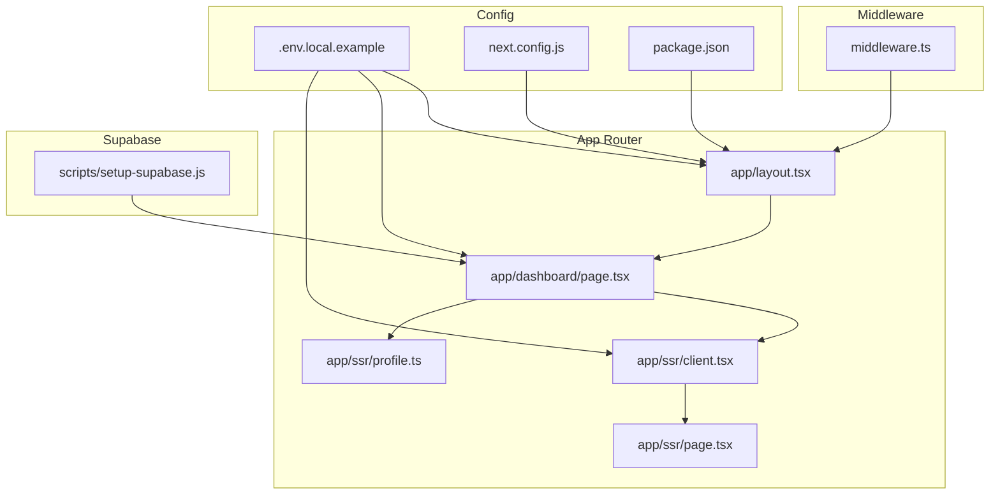
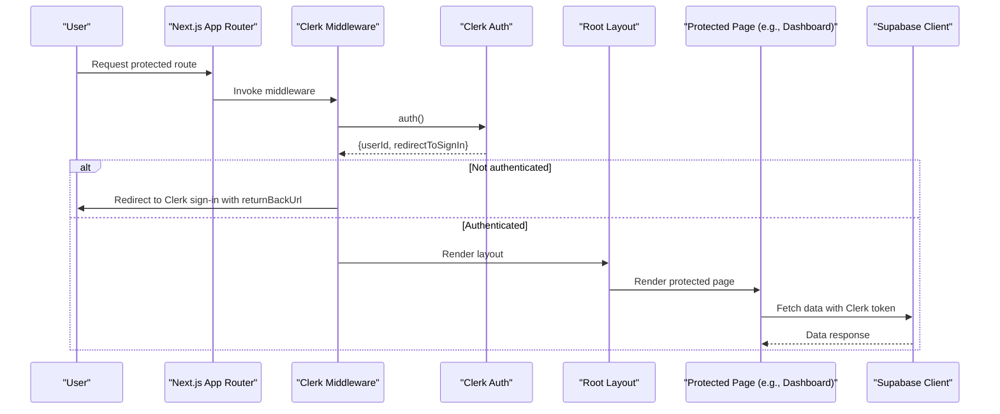
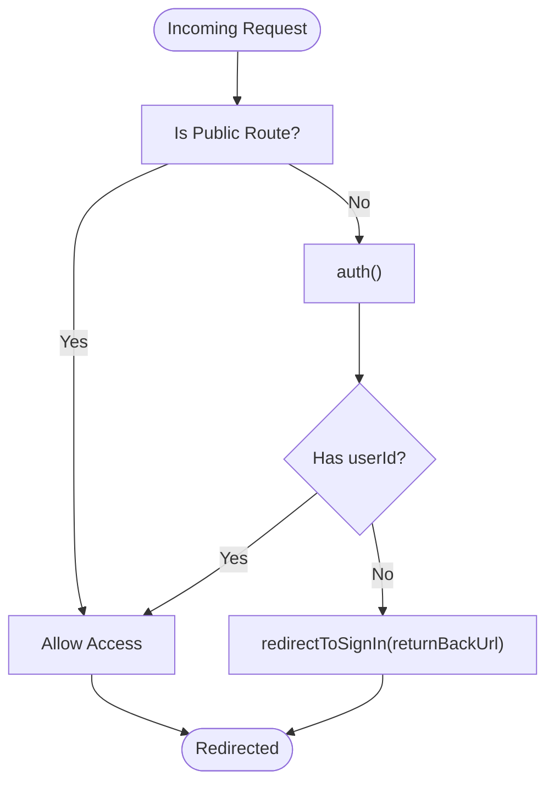
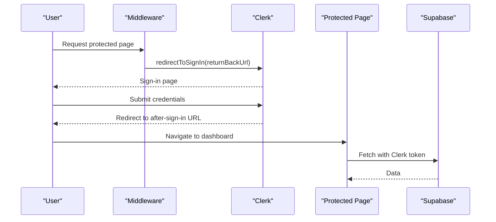
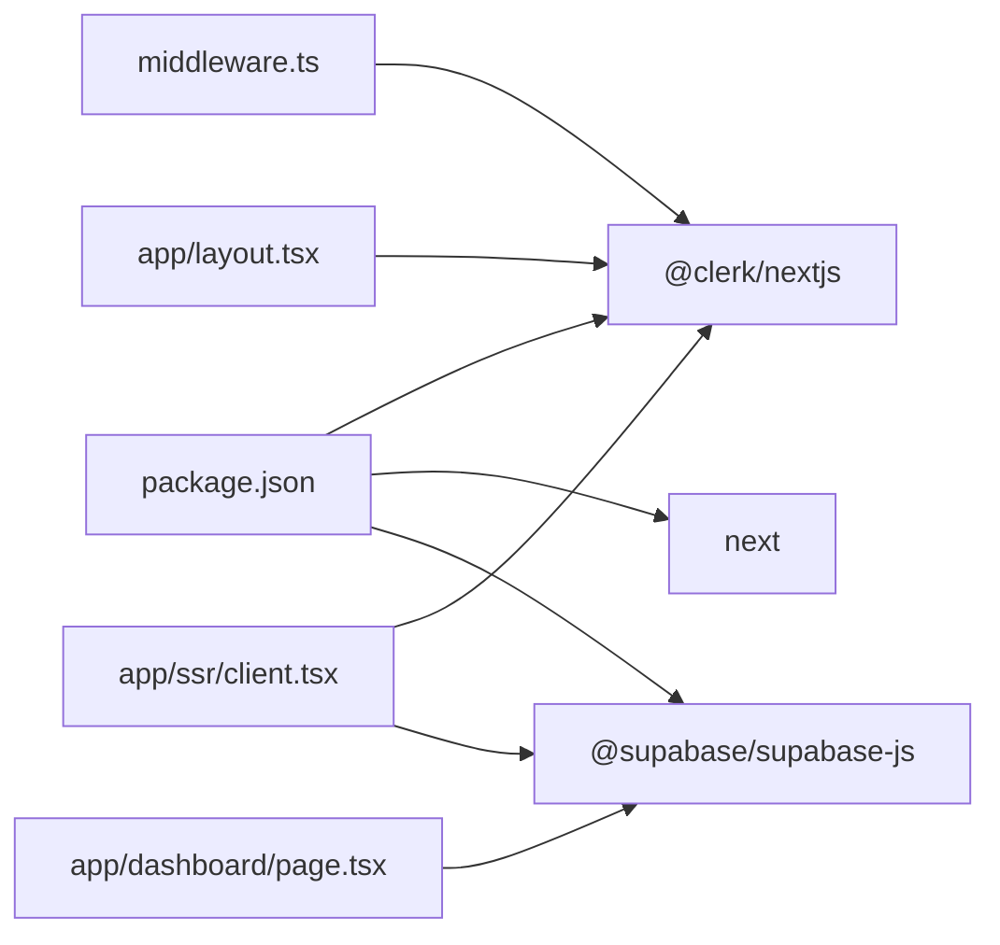

# Clerk Integration

<cite>
**Referenced Files in This Document**
- [middleware.ts](file://middleware.ts)
- [package.json](file://package.json)
- [next.config.js](file://next.config.js)
- [app/layout.tsx](file://app/layout.tsx)
- [.env.local.example](file://.env.local.example)
- [app/dashboard/page.tsx](file://app/dashboard/page.tsx)
- [app/ssr/client.tsx](file://app/ssr/client.tsx)
- [app/ssr/profile.ts](file://app/ssr/profile.ts)
- [app/ssr/page.tsx](file://app/ssr/page.tsx)
- [scripts/setup-supabase.js](file://scripts/setup-supabase.js)
</cite>

## Table of Contents
1. [Introduction](#introduction)
2. [Project Structure](#project-structure)
3. [Core Components](#core-components)
4. [Architecture Overview](#architecture-overview)
5. [Detailed Component Analysis](#detailed-component-analysis)
6. [Dependency Analysis](#dependency-analysis)
7. [Performance Considerations](#performance-considerations)
8. [Troubleshooting Guide](#troubleshooting-guide)
9. [Conclusion](#conclusion)

## Introduction
This document explains the Clerk authentication integration in MCE Command Center, focusing on the Next.js App Router setup with Clerk’s middleware and route protection. It covers:
- Clerk middleware configuration and route protection logic
- Public route configuration for landing and authentication pages
- Middleware matcher exclusions for static assets and API routes
- Authentication flow from sign-in/sign-up to authenticated sessions
- Redirect handling and session persistence
- Clerk provider integration in the root layout
- Clerk dashboard integration and user management via Clerk’s admin
- Session token handling for Supabase integration
- Practical examples of redirectToSignIn and integration patterns with Supabase
- Troubleshooting guidance for common authentication issues

## Project Structure
The authentication system centers around a small set of files:
- Middleware defines global route protection and matcher exclusions
- Root layout initializes Clerk provider and renders header controls
- Environment variables configure Clerk and Supabase integration
- Dashboard and SSR utilities demonstrate authenticated data fetching and profile upsert
- Supabase setup script configures database and storage policies

**Diagram sources**
- [middleware.ts](file://middleware.ts#L1-L20)
- [app/layout.tsx](file://app/layout.tsx#L1-L46)
- [app/dashboard/page.tsx](file://app/dashboard/page.tsx#L1-L157)
- [app/ssr/client.tsx](file://app/ssr/client.tsx#L1-L25)
- [app/ssr/profile.ts](file://app/ssr/profile.ts#L1-L31)
- [app/ssr/page.tsx](file://app/ssr/page.tsx#L1-L29)
- [.env.local.example](file://.env.local.example#L1-L11)
- [next.config.js](file://next.config.js#L1-L7)
- [package.json](file://package.json#L1-L32)
- [scripts/setup-supabase.js](file://scripts/setup-supabase.js#L1-L91)

**Section sources**
- [middleware.ts](file://middleware.ts#L1-L20)
- [app/layout.tsx](file://app/layout.tsx#L1-L46)
- [.env.local.example](file://.env.local.example#L1-L11)
- [package.json](file://package.json#L1-L32)
- [next.config.js](file://next.config.js#L1-L7)

## Core Components
- Clerk middleware: Implements route protection and redirects unauthenticated users to sign-in while allowing public routes.
- Clerk provider: Wraps the application to enable Clerk components and hooks in the UI.
- Environment configuration: Provides Clerk publishable and secret keys, Supabase URLs and keys, and Clerk after-sign-in/out paths.
- Supabase client with Clerk tokens: Uses Clerk’s server-side auth to supply Supabase with a current session token for secure server-side queries.
- Profile upsert: Ensures a user’s profile exists in Supabase upon dashboard access.

**Section sources**
- [middleware.ts](file://middleware.ts#L1-L20)
- [app/layout.tsx](file://app/layout.tsx#L1-L46)
- [.env.local.example](file://.env.local.example#L1-L11)
- [app/ssr/client.tsx](file://app/ssr/client.tsx#L1-L25)
- [app/ssr/profile.ts](file://app/ssr/profile.ts#L1-L31)

## Architecture Overview
The authentication architecture enforces global protection with Clerk middleware, exposes public routes for sign-in and sign-up, and integrates Clerk’s session tokens with Supabase for secure SSR.

**Diagram sources**
- [middleware.ts](file://middleware.ts#L5-L12)
- [app/layout.tsx](file://app/layout.tsx#L11-L45)
- [app/dashboard/page.tsx](file://app/dashboard/page.tsx#L11-L18)
- [app/ssr/client.tsx](file://app/ssr/client.tsx#L4-L14)

## Detailed Component Analysis

### Clerk Middleware and Route Protection
- Route protection logic:
  - A public route matcher allows access to the home page and Clerk-managed sign-in and sign-up paths.
  - For non-public routes, middleware awaits auth(), checks for a userId, and if absent, invokes redirectToSignIn with the original URL as returnBackUrl.
- Matcher exclusions:
  - Static assets: Excludes Next.js internal paths and common asset extensions.
  - API/trpc: Excludes API and trpc routes from middleware checks.

**Diagram sources**
- [middleware.ts](file://middleware.ts#L3-L12)
- [middleware.ts](file://middleware.ts#L14-L19)

**Section sources**
- [middleware.ts](file://middleware.ts#L1-L20)

### Public Routes and Authentication Endpoints
- Public routes include the root path and Clerk-managed sign-in and sign-up catch-all pages.
- These routes bypass middleware checks, enabling unauthenticated access to landing and authentication flows.

Practical example references:
- Public route matcher definition: [middleware.ts](file://middleware.ts#L3-L3)
- Clerk sign-in and sign-up pages under app/sign-in[[...sign-in]] and app/sign-up[[...sign-up]].

**Section sources**
- [middleware.ts](file://middleware.ts#L3-L3)

### Middleware Matcher Configuration
- Matcher excludes:
  - Next.js internal paths and static assets (images, fonts, CSV, docs, etc.).
  - API and trpc routes.
- This ensures middleware does not interfere with static rendering, asset delivery, or API endpoints.

**Section sources**
- [middleware.ts](file://middleware.ts#L14-L19)

### Clerk Provider in Root Layout
- The root layout wraps the entire app with ClerkProvider, enabling Clerk components and hooks in the UI.
- Header displays sign-in link when signed out and a user button when signed in.

**Section sources**
- [app/layout.tsx](file://app/layout.tsx#L1-L46)

### Authentication Flow: From Sign-In to Sessions
- Unauthenticated requests to protected routes trigger redirection to Clerk sign-in with returnBackUrl preserving the intended destination.
- After successful sign-in, Clerk redirects to configured after-sign-in URL.
- The dashboard page demonstrates authenticated SSR by retrieving the current user ID and performing downstream data operations.

**Diagram sources**
- [middleware.ts](file://middleware.ts#L7-L11)
- [.env.local.example](file://.env.local.example#L7-L10)
- [app/dashboard/page.tsx](file://app/dashboard/page.tsx#L11-L18)
- [app/ssr/client.tsx](file://app/ssr/client.tsx#L9-L11)

**Section sources**
- [middleware.ts](file://middleware.ts#L5-L12)
- [.env.local.example](file://.env.local.example#L7-L10)
- [app/dashboard/page.tsx](file://app/dashboard/page.tsx#L11-L18)
- [app/ssr/client.tsx](file://app/ssr/client.tsx#L1-L25)

### Session Token Handling for Supabase
- Server-side Supabase client is configured to fetch the current Clerk session token via auth().getToken().
- This enables secure SSR queries against Supabase using the authenticated user’s session.
- A service role client is also provided for privileged server operations.

**Section sources**
- [app/ssr/client.tsx](file://app/ssr/client.tsx#L1-L25)

### Clerk Dashboard Integration and User Management
- Clerk publishable and secret keys are configured via environment variables.
- The after-sign-in/out URLs are set to guide users to the dashboard after authentication events.
- Clerk’s admin dashboard can be used to manage users, authentication flows, and environment settings.

**Section sources**
- [.env.local.example](file://.env.local.example#L1-L11)

### Profile Upsert on First Visit
- On dashboard access, the server upserts a profile record in Supabase using the authenticated Clerk user’s data.
- This ensures user metadata exists in the database for downstream features.

**Section sources**
- [app/dashboard/page.tsx](file://app/dashboard/page.tsx#L17-L17)
- [app/ssr/profile.ts](file://app/ssr/profile.ts#L6-L30)

### Supabase Integration and Setup
- Supabase is integrated alongside Clerk for data operations in SSR.
- A setup script runs SQL migrations and creates a private storage bucket for documents.
- The Supabase client is configured with either a session token (for user-scoped operations) or a service role key (for admin operations).

**Section sources**
- [scripts/setup-supabase.js](file://scripts/setup-supabase.js#L1-L91)
- [app/ssr/client.tsx](file://app/ssr/client.tsx#L16-L24)

## Dependency Analysis
- Clerk Next.js SDK is included as a dependency.
- Next.js configuration remains minimal; Clerk middleware handles routing and protection.
- Environment variables connect Clerk and Supabase.

**Diagram sources**
- [package.json](file://package.json#L11-L19)
- [middleware.ts](file://middleware.ts#L1-L1)
- [app/layout.tsx](file://app/layout.tsx#L1-L6)
- [app/dashboard/page.tsx](file://app/dashboard/page.tsx#L1-L4)
- [app/ssr/client.tsx](file://app/ssr/client.tsx#L1-L14)

**Section sources**
- [package.json](file://package.json#L1-L32)
- [next.config.js](file://next.config.js#L1-L7)

## Performance Considerations
- Middleware matcher exclusions prevent unnecessary auth checks for static assets and API routes, reducing overhead.
- Using Clerk’s server-side auth.getToken() avoids redundant session initialization in SSR.
- Keep Supabase queries efficient and scoped to minimize latency for authenticated pages.

## Troubleshooting Guide
Common issues and resolutions:
- Missing environment variables:
  - Ensure NEXT_PUBLIC_CLERK_PUBLISHABLE_KEY, CLERK_SECRET_KEY, NEXT_PUBLIC_SUPABASE_URL, NEXT_PUBLIC_SUPABASE_KEY, SUPABASE_SERVICE_ROLE_KEY, NEXT_PUBLIC_APP_URL, and Clerk after-sign-in/out URLs are set.
  - Reference: [.env.local.example](file://.env.local.example#L1-L11)
- Middleware redirect loops:
  - Verify public route matcher includes sign-in and sign-up paths and that matcher exclusions do not inadvertently block legitimate routes.
  - Reference: [middleware.ts](file://middleware.ts#L3-L3), [middleware.ts](file://middleware.ts#L14-L19)
- Supabase access errors:
  - Confirm the Supabase client is configured with a valid token for user-scoped operations or a service role key for admin operations.
  - Reference: [app/ssr/client.tsx](file://app/ssr/client.tsx#L1-L25)
- Profile upsert failures:
  - Ensure the dashboard page is reachable only when authenticated and that the service role key is properly configured for privileged writes.
  - Reference: [app/dashboard/page.tsx](file://app/dashboard/page.tsx#L11-L18), [app/ssr/profile.ts](file://app/ssr/profile.ts#L15-L30)
- Supabase setup issues:
  - Run the setup script to apply migrations and create buckets; check for DATABASE_URL and service role key validity.
  - Reference: [scripts/setup-supabase.js](file://scripts/setup-supabase.js#L7-L45), [scripts/setup-supabase.js](file://scripts/setup-supabase.js#L47-L77)

## Conclusion
MCE Command Center integrates Clerk authentication with a concise middleware configuration that protects routes while explicitly allowing public access to landing and authentication pages. The middleware excludes static assets and API routes from checks, ensuring optimal performance. Clerk’s server-side auth seamlessly supplies Supabase with session tokens for secure SSR, and the dashboard performs profile upserts to maintain user metadata. The environment configuration and setup scripts streamline Clerk and Supabase integration, while the troubleshooting guide helps resolve common issues quickly.