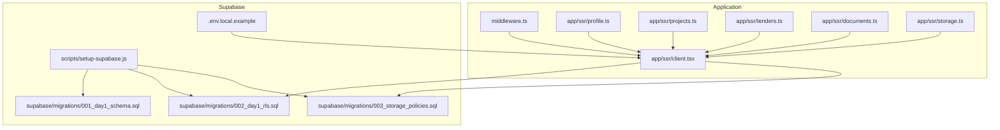
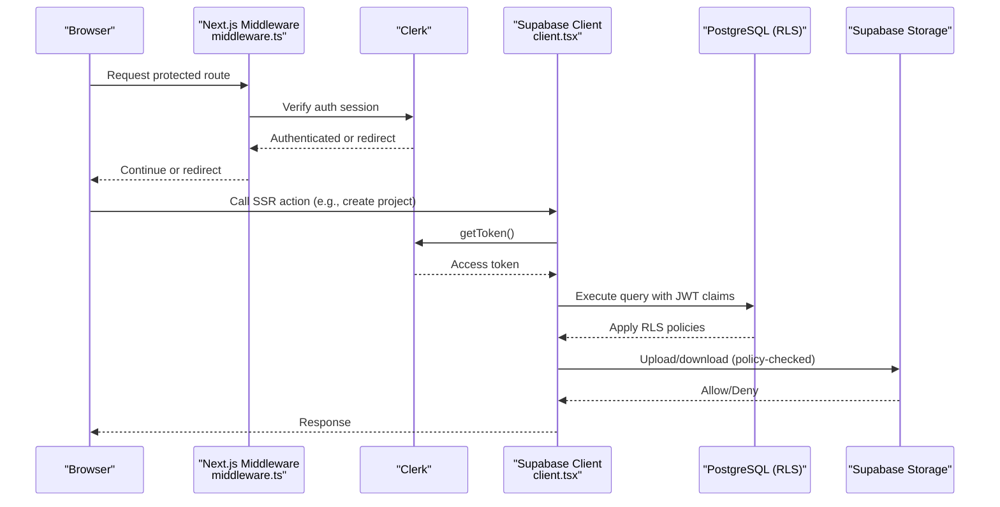
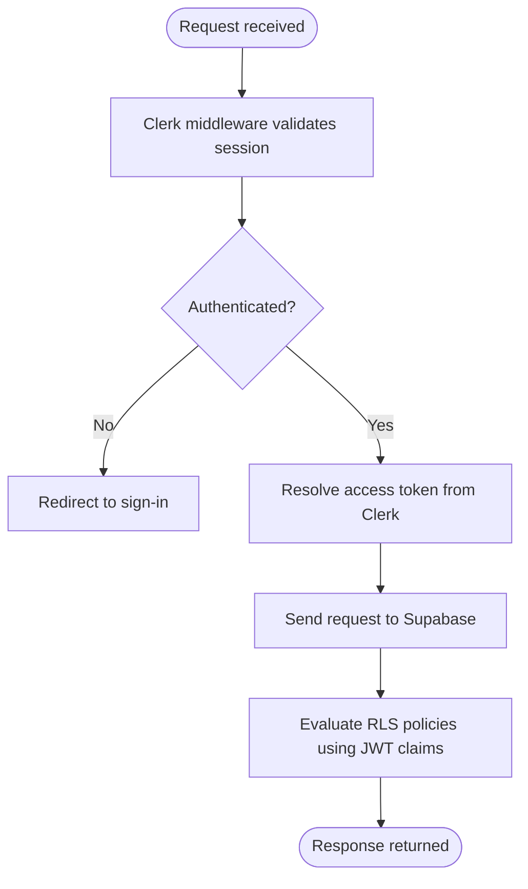
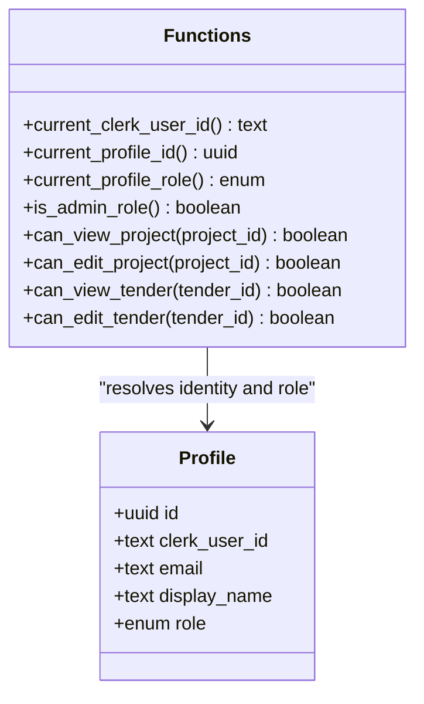
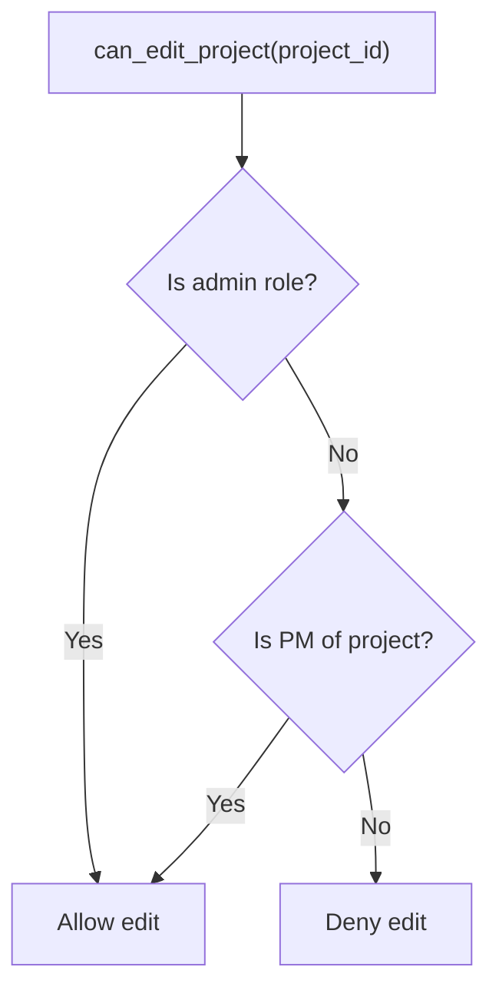
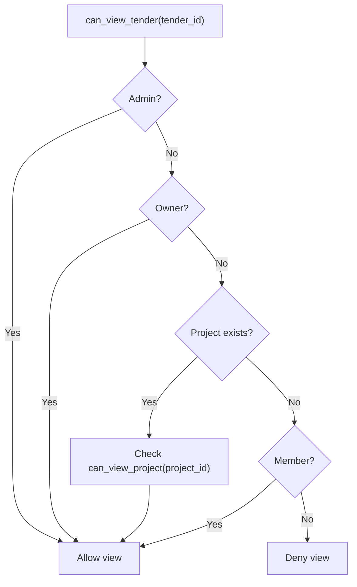
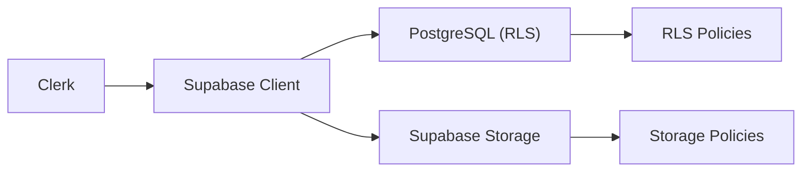

# Row Level Security (RLS)

<cite>
**Referenced Files in This Document**
- [001_day1_schema.sql](file://supabase/migrations/001_day1_schema.sql)
- [002_day1_rls.sql](file://supabase/migrations/002_day1_rls.sql)
- [003_storage_policies.sql](file://supabase/migrations/003_storage_policies.sql)
- [setup-supabase.js](file://scripts/setup-supabase.js)
- [middleware.ts](file://middleware.ts)
- [client.tsx](file://app/ssr/client.tsx)
- [profile.ts](file://app/ssr/profile.ts)
- [projects.ts](file://app/ssr/projects.ts)
- [tenders.ts](file://app/ssr/tenders.ts)
- [documents.ts](file://app/ssr/documents.ts)
- [storage.ts](file://app/ssr/storage.ts)
- [.env.local.example](file://.env.local.example)
</cite>

## Table of Contents
1. [Introduction](#introduction)
2. [Project Structure](#project-structure)
3. [Core Components](#core-components)
4. [Architecture Overview](#architecture-overview)
5. [Detailed Component Analysis](#detailed-component-analysis)
6. [Dependency Analysis](#dependency-analysis)
7. [Performance Considerations](#performance-considerations)
8. [Troubleshooting Guide](#troubleshooting-guide)
9. [Conclusion](#conclusion)
10. [Appendices](#appendices)

## Introduction
This document explains the Row Level Security (RLS) implementation in MCE Command Center’s Supabase database. It details how RLS policies enforce access control based on user roles and team/project memberships, how authentication context is passed via JWT claims, and how Clerk roles map to database-level access. Practical examples of policy syntax, testing methodologies, and debugging approaches are included, along with performance considerations and maintenance best practices.

## Project Structure
The RLS implementation spans:
- Database schema and enums
- RLS policies for tables and storage
- Application-side authentication and Supabase client configuration
- Server-side rendering (SSR) utilities that initialize authenticated sessions and call Supabase APIs

**Diagram sources**
- [middleware.ts](file://middleware.ts#L1-L20)
- [client.tsx](file://app/ssr/client.tsx#L1-L25)
- [profile.ts](file://app/ssr/profile.ts#L1-L31)
- [projects.ts](file://app/ssr/projects.ts#L1-L43)
- [tenders.ts](file://app/ssr/tenders.ts#L1-L43)
- [documents.ts](file://app/ssr/documents.ts#L1-L114)
- [storage.ts](file://app/ssr/storage.ts#L1-L35)
- [001_day1_schema.sql](file://supabase/migrations/001_day1_schema.sql#L1-L227)
- [002_day1_rls.sql](file://supabase/migrations/002_day1_rls.sql#L1-L348)
- [003_storage_policies.sql](file://supabase/migrations/003_storage_policies.sql#L1-L55)
- [setup-supabase.js](file://scripts/setup-supabase.js#L1-L91)
- [.env.local.example](file://.env.local.example#L1-L11)

**Section sources**
- [middleware.ts](file://middleware.ts#L1-L20)
- [client.tsx](file://app/ssr/client.tsx#L1-L25)
- [001_day1_schema.sql](file://supabase/migrations/001_day1_schema.sql#L1-L227)
- [002_day1_rls.sql](file://supabase/migrations/002_day1_rls.sql#L1-L348)
- [003_storage_policies.sql](file://supabase/migrations/003_storage_policies.sql#L1-L55)
- [setup-supabase.js](file://scripts/setup-supabase.js#L1-L91)
- [.env.local.example](file://.env.local.example#L1-L11)

## Core Components
- Authentication and session propagation
  - Clerk enforces authentication and redirects unauthenticated users away from public routes.
  - The Supabase client is initialized with an access token resolved from Clerk, ensuring JWT claims are available to RLS policies.
- Database schema and roles
  - A dedicated enum defines profile roles with hierarchical permissions.
  - Tables model profiles, clients, projects, tenders, documents, communications, notifications, and audit logs.
- RLS policy engine
  - Helper functions resolve current user identity, profile ID, role, and access checks for projects and tenders.
  - Policies on tables and storage enforce visibility and modification rules based on role and relationships.
- Storage policies
  - Storage bucket policies mirror document-level access checks to protect uploaded files.

**Section sources**
- [middleware.ts](file://middleware.ts#L1-L20)
- [client.tsx](file://app/ssr/client.tsx#L1-L25)
- [001_day1_schema.sql](file://supabase/migrations/001_day1_schema.sql#L3-L11)
- [001_day1_schema.sql](file://supabase/migrations/001_day1_schema.sql#L76-L227)
- [002_day1_rls.sql](file://supabase/migrations/002_day1_rls.sql#L1-L35)
- [002_day1_rls.sql](file://supabase/migrations/002_day1_rls.sql#L115-L348)
- [003_storage_policies.sql](file://supabase/migrations/003_storage_policies.sql#L1-L55)

## Architecture Overview
The system integrates Clerk for authentication and Supabase for data and storage. The Supabase client fetches an access token from Clerk and attaches it to requests. Supabase evaluates RLS policies server-side using the JWT claims to determine access.

**Diagram sources**
- [middleware.ts](file://middleware.ts#L1-L20)
- [client.tsx](file://app/ssr/client.tsx#L1-L25)
- [002_day1_rls.sql](file://supabase/migrations/002_day1_rls.sql#L115-L348)
- [003_storage_policies.sql](file://supabase/migrations/003_storage_policies.sql#L1-L55)

## Detailed Component Analysis

### Authentication Context and JWT Claims
- Clerk middleware ensures users are authenticated for non-public routes.
- The Supabase client resolves an access token from Clerk and injects it into requests.
- Supabase exposes the token claims (including subject) to RLS policies via built-in functions, enabling role and identity checks.

**Diagram sources**
- [middleware.ts](file://middleware.ts#L5-L12)
- [client.tsx](file://app/ssr/client.tsx#L9-L11)
- [002_day1_rls.sql](file://supabase/migrations/002_day1_rls.sql#L1-L7)

**Section sources**
- [middleware.ts](file://middleware.ts#L1-L20)
- [client.tsx](file://app/ssr/client.tsx#L1-L25)
- [002_day1_rls.sql](file://supabase/migrations/002_day1_rls.sql#L1-L7)

### Role Model and Identity Resolution
- Profile role enum defines hierarchical privileges.
- Helper functions derive current user identity and role from JWT claims and profile linkage.

**Diagram sources**
- [001_day1_schema.sql](file://supabase/migrations/001_day1_schema.sql#L3-L11)
- [001_day1_schema.sql](file://supabase/migrations/001_day1_schema.sql#L76-L84)
- [002_day1_rls.sql](file://supabase/migrations/002_day1_rls.sql#L1-L35)

**Section sources**
- [001_day1_schema.sql](file://supabase/migrations/001_day1_schema.sql#L3-L11)
- [001_day1_schema.sql](file://supabase/migrations/001_day1_schema.sql#L76-L84)
- [002_day1_rls.sql](file://supabase/migrations/002_day1_rls.sql#L1-L35)

### Profiles Table Policies
- Select: Super-admins or self.
- Update: Self only.

**Section sources**
- [002_day1_rls.sql](file://supabase/migrations/002_day1_rls.sql#L115-L128)

### Clients Table Policies
- Select: Super-admins or PM/engineer/viewer roles.
- Insert/Update: Super-admins, chairmen/VPs, department heads, or PMs.

**Section sources**
- [002_day1_rls.sql](file://supabase/migrations/002_day1_rls.sql#L130-L145)

### Projects Table Policies
- Select: Via helper that checks admin role, project manager, or membership.
- Insert: PM+ roles.
- Update: Via helper that checks admin role or project manager.

**Diagram sources**
- [002_day1_rls.sql](file://supabase/migrations/002_day1_rls.sql#L59-L73)

**Section sources**
- [002_day1_rls.sql](file://supabase/migrations/002_day1_rls.sql#L147-L162)

### Project Members Table Policies
- Select: Can view project.
- Manage (insert/update/delete): Can edit project.

**Section sources**
- [002_day1_rls.sql](file://supabase/migrations/002_day1_rls.sql#L164-L184)

### Project Milestones Table Policies
- Select: Can view project.
- Insert/Update: Can edit project.

**Section sources**
- [002_day1_rls.sql](file://supabase/migrations/002_day1_rls.sql#L186-L202)

### Tenders Table Policies
- Select: Via helper that checks admin role, owner, project view permission, or membership.
- Insert: PM+ roles and owner must match current profile.
- Update: Via helper that checks admin role, owner, or project edit permission.

**Diagram sources**
- [002_day1_rls.sql](file://supabase/migrations/002_day1_rls.sql#L75-L96)

**Section sources**
- [002_day1_rls.sql](file://supabase/migrations/002_day1_rls.sql#L203-L222)

### Tender Members Table Policies
- Select: Can view tender.
- Manage (insert/update/delete): Can edit tender.

**Section sources**
- [002_day1_rls.sql](file://supabase/migrations/002_day1_rls.sql#L223-L243)

### Tender Communications Events Table Policies
- Select: Can view tender.
- Insert: Must be a valid actor and can view tender.
- Append-only enforcement via triggers.

**Section sources**
- [002_day1_rls.sql](file://supabase/migrations/002_day1_rls.sql#L245-L257)
- [002_day1_rls.sql](file://supabase/migrations/002_day1_rls.sql#L332-L347)

### Documents Table Policies
- Select: Admin, or can view associated project or tender.
- Insert: Can edit associated project or tender and uploader must match current profile.
- Update/Delete: Admin, or can edit associated project or tender.

**Section sources**
- [002_day1_rls.sql](file://supabase/migrations/002_day1_rls.sql#L259-L301)

### Notifications Table Policies
- Select: Admin or recipient.
- Update: Recipient only.

**Section sources**
- [002_day1_rls.sql](file://supabase/migrations/002_day1_rls.sql#L303-L316)

### Audit Log Table Policies
- Select: Admin or actor.
- Insert: Actor must match current profile.

**Section sources**
- [002_day1_rls.sql](file://supabase/migrations/002_day1_rls.sql#L318-L330)

### Storage Objects Policies
- Select: Bucket must be target and user can view associated document.
- Insert: Bucket must be target, uploader must match current profile, and user can edit associated project or tender.
- Delete: Admin only.

**Section sources**
- [003_storage_policies.sql](file://supabase/migrations/003_storage_policies.sql#L1-L55)

### Application Integration Examples
- Upsert profile on first visit to bootstrap identity.
- Create project with current profile as project manager.
- Create tender with current profile as owner.
- Prepare document upload and create signed URLs.

**Section sources**
- [profile.ts](file://app/ssr/profile.ts#L6-L30)
- [projects.ts](file://app/ssr/projects.ts#L8-L42)
- [tenders.ts](file://app/ssr/tenders.ts#L8-L42)
- [documents.ts](file://app/ssr/documents.ts#L11-L86)
- [storage.ts](file://app/ssr/storage.ts#L6-L34)

## Dependency Analysis
- Application depends on Clerk for authentication and on Supabase client for database and storage access.
- Supabase evaluates RLS policies server-side using JWT claims supplied by the client.
- Storage policies depend on document records to validate access.

**Diagram sources**
- [client.tsx](file://app/ssr/client.tsx#L1-L25)
- [002_day1_rls.sql](file://supabase/migrations/002_day1_rls.sql#L115-L348)
- [003_storage_policies.sql](file://supabase/migrations/003_storage_policies.sql#L1-L55)

**Section sources**
- [client.tsx](file://app/ssr/client.tsx#L1-L25)
- [002_day1_rls.sql](file://supabase/migrations/002_day1_rls.sql#L115-L348)
- [003_storage_policies.sql](file://supabase/migrations/003_storage_policies.sql#L1-L55)

## Performance Considerations
- Keep helper functions efficient and selective; they are invoked per-row during policy evaluation.
- Prefer targeted indexes on foreign keys and frequently filtered columns (e.g., project and tender identifiers).
- Minimize nested subqueries in policies; leverage precomputed checks where possible.
- Use targeted selects and avoid wildcard queries when possible to reduce unnecessary rows.
- Monitor slow policy evaluations and consider caching repeated identity lookups at the application layer when appropriate.

[No sources needed since this section provides general guidance]

## Troubleshooting Guide
- Symptom: Access denied unexpectedly
  - Verify current user identity and role resolution helpers are working.
  - Confirm the user has a valid profile record and the correct role.
  - Check that the request is authenticated and the Supabase client is using a valid access token.
- Symptom: Storage access blocked despite document record present
  - Ensure the storage path matches the document record and the bucket is correct.
  - Verify the user can view the associated project or tender.
- Debugging steps
  - Inspect JWT claims propagated to Supabase.
  - Test helper functions directly in the database.
  - Temporarily relax policies to isolate the issue, then reapply incrementally.
  - Use audit logs to track who performed operations and when.

**Section sources**
- [client.tsx](file://app/ssr/client.tsx#L9-L11)
- [002_day1_rls.sql](file://supabase/migrations/002_day1_rls.sql#L1-L35)
- [003_storage_policies.sql](file://supabase/migrations/003_storage_policies.sql#L7-L39)

## Conclusion
The RLS implementation enforces robust, role-based access control across profiles, projects, tenders, documents, and storage. By deriving identity and role from Clerk via JWT claims, the system ensures consistent authorization semantics between the application and the database. Policies are structured to support data isolation across organizational units while enabling collaboration through explicit membership and ownership checks.

[No sources needed since this section summarizes without analyzing specific files]

## Appendices

### Appendix A: Environment Variables
Ensure the following environment variables are configured for proper operation:
- Clerk publishable and secret keys
- Supabase URL and anonymous/public key
- Supabase service role key
- Application URL and Clerk redirect URLs

**Section sources**
- [.env.local.example](file://.env.local.example#L1-L11)

### Appendix B: Migration and Setup Script
- The setup script runs schema and RLS migrations and creates the storage bucket.
- Ensure credentials are present before running.

**Section sources**
- [setup-supabase.js](file://scripts/setup-supabase.js#L7-L45)
- [setup-supabase.js](file://scripts/setup-supabase.js#L47-L77)