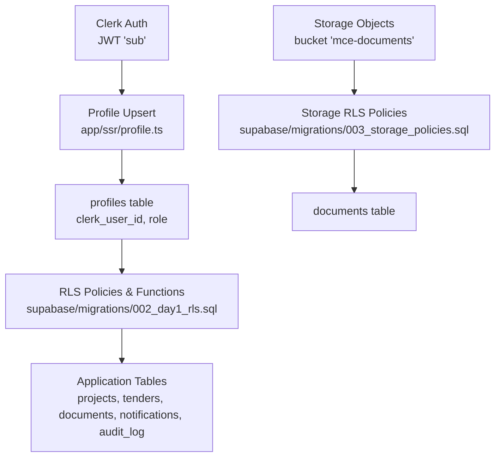
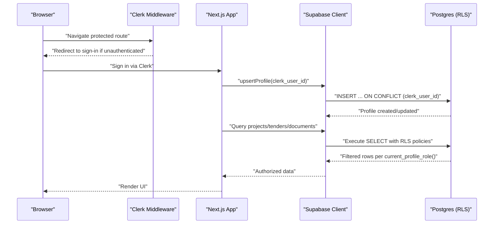
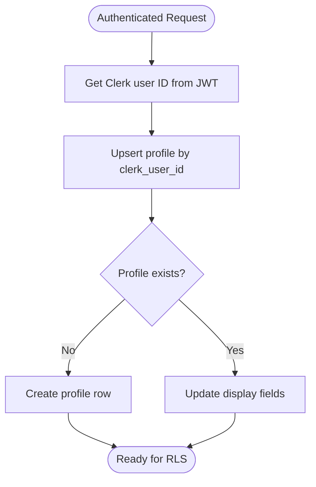
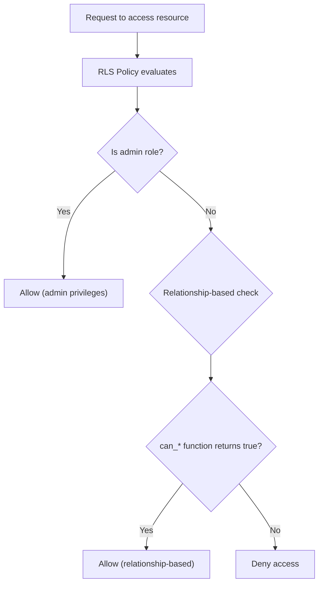
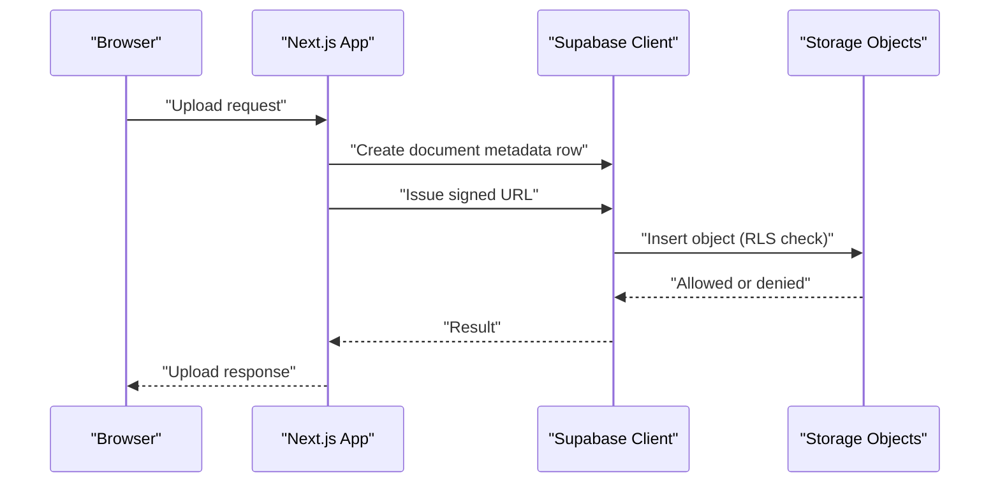
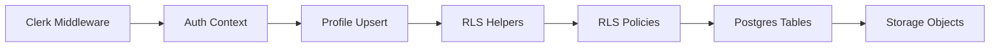

# User Roles & Permissions

<cite>
**Referenced Files in This Document**
- [README.md](file://README.md)
- [001_day1_schema.sql](file://supabase/migrations/001_day1_schema.sql)
- [002_day1_rls.sql](file://supabase/migrations/002_day1_rls.sql)
- [003_storage_policies.sql](file://supabase/migrations/003_storage_policies.sql)
- [profile.ts](file://app/ssr/profile.ts)
- [middleware.ts](file://middleware.ts)
- [layout.tsx](file://app/layout.tsx)
- [dashboard/page.tsx](file://app/dashboard/page.tsx)
- [projects/[id]/page.tsx](file://app/projects/[id]/page.tsx)
- [tenders/[id]/page.tsx](file://app/tenders/[id]/page.tsx)
- [audit.ts](file://app/ssr/audit.ts)
</cite>

## Table of Contents
1. [Introduction](#introduction)
2. [Project Structure](#project-structure)
3. [Core Components](#core-components)
4. [Architecture Overview](#architecture-overview)
5. [Detailed Component Analysis](#detailed-component-analysis)
6. [Dependency Analysis](#dependency-analysis)
7. [Performance Considerations](#performance-considerations)
8. [Troubleshooting Guide](#troubleshooting-guide)
9. [Conclusion](#conclusion)

## Introduction
This document explains the user role and permission system in MCE Command Center. It details the six distinct user roles, how roles are stored and validated, how access is enforced via database Row Level Security (RLS), and how Clerk integrates with the internal profile system. It also covers manual role assignment, permission escalation patterns, and practical examples for assigning roles, checking permissions, and conditionally rendering UI elements.

## Project Structure
The role and permission system spans three layers:
- Authentication and identity: Clerk-managed users with JWT claims.
- Identity mapping and profiles: Supabase profiles table linking Clerk user IDs to internal profile records.
- Access control: Postgres RLS policies and helper functions enforcing role-based access across all tables.

**Diagram sources**
- [profile.ts](file://app/ssr/profile.ts#L6-L30)
- [001_day1_schema.sql](file://supabase/migrations/001_day1_schema.sql#L76-L84)
- [002_day1_rls.sql](file://supabase/migrations/002_day1_rls.sql#L1-L35)
- [003_storage_policies.sql](file://supabase/migrations/003_storage_policies.sql#L1-L55)

**Section sources**
- [README.md](file://README.md#L128-L158)
- [001_day1_schema.sql](file://supabase/migrations/001_day1_schema.sql#L76-L84)
- [002_day1_rls.sql](file://supabase/migrations/002_day1_rls.sql#L115-L128)
- [003_storage_policies.sql](file://supabase/migrations/003_storage_policies.sql#L1-L55)

## Core Components
- Roles: Six enumerated roles are defined and used for access control.
- Profiles: Each Clerk user maps to a single profile record with a role.
- RLS helpers: Functions resolve current Clerk user ID, profile ID, and role; and compute derived permissions.
- Policies: Per-table RLS policies gate reads/writes based on roles and relationships.
- Storage policies: Additional RLS on storage.objects enforces document access.

Key implementation references:
- Role enumeration and profiles table definition
- Helper functions for current user, profile, and role
- RLS policies for all major tables
- Storage policies for document access
- Profile upsert on sign-in

**Section sources**
- [001_day1_schema.sql](file://supabase/migrations/001_day1_schema.sql#L3-L11)
- [001_day1_schema.sql](file://supabase/migrations/001_day1_schema.sql#L76-L84)
- [002_day1_rls.sql](file://supabase/migrations/002_day1_rls.sql#L1-L35)
- [002_day1_rls.sql](file://supabase/migrations/002_day1_rls.sql#L115-L331)
- [003_storage_policies.sql](file://supabase/migrations/003_storage_policies.sql#L1-L55)
- [profile.ts](file://app/ssr/profile.ts#L6-L30)

## Architecture Overview
The system enforces permissions at the database boundary using RLS. Application code relies on Clerk for authentication and Supabase for authorization checks. The flow:
- Clerk authenticates users and supplies a JWT with subject claim.
- On first visit, the app upserts a profile keyed by Clerk user ID.
- RLS functions derive the current profile role.
- Policies permit or deny operations based on role and relationships.

**Diagram sources**
- [middleware.ts](file://middleware.ts#L5-L12)
- [profile.ts](file://app/ssr/profile.ts#L6-L30)
- [002_day1_rls.sql](file://supabase/migrations/002_day1_rls.sql#L1-L35)
- [002_day1_rls.sql](file://supabase/migrations/002_day1_rls.sql#L147-L162)

## Detailed Component Analysis

### Roles and Role Hierarchy
- Defined roles: super_admin, chairman_vp, dept_head, pm, engineer, finance, viewer.
- Administrative roles: super_admin, chairman_vp, dept_head, finance.
- These roles gate access to sensitive operations and broader visibility.

Practical assignment example (manual):
- Update a profile’s role by Clerk user ID.

Role assignment example:
- See manual role assignment guidance and valid roles.

**Section sources**
- [001_day1_schema.sql](file://supabase/migrations/001_day1_schema.sql#L3-L11)
- [002_day1_rls.sql](file://supabase/migrations/002_day1_rls.sql#L29-L35)
- [README.md](file://README.md#L128-L139)

### Clerk Integration and Profile Mapping
- Clerk supplies the authenticated user ID via JWT subject claim.
- The app upserts a profile keyed by Clerk user ID, ensuring a profile exists for every authenticated user.
- Profile creation/updating occurs on demand when the app needs to resolve the current profile.

**Diagram sources**
- [profile.ts](file://app/ssr/profile.ts#L6-L30)
- [001_day1_schema.sql](file://supabase/migrations/001_day1_schema.sql#L76-L84)

**Section sources**
- [profile.ts](file://app/ssr/profile.ts#L6-L30)
- [001_day1_schema.sql](file://supabase/migrations/001_day1_schema.sql#L76-L84)

### Permission Validation and Enforcement
- Helper functions:
  - Resolve current Clerk user ID from JWT.
  - Resolve current profile ID from profiles table.
  - Resolve current profile role.
  - Determine administrative roles.
- Derived permission functions:
  - can_view_project(project_id)
  - can_edit_project(project_id)
  - can_view_tender(tender_id)
  - can_edit_tender(tender_id)
- Policies:
  - Per-table policies enforce read/write access based on role and relationships.
  - Append-only enforcement for selected audit tables.

**Diagram sources**
- [002_day1_rls.sql](file://supabase/migrations/002_day1_rls.sql#L19-L35)
- [002_day1_rls.sql](file://supabase/migrations/002_day1_rls.sql#L37-L56)
- [002_day1_rls.sql](file://supabase/migrations/002_day1_rls.sql#L59-L72)
- [002_day1_rls.sql](file://supabase/migrations/002_day1_rls.sql#L75-L95)
- [002_day1_rls.sql](file://supabase/migrations/002_day1_rls.sql#L98-L112)

**Section sources**
- [002_day1_rls.sql](file://supabase/migrations/002_day1_rls.sql#L1-L35)
- [002_day1_rls.sql](file://supabase/migrations/002_day1_rls.sql#L147-L162)
- [002_day1_rls.sql](file://supabase/migrations/002_day1_rls.sql#L203-L221)
- [002_day1_rls.sql](file://supabase/migrations/002_day1_rls.sql#L318-L331)

### Role-Based UI Rendering and Feature Access Control
- The dashboard and detail pages fetch authorized data server-side and render lists and summaries.
- Conditional UI elements (e.g., “Upload Document” links) appear based on available routes; role-based gating is enforced by RLS at the data layer.
- Notifications and audit logs are filtered by recipient or actor profile.

Examples of role-aware rendering:
- Dashboard renders lists of tenders and milestones after upserting the profile.
- Project and Tender detail pages render associated documents and tenders only if access is permitted by RLS.

**Section sources**
- [dashboard/page.tsx](file://app/dashboard/page.tsx#L11-L30)
- [projects/[id]/page.tsx](file://app/projects/[id]/page.tsx#L117-L133)
- [tenders/[id]/page.tsx](file://app/tenders/[id]/page.tsx#L109-L125)

### Document Access and Storage Policies
- Documents are linked to either a project or a tender.
- Storage RLS ensures:
  - Select: authenticated users can access objects if they can view the linked document’s project/tender or are admin.
  - Insert: only permitted if the uploader is the document’s author and the uploader can edit the linked project/tender.
  - Delete: only admins can delete objects.

**Diagram sources**
- [003_storage_policies.sql](file://supabase/migrations/003_storage_policies.sql#L3-L39)
- [002_day1_rls.sql](file://supabase/migrations/002_day1_rls.sql#L269-L278)

**Section sources**
- [003_storage_policies.sql](file://supabase/migrations/003_storage_policies.sql#L1-L55)
- [002_day1_rls.sql](file://supabase/migrations/002_day1_rls.sql#L259-L278)

### Role Inheritance and Permission Escalation
- Administrative roles automatically gain broad read access and can edit projects and tenders they own.
- Project managers (pm) can edit projects they own and can edit linked tenders they own.
- Engineers and viewers have more limited access aligned with their roles.
- Finance role is treated as administrative for read/write decisions.

Escalation patterns:
- Ownership-based escalation: owners can edit their own projects/tenders.
- Relationship-based escalation: membership in project/tender grants view/edit rights accordingly.

**Section sources**
- [002_day1_rls.sql](file://supabase/migrations/002_day1_rls.sql#L29-L35)
- [002_day1_rls.sql](file://supabase/migrations/002_day1_rls.sql#L69-L71)
- [002_day1_rls.sql](file://supabase/migrations/002_day1_rls.sql#L108-L110)
- [002_day1_rls.sql](file://supabase/migrations/002_day1_rls.sql#L134)

### Practical Examples

- Manual role assignment (SQL):
  - Update a profile’s role by Clerk user ID.

- Permission checking (PostgreSQL):
  - Use helper functions to derive current role and relationships.
  - Use can_view_project/can_edit_project and can_view_tender/can_edit_tender in policies.

- Role-based conditional rendering (React):
  - Render UI elements based on available routes and data returned by RLS-protected queries.
  - Example: “Upload Document” link appears on project/tender detail pages; access is enforced server-side.

- Audit logging:
  - Write audit entries with actor profile ID resolved from the current profile.

**Section sources**
- [README.md](file://README.md#L128-L139)
- [002_day1_rls.sql](file://supabase/migrations/002_day1_rls.sql#L19-L35)
- [002_day1_rls.sql](file://supabase/migrations/002_day1_rls.sql#L37-L56)
- [002_day1_rls.sql](file://supabase/migrations/002_day1_rls.sql#L75-L95)
- [dashboard/page.tsx](file://app/dashboard/page.tsx#L62-L80)
- [audit.ts](file://app/ssr/audit.ts#L6-L27)

## Dependency Analysis
- Authentication depends on Clerk middleware and JWT claims.
- Authorization depends on Supabase client and RLS policies.
- Data access depends on helper functions resolving current profile and role.
- UI rendering depends on server-side queries that are already RLS-filtered.

**Diagram sources**
- [middleware.ts](file://middleware.ts#L5-L12)
- [profile.ts](file://app/ssr/profile.ts#L6-L30)
- [002_day1_rls.sql](file://supabase/migrations/002_day1_rls.sql#L1-L35)

**Section sources**
- [middleware.ts](file://middleware.ts#L1-L20)
- [profile.ts](file://app/ssr/profile.ts#L6-L30)
- [002_day1_rls.sql](file://supabase/migrations/002_day1_rls.sql#L1-L35)

## Performance Considerations
- Keep RLS checks minimal and rely on indexed foreign keys (e.g., project_id, tender_id).
- Use targeted selects with appropriate filters to avoid scanning entire tables.
- Prefer server-side rendering for dashboards to leverage RLS filtering close to the data source.

## Troubleshooting Guide
Common issues and resolutions:
- Build fails due to invalid Clerk keys: verify environment variables.
- RLS denied or empty data: confirm the signed-in user has a profiles row and a valid role assignment.
- Document upload fails: verify the bucket exists, policies are applied, and the document metadata row exists before upload.
- Signed URL fails: ensure storage policies are applied and the user has access to the linked project/tender.

**Section sources**
- [README.md](file://README.md#L141-L158)

## Conclusion
MCE Command Center implements a robust role-based access control system centered on Clerk authentication and Supabase RLS. Roles are stored in the profiles table and enforced via helper functions and policies across all application tables, including storage. Administrators can manually assign roles, and the system supports ownership-based and relationship-based permission escalation. UI rendering is guided by server-side queries that respect RLS, ensuring consistent and secure access control.