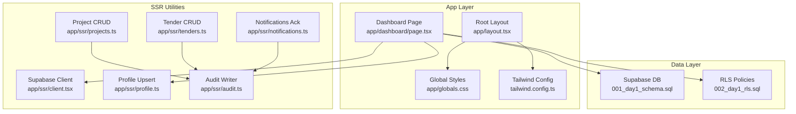
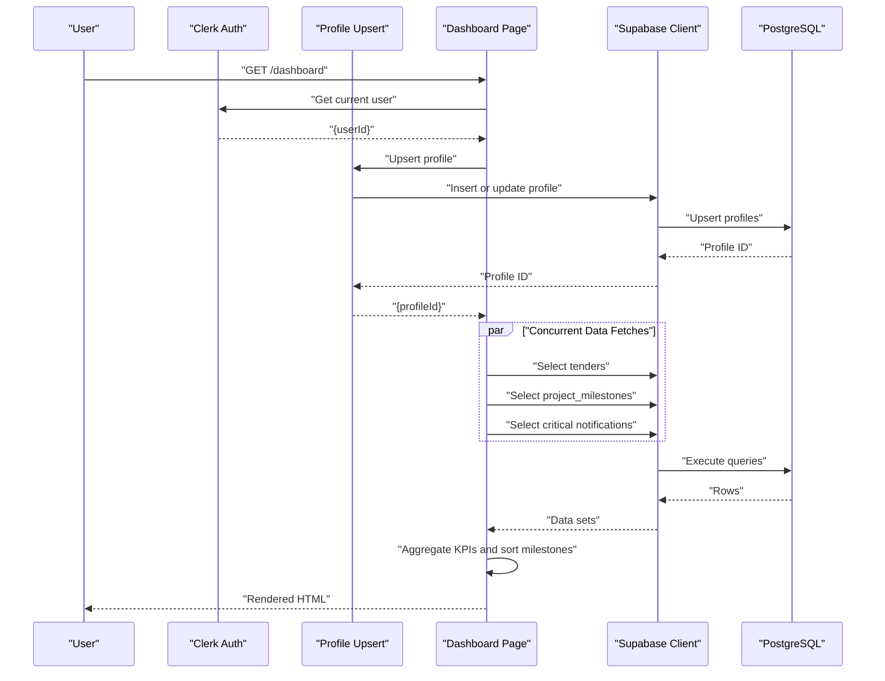
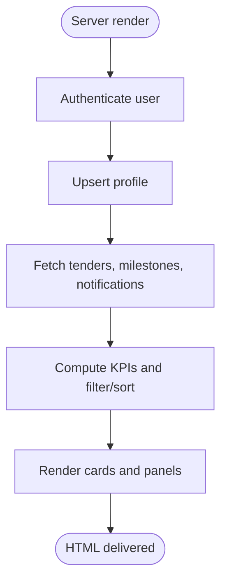
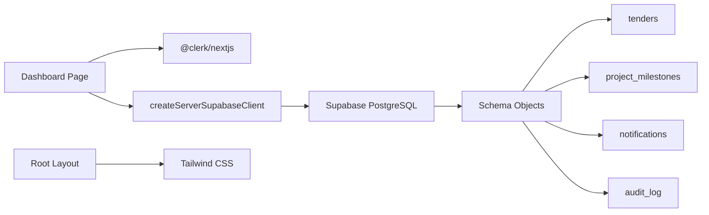

# Dashboard Module

<cite>
**Referenced Files in This Document**
- [page.tsx](file://app/dashboard/page.tsx)
- [layout.tsx](file://app/layout.tsx)
- [globals.css](file://app/globals.css)
- [tailwind.config.ts](file://tailwind.config.ts)
- [client.tsx](file://app/ssr/client.tsx)
- [profile.ts](file://app/ssr/profile.ts)
- [audit.ts](file://app/ssr/audit.ts)
- [notifications.ts](file://app/ssr/notifications.ts)
- [projects.ts](file://app/ssr/projects.ts)
- [tenders.ts](file://app/ssr/tenders.ts)
- [001_day1_schema.sql](file://supabase/migrations/001_day1_schema.sql)
- [002_day1_rls.sql](file://supabase/migrations/002_day1_rls.sql)
</cite>

## Table of Contents
1. [Introduction](#introduction)
2. [Project Structure](#project-structure)
3. [Core Components](#core-components)
4. [Architecture Overview](#architecture-overview)
5. [Detailed Component Analysis](#detailed-component-analysis)
6. [Dependency Analysis](#dependency-analysis)
7. [Performance Considerations](#performance-considerations)
8. [Troubleshooting Guide](#troubleshooting-guide)
9. [Conclusion](#conclusion)

## Introduction
The Dashboard module serves as the primary analytics interface for MCE Command Center. It presents key performance indicators, upcoming project milestones, and critical alerts to help users monitor ongoing work. The dashboard aggregates data from multiple subsystems, including tenders, project milestones, notifications, and audit logs, and renders them using a responsive layout powered by Tailwind CSS.

## Project Structure
The dashboard is implemented as a Next.js Server Component under the app routing structure. It relies on Supabase for data access and Clerk for authentication. The global layout applies Tailwind utility classes for consistent styling across the application.

**Diagram sources**
- [page.tsx](file://app/dashboard/page.tsx#L1-L157)
- [layout.tsx](file://app/layout.tsx#L1-L46)
- [globals.css](file://app/globals.css#L1-L4)
- [tailwind.config.ts](file://tailwind.config.ts#L1-L20)
- [client.tsx](file://app/ssr/client.tsx#L1-L25)
- [profile.ts](file://app/ssr/profile.ts#L1-L31)
- [audit.ts](file://app/ssr/audit.ts#L1-L29)
- [notifications.ts](file://app/ssr/notifications.ts#L1-L27)
- [projects.ts](file://app/ssr/projects.ts#L1-L43)
- [tenders.ts](file://app/ssr/tenders.ts#L1-L43)
- [001_day1_schema.sql](file://supabase/migrations/001_day1_schema.sql#L1-L227)
- [002_day1_rls.sql](file://supabase/migrations/002_day1_rls.sql#L1-L348)

**Section sources**
- [page.tsx](file://app/dashboard/page.tsx#L1-L157)
- [layout.tsx](file://app/layout.tsx#L1-L46)
- [globals.css](file://app/globals.css#L1-L4)
- [tailwind.config.ts](file://tailwind.config.ts#L1-L20)

## Core Components
- Authentication and Profile Initialization
  - Uses Clerk to obtain the current user and upserts a profile record in the database to ensure access to downstream queries.
  - See [page.tsx](file://app/dashboard/page.tsx#L11-L18) and [profile.ts](file://app/ssr/profile.ts#L6-L30).

- Data Fetching and Aggregation
  - Concurrently fetches tenders, project milestones, and critical notifications.
  - Computes KPIs for tenders due within 14 days, 7 days, 3 days, 1 day, and today.
  - Sorts and limits upcoming milestones to the next 10 entries.
  - Counts critical unacknowledged notifications requiring acknowledgment.
  - See [page.tsx](file://app/dashboard/page.tsx#L20-L60).

- UI Rendering with Tailwind CSS
  - Responsive grid layout for KPI cards and two-column panel for tenders and milestones.
  - Clean card-based design with subtle borders and spacing for readability.
  - See [page.tsx](file://app/dashboard/page.tsx#L82-L156) and [globals.css](file://app/globals.css#L1-L4).

- Navigation and Action Links
  - Provides quick links to create new projects, tenders, upload documents, and view notifications.
  - See [page.tsx](file://app/dashboard/page.tsx#L62-L80).

**Section sources**
- [page.tsx](file://app/dashboard/page.tsx#L6-L157)
- [profile.ts](file://app/ssr/profile.ts#L6-L30)
- [globals.css](file://app/globals.css#L1-L4)

## Architecture Overview
The dashboard follows a server-rendered pattern:
- The page component runs on the server, authenticates the user, initializes the profile, and performs data fetching.
- Data is aggregated locally and rendered into a responsive UI using Tailwind CSS utility classes.
- The layout wraps the dashboard with shared header navigation and Clerk user controls.

**Diagram sources**
- [page.tsx](file://app/dashboard/page.tsx#L11-L60)
- [profile.ts](file://app/ssr/profile.ts#L6-L30)
- [client.tsx](file://app/ssr/client.tsx#L4-L14)
- [001_day1_schema.sql](file://supabase/migrations/001_day1_schema.sql#L130-L206)

## Detailed Component Analysis

### Dashboard Page Component
Responsibilities:
- Authenticate user and initialize profile.
- Fetch and combine data from tenders, project milestones, and notifications.
- Compute KPIs for upcoming deadlines.
- Render summary cards, lists, and counts.

Key behaviors:
- KPI computation uses a simple counting scheme across predefined windows.
- Milestones are filtered by presence of due dates, sorted chronologically, and capped to ten items.
- Critical notifications are filtered by severity and acknowledgment status.

UI structure:
- Top bar with title and action buttons.
- Five KPI cards indicating tenders due in 14d, 7d, 3d, 1d, and today.
- Two-column panel: “Tenders due soon” and “Upcoming milestones.”
- “Critical notifications unacknowledged” count.

**Diagram sources**
- [page.tsx](file://app/dashboard/page.tsx#L11-L60)

**Section sources**
- [page.tsx](file://app/dashboard/page.tsx#L11-L157)

### Data Aggregation Patterns
- Tenders Due KPIs
  - Count tenders whose deadline falls within the 14-day window, incrementing counters for each relevant bucket.
  - See [page.tsx](file://app/dashboard/page.tsx#L32-L48).

- Upcoming Milestones
  - Filter out missing due dates, sort ascending by due date, and limit to top 10.
  - See [page.tsx](file://app/dashboard/page.tsx#L50-L56).

- Critical Unacknowledged Notifications
  - Filter notifications where severity is critical and acknowledgment is required but not yet acknowledged.
  - See [page.tsx](file://app/dashboard/page.tsx#L58-L60).

**Section sources**
- [page.tsx](file://app/dashboard/page.tsx#L32-L60)

### Audit Integration
While the dashboard does not directly display audit logs, it participates in audit events via CRUD operations in other modules:
- Creating projects and tenders writes audit records.
- Acknowledging notifications writes audit records.
- These audit events support compliance and traceability.

Integration points:
- Project creation triggers an audit entry for the “create” action.
- Tender creation triggers an audit entry for the “create” action.
- Notification acknowledgment triggers an audit entry for the “ack” action.

**Section sources**
- [projects.ts](file://app/ssr/projects.ts#L40-L42)
- [tenders.ts](file://app/ssr/tenders.ts#L40-L42)
- [notifications.ts](file://app/ssr/notifications.ts#L25-L26)
- [audit.ts](file://app/ssr/audit.ts#L17-L23)

### Real-Time Updates and Refresh Behavior
- Current Implementation: The dashboard is a server-rendered page. Data is fetched fresh on each request.
- Potential Enhancement: Introduce client-side polling or server-sent events to refresh specific widgets without full page reloads. This would require adding a client component wrapper around targeted sections and implementing a periodic refetch strategy.

[No sources needed since this section provides general guidance]

### Filtering and User Preferences
- Current Filtering: The dashboard applies server-side filters for critical notifications and client-side filters for milestones (presence of due dates) and KPI windows.
- User Preferences: There are no explicit user preference toggles in the dashboard code. Preferences could be introduced by storing user-selected filters or widget visibility in the database and hydrating them on the server.

[No sources needed since this section provides general guidance]

### Usage Scenarios and Integrations
- Scenario 1: PM reviews daily workload
  - Opens the dashboard to see tenders due today and 1d, and checks critical unacknowledged notifications.
  - Uses quick links to navigate to create new tenders or view notifications.
  - Reference: [page.tsx](file://app/dashboard/page.tsx#L62-L80), [page.tsx](file://app/dashboard/page.tsx#L82-L103), [page.tsx](file://app/dashboard/page.tsx#L150-L153).

- Scenario 2: Review upcoming milestones
  - Reviews the “Upcoming milestones” panel to identify near-term deadlines and plan resources accordingly.
  - Reference: [page.tsx](file://app/dashboard/page.tsx#L127-L147).

- Integration with Audit
  - All create and acknowledge actions are audited, enabling traceability for decisions made on the dashboard.
  - References: [projects.ts](file://app/ssr/projects.ts#L40-L42), [tenders.ts](file://app/ssr/tenders.ts#L40-L42), [notifications.ts](file://app/ssr/notifications.ts#L25-L26).

**Section sources**
- [page.tsx](file://app/dashboard/page.tsx#L62-L153)
- [projects.ts](file://app/ssr/projects.ts#L40-L42)
- [tenders.ts](file://app/ssr/tenders.ts#L40-L42)
- [notifications.ts](file://app/ssr/notifications.ts#L25-L26)

## Dependency Analysis
The dashboard depends on:
- Authentication and profile initialization via Clerk and Supabase.
- Data access through the Supabase client configured with Clerk tokens.
- Database schemas for tenders, project milestones, notifications, and audit logs.
- Row-level security policies ensuring users only see permitted data.

**Diagram sources**
- [page.tsx](file://app/dashboard/page.tsx#L1-L157)
- [client.tsx](file://app/ssr/client.tsx#L4-L14)
- [001_day1_schema.sql](file://supabase/migrations/001_day1_schema.sql#L130-L216)
- [layout.tsx](file://app/layout.tsx#L1-L46)

**Section sources**
- [page.tsx](file://app/dashboard/page.tsx#L1-L157)
- [client.tsx](file://app/ssr/client.tsx#L1-L25)
- [001_day1_schema.sql](file://supabase/migrations/001_day1_schema.sql#L1-L227)
- [002_day1_rls.sql](file://supabase/migrations/002_day1_rls.sql#L1-L348)

## Performance Considerations
- Current Approach: Server-rendered page with concurrent data fetching minimizes latency by reducing round trips.
- Recommendations:
  - Indexes: Ensure database indexes exist on frequently queried columns (e.g., tenders.deadline_at, project_milestones.due_date, notifications.severity and ack fields).
  - Pagination: For large datasets, introduce pagination or virtualization in future enhancements.
  - Caching: Consider short-lived caching for static or slowly changing metrics.
  - Client-side hydration: Add lightweight client components for interactive widgets to reduce full-page reloads while preserving server-side rendering benefits.

[No sources needed since this section provides general guidance]

## Troubleshooting Guide
Common issues and resolutions:
- Not authenticated
  - Symptom: Dashboard does not render content.
  - Cause: Missing Clerk session.
  - Resolution: Ensure the user is signed in before accessing the dashboard.
  - Reference: [page.tsx](file://app/dashboard/page.tsx#L13-L15).

- Profile Upsert Failure
  - Symptom: Errors during profile creation/upsert.
  - Cause: Missing Clerk user or database errors.
  - Resolution: Verify Clerk integration and database connectivity.
  - Reference: [profile.ts](file://app/ssr/profile.ts#L6-L30).

- Data Access Denied
  - Symptom: Empty or partial data in panels.
  - Cause: Row-level security policies restricting access.
  - Resolution: Confirm user roles and permissions; ensure the current profile matches expected access.
  - References: [002_day1_rls.sql](file://supabase/migrations/002_day1_rls.sql#L303-L316), [002_day1_rls.sql](file://supabase/migrations/002_day1_rls.sql#L318-L330).

- Audit Events Not Recorded
  - Symptom: Missing audit entries after create/ack operations.
  - Cause: Errors during audit insertion or insufficient privileges.
  - Resolution: Check audit table policies and error handling in audit writer.
  - References: [audit.ts](file://app/ssr/audit.ts#L17-L28), [002_day1_rls.sql](file://supabase/migrations/002_day1_rls.sql#L318-L330).

**Section sources**
- [page.tsx](file://app/dashboard/page.tsx#L13-L15)
- [profile.ts](file://app/ssr/profile.ts#L6-L30)
- [audit.ts](file://app/ssr/audit.ts#L17-L28)
- [002_day1_rls.sql](file://supabase/migrations/002_day1_rls.sql#L303-L330)

## Conclusion
The Dashboard module provides a concise, server-rendered overview of key operational metrics, upcoming deadlines, and critical alerts. Its design leverages Clerk for authentication, Supabase for secure data access, and Tailwind CSS for responsive presentation. Future enhancements can focus on client-side interactivity, caching, and configurable widgets to improve user experience and scalability.