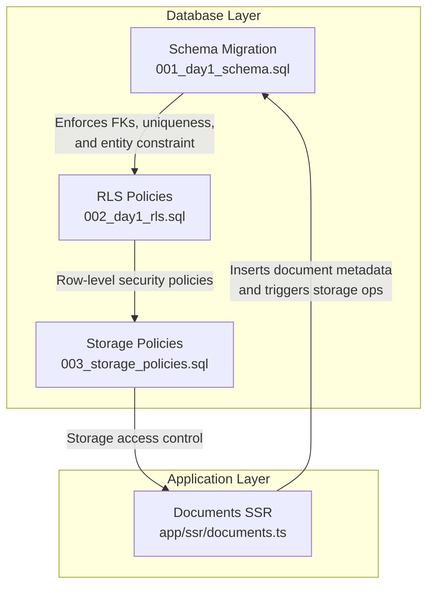
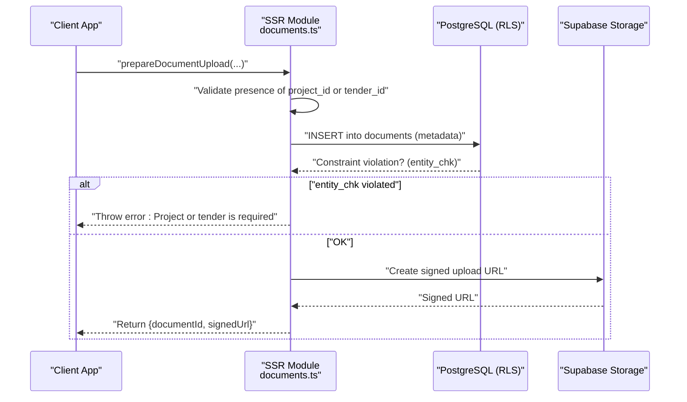
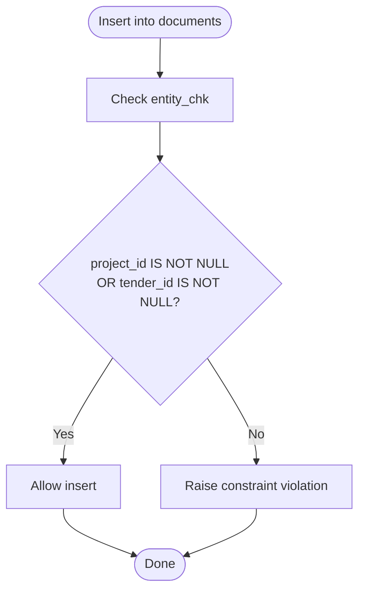
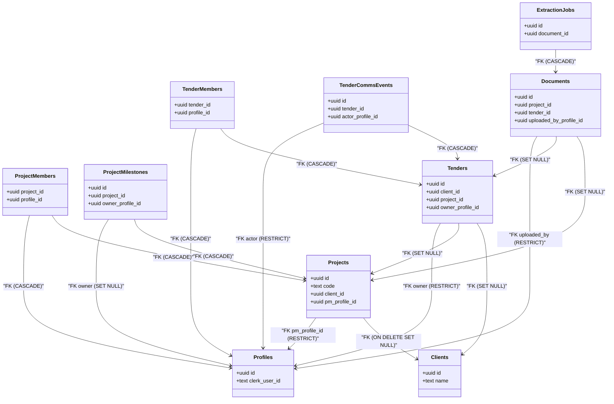
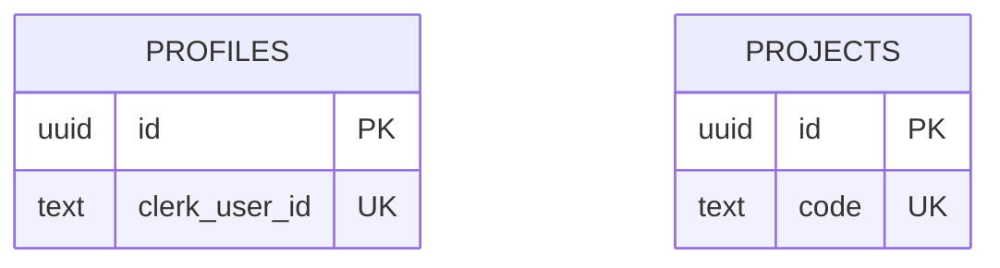
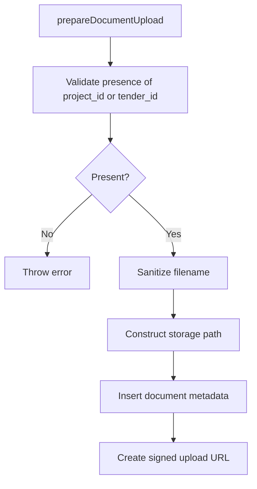
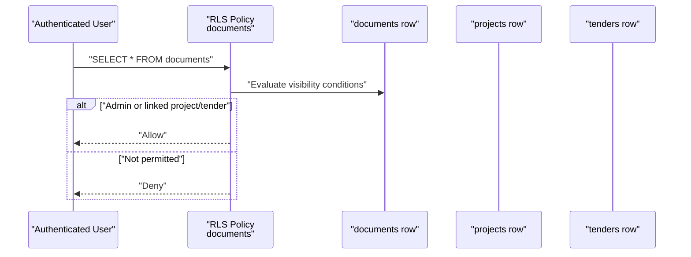
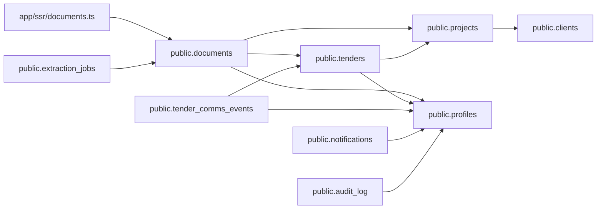

# Data Integrity & Constraints

<cite>
**Referenced Files in This Document**
- [001_day1_schema.sql](file://supabase/migrations/001_day1_schema.sql)
- [002_day1_rls.sql](file://supabase/migrations/002_day1_rls.sql)
- [003_storage_policies.sql](file://supabase/migrations/003_storage_policies.sql)
- [documents.ts](file://app/ssr/documents.ts)
- [README.md](file://README.md)
</cite>

## Table of Contents
1. [Introduction](#introduction)
2. [Project Structure](#project-structure)
3. [Core Components](#core-components)
4. [Architecture Overview](#architecture-overview)
5. [Detailed Component Analysis](#detailed-component-analysis)
6. [Dependency Analysis](#dependency-analysis)
7. [Performance Considerations](#performance-considerations)
8. [Troubleshooting Guide](#troubleshooting-guide)
9. [Conclusion](#conclusion)
10. [Appendices](#appendices)

## Introduction
This document explains the data integrity mechanisms and constraints implemented in the MCE Command Center database. It focuses on:
- Check constraints, unique constraints, and exclusion constraints
- Business rules enforced at the database level (including the entity constraint for documents)
- Foreign key constraints, cascading behaviors, and referential integrity
- Data validation and input sanitization through constraints and application logic
- Error handling for constraint violations
- Examples of constraint violations and resolution strategies
- Impact on performance, indexing considerations, and query optimization
- Constraint maintenance, schema evolution, and backward compatibility

## Project Structure
The database schema and constraints are defined in Supabase migrations. Application-level validation and upload flows are implemented in the Next.js SSR modules.

**Diagram sources**
- [001_day1_schema.sql](file://supabase/migrations/001_day1_schema.sql#L164-L180)
- [002_day1_rls.sql](file://supabase/migrations/002_day1_rls.sql#L259-L301)
- [003_storage_policies.sql](file://supabase/migrations/003_storage_policies.sql#L1-L55)
- [documents.ts](file://app/ssr/documents.ts#L11-L86)

**Section sources**
- [README.md](file://README.md#L42-L62)
- [001_day1_schema.sql](file://supabase/migrations/001_day1_schema.sql#L164-L180)
- [002_day1_rls.sql](file://supabase/migrations/002_day1_rls.sql#L259-L301)
- [003_storage_policies.sql](file://supabase/migrations/003_storage_policies.sql#L1-L55)
- [documents.ts](file://app/ssr/documents.ts#L11-L86)

## Core Components
- Unique constraints:
  - profiles.clerk_user_id is unique
  - projects.code is unique
- Check constraints:
  - documents.entity_chk enforces that either project_id or tender_id is present
- Exclusion constraints:
  - None explicitly defined in the provided migrations
- Foreign key constraints and cascading behaviors:
  - projects.client_id: ON DELETE SET NULL
  - projects.pm_profile_id: ON DELETE RESTRICT
  - project_members.project_id: ON DELETE CASCADE
  - project_members.profile_id: ON DELETE CASCADE
  - project_milestones.project_id: ON DELETE CASCADE
  - project_milestones.owner_profile_id: ON DELETE SET NULL
  - tenders.client_id: ON DELETE SET NULL
  - tenders.project_id: ON DELETE SET NULL
  - tenders.owner_profile_id: ON DELETE RESTRICT
  - tender_members.tender_id: ON DELETE CASCADE
  - tender_members.profile_id: ON DELETE CASCADE
  - tender_comms_events.tender_id: ON DELETE CASCADE
  - tender_comms_events.actor_profile_id: ON DELETE RESTRICT
  - documents.uploaded_by_profile_id: ON DELETE RESTRICT
  - documents.project_id: ON DELETE SET NULL
  - documents.tender_id: ON DELETE SET NULL
  - extraction_jobs.document_id: ON DELETE CASCADE
  - notifications.recipient_profile_id: ON DELETE CASCADE
  - notifications.acked_by_profile_id: ON DELETE SET NULL
  - audit_log.actor_profile_id: ON DELETE SET NULL

**Section sources**
- [001_day1_schema.sql](file://supabase/migrations/001_day1_schema.sql#L76-L180)
- [001_day1_schema.sql](file://supabase/migrations/001_day1_schema.sql#L218-L226)

## Architecture Overview
The system enforces data integrity at multiple layers:
- Database-level constraints (unique, check, foreign keys)
- Row-level security (RLS) policies for access control
- Storage policies for document access
- Application-level validation and error handling

**Diagram sources**
- [documents.ts](file://app/ssr/documents.ts#L26-L55)
- [001_day1_schema.sql](file://supabase/migrations/001_day1_schema.sql#L179-L180)
- [002_day1_rls.sql](file://supabase/migrations/002_day1_rls.sql#L269-L278)
- [003_storage_policies.sql](file://supabase/migrations/003_storage_policies.sql#L22-L39)

## Detailed Component Analysis

### Entity Constraint for Documents
- Purpose: Ensure every document record is associated with either a project or a tender.
- Implementation: A check constraint requires that at least one of project_id or tender_id is not null.
- Business rule: Documents must belong to a project or a tender; standalone documents are not allowed.

**Diagram sources**
- [001_day1_schema.sql](file://supabase/migrations/001_day1_schema.sql#L179-L180)

**Section sources**
- [001_day1_schema.sql](file://supabase/migrations/001_day1_schema.sql#L164-L180)

### Foreign Keys, Cascades, and Referential Integrity
- projects.pm_profile_id: ON DELETE RESTRICT prevents deletion of a profile if they are still project managers.
- tenders.owner_profile_id: ON DELETE RESTRICT prevents deletion of a profile if they own tenders.
- tender_comms_events.actor_profile_id: ON DELETE RESTRICT prevents deletion of a profile if they authored communications.
- documents.uploaded_by_profile_id: ON DELETE RESTRICT prevents deletion of a profile if they uploaded documents.
- project_members, tender_members: ON DELETE CASCADE ensures members are removed when parent records are deleted.
- project_milestones.project_id: ON DELETE CASCADE cascades deletions to milestones.
- tenders.client_id, tenders.project_id: ON DELETE SET NULL allows soft-deletion semantics for relationships.
- documents.project_id, documents.tender_id: ON DELETE SET NULL maintains document integrity while unlinking from deleted parents.

**Diagram sources**
- [001_day1_schema.sql](file://supabase/migrations/001_day1_schema.sql#L76-L191)

**Section sources**
- [001_day1_schema.sql](file://supabase/migrations/001_day1_schema.sql#L76-L191)

### Unique Constraints
- profiles.clerk_user_id: unique per profile
- projects.code: unique per project

**Diagram sources**
- [001_day1_schema.sql](file://supabase/migrations/001_day1_schema.sql#L76-L110)

**Section sources**
- [001_day1_schema.sql](file://supabase/migrations/001_day1_schema.sql#L76-L110)

### Exclusion Constraints
- None explicitly defined in the provided migrations.

**Section sources**
- [001_day1_schema.sql](file://supabase/migrations/001_day1_schema.sql#L1-L227)

### Data Validation and Input Sanitization
- Application-level validation ensures either project_id or tender_id is provided before inserting a document.
- Filename sanitization replaces disallowed characters with underscores.
- Storage path construction prefixes with project or tender identifiers.

**Diagram sources**
- [documents.ts](file://app/ssr/documents.ts#L26-L63)

**Section sources**
- [documents.ts](file://app/ssr/documents.ts#L7-L34)
- [documents.ts](file://app/ssr/documents.ts#L36-L63)

### Row-Level Security (RLS) and Access Control
- RLS policies enforce who can view, insert, update, or delete records based on roles and relationships.
- Documents RLS ensures access depends on either project visibility or tender visibility.
- Storage policies mirror document access rules for the mce-documents bucket.

**Diagram sources**
- [002_day1_rls.sql](file://supabase/migrations/002_day1_rls.sql#L259-L301)
- [003_storage_policies.sql](file://supabase/migrations/003_storage_policies.sql#L3-L20)

**Section sources**
- [002_day1_rls.sql](file://supabase/migrations/002_day1_rls.sql#L259-L301)
- [003_storage_policies.sql](file://supabase/migrations/003_storage_policies.sql#L1-L55)

## Dependency Analysis
- Application-to-database dependencies:
  - Documents upload depends on the documents table’s entity constraint and RLS policies.
  - Storage access depends on storage policies and the existence of a document metadata row.
- Database-to-database dependencies:
  - Foreign keys maintain referential integrity across projects, tenders, and documents.
  - Indexes support efficient joins and lookups for common queries.

**Diagram sources**
- [001_day1_schema.sql](file://supabase/migrations/001_day1_schema.sql#L76-L191)
- [documents.ts](file://app/ssr/documents.ts#L36-L51)

**Section sources**
- [001_day1_schema.sql](file://supabase/migrations/001_day1_schema.sql#L76-L191)
- [documents.ts](file://app/ssr/documents.ts#L36-L51)

## Performance Considerations
- Indexes:
  - projects_client_idx, projects_pm_idx, milestones_due_idx, tenders_deadline_idx, tenders_owner_idx, documents_project_idx, documents_tender_idx, notifications_recipient_idx, audit_entity_idx improve join and filter performance.
- Query optimization:
  - Use selective filters on indexed columns (e.g., project_id, tender_id) to leverage indexes.
  - Prefer equality predicates over range scans when possible.
- Constraint overhead:
  - Unique and check constraints add minimal runtime cost compared to the benefits of data integrity.
  - Foreign key checks occur on inserts/updates; ensure referential integrity is maintained to avoid expensive rollbacks.

**Section sources**
- [001_day1_schema.sql](file://supabase/migrations/001_day1_schema.sql#L218-L226)

## Troubleshooting Guide
- Constraint violation: “Entity constraint for documents”
  - Symptom: Insert fails with a message indicating that either project_id or tender_id must be present.
  - Cause: Missing project_id and tender_id during document creation.
  - Resolution: Provide exactly one of project_id or tender_id when calling the upload preparation function.
  - Reference: [documents.ts](file://app/ssr/documents.ts#L26-L28)

- Constraint violation: “Unique constraint on profiles.clerk_user_id”
  - Symptom: Attempt to create a profile with an existing clerk_user_id fails.
  - Cause: Duplicate clerk_user_id detected.
  - Resolution: Ensure unique Clerk user identifiers or deduplicate entries.

- Constraint violation: “Unique constraint on projects.code”
  - Symptom: Attempt to create a project with an existing code fails.
  - Cause: Duplicate project code detected.
  - Resolution: Use a unique project code.

- Constraint violation: “Foreign key constraint”
  - Symptom: Insert/update fails due to a missing or invalid referenced row.
  - Cause: Referenced parent record does not exist or violates ON DELETE behavior.
  - Resolution: Create the parent record first or adjust deletion strategy (e.g., SET NULL vs RESTRICT).

- Storage upload failure
  - Symptom: Signed URL creation fails or upload rejected.
  - Causes:
    - Missing document metadata row before upload
    - Bucket does not exist or is not private
    - Storage policies not applied
    - User lacks edit permission for the linked project/tender
  - Resolution:
    - Ensure the app creates the document metadata row prior to upload
    - Verify bucket configuration and policies
    - Confirm user role and linkage to project/tender

**Section sources**
- [documents.ts](file://app/ssr/documents.ts#L26-L28)
- [001_day1_schema.sql](file://supabase/migrations/001_day1_schema.sql#L76-L110)
- [001_day1_schema.sql](file://supabase/migrations/001_day1_schema.sql#L164-L180)
- [003_storage_policies.sql](file://supabase/migrations/003_storage_policies.sql#L1-L55)
- [README.md](file://README.md#L150-L157)

## Conclusion
The MCE Command Center database enforces robust data integrity through unique constraints, check constraints, and foreign keys with carefully chosen cascading behaviors. The entity constraint for documents ensures logical grouping under projects or tenders. RLS and storage policies complement database constraints to provide secure, auditable access. Application-level validation and error handling further strengthen integrity and user feedback. Proper indexing supports query performance, while constraint maintenance and schema evolution should preserve backward compatibility and referential integrity.

## Appendices

### Constraint Maintenance and Schema Evolution
- Backward compatibility:
  - Introduce new columns with defaults to avoid breaking existing rows.
  - Add indexes alongside new columns to support future queries.
- Constraint additions:
  - Add check constraints incrementally with validation disabled if necessary, then validate existing data.
  - Add unique constraints cautiously; ensure uniqueness before enabling.
- Cascade behavior adjustments:
  - Evaluate impact on referential integrity and cascading deletes before changing RESTRICT to CASCADE or vice versa.
- RLS and storage policy updates:
  - Test policies thoroughly; ensure they align with business rules and do not inadvertently block legitimate access.

[No sources needed since this section provides general guidance]