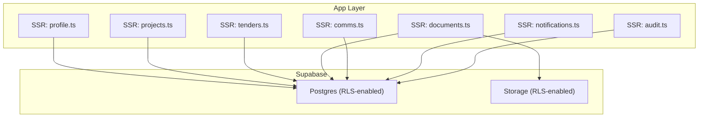
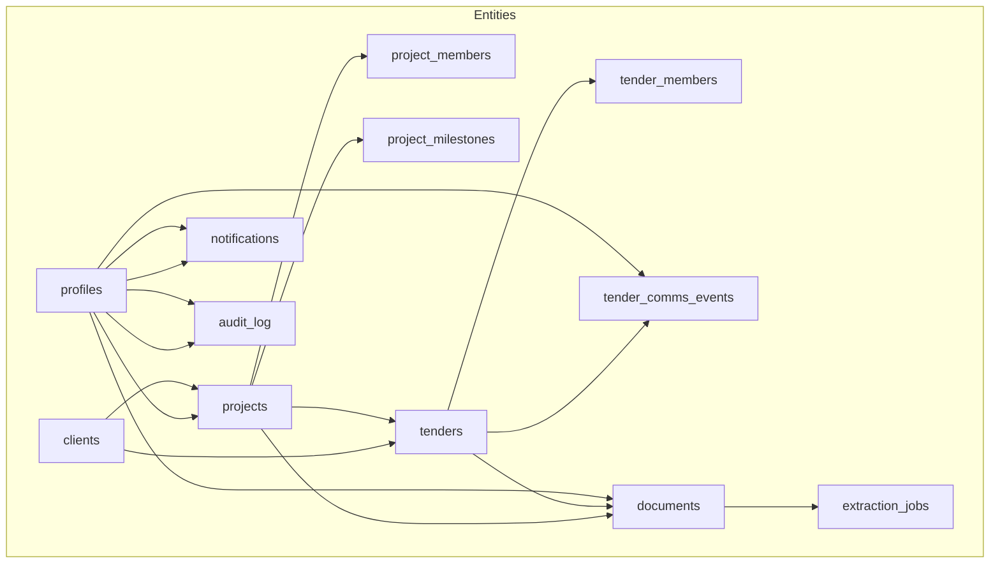
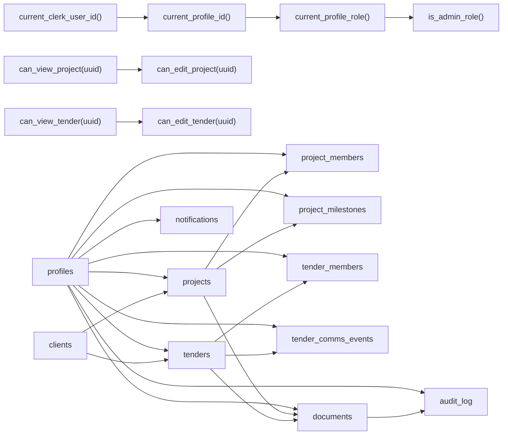

# Database Design

<cite>
**Referenced Files in This Document**
- [001_day1_schema.sql](file://supabase/migrations/001_day1_schema.sql)
- [002_day1_rls.sql](file://supabase/migrations/002_day1_rls.sql)
- [003_storage_policies.sql](file://supabase/migrations/003_storage_policies.sql)
- [setup-supabase.js](file://scripts/setup-supabase.js)
- [profile.ts](file://app/ssr/profile.ts)
- [projects.ts](file://app/ssr/projects.ts)
- [tenders.ts](file://app/ssr/tenders.ts)
- [documents.ts](file://app/ssr/documents.ts)
- [comms.ts](file://app/ssr/comms.ts)
- [notifications.ts](file://app/ssr/notifications.ts)
- [audit.ts](file://app/ssr/audit.ts)
- [README.md](file://README.md)
</cite>

## Table of Contents
1. [Introduction](#introduction)
2. [Project Structure](#project-structure)
3. [Core Components](#core-components)
4. [Architecture Overview](#architecture-overview)
5. [Detailed Component Analysis](#detailed-component-analysis)
6. [Dependency Analysis](#dependency-analysis)
7. [Performance Considerations](#performance-considerations)
8. [Troubleshooting Guide](#troubleshooting-guide)
9. [Conclusion](#conclusion)
10. [Appendices](#appendices)

## Introduction
This document describes the database schema and data model for MCE Command Center, focusing on entities for profiles, clients, projects, project milestones, tenders, tender members, tender communications, documents, extraction jobs, notifications, and audit logs. It explains entity relationships, field definitions, data types, primary and foreign keys, indexes, constraints, PostgreSQL enum types, access control via Row Level Security (RLS), and practical data access patterns used by the application. It also outlines indexing strategies, query optimization techniques, data lifecycle considerations, migration paths, and security controls.

## Project Structure
The database schema is defined and enforced through ordered migrations applied in the Supabase SQL editor. The application integrates with Supabase Postgres and Storage, using Clerk for authentication and service-side Supabase clients for server actions.

**Diagram sources**
- [001_day1_schema.sql](file://supabase/migrations/001_day1_schema.sql#L1-L227)
- [002_day1_rls.sql](file://supabase/migrations/002_day1_rls.sql#L1-L348)
- [003_storage_policies.sql](file://supabase/migrations/003_storage_policies.sql#L1-L55)
- [profile.ts](file://app/ssr/profile.ts#L1-L31)
- [projects.ts](file://app/ssr/projects.ts#L1-L43)
- [tenders.ts](file://app/ssr/tenders.ts#L1-L43)
- [documents.ts](file://app/ssr/documents.ts#L1-L114)
- [comms.ts](file://app/ssr/comms.ts#L1-L38)
- [notifications.ts](file://app/ssr/notifications.ts#L1-L27)
- [audit.ts](file://app/ssr/audit.ts#L1-L29)

**Section sources**
- [README.md](file://README.md#L42-L62)
- [setup-supabase.js](file://scripts/setup-supabase.js#L24-L36)

## Core Components
This section documents each table, its fields, data types, constraints, and indexes. Enum types are defined in the schema migration.

- Enum types
  - profile_role: super_admin, chairman_vp, dept_head, pm, engineer, finance, viewer
  - project_status: active, on_hold, completed
  - milestone_status: not_started, in_progress, done, blocked
  - tender_status: new, in_review, submitted, awarded, lost
  - tender_channel: email, call, meeting, other
  - document_sensitivity: confidential, restricted
  - notification_severity: info, warn, critical
  - notification_type: tender_deadline, milestone_due, followup_due, system
  - audit_action: create, update, delete, upload, ack
  - audit_entity: project, milestone, tender, tender_comms, document, notification

- Profiles
  - Fields: id (uuid, PK), clerk_user_id (text, unique), email (text), display_name (text), role (enum profile_role), created_at (timestamptz), updated_at (timestamptz)
  - Indexes: none
  - Constraints: unique(clerk_user_id)

- Clients
  - Fields: id (uuid, PK), name (text), classification (text), notes (text), created_at (timestamptz), updated_at (timestamptz)
  - Indexes: none
  - Constraints: none

- Projects
  - Fields: id (uuid, PK), code (text, unique), name (text), client_id (uuid, FK to clients), pm_profile_id (uuid, FK to profiles), stage (text), start_date (date), end_date (date), dlp_date (date), progress_pct (integer), status (enum project_status), tags (text[]), created_at (timestamptz), updated_at (timestamptz)
  - Indexes: projects_client_idx(client_id), projects_pm_idx(pm_profile_id)
  - Constraints: unique(code), FK(client_id), FK(pm_profile_id)

- Project Members
  - Fields: project_id (uuid, FK to projects), profile_id (uuid, FK to profiles), member_role (enum profile_role), created_at (timestamptz)
  - Indexes: none
  - Constraints: PK(project_id, profile_id), FK(project_id), FK(profile_id)

- Project Milestones
  - Fields: id (uuid, PK), project_id (uuid, FK to projects), title (text), due_date (date), owner_profile_id (uuid, FK to profiles), status (enum milestone_status), created_at (timestamptz)
  - Indexes: milestones_due_idx(due_date)
  - Constraints: FK(project_id), FK(owner_profile_id)

- Tenders
  - Fields: id (uuid, PK), client_id (uuid, FK to clients), project_id (uuid, FK to projects), reference (text), title (text), deadline_at (timestamptz), status (enum tender_status), value_amount (numeric(12,2)), value_currency (text), owner_profile_id (uuid, FK to profiles), next_followup_at (timestamptz), created_at (timestamptz), updated_at (timestamptz)
  - Indexes: tenders_deadline_idx(deadline_at), tenders_owner_idx(owner_profile_id)
  - Constraints: FK(client_id), FK(project_id), FK(owner_profile_id)

- Tender Members
  - Fields: tender_id (uuid, FK to tenders), profile_id (uuid, FK to profiles), created_at (timestamptz)
  - Indexes: none
  - Constraints: PK(tender_id, profile_id), FK(tender_id), FK(profile_id)

- Tender Comms Events
  - Fields: id (uuid, PK), tender_id (uuid, FK to tenders), actor_profile_id (uuid, FK to profiles), occurred_at (timestamptz), channel (enum tender_channel), outcome (text), notes (text), created_at (timestamptz)
  - Indexes: none
  - Constraints: FK(tender_id), FK(actor_profile_id)

- Documents
  - Fields: id (uuid, PK), doc_type (text), sensitivity (enum document_sensitivity), project_id (uuid, FK to projects), tender_id (uuid, FK to tenders), title (text), storage_bucket (text), storage_path (text), mime_type (text), size_bytes (bigint), uploaded_by_profile_id (uuid, FK to profiles), created_at (timestamptz), version_group_id (uuid), version_number (integer), constraint documents_entity_chk (check: project_id is not null or tender_id is not null)
  - Indexes: documents_project_idx(project_id), documents_tender_idx(tender_id)
  - Constraints: FK(project_id), FK(tender_id), FK(uploaded_by_profile_id), check

- Extraction Jobs
  - Fields: id (uuid, PK), document_id (uuid, FK to documents), job_type (text), status (text), started_at (timestamptz), finished_at (timestamptz), result_json (jsonb), error_message (text)
  - Indexes: none
  - Constraints: FK(document_id)

- Notifications
  - Fields: id (uuid, PK), recipient_profile_id (uuid, FK to profiles), severity (enum notification_severity), type (enum notification_type), message (text), entity_type (enum audit_entity), entity_id (uuid), ack_required (boolean), acked_at (timestamptz), acked_by_profile_id (uuid, FK to profiles), read_at (timestamptz), created_at (timestamptz)
  - Indexes: notifications_recipient_idx(recipient_profile_id)
  - Constraints: FK(recipient_profile_id), FK(acked_by_profile_id)

- Audit Log
  - Fields: id (uuid, PK), actor_profile_id (uuid, FK to profiles), action (enum audit_action), entity_type (enum audit_entity), entity_id (uuid), occurred_at (timestamptz), metadata (jsonb)
  - Indexes: audit_entity_idx(entity_type, entity_id)
  - Constraints: FK(actor_profile_id)

**Section sources**
- [001_day1_schema.sql](file://supabase/migrations/001_day1_schema.sql#L3-L74)
- [001_day1_schema.sql](file://supabase/migrations/001_day1_schema.sql#L76-L84)
- [001_day1_schema.sql](file://supabase/migrations/001_day1_schema.sql#L86-L93)
- [001_day1_schema.sql](file://supabase/migrations/001_day1_schema.sql#L95-L110)
- [001_day1_schema.sql](file://supabase/migrations/001_day1_schema.sql#L112-L118)
- [001_day1_schema.sql](file://supabase/migrations/001_day1_schema.sql#L120-L128)
- [001_day1_schema.sql](file://supabase/migrations/001_day1_schema.sql#L130-L144)
- [001_day1_schema.sql](file://supabase/migrations/001_day1_schema.sql#L146-L151)
- [001_day1_schema.sql](file://supabase/migrations/001_day1_schema.sql#L153-L162)
- [001_day1_schema.sql](file://supabase/migrations/001_day1_schema.sql#L164-L180)
- [001_day1_schema.sql](file://supabase/migrations/001_day1_schema.sql#L182-L191)
- [001_day1_schema.sql](file://supabase/migrations/001_day1_schema.sql#L193-L206)
- [001_day1_schema.sql](file://supabase/migrations/001_day1_schema.sql#L208-L216)
- [001_day1_schema.sql](file://supabase/migrations/001_day1_schema.sql#L218-L226)

## Architecture Overview
The database enforces access control via RLS policies per entity. Storage access is governed by storage policies that cross-check document records. Application server actions create or update rows and emit audit entries. Triggers enforce append-only semantics on sensitive tables.

**Diagram sources**
- [001_day1_schema.sql](file://supabase/migrations/001_day1_schema.sql#L95-L118)
- [001_day1_schema.sql](file://supabase/migrations/001_day1_schema.sql#L130-L151)
- [001_day1_schema.sql](file://supabase/migrations/001_day1_schema.sql#L164-L180)
- [001_day1_schema.sql](file://supabase/migrations/001_day1_schema.sql#L193-L206)
- [001_day1_schema.sql](file://supabase/migrations/001_day1_schema.sql#L208-L216)

## Detailed Component Analysis

### Profiles
- Purpose: Stores authenticated user identities and roles.
- Key constraints: Unique clerk_user_id; role defaults to viewer.
- Access pattern: Upsert on sign-in; used to derive current profile for RLS checks.

**Section sources**
- [001_day1_schema.sql](file://supabase/migrations/001_day1_schema.sql#L76-L84)
- [profile.ts](file://app/ssr/profile.ts#L6-L30)

### Clients
- Purpose: Organizations or parties associated with projects and tenders.
- Access pattern: Select allowed for non-admin viewers; insert/update requires admin-level roles.

**Section sources**
- [001_day1_schema.sql](file://supabase/migrations/001_day1_schema.sql#L86-L93)
- [002_day1_rls.sql](file://supabase/migrations/002_day1_rls.sql#L130-L145)

### Projects
- Purpose: Track project metadata, ownership, status, and timeline.
- Key constraints: Unique code; PM must be a profile; FK to clients.
- Access pattern: Insert/update allowed for admin/pm; view depends on membership or PM role.

**Section sources**
- [001_day1_schema.sql](file://supabase/migrations/001_day1_schema.sql#L95-L110)
- [002_day1_rls.sql](file://supabase/migrations/002_day1_rls.sql#L147-L162)
- [projects.ts](file://app/ssr/projects.ts#L8-L42)

### Project Members
- Purpose: Link profiles to projects with member roles.
- Access pattern: Manage allowed only by editors; select allowed for viewers.

**Section sources**
- [001_day1_schema.sql](file://supabase/migrations/001_day1_schema.sql#L112-L118)
- [002_day1_rls.sql](file://supabase/migrations/002_day1_rls.sql#L164-L184)

### Project Milestones
- Purpose: Track milestone due dates and owners.
- Access pattern: CRUD allowed for editors; select allowed for viewers.

**Section sources**
- [001_day1_schema.sql](file://supabase/migrations/001_day1_schema.sql#L120-L128)
- [002_day1_rls.sql](file://supabase/migrations/002_day1_rls.sql#L186-L201)

### Tenders
- Purpose: Capture tender opportunities, deadlines, owners, and financials.
- Key constraints: Owner must be current profile; optional FK to project/client.
- Access pattern: Insert requires admin/pm and owner match; edit allowed for editors.

**Section sources**
- [001_day1_schema.sql](file://supabase/migrations/001_day1_schema.sql#L130-L144)
- [002_day1_rls.sql](file://supabase/migrations/002_day1_rls.sql#L203-L221)
- [tenders.ts](file://app/ssr/tenders.ts#L8-L42)

### Tender Members
- Purpose: Assign profiles to tenders.
- Access pattern: Manage allowed for editors; select allowed for viewers.

**Section sources**
- [001_day1_schema.sql](file://supabase/migrations/001_day1_schema.sql#L146-L151)
- [002_day1_rls.sql](file://supabase/migrations/002_day1_rls.sql#L223-L243)

### Tender Comms Events
- Purpose: Record communication events against tenders.
- Access pattern: Insert allowed for viewers who can see the tender and actor must be current profile.
- Append-only enforcement: Trigger prevents updates/deletes.

**Section sources**
- [001_day1_schema.sql](file://supabase/migrations/001_day1_schema.sql#L153-L162)
- [002_day1_rls.sql](file://supabase/migrations/002_day1_rls.sql#L245-L257)
- [002_day1_rls.sql](file://supabase/migrations/002_day1_rls.sql#L341-L343)
- [comms.ts](file://app/ssr/comms.ts#L7-L37)

### Documents
- Purpose: Metadata for uploaded files stored in Supabase Storage.
- Key constraints: Must belong to either a project or a tender; uploaded_by must be current profile.
- Access pattern: Select allowed for admins or authorized viewers; insert/update/delete allowed for editors.

**Section sources**
- [001_day1_schema.sql](file://supabase/migrations/001_day1_schema.sql#L164-L180)
- [002_day1_rls.sql](file://supabase/migrations/002_day1_rls.sql#L259-L301)
- [documents.ts](file://app/ssr/documents.ts#L11-L86)

### Extraction Jobs
- Purpose: Track asynchronous extraction tasks for documents.
- Access pattern: CRUD controlled by application logic; FK cascade from documents.

**Section sources**
- [001_day1_schema.sql](file://supabase/migrations/001_day1_schema.sql#L182-L191)

### Notifications
- Purpose: Store user-facing alerts with acknowledgment tracking.
- Access pattern: Select allowed for admins or recipients; update allowed only for recipients.

**Section sources**
- [001_day1_schema.sql](file://supabase/migrations/001_day1_schema.sql#L193-L206)
- [002_day1_rls.sql](file://supabase/migrations/002_day1_rls.sql#L303-L316)
- [notifications.ts](file://app/ssr/notifications.ts#L7-L26)

### Audit Log
- Purpose: Persist auditable actions performed by users.
- Access pattern: Select allowed for admins or actors; insert allowed only by current profile.
- Append-only enforcement: Trigger prevents updates/deletes.

**Section sources**
- [001_day1_schema.sql](file://supabase/migrations/001_day1_schema.sql#L208-L216)
- [002_day1_rls.sql](file://supabase/migrations/002_day1_rls.sql#L318-L330)
- [002_day1_rls.sql](file://supabase/migrations/002_day1_rls.sql#L345-L347)
- [audit.ts](file://app/ssr/audit.ts#L6-L28)

## Dependency Analysis
The following diagram shows referential integrity among entities and how RLS policies depend on helper functions.

**Diagram sources**
- [002_day1_rls.sql](file://supabase/migrations/002_day1_rls.sql#L1-L35)
- [002_day1_rls.sql](file://supabase/migrations/002_day1_rls.sql#L37-L113)
- [001_day1_schema.sql](file://supabase/migrations/001_day1_schema.sql#L95-L118)
- [001_day1_schema.sql](file://supabase/migrations/001_day1_schema.sql#L130-L151)
- [001_day1_schema.sql](file://supabase/migrations/001_day1_schema.sql#L164-L180)
- [001_day1_schema.sql](file://supabase/migrations/001_day1_schema.sql#L193-L206)
- [001_day1_schema.sql](file://supabase/migrations/001_day1_schema.sql#L208-L216)

## Performance Considerations
- Indexes
  - projects_client_idx(client_id): accelerates joins from projects to clients.
  - projects_pm_idx(pm_profile_id): supports queries filtering by project manager.
  - milestones_due_idx(due_date): optimizes milestone due-date scans.
  - tenders_deadline_idx(deadline_at): improves tender deadline queries.
  - tenders_owner_idx(owner_profile_id): speeds owner-based tender queries.
  - documents_project_idx(project_id): aids project-scoped document queries.
  - documents_tender_idx(tender_id): aids tender-scoped document queries.
  - notifications_recipient_idx(recipient_profile_id): supports per-user notification retrieval.
  - audit_entity_idx(entity_type, entity_id): optimizes audit lookups by entity.

- Query optimization techniques
  - Use targeted indexes for frequent filter columns (deadline_at, owner_profile_id, due_date, recipient_profile_id).
  - Prefer selective predicates and limit scans when retrieving latest document versions (application logic orders by created_at and limits).
  - Leverage enums for equality checks to benefit from efficient index usage.

- Data lifecycle and retention
  - No explicit retention policies are defined in the schema. Retention and archival should be implemented at the application or database level as needed.

**Section sources**
- [001_day1_schema.sql](file://supabase/migrations/001_day1_schema.sql#L218-L226)

## Troubleshooting Guide
- RLS denied / empty data
  - Ensure the signed-in user has a profiles row and appropriate role assignment.
  - Confirm that RLS policies are enabled and applied after migrations.

- Document upload fails
  - Verify the mce-documents bucket exists and is private.
  - Ensure migrations are applied in order and the document metadata row is created before upload.

- Signed URL fails
  - Confirm storage policies are applied and the requesting user has access to the linked project/tender.

- Append-only violations
  - Updates or deletes to tender_comms_events and audit_log are prevented by triggers.

**Section sources**
- [README.md](file://README.md#L141-L157)
- [002_day1_rls.sql](file://supabase/migrations/002_day1_rls.sql#L332-L347)
- [003_storage_policies.sql](file://supabase/migrations/003_storage_policies.sql#L1-L55)

## Conclusion
The MCE Command Center database schema establishes a secure, role-aware data model with clear entity relationships and robust access control via RLS. The schema supports core workflows for projects, tenders, documents, notifications, and audit trails. Indexes are strategically placed to support common queries. Append-only enforcement protects sensitive audit and communication records. Application server actions integrate tightly with the schema to maintain referential integrity and auditability.

## Appendices

### Data Access Patterns and Sample Queries
- Upsert profile on sign-in
  - Path: [profile.ts](file://app/ssr/profile.ts#L6-L30)

- Create project (PM sets to current profile)
  - Path: [projects.ts](file://app/ssr/projects.ts#L8-L42)

- Create tender (owner sets to current profile)
  - Path: [tenders.ts](file://app/ssr/tenders.ts#L8-L42)

- Prepare document upload (metadata + signed URL)
  - Path: [documents.ts](file://app/ssr/documents.ts#L11-L86)

- Create signed download URL for a document reference
  - Path: [documents.ts](file://app/ssr/documents.ts#L88-L113)

- Add tender communication event
  - Path: [comms.ts](file://app/ssr/comms.ts#L7-L37)

- Acknowledge notification
  - Path: [notifications.ts](file://app/ssr/notifications.ts#L7-L26)

- Write audit entry
  - Path: [audit.ts](file://app/ssr/audit.ts#L6-L28)

### Data Validation Rules and Business Logic
- Enum constraints: All enum-typed columns enforce allowed values at insert/update.
- Check constraints:
  - documents_entity_chk ensures documents are linked to either a project or a tender.
- Triggers:
  - prevent_updates blocks updates/deletes on tender_comms_events and audit_log.
- RLS policies:
  - Fine-grained visibility and modification permissions based on roles and relationships.

**Section sources**
- [001_day1_schema.sql](file://supabase/migrations/001_day1_schema.sql#L179-L179)
- [002_day1_rls.sql](file://supabase/migrations/002_day1_rls.sql#L332-L347)

### Schema Change Management and Versioning
- Apply migrations in order using the Supabase SQL editor or the provided script.
- Migration order:
  - 001_day1_schema.sql
  - 002_day1_rls.sql
  - 003_storage_policies.sql
- Script usage:
  - Path: [setup-supabase.js](file://scripts/setup-supabase.js#L24-L36)

**Section sources**
- [README.md](file://README.md#L42-L54)
- [setup-supabase.js](file://scripts/setup-supabase.js#L24-L36)

### Security Controls
- Authentication: Clerk-managed sessions.
- Authorization: Supabase RLS policies per table and helper functions for role checks.
- Storage: Bucket-level RLS policies for mce-documents, enforcing access based on document ownership and project/tender membership.
- Auditability: Dedicated audit_log table capturing create/upload/ack events.

**Section sources**
- [README.md](file://README.md#L4-L16)
- [002_day1_rls.sql](file://supabase/migrations/002_day1_rls.sql#L1-L35)
- [003_storage_policies.sql](file://supabase/migrations/003_storage_policies.sql#L1-L55)