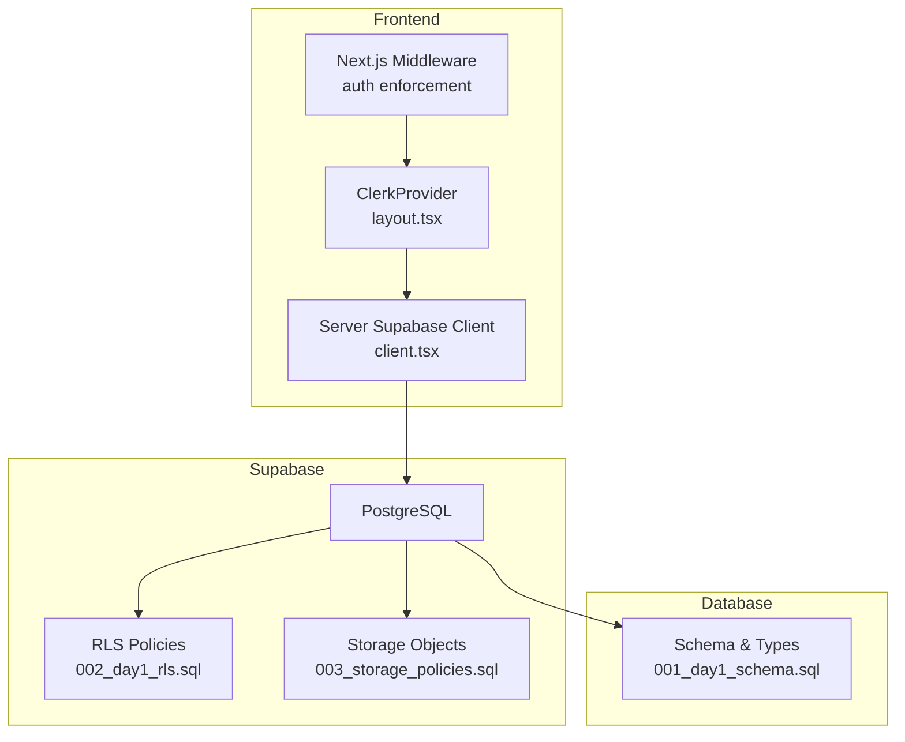
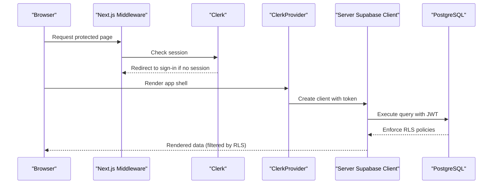
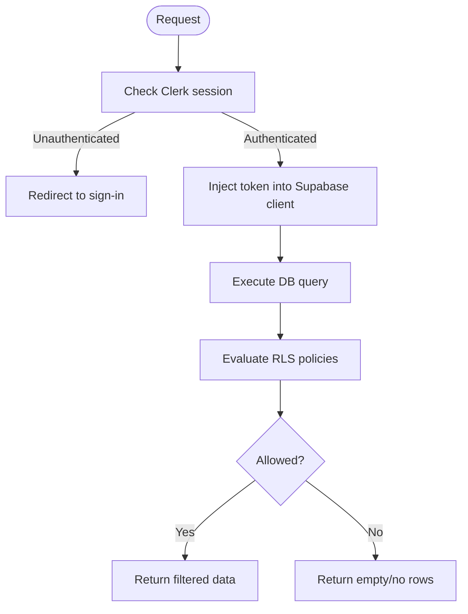
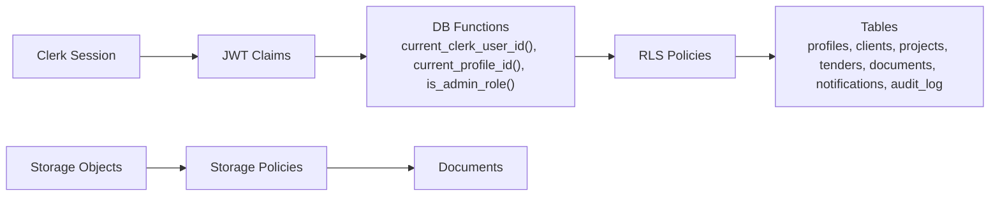

# Row Level Security

<cite>
**Referenced Files in This Document**
- [001_day1_schema.sql](file://supabase/migrations/001_day1_schema.sql)
- [002_day1_rls.sql](file://supabase/migrations/002_day1_rls.sql)
- [003_storage_policies.sql](file://supabase/migrations/003_storage_policies.sql)
- [setup-supabase.js](file://scripts/setup-supabase.js)
- [middleware.ts](file://middleware.ts)
- [layout.tsx](file://app/layout.tsx)
- [client.tsx](file://app/ssr/client.tsx)
- [README.md](file://README.md)
</cite>

## Table of Contents
1. [Introduction](#introduction)
2. [Project Structure](#project-structure)
3. [Core Components](#core-components)
4. [Architecture Overview](#architecture-overview)
5. [Detailed Component Analysis](#detailed-component-analysis)
6. [Dependency Analysis](#dependency-analysis)
7. [Performance Considerations](#performance-considerations)
8. [Troubleshooting Guide](#troubleshooting-guide)
9. [Conclusion](#conclusion)

## Introduction
This document explains the Row Level Security (RLS) implementation in MCE Command Center. It details how PostgreSQL RLS policies are configured to enforce data isolation and access control at the row level across the application’s core tables. It also documents how Clerk authentication integrates with Supabase to map user sessions to database policies, and outlines the security implications, potential bypass scenarios, and best practices for maintaining data security.

## Project Structure
The RLS implementation spans three SQL migrations and a small amount of frontend integration:
- Schema creation and types define the data model and constraints.
- RLS policies define who can access rows and under what conditions.
- Storage policies complement database RLS for secure document access.
- Frontend middleware enforces session presence for protected routes.
- A server-side Supabase client injects the authenticated user’s token into database requests.

**Diagram sources**
- [middleware.ts](file://middleware.ts#L1-L20)
- [layout.tsx](file://app/layout.tsx#L1-L46)
- [client.tsx](file://app/ssr/client.tsx#L1-L24)
- [001_day1_schema.sql](file://supabase/migrations/001_day1_schema.sql#L1-L227)
- [002_day1_rls.sql](file://supabase/migrations/002_day1_rls.sql#L1-L348)
- [003_storage_policies.sql](file://supabase/migrations/003_storage_policies.sql#L1-L55)

**Section sources**
- [001_day1_schema.sql](file://supabase/migrations/001_day1_schema.sql#L1-L227)
- [002_day1_rls.sql](file://supabase/migrations/002_day1_rls.sql#L1-L348)
- [003_storage_policies.sql](file://supabase/migrations/003_storage_policies.sql#L1-L55)
- [middleware.ts](file://middleware.ts#L1-L20)
- [layout.tsx](file://app/layout.tsx#L1-L46)
- [client.tsx](file://app/ssr/client.tsx#L1-L24)

## Core Components
- Authentication and session mapping:
  - Clerk manages user sessions and redirects unauthenticated users to sign-in.
  - The server-side Supabase client injects the authenticated user’s token into database requests so that database functions can read the JWT claims.
- Database functions:
  - Helper functions resolve the current Clerk user ID, current profile UUID, current profile role, and admin role checks.
  - Higher-level functions evaluate whether a user can view or edit a project or tender based on role, ownership, or membership.
- RLS policies:
  - Applied per-table to control SELECT, INSERT, UPDATE, DELETE operations.
  - Policies rely on the helper functions and enforce role-based and relationship-based access.
- Storage policies:
  - Storage objects are secured with RLS and policies mirror document-level access rules.

**Section sources**
- [middleware.ts](file://middleware.ts#L1-L20)
- [client.tsx](file://app/ssr/client.tsx#L1-L24)
- [002_day1_rls.sql](file://supabase/migrations/002_day1_rls.sql#L1-L348)
- [003_storage_policies.sql](file://supabase/migrations/003_storage_policies.sql#L1-L55)

## Architecture Overview
The system enforces access control at the database boundary using RLS. Clerk ensures users are authenticated before accessing protected pages. The server-side Supabase client passes the authenticated user’s token to the database, enabling database functions to read the JWT and enforce policies.

**Diagram sources**
- [middleware.ts](file://middleware.ts#L1-L20)
- [layout.tsx](file://app/layout.tsx#L1-L46)
- [client.tsx](file://app/ssr/client.tsx#L1-L24)
- [002_day1_rls.sql](file://supabase/migrations/002_day1_rls.sql#L1-L348)

## Detailed Component Analysis

### Profiles
- Purpose: Stores Clerk user identifiers and application roles.
- RLS:
  - Select: Super-admins or the user whose Clerk ID matches the current session.
  - Update: Self-update only, with a check ensuring the JWT subject matches the target row.
- Security implications:
  - Prevents unauthorized profile updates.
  - Ensures users can only see their own profile unless elevated roles apply.

**Section sources**
- [001_day1_schema.sql](file://supabase/migrations/001_day1_schema.sql#L76-L84)
- [002_day1_rls.sql](file://supabase/migrations/002_day1_rls.sql#L115-L128)

### Clients
- Purpose: Stores client organizations.
- RLS:
  - Select: Super-admins or users with roles that include project manager, engineer, or viewer.
  - Insert/Update: Super-admins or higher roles; updates restricted to authorized roles.
- Security implications:
  - Limits visibility and modification to roles with operational needs.

**Section sources**
- [001_day1_schema.sql](file://supabase/migrations/001_day1_schema.sql#L86-L93)
- [002_day1_rls.sql](file://supabase/migrations/002_day1_rls.sql#L130-L145)

### Projects
- Purpose: Tracks projects, including PM assignment and status.
- RLS:
  - Select: Enforced via a helper that allows super-admins, the project manager, or members.
  - Insert: Authorized roles only.
  - Update: Enforced via a helper that allows super-admins or the project manager.
- Membership:
  - Project members are tracked separately; access to project data is granted via membership.
- Security implications:
  - Prevents unauthorized access to project data; PMs have broader editing rights.

**Section sources**
- [001_day1_schema.sql](file://supabase/migrations/001_day1_schema.sql#L95-L110)
- [001_day1_schema.sql](file://supabase/migrations/001_day1_schema.sql#L112-L118)
- [002_day1_rls.sql](file://supabase/migrations/002_day1_rls.sql#L147-L162)
- [002_day1_rls.sql](file://supabase/migrations/002_day1_rls.sql#L164-L184)

### Project Members
- Purpose: Links profiles to projects with a member role.
- RLS:
  - Select: Access granted if the user can view the associated project.
  - Manage (insert/update/delete): Controlled by the ability to edit the project.
- Security implications:
  - Maintains strict control over who can modify membership.

**Section sources**
- [001_day1_schema.sql](file://supabase/migrations/001_day1_schema.sql#L112-L118)
- [002_day1_rls.sql](file://supabase/migrations/002_day1_rls.sql#L164-L184)

### Project Milestones
- Purpose: Tracks milestone details for projects.
- RLS:
  - Select/Insert/Update: Controlled by the ability to view/edit the associated project.
- Security implications:
  - Aligns milestone access with project-level permissions.

**Section sources**
- [001_day1_schema.sql](file://supabase/migrations/001_day1_schema.sql#L120-L128)
- [002_day1_rls.sql](file://supabase/migrations/002_day1_rls.sql#L186-L201)

### Tenders
- Purpose: Manages tenders, deadlines, owners, and links to projects.
- RLS:
  - Select: Super-admins, the owner, access via project membership, or explicit membership.
  - Insert: Authorized roles plus owner must match the current profile.
  - Update: Super-admins, owner, or editing rights derived from project-level permissions.
- Security implications:
  - Owner-only write controls; broad read access via project or explicit membership.

**Section sources**
- [001_day1_schema.sql](file://supabase/migrations/001_day1_schema.sql#L130-L144)
- [002_day1_rls.sql](file://supabase/migrations/002_day1_rls.sql#L203-L221)

### Tender Members
- Purpose: Links profiles to tenders.
- RLS:
  - Select: Access granted if the user can view the associated tender.
  - Manage (insert/update/delete): Controlled by the ability to edit the tender.
- Security implications:
  - Ensures only authorized users can manage tender collaborators.

**Section sources**
- [001_day1_schema.sql](file://supabase/migrations/001_day1_schema.sql#L146-L151)
- [002_day1_rls.sql](file://supabase/migrations/002_day1_rls.sql#L223-L243)

### Tender Communications Events
- Purpose: Records communication events related to tenders.
- RLS:
  - Select: Access granted if the user can view the associated tender.
  - Insert: Must have view access and actor must match the current profile.
- Additional protection:
  - A trigger prevents updates/deletes on this table.
- Security implications:
  - Append-only logging with explicit actor verification.

**Section sources**
- [001_day1_schema.sql](file://supabase/migrations/001_day1_schema.sql#L153-L162)
- [002_day1_rls.sql](file://supabase/migrations/002_day1_rls.sql#L245-L257)
- [002_day1_rls.sql](file://supabase/migrations/002_day1_rls.sql#L341-L347)

### Documents
- Purpose: Metadata for uploaded documents, linking to projects or tenders.
- RLS:
  - Select: Super-admins or users with view access to the linked project/tender.
  - Insert: Must have edit access to the linked project/tender and be the uploader.
  - Update/Delete: Controlled by edit access to the linked project/tender.
- Security implications:
  - Strong linkage to project/tender permissions; uploader identity enforced.

**Section sources**
- [001_day1_schema.sql](file://supabase/migrations/001_day1_schema.sql#L164-L180)
- [002_day1_rls.sql](file://supabase/migrations/002_day1_rls.sql#L259-L301)

### Notifications
- Purpose: Stores user notifications with acknowledgment tracking.
- RLS:
  - Select: Super-admins or the notification recipient.
  - Update: Recipient-only, with a check ensuring the target matches the current profile.
- Security implications:
  - Protects privacy by restricting notifications to recipients.

**Section sources**
- [001_day1_schema.sql](file://supabase/migrations/001_day1_schema.sql#L193-L206)
- [002_day1_rls.sql](file://supabase/migrations/002_day1_rls.sql#L303-L316)

### Audit Log
- Purpose: Logs actions performed by actors.
- RLS:
  - Select: Super-admins or the actor themselves.
  - Insert: Actor must match the current profile.
- Additional protection:
  - A trigger prevents updates/deletes on this table.
- Security implications:
  - Append-only audit trail with actor verification.

**Section sources**
- [001_day1_schema.sql](file://supabase/migrations/001_day1_schema.sql#L208-L216)
- [002_day1_rls.sql](file://supabase/migrations/002_day1_rls.sql#L318-L330)
- [002_day1_rls.sql](file://supabase/migrations/002_day1_rls.sql#L345-L347)

### Storage Objects (Documents)
- Purpose: Securely stores uploaded files in a private bucket.
- RLS:
  - Select: Authenticated users can access objects linked to documents they can view.
  - Insert: Authenticated users can upload objects linked to documents they can edit and who uploaded them.
  - Delete: Super-admins only.
- Security implications:
  - Ensures documents remain private and access is aligned with project/tender permissions.

**Section sources**
- [003_storage_policies.sql](file://supabase/migrations/003_storage_policies.sql#L1-L55)

### Authentication and Session Mapping
- Clerk middleware enforces session presence for protected routes.
- The server-side Supabase client supplies the authenticated user’s token to the database, enabling database functions to read the JWT and enforce policies.
- The helper functions derive the current Clerk user ID, profile ID, and role from the JWT.

**Diagram sources**
- [middleware.ts](file://middleware.ts#L1-L20)
- [client.tsx](file://app/ssr/client.tsx#L1-L24)
- [002_day1_rls.sql](file://supabase/migrations/002_day1_rls.sql#L1-L35)

**Section sources**
- [middleware.ts](file://middleware.ts#L1-L20)
- [layout.tsx](file://app/layout.tsx#L1-L46)
- [client.tsx](file://app/ssr/client.tsx#L1-L24)
- [002_day1_rls.sql](file://supabase/migrations/002_day1_rls.sql#L1-L35)

## Dependency Analysis
- Database functions depend on:
  - Clerk user ID extracted from the JWT.
  - Profile role and profile ID derived from the profiles table.
  - Relationship tables (project_members, tender_members) to determine membership.
- Policies depend on:
  - Helper functions for view/edit checks.
  - Triggers to enforce append-only semantics for sensitive tables.
- Frontend depends on:
  - Clerk middleware for route protection.
  - Server-side Supabase client to pass the authenticated token to the database.

**Diagram sources**
- [002_day1_rls.sql](file://supabase/migrations/002_day1_rls.sql#L1-L348)
- [003_storage_policies.sql](file://supabase/migrations/003_storage_policies.sql#L1-L55)

**Section sources**
- [002_day1_rls.sql](file://supabase/migrations/002_day1_rls.sql#L1-L348)
- [003_storage_policies.sql](file://supabase/migrations/003_storage_policies.sql#L1-L55)

## Performance Considerations
- Indexes:
  - Several tables have indexes on foreign keys and frequently queried columns (e.g., project PM, tender owner, document links). These support efficient policy evaluation.
- Policy complexity:
  - Policies often include subqueries to check admin roles, ownership, or membership. Ensure indexes exist on join columns to minimize cost.
- Storage policies:
  - Storage policies join with documents; ensure indexes on bucket and path fields to optimize lookups.
- Recommendations:
  - Monitor slow queries in the database logs.
  - Consider partitioning or materialized views for frequently accessed aggregates if needed.
  - Keep JWT claims minimal and avoid heavy computations in triggers.

**Section sources**
- [001_day1_schema.sql](file://supabase/migrations/001_day1_schema.sql#L218-L226)
- [002_day1_rls.sql](file://supabase/migrations/002_day1_rls.sql#L259-L301)
- [003_storage_policies.sql](file://supabase/migrations/003_storage_policies.sql#L3-L39)

## Troubleshooting Guide
- Build fails due to invalid Clerk keys:
  - Ensure the publishable and secret keys are present and valid in environment variables.
- RLS denied or empty data:
  - Confirm the signed-in user has a corresponding profile row.
  - Verify role assignments for the user.
- Document upload fails:
  - Ensure the bucket exists and is private.
  - Confirm migrations were applied in order.
  - Ensure the document metadata row exists before uploading.
- Signed URL fails:
  - Verify storage policies and ensure the requesting user has access to the linked project/tender.

**Section sources**
- [README.md](file://README.md#L141-L158)

## Conclusion
MCE Command Center’s RLS implementation provides robust, fine-grained access control by combining Clerk authentication, server-side token injection, and PostgreSQL policies. The design centers around role-based permissions and relationship-based access (ownership and membership), with additional protections for append-only audit trails. By aligning frontend route protection with database policies and leveraging helper functions, the system maintains strong data isolation while remaining maintainable and extensible.