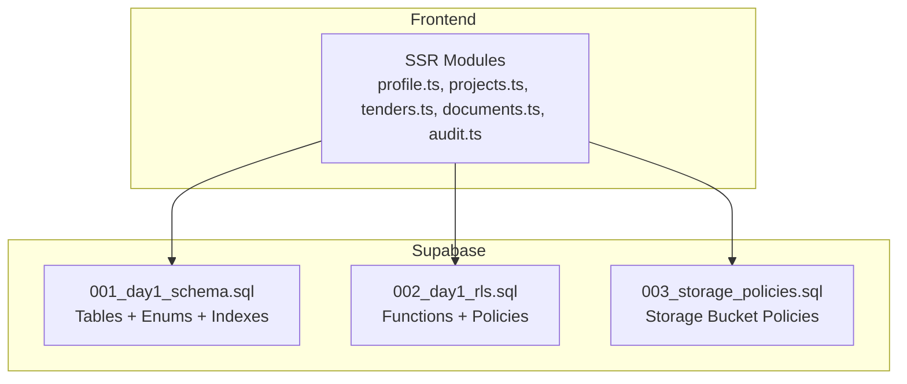
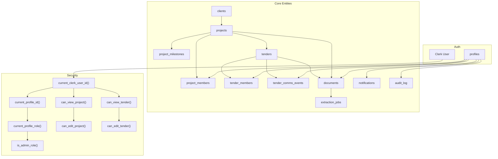
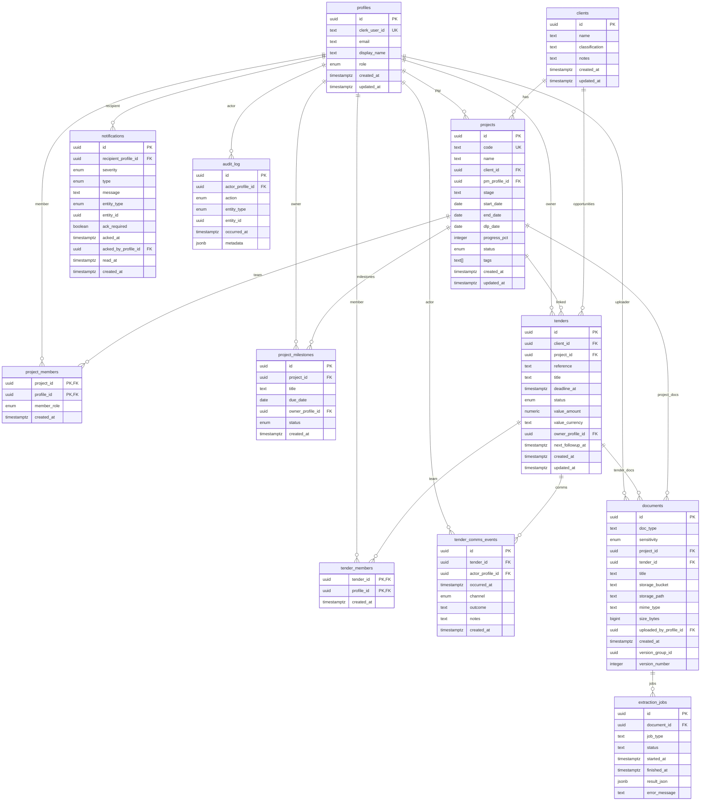
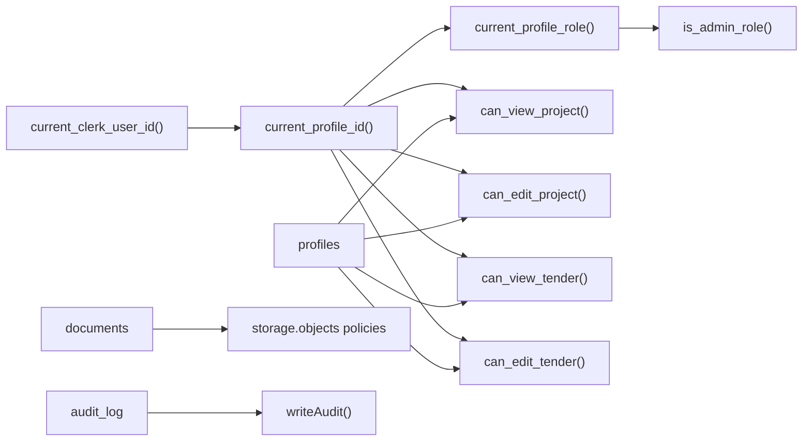

# Schema Overview

<cite>
**Referenced Files in This Document**
- [001_day1_schema.sql](file://supabase/migrations/001_day1_schema.sql)
- [002_day1_rls.sql](file://supabase/migrations/002_day1_rls.sql)
- [003_storage_policies.sql](file://supabase/migrations/003_storage_policies.sql)
- [profile.ts](file://app/ssr/profile.ts)
- [projects.ts](file://app/ssr/projects.ts)
- [tenders.ts](file://app/ssr/tenders.ts)
- [documents.ts](file://app/ssr/documents.ts)
- [audit.ts](file://app/ssr/audit.ts)
- [README.md](file://README.md)
</cite>

## Table of Contents
1. [Introduction](#introduction)
2. [Project Structure](#project-structure)
3. [Core Components](#core-components)
4. [Architecture Overview](#architecture-overview)
5. [Detailed Component Analysis](#detailed-component-analysis)
6. [Dependency Analysis](#dependency-analysis)
7. [Performance Considerations](#performance-considerations)
8. [Troubleshooting Guide](#troubleshooting-guide)
9. [Conclusion](#conclusion)
10. [Appendices](#appendices)

## Introduction
This document provides a comprehensive schema overview for the MCE Command Center database. It describes the entity tables, their fields, constraints, and relationships; enumerations used for roles, statuses, priorities, and classifications; and the overall design philosophy. It also includes ER diagrams, sample data examples, and common query patterns that illustrate how entities connect.

## Project Structure
The database schema is defined by Supabase migrations and enforced by Row Level Security (RLS) policies. The frontend integrates with Supabase to create records and manage access.

**Diagram sources**
- [001_day1_schema.sql](file://supabase/migrations/001_day1_schema.sql#L1-L227)
- [002_day1_rls.sql](file://supabase/migrations/002_day1_rls.sql#L1-L348)
- [003_storage_policies.sql](file://supabase/migrations/003_storage_policies.sql#L1-L55)

**Section sources**
- [README.md](file://README.md#L42-L62)

## Core Components
This section documents each table, its fields, data types, constraints, defaults, and relationships.

- Enumerations
  - profile_role: super_admin, chairman_vp, dept_head, pm, engineer, finance, viewer
  - project_status: active, on_hold, completed
  - milestone_status: not_started, in_progress, done, blocked
  - tender_status: new, in_review, submitted, awarded, lost
  - tender_channel: email, call, meeting, other
  - document_sensitivity: confidential, restricted
  - notification_severity: info, warn, critical
  - notification_type: tender_deadline, milestone_due, followup_due, system
  - audit_action: create, update, delete, upload, ack
  - audit_entity: project, milestone, tender, tender_comms, document, notification

- Profiles
  - Purpose: User identity and role.
  - Primary key: id (uuid, default generated)
  - Unique: clerk_user_id (text)
  - Fields: email (text), display_name (text), role (enum), timestamps
  - Defaults: role=view, created_at/updated_at now()

- Clients
  - Purpose: Organization or customer.
  - Primary key: id (uuid, default generated)
  - Fields: name (text), classification (text), notes (text), timestamps

- Projects
  - Purpose: Track project lifecycle.
  - Primary key: id (uuid, default generated)
  - Unique: code (text)
  - Foreign keys: client_id (clients.id), pm_profile_id (profiles.id)
  - Fields: name (text), stage (text), dates (start_date, end_date, dlp_date), progress_pct (integer), status (enum), tags (text[]), timestamps
  - Defaults: progress_pct=0, status=active

- Project Members
  - Purpose: Team membership with role per project.
  - Composite primary key: (project_id, profile_id)
  - Foreign keys: project_id (projects.id, cascade delete), profile_id (profiles.id, cascade delete)
  - Fields: member_role (enum), created_at (default now())

- Project Milestones
  - Purpose: Track milestones within a project.
  - Primary key: id (uuid, default generated)
  - Foreign keys: project_id (projects.id, cascade delete), owner_profile_id (profiles.id, set null)
  - Fields: title (text), due_date (date), status (enum), created_at (default now())
  - Defaults: status=not_started

- Tenders
  - Purpose: Tender opportunities and tracking.
  - Primary key: id (uuid, default generated)
  - Foreign keys: client_id (clients.id, set null), project_id (projects.id, set null), owner_profile_id (profiles.id, restrict)
  - Fields: reference (text), title (text), deadline_at (timestamptz), status (enum), value_amount (numeric), value_currency (text), next_followup_at (timestamptz), timestamps
  - Defaults: status=new, value_currency=GBP

- Tender Members
  - Purpose: Team members assigned to a tender.
  - Composite primary key: (tender_id, profile_id)
  - Foreign keys: tender_id (tenders.id, cascade delete), profile_id (profiles.id, cascade delete)
  - Fields: created_at (default now())

- Tender Comms Events
  - Purpose: Communication logs for tenders.
  - Primary key: id (uuid, default generated)
  - Foreign keys: tender_id (tenders.id, cascade delete), actor_profile_id (profiles.id, restrict)
  - Fields: occurred_at (timestamptz), channel (enum), outcome (text), notes (text), timestamps
  - Defaults: occurred_at=now(), channel=email

- Documents
  - Purpose: Document metadata and versioning.
  - Primary key: id (uuid, default generated)
  - Foreign keys: project_id (projects.id, set null), tender_id (tenders.id, set null), uploaded_by_profile_id (profiles.id, restrict)
  - Fields: doc_type (text), sensitivity (enum), title (text), storage_bucket (text), storage_path (text), mime_type (text), size_bytes (bigint), version_group_id (uuid), version_number (integer), timestamps
  - Defaults: sensitivity=confidential, storage_bucket=mce-documents, version_number=1
  - Constraint: documents_entity_chk (either project_id or tender_id is not null)

- Extraction Jobs
  - Purpose: Background jobs for document processing.
  - Primary key: id (uuid, default generated)
  - Foreign key: document_id (documents.id, cascade delete)
  - Fields: job_type (text), status (text), timestamps, result_json (jsonb), error_message (text)

- Notifications
  - Purpose: User notifications with acknowledgments.
  - Primary key: id (uuid, default generated)
  - Foreign key: recipient_profile_id (profiles.id, cascade delete)
  - Fields: severity (enum), type (enum), message (text), entity_type (enum), entity_id (uuid), ack_required (boolean), acked_at (timestamptz), acked_by_profile_id (profiles.id, set null), read_at (timestamptz), timestamps
  - Defaults: severity=info, type=system, ack_required=false

- Audit Log
  - Purpose: Append-only audit trail.
  - Primary key: id (uuid, default generated)
  - Foreign key: actor_profile_id (profiles.id, set null)
  - Fields: action (enum), entity_type (enum), entity_id (uuid), occurred_at (timestamptz), metadata (jsonb)
  - Defaults: occurred_at=now(), metadata={}

**Section sources**
- [001_day1_schema.sql](file://supabase/migrations/001_day1_schema.sql#L3-L74)
- [001_day1_schema.sql](file://supabase/migrations/001_day1_schema.sql#L76-L216)

## Architecture Overview
The system enforces role-based access control at the database level using Supabase RLS. Functions resolve the current user’s profile and role, and policies gate visibility and modification of resources. Storage policies protect the private bucket and align access with document ownership and linkage to projects/tenders.

**Diagram sources**
- [002_day1_rls.sql](file://supabase/migrations/002_day1_rls.sql#L1-L348)
- [001_day1_schema.sql](file://supabase/migrations/001_day1_schema.sql#L76-L216)

## Detailed Component Analysis

### Entity Relationship Diagram

**Diagram sources**
- [001_day1_schema.sql](file://supabase/migrations/001_day1_schema.sql#L76-L216)

### Sample Data Examples
- profiles
  - Example: id=<uuid>, clerk_user_id="user_abc", email="user@example.com", display_name="User Name", role="pm", created_at=<timestamp>, updated_at=<timestamp>
- clients
  - Example: id=<uuid>, name="Acme Corp", classification="private", notes="Preferred vendor", created_at=<timestamp>, updated_at=<timestamp>
- projects
  - Example: id=<uuid>, code="PRJ-001", name="Bridge Construction", client_id=<client uuid>, pm_profile_id=<profile uuid>, stage="planning", start_date=2025-01-01, end_date=2025-12-31, dlp_date=2025-06-30, progress_pct=0, status="active", tags="{}", created_at=<timestamp>, updated_at=<timestamp>
- project_members
  - Example: project_id=<project uuid>, profile_id=<profile uuid>, member_role="engineer", created_at=<timestamp>
- project_milestones
  - Example: id=<uuid>, project_id=<project uuid>, title="Foundation Pouring", due_date=2025-03-15, owner_profile_id=<profile uuid>, status="not_started", created_at=<timestamp>
- tenders
  - Example: id=<uuid>, client_id=<client uuid>, project_id=<project uuid>, reference="TND-2025-001", title="Electrical Works", deadline_at=2025-02-28T17:00:00Z, status="new", value_amount=125000.00, value_currency="GBP", owner_profile_id=<profile uuid>, next_followup_at=<timestamp>, created_at=<timestamp>, updated_at=<timestamp>
- tender_members
  - Example: tender_id=<tender uuid>, profile_id=<profile uuid>, created_at=<timestamp>
- tender_comms_events
  - Example: id=<uuid>, tender_id=<tender uuid>, actor_profile_id=<profile uuid>, occurred_at=<timestamp>, channel="email", outcome="Proposal sent", notes="Follow-up required", created_at=<timestamp>
- documents
  - Example: id=<uuid>, doc_type="contract", sensitivity="confidential", project_id=<project uuid>, tender_id=null, title="Agreement.pdf", storage_bucket="mce-documents", storage_path="projects/<project uuid>/1700000000-filename.pdf", mime_type="application/pdf", size_bytes=1048576, uploaded_by_profile_id=<profile uuid>, created_at=<timestamp>, version_group_id=<uuid>, version_number=1
- extraction_jobs
  - Example: id=<uuid>, document_id=<document uuid>, job_type="document_ingest", status="pending", started_at=null, finished_at=null, result_json=null, error_message=null
- notifications
  - Example: id=<uuid>, recipient_profile_id=<profile uuid>, severity="warn", type="tender_deadline", message="Tender deadline approaching", entity_type="tender", entity_id=<tender uuid>, ack_required=true, acked_at=null, acked_by_profile_id=null, read_at=null, created_at=<timestamp>
- audit_log
  - Example: id=<uuid>, actor_profile_id=<profile uuid>, action="create", entity_type="project", entity_id=<project uuid>, occurred_at=<timestamp>, metadata={"code":"PRJ-001"}

**Section sources**
- [001_day1_schema.sql](file://supabase/migrations/001_day1_schema.sql#L76-L216)

### Common Query Patterns
- List a user’s projects (viewable)
  - Filter projects where the current user is admin, project manager, or team member.
- List a user’s tenders (viewable)
  - Filter tenders where the current user is admin, owner, or team member; or can view the linked project.
- Download latest version of a document by ID or by project/tender ID
  - Select the latest record by created_at for the given reference.
- Get pending extraction jobs for a document
  - Join documents with extraction_jobs on document_id.

**Section sources**
- [002_day1_rls.sql](file://supabase/migrations/002_day1_rls.sql#L37-L113)
- [documents.ts](file://app/ssr/documents.ts#L88-L113)
- [001_day1_schema.sql](file://supabase/migrations/001_day1_schema.sql#L182-L191)

## Dependency Analysis
- Internal dependencies
  - Functions depend on profiles and roles to compute access.
  - Policies depend on functions to enforce visibility and edit rights.
  - Storage policies depend on documents and RLS functions to authorize bucket operations.
- External dependencies
  - Frontend SSR modules depend on Supabase client to insert/update records and trigger audit entries.
  - Document upload flow depends on storage bucket policies and signed URLs.

**Diagram sources**
- [002_day1_rls.sql](file://supabase/migrations/002_day1_rls.sql#L1-L348)
- [003_storage_policies.sql](file://supabase/migrations/003_storage_policies.sql#L1-L55)
- [audit.ts](file://app/ssr/audit.ts#L6-L28)

**Section sources**
- [002_day1_rls.sql](file://supabase/migrations/002_day1_rls.sql#L1-L348)
- [003_storage_policies.sql](file://supabase/migrations/003_storage_policies.sql#L1-L55)
- [audit.ts](file://app/ssr/audit.ts#L6-L28)

## Performance Considerations
- Indexes
  - Projects: client_id, pm_profile_id
  - Milestones: due_date
  - Tenders: deadline_at, owner_profile_id
  - Documents: project_id, tender_id
  - Notifications: recipient_profile_id
  - Audit log: entity_type + entity_id
- Recommendations
  - Use selective filters on indexed columns (dates, foreign keys).
  - Prefer composite indexes for frequent join conditions (e.g., project_id + created_at).
  - Monitor long-running queries and consider partitioning for audit_log if growth is significant.

**Section sources**
- [001_day1_schema.sql](file://supabase/migrations/001_day1_schema.sql#L218-L226)

## Troubleshooting Guide
- RLS denied / empty data
  - Ensure the signed-in user has a profiles row and a valid role assignment.
- Document upload fails
  - Verify the bucket mce-documents exists and is private.
  - Confirm migrations were applied in order.
  - Ensure the document metadata row exists before creating a signed upload URL.
- Signed URL fails
  - Verify storage policies are applied.
  - Ensure the requesting user has access to the linked project/tender.

**Section sources**
- [README.md](file://README.md#L141-L157)

## Conclusion
The MCE Command Center schema is designed around clear entity boundaries, strong referential integrity, and robust access control through Supabase RLS. Enumerations standardize statuses and roles, while indexes optimize common queries. The append-only audit_log and storage policies protect data integrity and privacy. The frontend integrates seamlessly with Supabase to enforce policies and maintain audit trails.

## Appendices

### Appendix A: Roles and Access Control
- Roles: super_admin, chairman_vp, dept_head, pm, engineer, finance, viewer
- Admin roles can bypass many checks; PMs and owners have broader edit privileges; viewers have limited read access.

**Section sources**
- [002_day1_rls.sql](file://supabase/migrations/002_day1_rls.sql#L29-L35)
- [README.md](file://README.md#L128-L139)

### Appendix B: Frontend Integration Notes
- Profile creation/upsert uses Clerk user ID and sets display name and email.
- Project/Tender creation resolves the current profile and writes audit entries.
- Document upload prepares metadata, creates a signed upload URL, and schedules extraction jobs.

**Section sources**
- [profile.ts](file://app/ssr/profile.ts#L6-L30)
- [projects.ts](file://app/ssr/projects.ts#L8-L42)
- [tenders.ts](file://app/ssr/tenders.ts#L8-L42)
- [documents.ts](file://app/ssr/documents.ts#L11-L86)
- [audit.ts](file://app/ssr/audit.ts#L6-L28)