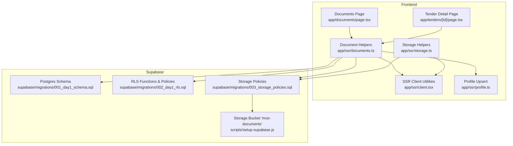
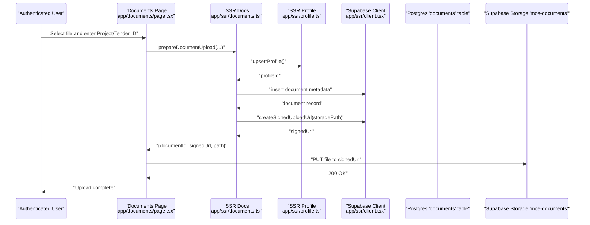
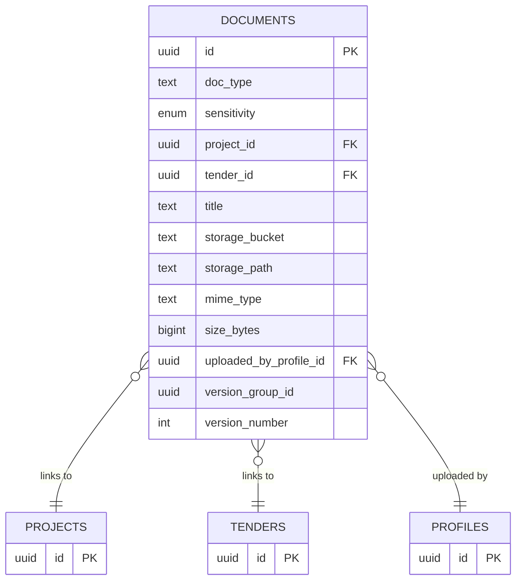
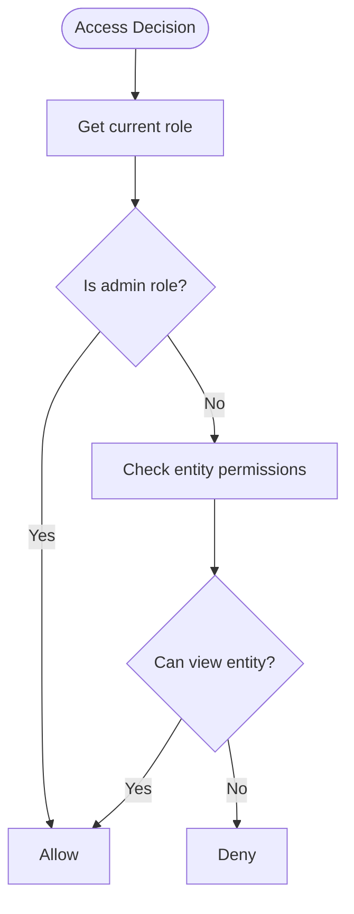
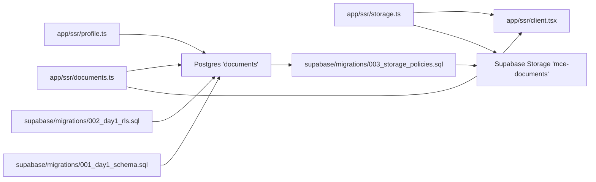

# Storage Policies

<cite>
**Referenced Files in This Document**
- [001_day1_schema.sql](file://supabase/migrations/001_day1_schema.sql)
- [002_day1_rls.sql](file://supabase/migrations/002_day1_rls.sql)
- [003_storage_policies.sql](file://supabase/migrations/003_storage_policies.sql)
- [setup-supabase.js](file://scripts/setup-supabase.js)
- [README.md](file://README.md)
- [client.tsx](file://app/ssr/client.tsx)
- [profile.ts](file://app/ssr/profile.ts)
- [storage.ts](file://app/ssr/storage.ts)
- [documents.ts](file://app/ssr/documents.ts)
- [page.tsx](file://app/documents/page.tsx)
- [page.tsx](file://app/tenders/[id]/page.tsx)
</cite>

## Table of Contents
1. [Introduction](#introduction)
2. [Project Structure](#project-structure)
3. [Core Components](#core-components)
4. [Architecture Overview](#architecture-overview)
5. [Detailed Component Analysis](#detailed-component-analysis)
6. [Dependency Analysis](#dependency-analysis)
7. [Performance Considerations](#performance-considerations)
8. [Troubleshooting Guide](#troubleshooting-guide)
9. [Conclusion](#conclusion)

## Introduction
This document explains the Supabase Storage policies and access control mechanisms used by MCE Command Center. It focuses on how bucket-level and object-level policies govern document access and manipulation, how storage path restrictions and validations are enforced, and how database records relate to storage objects. It also provides practical guidance for maintaining policies, troubleshooting access issues, and optimizing performance for large file operations.

## Project Structure
The storage system spans:
- Supabase Postgres schema and Row Level Security (RLS) policies
- Supabase Storage bucket configuration and policies
- Frontend and SSR utilities that create signed URLs and enforce access rules
- Frontend pages that demonstrate upload and download flows

**Diagram sources**
- [page.tsx](file://app/documents/page.tsx#L1-L90)
- [page.tsx](file://app/tenders/[id]/page.tsx#L1-L130)
- [client.tsx](file://app/ssr/client.tsx#L1-L25)
- [profile.ts](file://app/ssr/profile.ts#L1-L31)
- [storage.ts](file://app/ssr/storage.ts#L1-L35)
- [documents.ts](file://app/ssr/documents.ts#L1-L114)
- [001_day1_schema.sql](file://supabase/migrations/001_day1_schema.sql#L164-L180)
- [002_day1_rls.sql](file://supabase/migrations/002_day1_rls.sql#L29-L113)
- [003_storage_policies.sql](file://supabase/migrations/003_storage_policies.sql#L1-L55)
- [setup-supabase.js](file://scripts/setup-supabase.js#L60-L76)

**Section sources**
- [README.md](file://README.md#L42-L62)
- [001_day1_schema.sql](file://supabase/migrations/001_day1_schema.sql#L164-L180)
- [002_day1_rls.sql](file://supabase/migrations/002_day1_rls.sql#L29-L113)
- [003_storage_policies.sql](file://supabase/migrations/003_storage_policies.sql#L1-L55)
- [setup-supabase.js](file://scripts/setup-supabase.js#L60-L76)
- [client.tsx](file://app/ssr/client.tsx#L1-L25)
- [profile.ts](file://app/ssr/profile.ts#L1-L31)
- [storage.ts](file://app/ssr/storage.ts#L1-L35)
- [documents.ts](file://app/ssr/documents.ts#L1-L114)
- [page.tsx](file://app/documents/page.tsx#L1-L90)
- [page.tsx](file://app/tenders/[id]/page.tsx#L1-L130)

## Core Components
- Storage bucket: private bucket named mce-documents configured with size limits and allowed MIME types.
- Database documents table: stores metadata linking to storage objects and to projects/tenders.
- Storage policies: enforce access control at the bucket and object levels.
- SSR helpers: create signed URLs and ensure a profile exists before storage operations.
- Frontend pages: demonstrate upload and download flows.

**Section sources**
- [setup-supabase.js](file://scripts/setup-supabase.js#L60-L76)
- [001_day1_schema.sql](file://supabase/migrations/001_day1_schema.sql#L164-L180)
- [003_storage_policies.sql](file://supabase/migrations/003_storage_policies.sql#L1-L55)
- [documents.ts](file://app/ssr/documents.ts#L1-L114)
- [storage.ts](file://app/ssr/storage.ts#L1-L35)
- [page.tsx](file://app/documents/page.tsx#L1-L90)

## Architecture Overview
The storage architecture enforces strict access control by tying storage operations to database records and user roles. The flow below shows how uploads and downloads are orchestrated.

**Diagram sources**
- [page.tsx](file://app/documents/page.tsx#L12-L36)
- [documents.ts](file://app/ssr/documents.ts#L11-L86)
- [profile.ts](file://app/ssr/profile.ts#L6-L30)
- [client.tsx](file://app/ssr/client.tsx#L4-L14)
- [001_day1_schema.sql](file://supabase/migrations/001_day1_schema.sql#L164-L180)
- [003_storage_policies.sql](file://supabase/migrations/003_storage_policies.sql#L22-L39)

## Detailed Component Analysis

### Storage Bucket Configuration
- Bucket name: mce-documents
- Visibility: private
- Size limit: 10 MB
- Allowed MIME types: PDF, PNG, JPEG

These constraints are enforced by the bucket configuration script and complement the storage policies.

**Section sources**
- [setup-supabase.js](file://scripts/setup-supabase.js#L60-L76)

### Database Schema and Metadata Model
The documents table stores:
- Entity linkage: project_id or tender_id (mutually exclusive constraint)
- Storage identifiers: storage_bucket and storage_path
- Upload metadata: mime_type, size_bytes, uploaded_by_profile_id
- Sensitivity: confidential or restricted
- Versioning: version_group_id and version_number

**Diagram sources**
- [001_day1_schema.sql](file://supabase/migrations/001_day1_schema.sql#L164-L180)

**Section sources**
- [001_day1_schema.sql](file://supabase/migrations/001_day1_schema.sql#L164-L180)

### Storage Path Organization and Naming Conventions
- Paths are prefixed by entity type:
  - projects/{projectId}/...
  - tenders/{tenderId}/...
- Each file name is sanitized and prefixed with a timestamp to ensure uniqueness and ordering.
- The storage path is stored alongside the document metadata.

**Section sources**
- [documents.ts](file://app/ssr/documents.ts#L30-L34)

### Access Control Functions and Roles
Access decisions rely on helper functions that resolve the current user’s profile and role, and on capability checks for projects and tenders.

**Diagram sources**
- [002_day1_rls.sql](file://supabase/migrations/002_day1_rls.sql#L29-L113)

**Section sources**
- [002_day1_rls.sql](file://supabase/migrations/002_day1_rls.sql#L29-L113)

### Bucket-Level Policy: storage_documents_select
- Principal: authenticated users
- Scope: objects in bucket mce-documents
- Condition: a corresponding document record exists and the user satisfies one of:
  - Is admin role
  - Has view permission for the linked project
  - Has view permission for the linked tender

**Section sources**
- [003_storage_policies.sql](file://supabase/migrations/003_storage_policies.sql#L3-L20)

### Bucket-Level Policy: storage_documents_insert
- Principal: authenticated users
- Scope: objects in bucket mce-documents
- Constraint: a corresponding document record exists and:
  - The storage path matches the record’s storage_path
  - The uploader’s profile id equals the record’s uploaded_by_profile_id
  - The user has edit permission for the linked project or tender

**Section sources**
- [003_storage_policies.sql](file://supabase/migrations/003_storage_policies.sql#L22-L39)

### Bucket-Level Policy: storage_documents_delete
- Principal: authenticated users
- Scope: objects in bucket mce-documents
- Condition: a corresponding document record exists and the user is admin role

**Section sources**
- [003_storage_policies.sql](file://supabase/migrations/003_storage_policies.sql#L41-L54)

### Object-Level Policy: storage_objects_select
- Principal: authenticated users
- Scope: all objects
- Condition: bucket_id = mce-documents AND the user satisfies the same conditions as bucket-level select

**Section sources**
- [003_storage_policies.sql](file://supabase/migrations/003_storage_policies.sql#L3-L20)

### Object-Level Policy: storage_objects_insert
- Principal: authenticated users
- Scope: all objects
- Constraint: bucket_id = mce-documents AND the user satisfies the same conditions as bucket-level insert

**Section sources**
- [003_storage_policies.sql](file://supabase/migrations/003_storage_policies.sql#L22-L39)

### Object-Level Policy: storage_objects_delete
- Principal: authenticated users
- Scope: all objects
- Condition: bucket_id = mce-documents AND the user satisfies the same conditions as bucket-level delete

**Section sources**
- [003_storage_policies.sql](file://supabase/migrations/003_storage_policies.sql#L41-L54)

### Upload Workflow and Policy Expressions
- Pre-upload: the app inserts a document metadata record with storage_bucket and storage_path, sets uploaded_by_profile_id, and links to a project or tender.
- Signed upload URL creation: the app requests a signed URL for the storage path in the mce-documents bucket.
- Upload: the client performs a PUT to the signed URL; the bucket enforces size and MIME-type limits.
- Post-upload: the app triggers extraction jobs and writes audit logs.

Policy expressions for upload:
- Bucket-level insert policy requires:
  - bucket_id = 'mce-documents'
  - existence of a document record with matching storage_bucket, storage_path, and uploaded_by_profile_id
  - the user has edit permission for the linked project or tender

**Section sources**
- [documents.ts](file://app/ssr/documents.ts#L36-L51)
- [documents.ts](file://app/ssr/documents.ts#L57-L59)
- [setup-supabase.js](file://scripts/setup-supabase.js#L60-L76)
- [003_storage_policies.sql](file://supabase/migrations/003_storage_policies.sql#L22-L39)

### Download Workflow and Policy Expressions
- Pre-download: the app resolves a document record by document id, project id, or tender id and retrieves its storage_path.
- Signed download URL creation: the app requests a signed URL for the storage_path in the mce-documents bucket.
- Download: the client opens the signed URL; the bucket enforces size and MIME-type limits.
- Access control: the storage policy ensures the user has view permission for the linked project or tender.

Policy expressions for download:
- Bucket-level select policy requires:
  - bucket_id = 'mce-documents'
  - existence of a document record with matching storage_bucket and storage_path
  - the user satisfies one of:
    - Is admin role
    - Has view permission for the linked project
    - Has view permission for the linked tender

**Section sources**
- [documents.ts](file://app/ssr/documents.ts#L88-L102)
- [documents.ts](file://app/ssr/documents.ts#L104-L106)
- [003_storage_policies.sql](file://supabase/migrations/003_storage_policies.sql#L3-L20)

### Delete Workflow and Policy Expressions
- Deletion requires:
  - bucket_id = 'mce-documents'
  - existence of a document record with matching storage_bucket and storage_path
  - the user is admin role

**Section sources**
- [003_storage_policies.sql](file://supabase/migrations/003_storage_policies.sql#L41-L54)

### Relationship Between Database Records and Storage Objects
- Every stored object corresponds to a row in the documents table with:
  - storage_bucket = 'mce-documents'
  - storage_path equal to the object name
  - uploaded_by_profile_id equal to the profile id of the uploader
- The documents table links to either a project or a tender (mutually exclusive), enabling fine-grained access control.

**Section sources**
- [001_day1_schema.sql](file://supabase/migrations/001_day1_schema.sql#L164-L180)
- [003_storage_policies.sql](file://supabase/migrations/003_storage_policies.sql#L7-L20)

### Security Measures for Confidential and Restricted Documents
- Access is role-based:
  - Admin roles can bypass entity checks and perform deletions
  - Non-admin users must satisfy can_view_project/can_view_tender
- Entity linkage ensures that only authorized users can access documents linked to projects or tenders they belong to.
- Signed URLs are time-limited and scoped to the mce-documents bucket.

**Section sources**
- [002_day1_rls.sql](file://supabase/migrations/002_day1_rls.sql#L29-L113)
- [003_storage_policies.sql](file://supabase/migrations/003_storage_policies.sql#L3-L54)

### Metadata Management
- Document metadata includes:
  - doc_type, sensitivity, title
  - storage_bucket, storage_path, mime_type, size_bytes
  - uploaded_by_profile_id
  - version_group_id and version_number for versioning
- Extraction jobs are created automatically upon successful upload.

**Section sources**
- [001_day1_schema.sql](file://supabase/migrations/001_day1_schema.sql#L164-L180)
- [documents.ts](file://app/ssr/documents.ts#L66-L73)

## Dependency Analysis
The storage system depends on:
- Supabase Storage bucket configuration
- Postgres RLS functions and policies
- SSR helpers to create signed URLs and manage profiles
- Frontend pages to orchestrate uploads and downloads

**Diagram sources**
- [documents.ts](file://app/ssr/documents.ts#L1-L114)
- [profile.ts](file://app/ssr/profile.ts#L1-L31)
- [storage.ts](file://app/ssr/storage.ts#L1-L35)
- [client.tsx](file://app/ssr/client.tsx#L1-L25)
- [001_day1_schema.sql](file://supabase/migrations/001_day1_schema.sql#L164-L180)
- [002_day1_rls.sql](file://supabase/migrations/002_day1_rls.sql#L29-L113)
- [003_storage_policies.sql](file://supabase/migrations/003_storage_policies.sql#L1-L55)

**Section sources**
- [documents.ts](file://app/ssr/documents.ts#L1-L114)
- [storage.ts](file://app/ssr/storage.ts#L1-L35)
- [client.tsx](file://app/ssr/client.tsx#L1-L25)
- [001_day1_schema.sql](file://supabase/migrations/001_day1_schema.sql#L164-L180)
- [002_day1_rls.sql](file://supabase/migrations/002_day1_rls.sql#L29-L113)
- [003_storage_policies.sql](file://supabase/migrations/003_storage_policies.sql#L1-L55)

## Performance Considerations
- Signed URLs minimize server bandwidth and reduce latency for large file transfers.
- Bucket-level size limits prevent oversized uploads and protect downstream systems.
- Indexes on documents (project_id, tender_id) support efficient lookups during signed URL creation and access checks.
- For large files, consider chunked uploads and background processing (e.g., extraction jobs) to keep UI responsive.

[No sources needed since this section provides general guidance]

## Troubleshooting Guide
Common issues and resolutions:
- Build fails due to invalid Clerk key
  - Ensure NEXT_PUBLIC_CLERK_PUBLISHABLE_KEY is valid.
- RLS denied / empty data
  - Confirm the signed-in user has a profiles row and correct role assignment.
- Document upload fails
  - Verify bucket mce-documents exists and is private.
  - Confirm migrations were applied in order.
  - Ensure the document metadata row exists before upload (the app creates this).
- Signed URL fails
  - Verify storage policies in 003_storage_policies.sql.
  - Ensure the requesting user has access to the linked project/tender.

**Section sources**
- [README.md](file://README.md#L141-L157)

## Conclusion
MCE Command Center enforces robust access control by combining:
- Private storage buckets with size and MIME-type constraints
- Database-driven metadata linking storage objects to projects/tenders
- Role-based policies at both bucket and object levels
- Signed URLs for secure, time-limited access

This design ensures confidentiality and integrity for sensitive documents while providing a clear, maintainable model for uploads, downloads, and deletions.