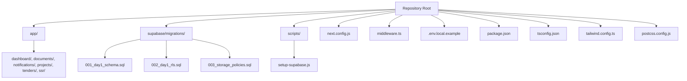
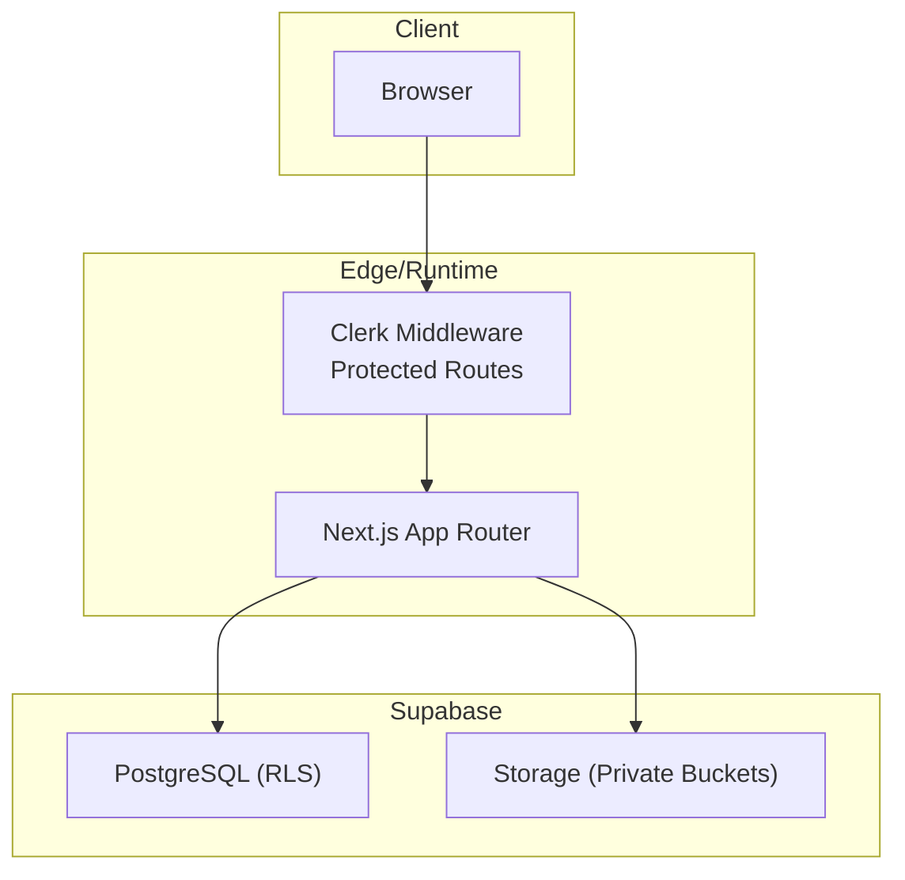
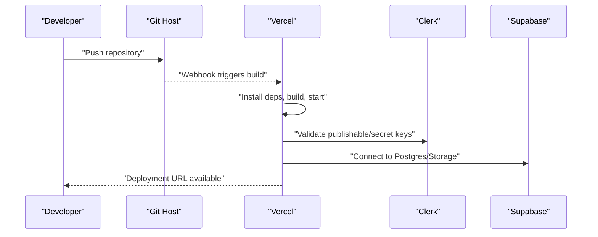
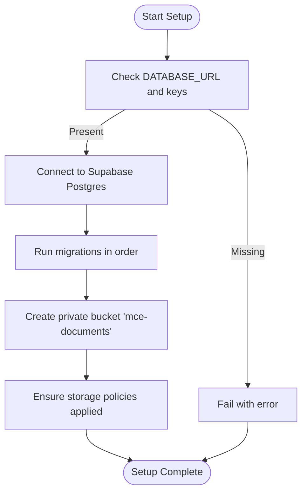
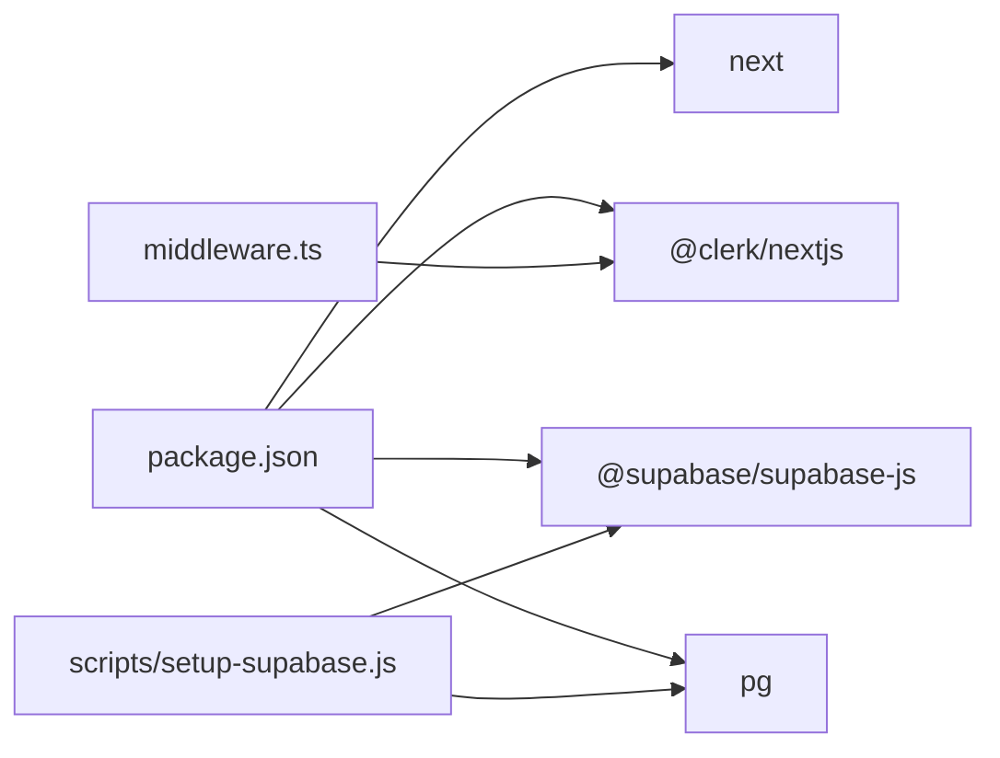

# Deployment and Production

<cite>
**Referenced Files in This Document**
- [README.md](file://README.md)
- [package.json](file://package.json)
- [next.config.js](file://next.config.js)
- [middleware.ts](file://middleware.ts)
- [.env.local.example](file://.env.local.example)
- [scripts/setup-supabase.js](file://scripts/setup-supabase.js)
- [supabase/migrations/001_day1_schema.sql](file://supabase/migrations/001_day1_schema.sql)
- [supabase/migrations/002_day1_rls.sql](file://supabase/migrations/002_day1_rls.sql)
- [supabase/migrations/003_storage_policies.sql](file://supabase/migrations/003_storage_policies.sql)
- [tsconfig.json](file://tsconfig.json)
- [tailwind.config.ts](file://tailwind.config.ts)
- [postcss.config.js](file://postcss.config.js)
</cite>

## Table of Contents
1. [Introduction](#introduction)
2. [Project Structure](#project-structure)
3. [Core Components](#core-components)
4. [Architecture Overview](#architecture-overview)
5. [Detailed Component Analysis](#detailed-component-analysis)
6. [Dependency Analysis](#dependency-analysis)
7. [Performance Considerations](#performance-considerations)
8. [Troubleshooting Guide](#troubleshooting-guide)
9. [Conclusion](#conclusion)
10. [Appendices](#appendices)

## Introduction
This document provides comprehensive deployment and production guidance for MCE Command Center. It covers Vercel deployment, environment variable management, production runtime requirements, database setup and migration, security hardening, monitoring and logging, scaling, and operational maintenance procedures. The guidance is grounded in the repository’s configuration and scripts to ensure accuracy and reproducibility.

## Project Structure
MCE Command Center is a Next.js 15 application using the App Router, Clerk for authentication, and Supabase for Postgres, Row Level Security (RLS), and Storage. The repository includes:
- Application pages and shared UI under app/
- Middleware for authentication enforcement
- Supabase migrations for schema, RLS, and storage policies
- A setup script to apply migrations and initialize storage
- Configuration files for Next.js, TypeScript, Tailwind CSS, and PostCSS

**Diagram sources**
- [README.md](file://README.md#L1-L158)
- [package.json](file://package.json#L1-L32)
- [next.config.js](file://next.config.js#L1-L7)
- [middleware.ts](file://middleware.ts#L1-L20)
- [.env.local.example](file://.env.local.example#L1-L11)
- [scripts/setup-supabase.js](file://scripts/setup-supabase.js#L1-L91)
- [supabase/migrations/001_day1_schema.sql](file://supabase/migrations/001_day1_schema.sql#L1-L227)
- [supabase/migrations/002_day1_rls.sql](file://supabase/migrations/002_day1_rls.sql#L1-L348)
- [supabase/migrations/003_storage_policies.sql](file://supabase/migrations/003_storage_policies.sql#L1-L55)
- [tsconfig.json](file://tsconfig.json#L1-L28)
- [tailwind.config.ts](file://tailwind.config.ts#L1-L20)
- [postcss.config.js](file://postcss.config.js#L1-L7)

**Section sources**
- [README.md](file://README.md#L1-L158)
- [package.json](file://package.json#L1-L32)
- [next.config.js](file://next.config.js#L1-L7)
- [middleware.ts](file://middleware.ts#L1-L20)
- [.env.local.example](file://.env.local.example#L1-L11)
- [scripts/setup-supabase.js](file://scripts/setup-supabase.js#L1-L91)
- [supabase/migrations/001_day1_schema.sql](file://supabase/migrations/001_day1_schema.sql#L1-L227)
- [supabase/migrations/002_day1_rls.sql](file://supabase/migrations/002_day1_rls.sql#L1-L348)
- [supabase/migrations/003_storage_policies.sql](file://supabase/migrations/003_storage_policies.sql#L1-L55)
- [tsconfig.json](file://tsconfig.json#L1-L28)
- [tailwind.config.ts](file://tailwind.config.ts#L1-L20)
- [postcss.config.js](file://postcss.config.js#L1-L7)

## Core Components
- Authentication and routing protection are handled by Clerk middleware, which enforces authentication for protected routes and redirects unauthenticated users to sign-in.
- Environment variables define Clerk keys, Supabase endpoints and service role key, and the application URL used for redirects and client-side configuration.
- Supabase migrations define the schema, RLS policies, and storage policies. A setup script applies migrations and initializes the private storage bucket.

Key production-relevant components:
- Authentication middleware and route matching
- Environment variable contract for Clerk and Supabase
- Supabase migration and storage initialization

**Section sources**
- [middleware.ts](file://middleware.ts#L1-L20)
- [.env.local.example](file://.env.local.example#L1-L11)
- [scripts/setup-supabase.js](file://scripts/setup-supabase.js#L1-L91)
- [supabase/migrations/001_day1_schema.sql](file://supabase/migrations/001_day1_schema.sql#L1-L227)
- [supabase/migrations/002_day1_rls.sql](file://supabase/migrations/002_day1_rls.sql#L1-L348)
- [supabase/migrations/003_storage_policies.sql](file://supabase/migrations/003_storage_policies.sql#L1-L55)

## Architecture Overview
The production architecture integrates Next.js serving, Clerk-managed authentication, and Supabase for data and storage. The middleware enforces authentication and redirects for non-public routes. Supabase handles RLS and storage policies to secure data access.

**Diagram sources**
- [middleware.ts](file://middleware.ts#L1-L20)
- [supabase/migrations/001_day1_schema.sql](file://supabase/migrations/001_day1_schema.sql#L1-L227)
- [supabase/migrations/002_day1_rls.sql](file://supabase/migrations/002_day1_rls.sql#L1-L348)
- [supabase/migrations/003_storage_policies.sql](file://supabase/migrations/003_storage_policies.sql#L1-L55)

## Detailed Component Analysis

### Vercel Deployment Process
- Repository setup: Push the repository to a Git host and import the project into Vercel.
- Environment variables: Configure the same environment variables used locally in Vercel’s project settings.
- Application URL: Set NEXT_PUBLIC_APP_URL to the Vercel deployment URL.
- Redirect URLs: Update Clerk allowed OAuth redirect URLs to include the Vercel domain.
- Database migrations: Apply the Supabase migrations in production after importing the project into Vercel.

Operational flow during deployment and runtime:

**Diagram sources**
- [README.md](file://README.md#L107-L114)
- [package.json](file://package.json#L5-L10)
- [middleware.ts](file://middleware.ts#L1-L20)
- [.env.local.example](file://.env.local.example#L1-L11)

**Section sources**
- [README.md](file://README.md#L107-L114)
- [package.json](file://package.json#L5-L10)
- [middleware.ts](file://middleware.ts#L1-L20)
- [.env.local.example](file://.env.local.example#L1-L11)

### Production Environment Requirements
- Node.js version: The project targets Next.js 15 and uses modern module resolution; align with a compatible Node.js LTS version suitable for Next.js 15.
- Memory allocation: Allocate sufficient memory for builds and runtime; typical Next.js applications require modest resources, but scale with concurrent requests and database queries.
- Performance optimization: Enable Next.js output tracing and production mode. Use caching and CDN features provided by Vercel.

**Section sources**
- [package.json](file://package.json#L11-L19)
- [next.config.js](file://next.config.js#L1-L7)
- [README.md](file://README.md#L18-L22)

### Environment Variable Management
- Contract: The application requires Clerk publishable and secret keys, Supabase public and service role keys, and the application URL.
- Secrets handling: Store Clerk secret key and Supabase service role key as encrypted environment variables in Vercel. Expose only the public keys to the client.
- Domain configuration: Set NEXT_PUBLIC_APP_URL to the production domain. Ensure Clerk allowed redirect URLs match the production domain.
- SSL certificate: Vercel provides automatic TLS termination; configure HTTPS at the edge and enforce HTTPS in Clerk.

**Section sources**
- [.env.local.example](file://.env.local.example#L1-L11)
- [README.md](file://README.md#L74-L91)
- [README.md](file://README.md#L107-L114)

### Database Deployment Considerations
- Supabase migrations: Apply migrations in order to create the schema, enable RLS, and configure storage policies.
- Storage initialization: Create a private bucket named mce-documents and ensure storage policies are applied.
- Backup strategies: Use Supabase’s built-in backup and point-in-time recovery; schedule regular backups and test restore procedures.
- Monitoring: Monitor database performance and query patterns; enable logs and alerts for anomalies.

**Diagram sources**
- [scripts/setup-supabase.js](file://scripts/setup-supabase.js#L7-L45)
- [scripts/setup-supabase.js](file://scripts/setup-supabase.js#L47-L77)
- [supabase/migrations/001_day1_schema.sql](file://supabase/migrations/001_day1_schema.sql#L1-L227)
- [supabase/migrations/002_day1_rls.sql](file://supabase/migrations/002_day1_rls.sql#L1-L348)
- [supabase/migrations/003_storage_policies.sql](file://supabase/migrations/003_storage_policies.sql#L1-L55)

**Section sources**
- [scripts/setup-supabase.js](file://scripts/setup-supabase.js#L1-L91)
- [supabase/migrations/001_day1_schema.sql](file://supabase/migrations/001_day1_schema.sql#L1-L227)
- [supabase/migrations/002_day1_rls.sql](file://supabase/migrations/002_day1_rls.sql#L1-L348)
- [supabase/migrations/003_storage_policies.sql](file://supabase/migrations/003_storage_policies.sql#L1-L55)

### Security Considerations
- HTTPS enforcement: Enforce HTTPS at the edge via Vercel and configure Clerk to use HTTPS redirect URLs.
- CORS configuration: Restrict origins in Clerk to the production domain; avoid wildcard origins.
- Security headers: Use Next.js headers configuration to set security headers (e.g., Content-Security-Policy, HSTS). Configure in middleware or Next.js headers.
- Authentication: Clerk middleware protects routes; ensure Clerk secret key is not exposed to the client.
- Data access: RLS policies and storage policies restrict access based on roles and relationships.

**Section sources**
- [middleware.ts](file://middleware.ts#L1-L20)
- [supabase/migrations/002_day1_rls.sql](file://supabase/migrations/002_day1_rls.sql#L1-L348)
- [supabase/migrations/003_storage_policies.sql](file://supabase/migrations/003_storage_policies.sql#L1-L55)
- [README.md](file://README.md#L107-L114)

### Monitoring and Logging
- Error tracking: Integrate an error tracking service (e.g., Sentry) in the Next.js app and middleware to capture runtime errors.
- Performance monitoring: Use Vercel’s analytics and external APM tools to monitor build and runtime performance.
- Audit logging: The application includes an audit log table; surface relevant events for operational visibility.

**Section sources**
- [supabase/migrations/001_day1_schema.sql](file://supabase/migrations/001_day1_schema.sql#L208-L216)

### Scaling, Load Balancing, and High Availability
- Horizontal scaling: Deploy multiple instances behind Vercel’s edge network; rely on stateless Next.js pages and centralized Supabase backend.
- Load balancing: Vercel handles global load distribution; ensure Clerk and Supabase are configured for high availability.
- Database considerations: Use Supabase’s managed Postgres and Storage; plan capacity and read replicas if needed.

**Section sources**
- [README.md](file://README.md#L107-L114)
- [supabase/migrations/001_day1_schema.sql](file://supabase/migrations/001_day1_schema.sql#L1-L227)

## Dependency Analysis
The application depends on Next.js, Clerk, and Supabase. Dependencies are declared in package.json. Middleware depends on Clerk server utilities. The setup script depends on Postgres and Supabase client libraries.

**Diagram sources**
- [package.json](file://package.json#L11-L19)
- [middleware.ts](file://middleware.ts#L1-L20)
- [scripts/setup-supabase.js](file://scripts/setup-supabase.js#L1-L5)

**Section sources**
- [package.json](file://package.json#L11-L19)
- [middleware.ts](file://middleware.ts#L1-L20)
- [scripts/setup-supabase.js](file://scripts/setup-supabase.js#L1-L5)

## Performance Considerations
- Build optimization: Use Next.js production build and output tracing to minimize bundle size.
- Runtime optimization: Keep Clerk and Supabase keys current; leverage caching and CDN features.
- Database tuning: Monitor slow queries and add indexes as needed; review RLS policies for performance impact.

**Section sources**
- [next.config.js](file://next.config.js#L1-L7)
- [supabase/migrations/001_day1_schema.sql](file://supabase/migrations/001_day1_schema.sql#L218-L226)

## Troubleshooting Guide
Common production issues and resolutions:
- Deployment failures: Verify Clerk keys and application URL; ensure environment variables are set in Vercel.
- Build failures: Confirm Clerk keys are valid; the build will fail without valid keys.
- RLS denied / empty data: Ensure the signed-in user has a profiles row and proper role assignment.
- Document upload failures: Verify the private bucket mce-documents exists and migrations are applied.
- Signed URL failures: Confirm storage policies and that the user has access to the linked project/tender.

**Section sources**
- [README.md](file://README.md#L141-L158)
- [scripts/setup-supabase.js](file://scripts/setup-supabase.js#L10-L14)
- [scripts/setup-supabase.js](file://scripts/setup-supabase.js#L53-L56)
- [supabase/migrations/003_storage_policies.sql](file://supabase/migrations/003_storage_policies.sql#L1-L55)

## Conclusion
MCE Command Center is designed for production with Clerk authentication, Supabase-backed RLS and storage, and a straightforward Vercel deployment path. By following the environment variable management, database migration, security, monitoring, and scaling recommendations in this document, teams can deploy and operate the application reliably and securely.

## Appendices

### Appendix A: Environment Variables Reference
- NEXT_PUBLIC_CLERK_PUBLISHABLE_KEY: Clerk publishable key for client-side SDK.
- CLERK_SECRET_KEY: Clerk secret key for server-side operations.
- NEXT_PUBLIC_SUPABASE_URL: Supabase project URL.
- NEXT_PUBLIC_SUPABASE_KEY: Supabase public/anon key.
- SUPABASE_SERVICE_ROLE_KEY: Supabase service role key for server-side admin operations.
- NEXT_PUBLIC_APP_URL: Application base URL used for redirects.

**Section sources**
- [.env.local.example](file://.env.local.example#L1-L11)

### Appendix B: Supabase Migration Order
- Apply migrations in the following order:
  1) Schema creation and indexes
  2) RLS functions and policies
  3) Storage policies

**Section sources**
- [supabase/migrations/001_day1_schema.sql](file://supabase/migrations/001_day1_schema.sql#L1-L227)
- [supabase/migrations/002_day1_rls.sql](file://supabase/migrations/002_day1_rls.sql#L1-L348)
- [supabase/migrations/003_storage_policies.sql](file://supabase/migrations/003_storage_policies.sql#L1-L55)