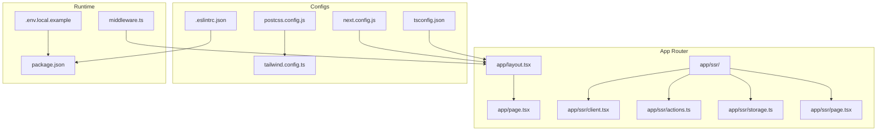
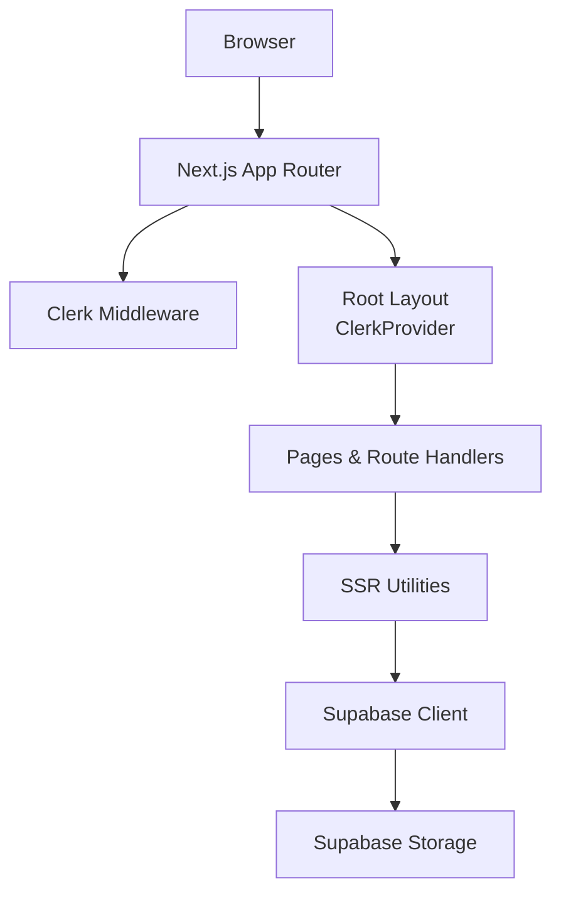
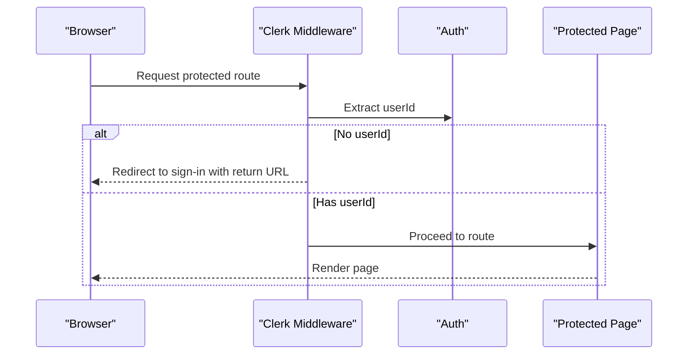
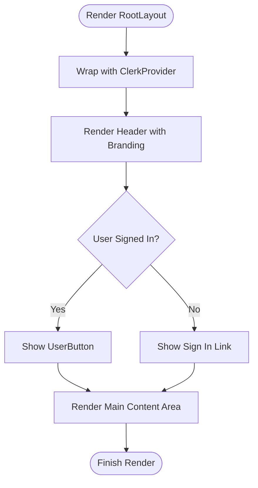
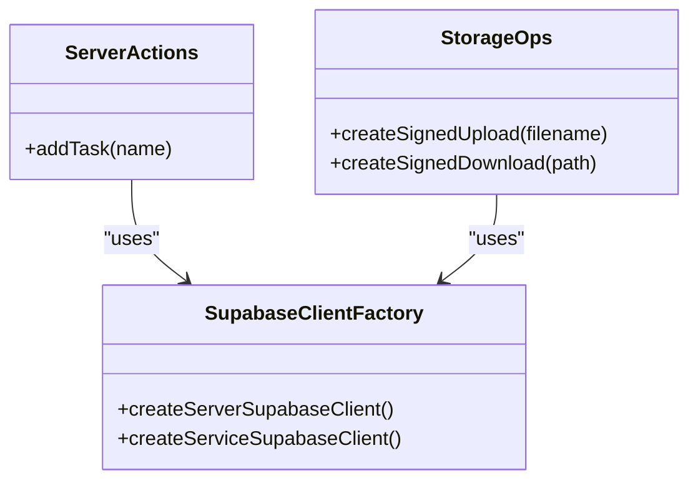
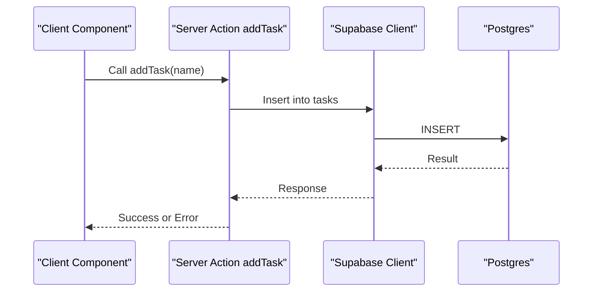
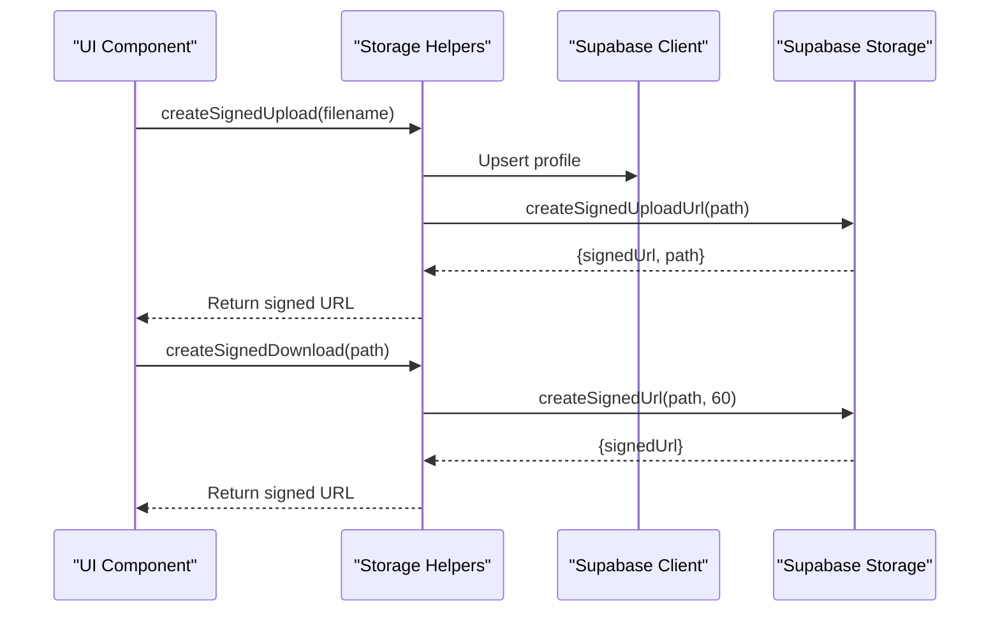
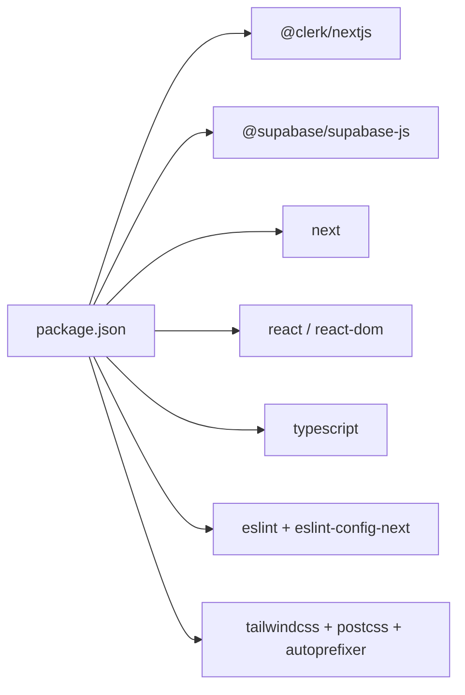

# Development Guide

<cite>
**Referenced Files in This Document**
- [README.md](file://README.md)
- [.env.local.example](file://.env.local.example)
- [package.json](file://package.json)
- [next.config.js](file://next.config.js)
- [tsconfig.json](file://tsconfig.json)
- [.eslintrc.json](file://.eslintrc.json)
- [tailwind.config.ts](file://tailwind.config.ts)
- [postcss.config.js](file://postcss.config.js)
- [middleware.ts](file://middleware.ts)
- [app/layout.tsx](file://app/layout.tsx)
- [app/page.tsx](file://app/page.tsx)
- [app/globals.css](file://app/globals.css)
- [app/ssr/client.tsx](file://app/ssr/client.tsx)
- [app/ssr/actions.ts](file://app/ssr/actions.ts)
- [app/ssr/storage.ts](file://app/ssr/storage.ts)
- [app/ssr/page.tsx](file://app/ssr/page.tsx)
</cite>

## Table of Contents
1. [Introduction](#introduction)
2. [Project Structure](#project-structure)
3. [Core Components](#core-components)
4. [Architecture Overview](#architecture-overview)
5. [Detailed Component Analysis](#detailed-component-analysis)
6. [Dependency Analysis](#dependency-analysis)
7. [Performance Considerations](#performance-considerations)
8. [Troubleshooting Guide](#troubleshooting-guide)
9. [Conclusion](#conclusion)
10. [Appendices](#appendices)

## Introduction
This guide provides end-to-end development documentation for MCE Command Center, a Next.js App Router application integrating authentication via Clerk and data/services via Supabase. It covers local setup, environment configuration, dependency installation, development server startup, build and linting, testing strategy, development workflow, debugging, performance profiling, contribution guidelines, IDE recommendations, troubleshooting, and production readiness.

## Project Structure
The project follows a Next.js App Router convention with a top-level app directory containing pages and route handlers, shared styles, and server-side rendering utilities under app/ssr. Configuration files define Next.js behavior, TypeScript compilation, ESLint rules, PostCSS/Tailwind CSS processing, and Clerk middleware routing.

**Diagram sources**
- [app/layout.tsx](file://app/layout.tsx#L1-L46)
- [app/page.tsx](file://app/page.tsx#L1-L29)
- [app/ssr/client.tsx](file://app/ssr/client.tsx#L1-L25)
- [app/ssr/actions.ts](file://app/ssr/actions.ts#L1-L19)
- [app/ssr/storage.ts](file://app/ssr/storage.ts#L1-L35)
- [app/ssr/page.tsx](file://app/ssr/page.tsx#L1-L29)
- [next.config.js](file://next.config.js#L1-L7)
- [tsconfig.json](file://tsconfig.json#L1-L28)
- [.eslintrc.json](file://.eslintrc.json#L1-L4)
- [postcss.config.js](file://postcss.config.js#L1-L7)
- [tailwind.config.ts](file://tailwind.config.ts#L1-L20)
- [middleware.ts](file://middleware.ts#L1-L20)
- [.env.local.example](file://.env.local.example#L1-L11)
- [package.json](file://package.json#L1-L32)

**Section sources**
- [README.md](file://README.md#L1-L158)
- [package.json](file://package.json#L1-L32)
- [next.config.js](file://next.config.js#L1-L7)
- [tsconfig.json](file://tsconfig.json#L1-L28)
- [.eslintrc.json](file://.eslintrc.json#L1-L4)
- [postcss.config.js](file://postcss.config.js#L1-L7)
- [tailwind.config.ts](file://tailwind.config.ts#L1-L20)
- [middleware.ts](file://middleware.ts#L1-L20)
- [app/layout.tsx](file://app/layout.tsx#L1-L46)
- [app/page.tsx](file://app/page.tsx#L1-L29)
- [app/globals.css](file://app/globals.css#L1-L4)
- [app/ssr/client.tsx](file://app/ssr/client.tsx#L1-L25)
- [app/ssr/actions.ts](file://app/ssr/actions.ts#L1-L19)
- [app/ssr/storage.ts](file://app/ssr/storage.ts#L1-L35)
- [app/ssr/page.tsx](file://app/ssr/page.tsx#L1-L29)
- [.env.local.example](file://.env.local.example#L1-L11)

## Core Components
- Authentication and routing protection are handled by Clerk middleware, enforcing sign-in for protected routes.
- The root layout wraps the app with Clerk provider and renders a global header with sign-in/sign-out controls.
- SSR utilities encapsulate Supabase client creation for server actions and storage operations, including signed URL generation for uploads/downloads.
- Styling is powered by Tailwind CSS via PostCSS, with global styles imported in the root layout.

Key responsibilities:
- Middleware: enforce authentication for non-public routes and configure matcher behavior.
- Layout: provide global UI shell and Clerk provider.
- SSR client: create authenticated Supabase clients for server-side operations.
- SSR actions: encapsulate database writes and logging.
- SSR storage: manage signed upload/download URLs for private storage.

**Section sources**
- [middleware.ts](file://middleware.ts#L1-L20)
- [app/layout.tsx](file://app/layout.tsx#L1-L46)
- [app/ssr/client.tsx](file://app/ssr/client.tsx#L1-L25)
- [app/ssr/actions.ts](file://app/ssr/actions.ts#L1-L19)
- [app/ssr/storage.ts](file://app/ssr/storage.ts#L1-L35)
- [app/globals.css](file://app/globals.css#L1-L4)

## Architecture Overview
The application uses Next.js App Router with server actions for data mutations and server components for data fetching. Clerk manages authentication and redirects, while Supabase provides database and storage capabilities. Tailwind CSS handles styling with PostCSS pipeline.

**Diagram sources**
- [middleware.ts](file://middleware.ts#L1-L20)
- [app/layout.tsx](file://app/layout.tsx#L1-L46)
- [app/ssr/client.tsx](file://app/ssr/client.tsx#L1-L25)
- [app/ssr/storage.ts](file://app/ssr/storage.ts#L1-L35)

## Detailed Component Analysis

### Authentication and Routing (Clerk Middleware)
- Public routes are whitelisted; all other routes require authentication.
- Non-authenticated requests are redirected to sign-in with return URL preserved.
- Matcher excludes static assets and API/trpc routes.

**Diagram sources**
- [middleware.ts](file://middleware.ts#L1-L20)

**Section sources**
- [middleware.ts](file://middleware.ts#L1-L20)

### Root Layout and Global UI Shell
- Wraps the app with ClerkProvider.
- Renders a responsive header with branding and sign-in/sign-out controls.
- Applies global Tailwind styles via app/globals.css.

**Diagram sources**
- [app/layout.tsx](file://app/layout.tsx#L1-L46)
- [app/globals.css](file://app/globals.css#L1-L4)

**Section sources**
- [app/layout.tsx](file://app/layout.tsx#L1-L46)
- [app/globals.css](file://app/globals.css#L1-L4)

### SSR Client and Supabase Integration
- Provides two client factories:
  - Authenticated client using Clerk JWT tokens for server actions.
  - Service client using service role key for privileged operations.
- Used by server actions and storage helpers.

**Diagram sources**
- [app/ssr/client.tsx](file://app/ssr/client.tsx#L1-L25)
- [app/ssr/actions.ts](file://app/ssr/actions.ts#L1-L19)
- [app/ssr/storage.ts](file://app/ssr/storage.ts#L1-L35)

**Section sources**
- [app/ssr/client.tsx](file://app/ssr/client.tsx#L1-L25)
- [app/ssr/actions.ts](file://app/ssr/actions.ts#L1-L19)
- [app/ssr/storage.ts](file://app/ssr/storage.ts#L1-L35)

### Server Actions Flow (Example: Add Task)
- Marked as "use server".
- Uses server Supabase client to insert a record.
- Logs outcomes and propagates errors.

**Diagram sources**
- [app/ssr/actions.ts](file://app/ssr/actions.ts#L1-L19)
- [app/ssr/client.tsx](file://app/ssr/client.tsx#L1-L25)

**Section sources**
- [app/ssr/actions.ts](file://app/ssr/actions.ts#L1-L19)
- [app/ssr/client.tsx](file://app/ssr/client.tsx#L1-L25)

### Storage Signed URL Flow (Upload/Download)
- Upsert profile to ensure user metadata exists.
- Create signed upload URL for private bucket.
- Create signed download URL with expiration.

**Diagram sources**
- [app/ssr/storage.ts](file://app/ssr/storage.ts#L1-L35)
- [app/ssr/client.tsx](file://app/ssr/client.tsx#L1-L25)

**Section sources**
- [app/ssr/storage.ts](file://app/ssr/storage.ts#L1-L35)
- [app/ssr/client.tsx](file://app/ssr/client.tsx#L1-L25)

## Dependency Analysis
- Runtime dependencies include Next.js, Clerk Next.js SDK, Supabase JS client, dotenv, pg, and React/ReactDOM.
- Dev dependencies include TypeScript, ESLint, Tailwind CSS, PostCSS, and related type packages.
- Scripts define dev, build, start, and lint commands.

**Diagram sources**
- [package.json](file://package.json#L1-L32)

**Section sources**
- [package.json](file://package.json#L1-L32)

## Performance Considerations
- Keep server actions scoped and focused to minimize round-trips.
- Use signed URLs for storage operations to avoid proxying large payloads through the server.
- Leverage Next.js incremental static regeneration and caching where appropriate.
- Monitor bundle sizes and remove unused Tailwind utilities to reduce CSS payload.
- Profile builds and server actions to identify bottlenecks.

[No sources needed since this section provides general guidance]

## Troubleshooting Guide
Common issues and resolutions:
- Build fails due to invalid Clerk keys: verify publishable and secret keys in environment configuration.
- RLS denied or empty data: confirm the signed-in user has a profiles row and proper role assignment.
- Document upload fails: ensure the private bucket exists, migrations are applied, and document metadata exists before upload.
- Signed URL fails: verify storage policies and user access to the associated project/tender.

Environment variables to configure:
- NEXT_PUBLIC_CLERK_PUBLISHABLE_KEY
- CLERK_SECRET_KEY
- NEXT_PUBLIC_SUPABASE_URL
- NEXT_PUBLIC_SUPABASE_KEY
- SUPABASE_SERVICE_ROLE_KEY
- NEXT_PUBLIC_APP_URL
- NEXT_PUBLIC_CLERK_SIGN_IN_URL
- NEXT_PUBLIC_CLERK_SIGN_UP_URL
- NEXT_PUBLIC_CLERK_AFTER_SIGN_IN_URL
- NEXT_PUBLIC_CLERK_AFTER_SIGN_UP_URL

**Section sources**
- [README.md](file://README.md#L141-L158)
- [.env.local.example](file://.env.local.example#L1-L11)

## Conclusion
MCE Command Center integrates Clerk for authentication and Supabase for data and storage within a modern Next.js App Router architecture. Following the setup and configuration steps outlined here will enable a smooth local development experience, robust linting and build processes, and reliable production deployment.

[No sources needed since this section summarizes without analyzing specific files]

## Appendices

### Local Development Setup
- Install dependencies and copy environment template:
  - Install dependencies.
  - Copy the environment template to .env.local and fill in values.
- Apply Supabase migrations in order.
- Start the development server.

**Section sources**
- [README.md](file://README.md#L24-L41)
- [README.md](file://README.md#L42-L62)

### Build and Lint
- Lint: runs ESLint with Next.js recommended rules.
- Build: compiles the Next.js application.

**Section sources**
- [README.md](file://README.md#L98-L106)
- [package.json](file://package.json#L5-L10)
- [.eslintrc.json](file://.eslintrc.json#L1-L4)

### Testing Strategy
- Unit tests: test server actions and utility functions in isolation.
- Integration tests: verify server action flows against Supabase using a test database and controlled environment.
- End-to-end tests: validate user journeys (authentication, CRUD, storage) using a headless browser and test environment.

[No sources needed since this section provides general guidance]

### Development Workflow
- Code organization: feature-based under app/, with server actions and utilities under app/ssr/.
- Component architecture: functional components with hooks; server actions for mutations.
- State management: minimal client-side state; leverage Clerk for auth state and Supabase for data/state synchronization.

[No sources needed since this section provides general guidance]

### Debugging Techniques
- Use console logs in server actions and storage helpers for quick diagnostics.
- Inspect network tab for failed API calls or storage URL failures.
- Validate environment variables and migration application.
- Use Next.js dev server logs and browser developer tools.

[No sources needed since this section provides general guidance]

### Contribution Guidelines and Best Practices
- Follow ESLint rules and formatting standards.
- Keep server actions small and deterministic.
- Prefer signed URLs for storage operations.
- Add comments and type annotations for clarity.
- Keep environment secrets out of version control.

[No sources needed since this section provides general guidance]

### IDE Configuration Recommendations
- Enable TypeScript checking and ESLint integration.
- Configure Tailwind CSS IntelliSense for class completion.
- Set up environment variable support for .env.local.

[No sources needed since this section provides general guidance]

### Deployment Preparation and Production Readiness
- Ensure all environment variables are configured for the target platform.
- Confirm Clerk redirect URLs match the production domain.
- Apply Supabase migrations to the production database.
- Verify build succeeds and lint passes before deploying.

**Section sources**
- [README.md](file://README.md#L107-L118)