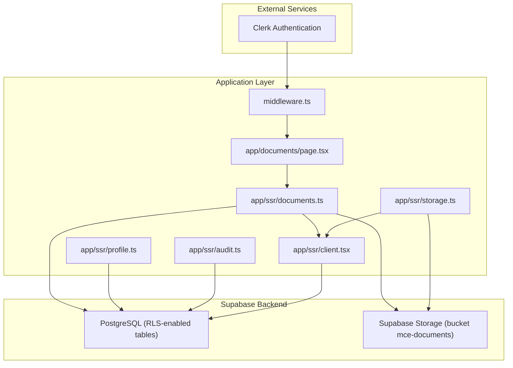
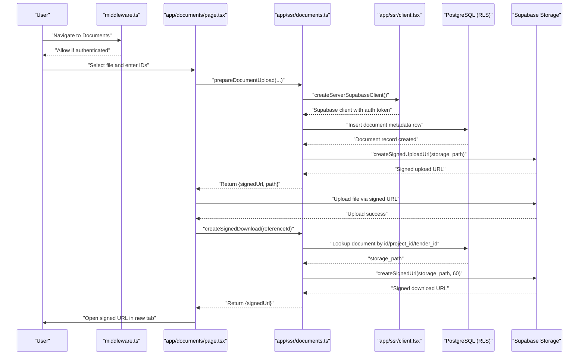
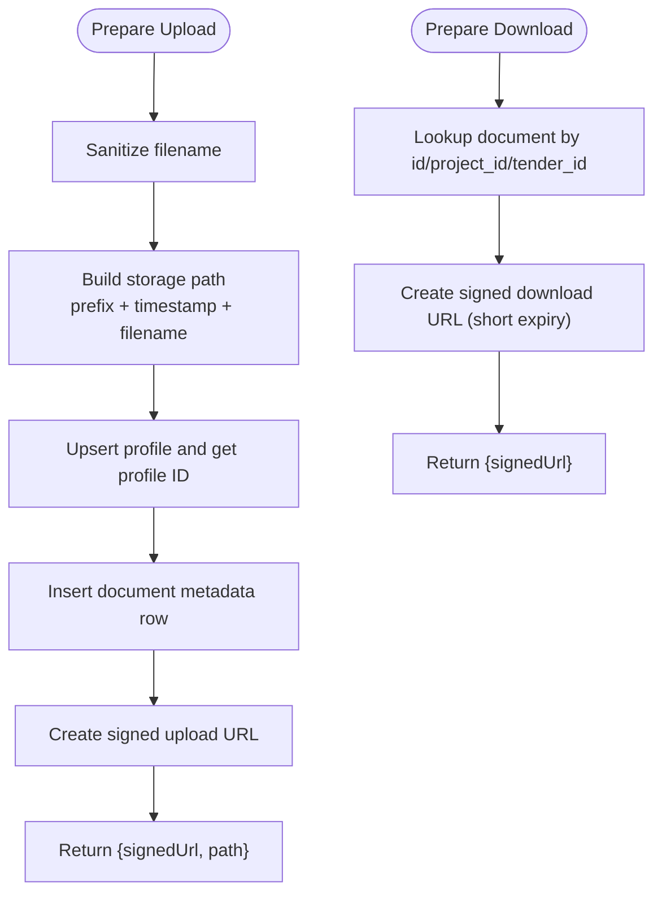
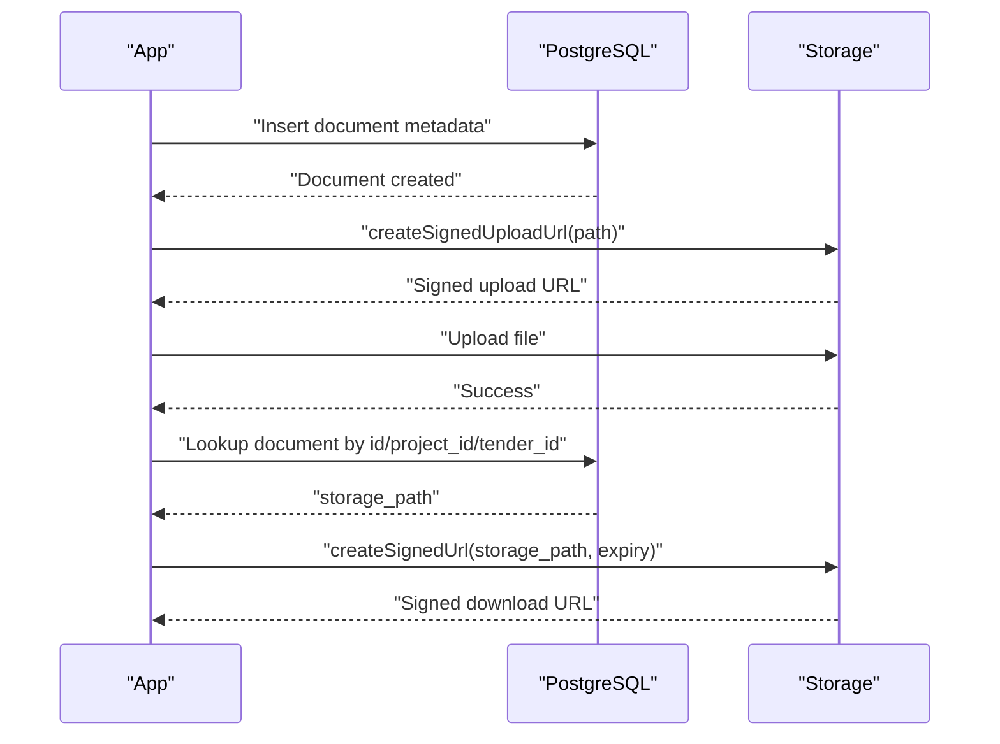
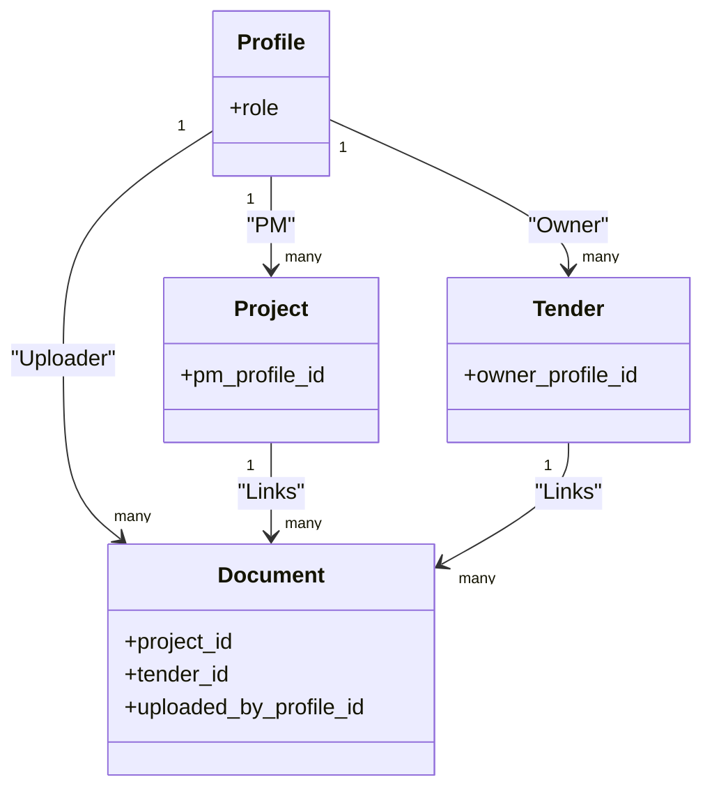
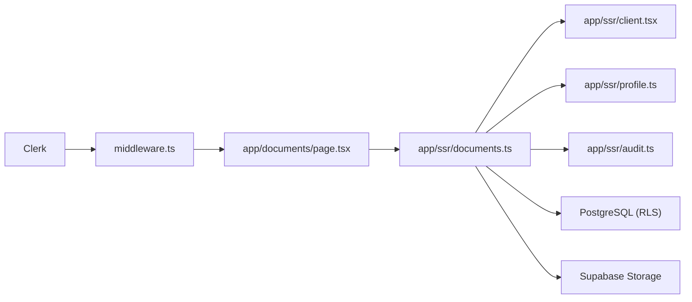

# Access Control and Security

<cite>
**Referenced Files in This Document**
- [001_day1_schema.sql](file://supabase/migrations/001_day1_schema.sql)
- [002_day1_rls.sql](file://supabase/migrations/002_day1_rls.sql)
- [003_storage_policies.sql](file://supabase/migrations/003_storage_policies.sql)
- [setup-supabase.js](file://scripts/setup-supabase.js)
- [client.tsx](file://app/ssr/client.tsx)
- [profile.ts](file://app/ssr/profile.ts)
- [storage.ts](file://app/ssr/storage.ts)
- [documents.ts](file://app/ssr/documents.ts)
- [audit.ts](file://app/ssr/audit.ts)
- [page.tsx](file://app/documents/page.tsx)
- [middleware.ts](file://middleware.ts)
- [README.md](file://README.md)
</cite>

## Table of Contents
1. [Introduction](#introduction)
2. [Project Structure](#project-structure)
3. [Core Components](#core-components)
4. [Architecture Overview](#architecture-overview)
5. [Detailed Component Analysis](#detailed-component-analysis)
6. [Dependency Analysis](#dependency-analysis)
7. [Performance Considerations](#performance-considerations)
8. [Troubleshooting Guide](#troubleshooting-guide)
9. [Conclusion](#conclusion)

## Introduction
This document explains the document access control and security mechanisms implemented in the system. It focuses on:
- Supabase Storage policies that restrict document access based on user roles and project/tender associations
- Row-level security (RLS) policies ensuring users can only access documents linked to projects or tenders they are authorized for
- Signed URL generation process and expiration mechanisms for secure document downloads
- Integration between document metadata and user permission systems
- Encryption at rest and in transit for document storage
- Security best practices for file naming, access logging, and compliance requirements
- Relationship between document access controls and the broader RBAC system

## Project Structure
The security model spans three main areas:
- Database schema and RLS policies (PostgreSQL)
- Supabase Storage policies
- Application-side helpers for signed URL creation and metadata management

**Diagram sources**
- [middleware.ts](file://middleware.ts#L1-L20)
- [page.tsx](file://app/documents/page.tsx#L1-L90)
- [documents.ts](file://app/ssr/documents.ts#L1-L114)
- [storage.ts](file://app/ssr/storage.ts#L1-L35)
- [client.tsx](file://app/ssr/client.tsx#L1-L25)
- [profile.ts](file://app/ssr/profile.ts#L1-L31)
- [audit.ts](file://app/ssr/audit.ts#L1-L29)

**Section sources**
- [README.md](file://README.md#L1-L158)

## Core Components
- Database schema defines document metadata and constraints, including foreign keys to projects and tenders, and a mandatory linkage constraint ensuring documents are associated with either a project or a tender.
- RLS functions and policies enforce role-based access to documents and related entities.
- Storage policies enforce access to objects stored under the designated bucket and tie access to document metadata.
- Application helpers manage signed URL creation and ensure metadata is created before uploads.

**Section sources**
- [001_day1_schema.sql](file://supabase/migrations/001_day1_schema.sql#L164-L180)
- [002_day1_rls.sql](file://supabase/migrations/002_day1_rls.sql#L259-L301)
- [003_storage_policies.sql](file://supabase/migrations/003_storage_policies.sql#L1-L55)
- [documents.ts](file://app/ssr/documents.ts#L11-L86)
- [storage.ts](file://app/ssr/storage.ts#L6-L34)

## Architecture Overview
The system enforces access control through a layered approach:
- Authentication via Clerk ensures only authenticated users reach protected routes.
- Application server-side functions create or validate document metadata and issue signed URLs.
- PostgreSQL RLS policies gate access to document rows and related entities.
- Supabase Storage policies gate access to actual object data and enforce bucket-level constraints.

**Diagram sources**
- [middleware.ts](file://middleware.ts#L1-L20)
- [page.tsx](file://app/documents/page.tsx#L12-L42)
- [documents.ts](file://app/ssr/documents.ts#L11-L113)
- [client.tsx](file://app/ssr/client.tsx#L4-L14)

## Detailed Component Analysis

### Database Schema and Constraints
- The documents table stores metadata including bucket name, storage path, MIME type, size, and foreign keys to projects and tenders. A constraint ensures that at least one of project_id or tender_id is present.
- Indexes are created on frequently queried columns to support efficient access checks.

Security implications:
- The constraint guarantees that every stored document is associated with a project or a tender, preventing orphaned objects.
- The bucket and path fields link storage objects to document records, enabling precise access control.

**Section sources**
- [001_day1_schema.sql](file://supabase/migrations/001_day1_schema.sql#L164-L180)
- [001_day1_schema.sql](file://supabase/migrations/001_day1_schema.sql#L223-L226)

### Row-Level Security Functions and Policies
- Helper functions derive the current user’s Clerk ID, profile ID, and role, and compute whether the user can view or edit specific projects or tenders.
- Policies on documents enforce that:
  - Select requires admin role OR access to the linked project OR access to the linked tender.
  - Insert requires edit rights on the linked project or tender and that the uploader matches the current profile.
  - Update/Delete mirror the edit permissions.

These functions and policies ensure that document visibility and mutability are tightly coupled to project/tender membership and role.

**Section sources**
- [002_day1_rls.sql](file://supabase/migrations/002_day1_rls.sql#L1-L27)
- [002_day1_rls.sql](file://supabase/migrations/002_day1_rls.sql#L37-L96)
- [002_day1_rls.sql](file://supabase/migrations/002_day1_rls.sql#L259-L301)

### Supabase Storage Policies
- Storage objects are RLS-enabled.
- Select policy allows authenticated users to access objects in the designated bucket if:
  - The object corresponds to a document record, and
  - The user has view access to the linked project or tender.
- Insert policy allows authenticated users to upload into the bucket if:
  - The object corresponds to a document record, and
  - The uploader’s profile ID matches the document’s uploader, and
  - The user has edit access to the linked project or tender.
- Delete policy allows deletion only for admins.

These policies ensure that:
- Only authenticated users can interact with storage.
- Access is strictly bound to document metadata and user permissions.
- Uploads are auditable and tied to the correct metadata.

**Section sources**
- [003_storage_policies.sql](file://supabase/migrations/003_storage_policies.sql#L1-L55)

### Signed URL Generation and Expiration
- Upload URLs are created server-side before the actual upload occurs. The path is constructed with a timestamp prefix and sanitized filename, then a signed upload URL is issued.
- Download URLs are created server-side with a short expiration (e.g., 60 seconds), ensuring temporary access.
- The application validates that the user has access to the target document before issuing a download URL.

**Diagram sources**
- [documents.ts](file://app/ssr/documents.ts#L11-L86)
- [storage.ts](file://app/ssr/storage.ts#L6-L34)

**Section sources**
- [documents.ts](file://app/ssr/documents.ts#L11-L113)
- [storage.ts](file://app/ssr/storage.ts#L6-L34)

### Integration Between Document Metadata and Permissions
- Before uploading, the application inserts a document metadata row with uploader identity and linkage to a project or tender.
- Uploads are only permitted if the uploader matches the metadata and the user has edit rights on the linked entity.
- Downloads are permitted only if the user has view rights on the linked entity.

**Diagram sources**
- [documents.ts](file://app/ssr/documents.ts#L36-L85)
- [003_storage_policies.sql](file://supabase/migrations/003_storage_policies.sql#L22-L39)

**Section sources**
- [documents.ts](file://app/ssr/documents.ts#L36-L85)
- [003_storage_policies.sql](file://supabase/migrations/003_storage_policies.sql#L22-L39)

### Encryption at Rest and in Transit
- Supabase Storage buckets are configured as private, preventing anonymous access.
- The setup script creates the bucket with size limits and allowed MIME types.
- Authentication and authorization are enforced by Clerk and Supabase RLS.
- The application obtains an access token from Clerk and passes it to Supabase, ensuring requests are authenticated.

Best practices:
- Use HTTPS for all network traffic.
- Store secrets securely and avoid exposing service role keys to the client.
- Limit allowed MIME types and enforce size limits at the bucket level.

**Section sources**
- [setup-supabase.js](file://scripts/setup-supabase.js#L60-L77)
- [client.tsx](file://app/ssr/client.tsx#L4-L14)
- [README.md](file://README.md#L56-L62)

### Security Best Practices for File Naming, Access Logging, and Compliance
- File naming:
  - Sanitize filenames to remove potentially problematic characters.
  - Use timestamp prefixes to reduce collisions and improve auditability.
- Access logging:
  - The application writes audit logs for upload actions, capturing entity type, ID, and metadata.
  - RLS policies prevent unauthorized reads/writes, and triggers enforce append-only semantics for sensitive tables.
- Compliance:
  - Enforce role-based access to sensitive documents.
  - Restrict allowed MIME types and sizes to mitigate risks.
  - Ensure bucket privacy and policy alignment with organizational data governance.

**Section sources**
- [documents.ts](file://app/ssr/documents.ts#L7-L9)
- [audit.ts](file://app/ssr/audit.ts#L6-L28)
- [002_day1_rls.sql](file://supabase/migrations/002_day1_rls.sql#L341-L347)
- [setup-supabase.js](file://scripts/setup-supabase.js#L60-L77)

### Relationship to the Broader RBAC System
- Roles are defined in the profiles table and used to compute admin privileges and edit/view rights.
- Functions like can_view_project and can_edit_project encapsulate access logic, which is reused in both document and storage policies.
- The RBAC model extends to tenders and project members, ensuring consistent enforcement across entities.

**Diagram sources**
- [001_day1_schema.sql](file://supabase/migrations/001_day1_schema.sql#L76-L84)
- [001_day1_schema.sql](file://supabase/migrations/001_day1_schema.sql#L95-L110)
- [001_day1_schema.sql](file://supabase/migrations/001_day1_schema.sql#L130-L144)
- [001_day1_schema.sql](file://supabase/migrations/001_day1_schema.sql#L164-L180)

**Section sources**
- [002_day1_rls.sql](file://supabase/migrations/002_day1_rls.sql#L19-L35)
- [002_day1_rls.sql](file://supabase/migrations/002_day1_rls.sql#L37-L113)

## Dependency Analysis
- Application depends on Clerk for authentication and Supabase for database and storage.
- Document operations depend on profile upsertion to establish the user’s identity in the database.
- Storage policies depend on document metadata to validate access.

**Diagram sources**
- [middleware.ts](file://middleware.ts#L1-L20)
- [page.tsx](file://app/documents/page.tsx#L1-L90)
- [documents.ts](file://app/ssr/documents.ts#L1-L114)
- [client.tsx](file://app/ssr/client.tsx#L1-L25)
- [profile.ts](file://app/ssr/profile.ts#L1-L31)
- [audit.ts](file://app/ssr/audit.ts#L1-L29)

**Section sources**
- [middleware.ts](file://middleware.ts#L1-L20)
- [documents.ts](file://app/ssr/documents.ts#L1-L114)
- [client.tsx](file://app/ssr/client.tsx#L1-L25)

## Performance Considerations
- Use indexes on frequently filtered columns (e.g., documents_project_idx, documents_tender_idx) to speed up access checks.
- Keep signed URL expirations short to minimize exposure windows.
- Limit allowed MIME types and enforce size limits to reduce storage overhead and scanning costs.

[No sources needed since this section provides general guidance]

## Troubleshooting Guide
Common issues and resolutions:
- Build fails due to invalid Clerk keys: verify environment variables are set correctly.
- RLS denied or empty data: confirm the user has a profiles row and appropriate role assignments.
- Document upload fails: verify the bucket exists, is private, and migrations are applied; ensure metadata is created before upload.
- Signed URL fails: verify storage policies and that the user has access to the linked project/tender.

**Section sources**
- [README.md](file://README.md#L141-L157)

## Conclusion
The system implements a robust, layered security model:
- Authentication via Clerk
- Role-based access control enforced by PostgreSQL RLS
- Storage access controlled by policies tied to document metadata
- Signed URLs with short expiration for secure transfers
- Audit logging for accountability

This design ensures that documents are accessible only to authorized users and that access is traceable and compliant with organizational policies.