# Document Management

<cite>
**Referenced Files in This Document**
- [README.md](file://README.md)
- [package.json](file://package.json)
- [scripts/setup-supabase.js](file://scripts/setup-supabase.js)
- [supabase/migrations/001_day1_schema.sql](file://supabase/migrations/001_day1_schema.sql)
- [supabase/migrations/002_day1_rls.sql](file://supabase/migrations/002_day1_rls.sql)
- [supabase/migrations/003_storage_policies.sql](file://supabase/migrations/003_storage_policies.sql)
- [app/ssr/client.tsx](file://app/ssr/client.tsx)
- [app/ssr/profile.ts](file://app/ssr/profile.ts)
- [app/ssr/audit.ts](file://app/ssr/audit.ts)
- [app/ssr/documents.ts](file://app/ssr/documents.ts)
- [app/ssr/storage.ts](file://app/ssr/storage.ts)
- [app/documents/page.tsx](file://app/documents/page.tsx)
- [app/projects/[id]/page.tsx](file://app/projects/[id]/page.tsx)
- [app/tenders/[id]/page.tsx](file://app/tenders/[id]/page.tsx)
- [app/dashboard/page.tsx](file://app/dashboard/page.tsx)
</cite>

## Table of Contents
1. [Introduction](#introduction)
2. [Project Structure](#project-structure)
3. [Core Components](#core-components)
4. [Architecture Overview](#architecture-overview)
5. [Detailed Component Analysis](#detailed-component-analysis)
6. [Dependency Analysis](#dependency-analysis)
7. [Performance Considerations](#performance-considerations)
8. [Troubleshooting Guide](#troubleshooting-guide)
9. [Conclusion](#conclusion)
10. [Appendices](#appendices)

## Introduction
This document describes the Document Management system built with Next.js App Router, Clerk for authentication, and Supabase for Postgres, Row Level Security (RLS), and Storage. It focuses on the end-to-end document lifecycle: upload, metadata creation, signed URL generation, secure storage integration, access control, audit logging, and retrieval. It also outlines search and retrieval patterns, integration with external document processing, and user interface components for uploading and listing documents. Practical workflows for contracts, drawings, and correspondence are included.

## Project Structure
The repository is organized around a Next.js App Router application with a dedicated SSR module for backend-like operations, Supabase migrations defining schema and policies, and a setup script to provision storage and apply migrations.

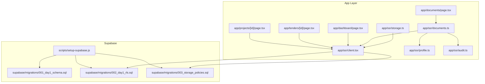

**Diagram sources**
- [app/documents/page.tsx](file://app/documents/page.tsx#L1-L90)
- [app/ssr/documents.ts](file://app/ssr/documents.ts#L1-L114)
- [app/ssr/storage.ts](file://app/ssr/storage.ts#L1-L35)
- [app/ssr/client.tsx](file://app/ssr/client.tsx#L1-L25)
- [app/ssr/profile.ts](file://app/ssr/profile.ts#L1-L31)
- [app/ssr/audit.ts](file://app/ssr/audit.ts#L1-L29)
- [scripts/setup-supabase.js](file://scripts/setup-supabase.js#L1-L91)
- [supabase/migrations/001_day1_schema.sql](file://supabase/migrations/001_day1_schema.sql#L164-L180)
- [supabase/migrations/002_day1_rls.sql](file://supabase/migrations/002_day1_rls.sql#L259-L301)
- [supabase/migrations/003_storage_policies.sql](file://supabase/migrations/003_storage_policies.sql#L1-L55)

**Section sources**
- [README.md](file://README.md#L1-L158)
- [package.json](file://package.json#L1-L32)

## Core Components
- Document upload orchestration: prepares metadata, creates a signed upload URL, triggers extraction, and writes audit logs.
- Signed URL utilities: generic helpers for uploads and downloads against the private bucket.
- Access control: database RLS policies and storage policies enforce project/tender-based permissions.
- Audit trail: centralized logging for document-related actions.
- UI surfaces: upload form and document listings integrated with SSR actions.

**Section sources**
- [app/ssr/documents.ts](file://app/ssr/documents.ts#L11-L86)
- [app/ssr/storage.ts](file://app/ssr/storage.ts#L6-L34)
- [app/ssr/audit.ts](file://app/ssr/audit.ts#L6-L28)
- [app/documents/page.tsx](file://app/documents/page.tsx#L6-L89)

## Architecture Overview
The system integrates Clerk for authentication and Supabase for data and storage. Authentication tokens are exchanged server-side to access Supabase with scoped privileges. Document metadata is written to the database before a signed upload URL is issued to the client. Storage access is governed by both database RLS and storage policies.

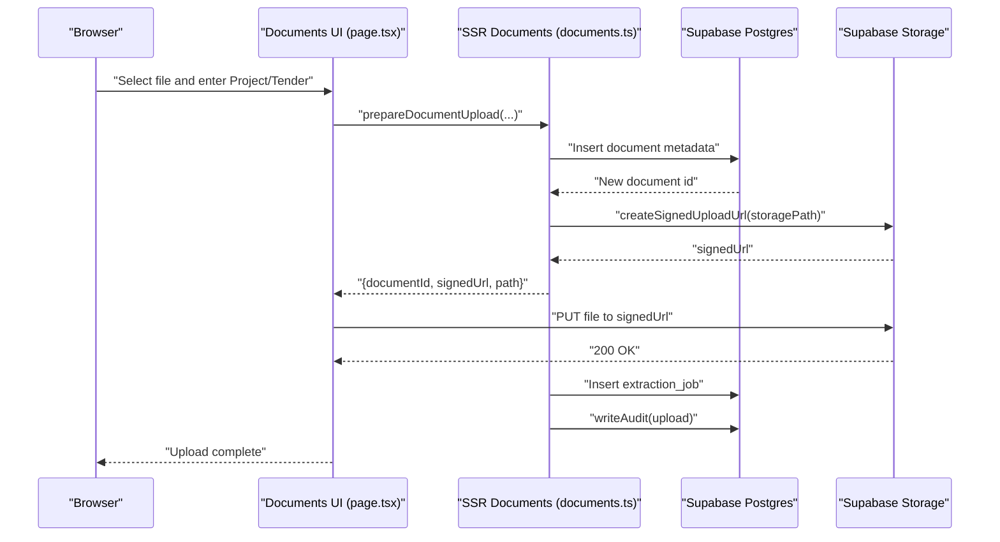

**Diagram sources**
- [app/documents/page.tsx](file://app/documents/page.tsx#L12-L36)
- [app/ssr/documents.ts](file://app/ssr/documents.ts#L11-L86)
- [app/ssr/storage.ts](file://app/ssr/storage.ts#L6-L20)

## Detailed Component Analysis

### Document Upload Workflow
- Metadata creation: the SSR function inserts a row into the documents table with project or tender linkage, sensitivity defaults, MIME type, size, and uploader profile.
- Signed URL generation: a pre-signed upload URL is generated for the bucket path; the client performs a direct PUT to Supabase Storage.
- Extraction job: an extraction job is created for downstream processing (e.g., metadata extraction).
- Audit logging: an audit event is recorded with contextual metadata.

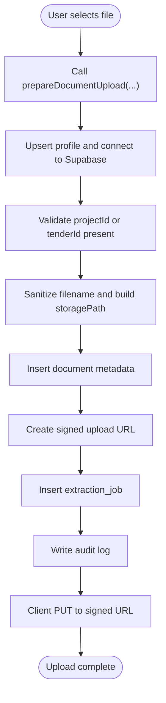

**Diagram sources**
- [app/ssr/documents.ts](file://app/ssr/documents.ts#L11-L86)
- [app/ssr/profile.ts](file://app/ssr/profile.ts#L6-L30)
- [app/ssr/audit.ts](file://app/ssr/audit.ts#L6-L28)
- [app/ssr/storage.ts](file://app/ssr/storage.ts#L6-L20)

**Section sources**
- [app/ssr/documents.ts](file://app/ssr/documents.ts#L11-L86)
- [app/ssr/storage.ts](file://app/ssr/storage.ts#L6-L20)
- [app/ssr/audit.ts](file://app/ssr/audit.ts#L6-L28)

### Access Control and Security
- Database RLS: policies on documents, profiles, tenders, and project members define who can select/update/delete based on roles and associations.
- Storage policies: storage.objects policies restrict select/insert/delete to authenticated users with appropriate project/tender permissions and ensure the storage path matches a valid document record.
- Private bucket: the bucket is configured private with size limits and allowed MIME types.

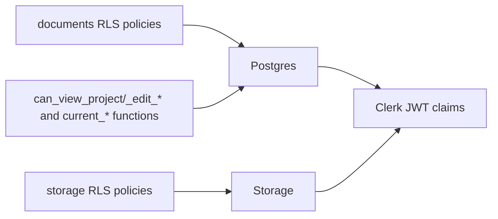

**Diagram sources**
- [supabase/migrations/002_day1_rls.sql](file://supabase/migrations/002_day1_rls.sql#L259-L301)
- [supabase/migrations/003_storage_policies.sql](file://supabase/migrations/003_storage_policies.sql#L1-L55)

**Section sources**
- [supabase/migrations/002_day1_rls.sql](file://supabase/migrations/002_day1_rls.sql#L259-L301)
- [supabase/migrations/003_storage_policies.sql](file://supabase/migrations/003_storage_policies.sql#L1-L55)

### Download Workflow and Signed URLs
- Signed download URL: the SSR function resolves a document by id, project_id, or tender_id, then generates a short-lived signed URL for retrieval.
- UI integration: the Documents page exposes a button to create a signed URL for a given project.

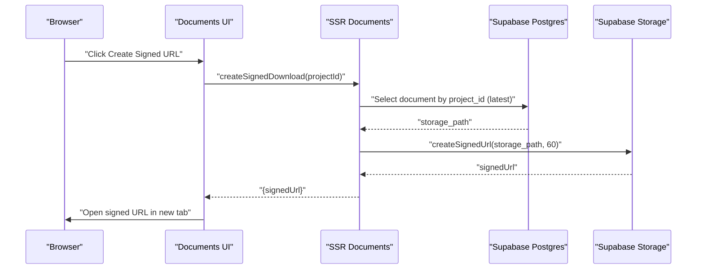

**Diagram sources**
- [app/documents/page.tsx](file://app/documents/page.tsx#L38-L42)
- [app/ssr/documents.ts](file://app/ssr/documents.ts#L88-L113)

**Section sources**
- [app/ssr/documents.ts](file://app/ssr/documents.ts#L88-L113)
- [app/documents/page.tsx](file://app/documents/page.tsx#L38-L42)

### Document Search and Retrieval
- Project context: project detail page lists recent documents linked to the project.
- Tender context: tender detail page lists documents linked to the tender.
- Filtering: queries filter by project_id or tender_id and sort by created_at.

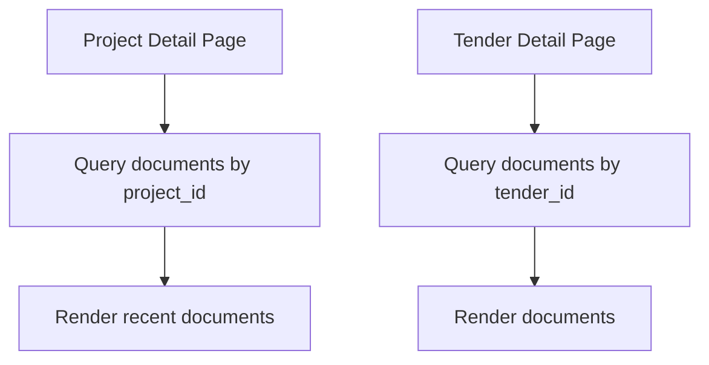

**Diagram sources**
- [app/projects/[id]/page.tsx](file://app/projects/[id]/page.tsx#L32-L36)
- [app/tenders/[id]/page.tsx](file://app/tenders/[id]/page.tsx#L35-L40)

**Section sources**
- [app/projects/[id]/page.tsx](file://app/projects/[id]/page.tsx#L32-L42)
- [app/tenders/[id]/page.tsx](file://app/tenders/[id]/page.tsx#L35-L40)

### Document Versioning and Audit Trail
- Versioning model: the documents table includes version_group_id and version_number, enabling grouping and numbering of document versions.
- Audit system: the audit_log table records actions (including upload) with actor, entity, and metadata for traceability.

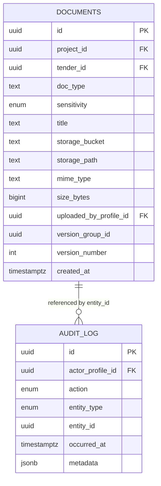

**Diagram sources**
- [supabase/migrations/001_day1_schema.sql](file://supabase/migrations/001_day1_schema.sql#L164-L180)
- [supabase/migrations/001_day1_schema.sql](file://supabase/migrations/001_day1_schema.sql#L208-L216)

**Section sources**
- [supabase/migrations/001_day1_schema.sql](file://supabase/migrations/001_day1_schema.sql#L164-L180)
- [supabase/migrations/001_day1_schema.sql](file://supabase/migrations/001_day1_schema.sql#L208-L216)
- [app/ssr/audit.ts](file://app/ssr/audit.ts#L6-L28)

### Storage Policies and Security Measures
- Bucket configuration: private bucket with size limit and allowed MIME types.
- Storage RLS: policies restrict access based on document ownership and project/tender permissions.
- Access restrictions: signed URLs are time-limited; storage operations require valid document metadata rows.

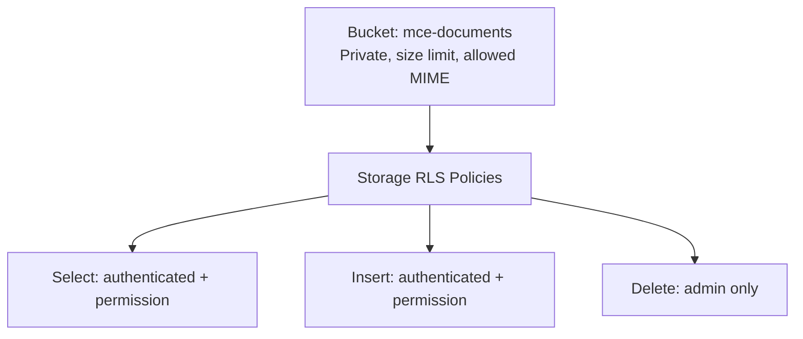

**Diagram sources**
- [scripts/setup-supabase.js](file://scripts/setup-supabase.js#L60-L76)
- [supabase/migrations/003_storage_policies.sql](file://supabase/migrations/003_storage_policies.sql#L1-L55)

**Section sources**
- [scripts/setup-supabase.js](file://scripts/setup-supabase.js#L47-L77)
- [supabase/migrations/003_storage_policies.sql](file://supabase/migrations/003_storage_policies.sql#L1-L55)

### Integration with External Document Processing
- Extraction jobs: after upload, an extraction job is inserted into the extraction_jobs table with job_type indicating whether it is a tender pack or document ingestion.
- Downstream processing: external systems can poll or react to extraction_jobs to extract metadata and enrich the document record.

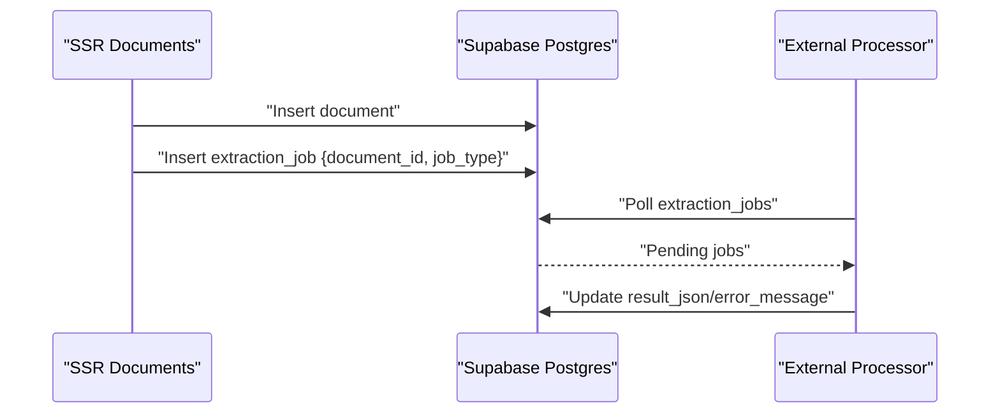

**Diagram sources**
- [app/ssr/documents.ts](file://app/ssr/documents.ts#L65-L73)
- [supabase/migrations/001_day1_schema.sql](file://supabase/migrations/001_day1_schema.sql#L182-L191)

**Section sources**
- [app/ssr/documents.ts](file://app/ssr/documents.ts#L65-L73)
- [supabase/migrations/001_day1_schema.sql](file://supabase/migrations/001_day1_schema.sql#L182-L191)

### User Interface Components
- Upload form: allows selecting a file, entering Project ID (required) and optional Tender ID, and initiating upload.
- Download helper: creates a signed URL for a given project to open the latest document.
- Document listings: project and tender pages render recent documents associated with the entity.

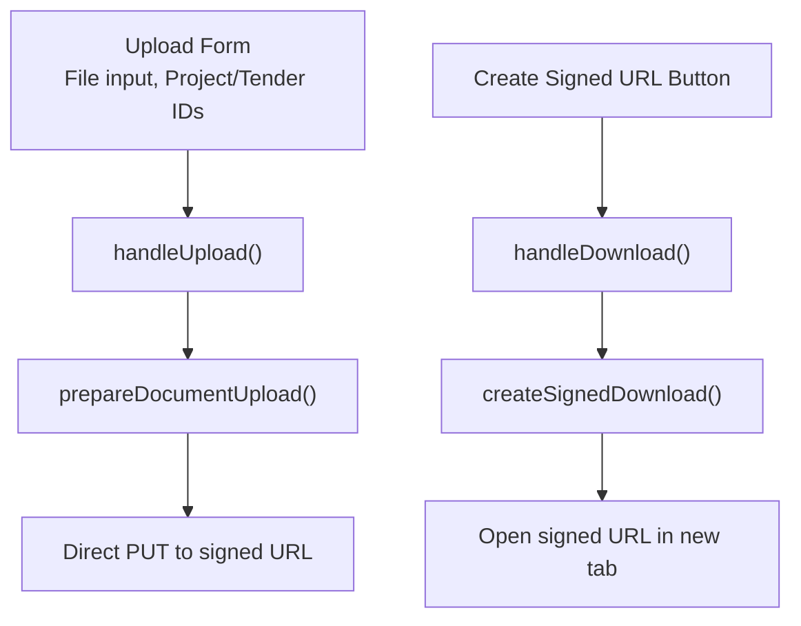

**Diagram sources**
- [app/documents/page.tsx](file://app/documents/page.tsx#L12-L42)

**Section sources**
- [app/documents/page.tsx](file://app/documents/page.tsx#L6-L89)
- [app/projects/[id]/page.tsx](file://app/projects/[id]/page.tsx#L118-L133)
- [app/tenders/[id]/page.tsx](file://app/tenders/[id]/page.tsx#L109-L125)

### Practical Workflows
- Contract uploads: select a project, choose a PDF, and upload; the system records metadata and initiates extraction.
- Drawing revisions: link to a project or tender, upload the revised drawing; versioning fields support revision tracking.
- Correspondence management: attach communications to tenders or projects; documents appear in respective listings.

[No sources needed since this section provides conceptual workflows]

## Dependency Analysis
The system relies on Clerk for authentication and Supabase for data and storage. The SSR modules encapsulate Supabase client creation and profile upsertion, while UI components coordinate with SSR functions to perform uploads and downloads.

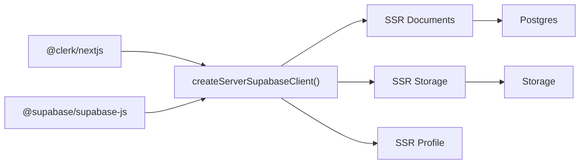

**Diagram sources**
- [app/ssr/client.tsx](file://app/ssr/client.tsx#L1-L25)
- [package.json](file://package.json#L11-L18)

**Section sources**
- [app/ssr/client.tsx](file://app/ssr/client.tsx#L1-L25)
- [package.json](file://package.json#L11-L18)

## Performance Considerations
- Signed URLs eliminate server bandwidth for large files.
- Parallel queries in UI pages reduce round trips when fetching related data.
- Indexes on documents and notifications improve retrieval performance.

[No sources needed since this section provides general guidance]

## Troubleshooting Guide
- Build fails due to invalid Clerk keys: verify environment variables and redirect URLs.
- RLS denied or empty data: confirm the signed-in user has a profiles row and proper role assignment.
- Document upload fails: verify the private bucket exists, migrations applied, and the document metadata row is created before upload.
- Signed URL fails: ensure storage policies are applied and the requesting user has access to the linked project/tender.

**Section sources**
- [README.md](file://README.md#L141-L158)

## Conclusion
The Document Management system provides a secure, auditable, and extensible foundation for managing project and tender-related documents. It leverages Clerk for authentication, Supabase RLS for fine-grained access control, and signed URLs for efficient, secure transfers. The schema supports versioning and the audit trail ensures accountability. UI components streamline common workflows, and the design accommodates future integrations with external processing systems.

[No sources needed since this section summarizes without analyzing specific files]

## Appendices

### Environment and Setup
- Supabase migrations and storage setup are automated via a script that applies schema, RLS, and storage policies, and creates the private bucket.

**Section sources**
- [scripts/setup-supabase.js](file://scripts/setup-supabase.js#L7-L45)
- [scripts/setup-supabase.js](file://scripts/setup-supabase.js#L47-L77)