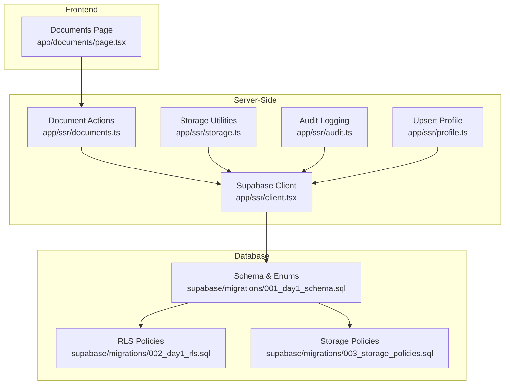
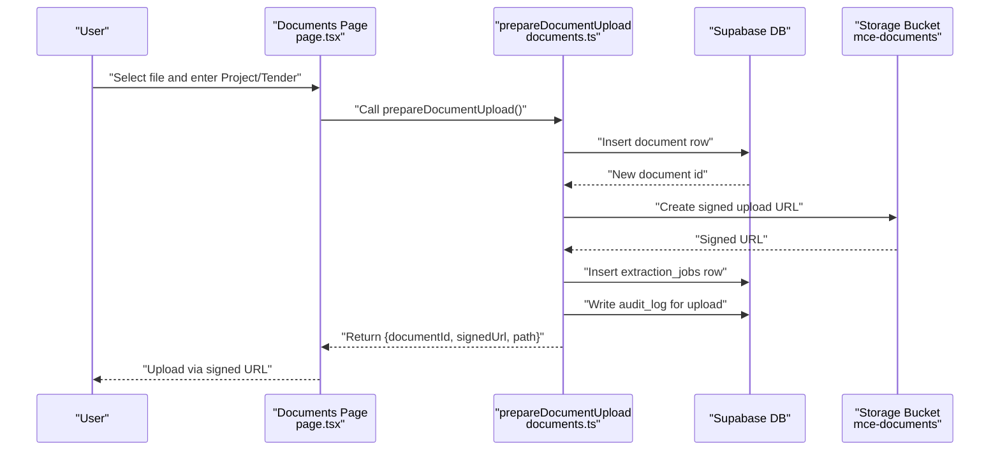
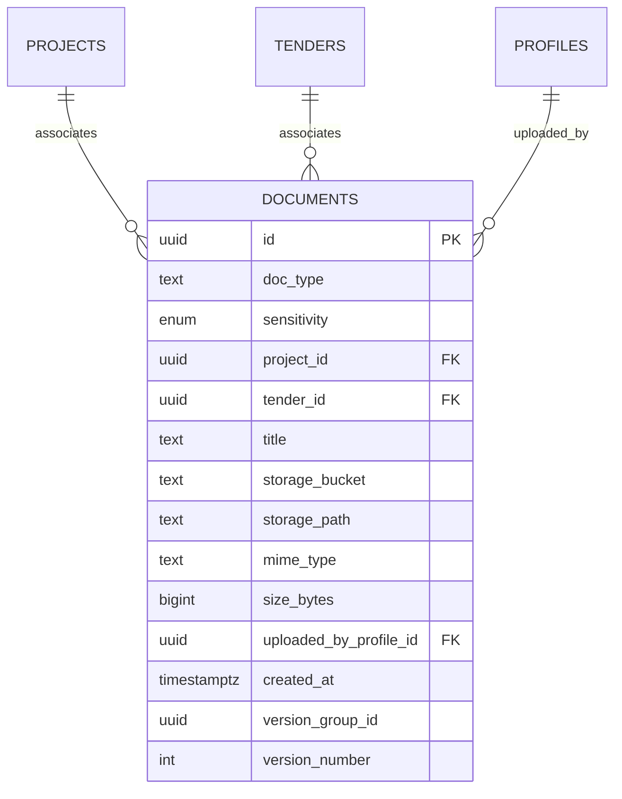
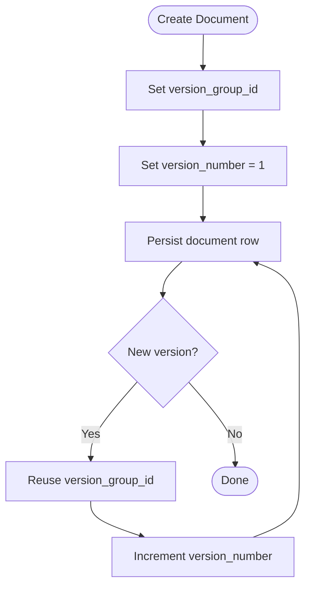
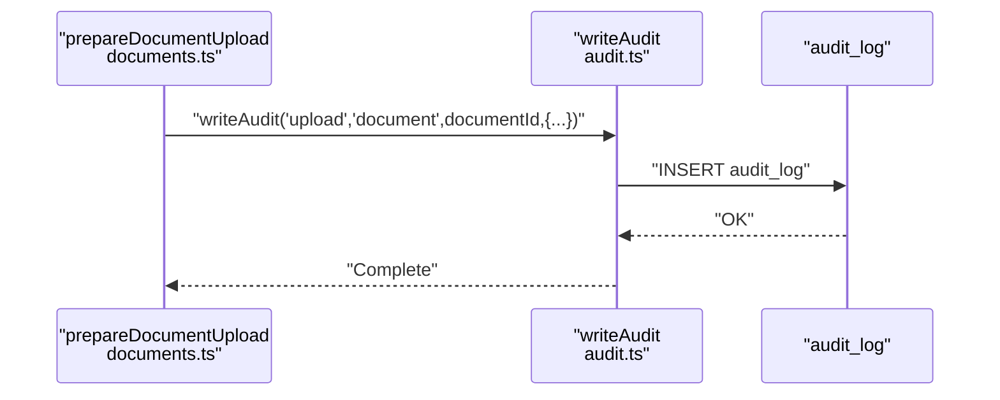
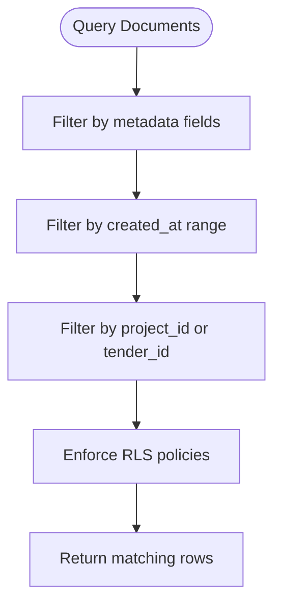
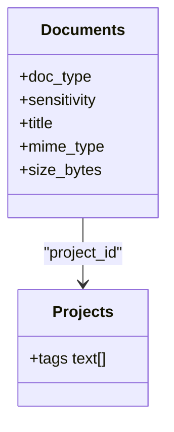
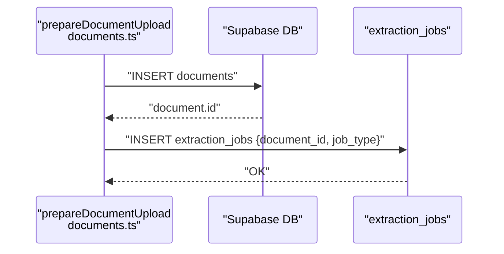
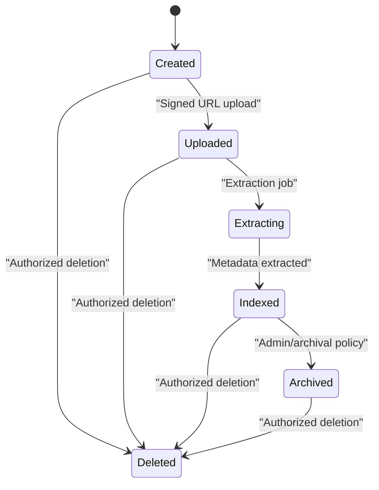
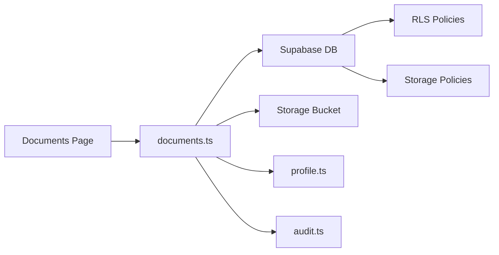

# Document Metadata and Versioning

<cite>
**Referenced Files in This Document**
- [README.md](file://README.md)
- [001_day1_schema.sql](file://supabase/migrations/001_day1_schema.sql)
- [002_day1_rls.sql](file://supabase/migrations/002_day1_rls.sql)
- [003_storage_policies.sql](file://supabase/migrations/003_storage_policies.sql)
- [client.tsx](file://app/ssr/client.tsx)
- [profile.ts](file://app/ssr/profile.ts)
- [audit.ts](file://app/ssr/audit.ts)
- [documents.ts](file://app/ssr/documents.ts)
- [storage.ts](file://app/ssr/storage.ts)
- [page.tsx](file://app/documents/page.tsx)
- [projects.ts](file://app/ssr/projects.ts)
- [tenders.ts](file://app/ssr/tenders.ts)
</cite>

## Table of Contents
1. [Introduction](#introduction)
2. [Project Structure](#project-structure)
3. [Core Components](#core-components)
4. [Architecture Overview](#architecture-overview)
5. [Detailed Component Analysis](#detailed-component-analysis)
6. [Dependency Analysis](#dependency-analysis)
7. [Performance Considerations](#performance-considerations)
8. [Troubleshooting Guide](#troubleshooting-guide)
9. [Conclusion](#conclusion)
10. [Appendices](#appendices)

## Introduction
This document explains how document metadata and version control are modeled and implemented in the system. It covers:
- The metadata schema for documents, including titles, descriptions, creation dates, and project/tender associations
- The document revision tracking system and how version history is maintained
- Audit trail integration for document changes and access logs
- Search and filtering capabilities by metadata fields, date ranges, and project associations
- Document categorization and tagging mechanisms
- Examples of metadata extraction for different document types and automated metadata processing workflows
- Lifecycle management from creation through archival and deletion

## Project Structure
The document management feature spans frontend pages and server-side modules:
- Frontend: Documents page for upload and download
- Backend: Document preparation, signed URL generation, storage utilities, and audit logging
- Database: Schema, Row Level Security (RLS), and storage policies

**Diagram sources**
- [page.tsx](file://app/documents/page.tsx#L1-L90)
- [client.tsx](file://app/ssr/client.tsx#L1-L25)
- [profile.ts](file://app/ssr/profile.ts#L1-L31)
- [documents.ts](file://app/ssr/documents.ts#L1-L114)
- [storage.ts](file://app/ssr/storage.ts#L1-L35)
- [audit.ts](file://app/ssr/audit.ts#L1-L29)
- [001_day1_schema.sql](file://supabase/migrations/001_day1_schema.sql#L1-L227)
- [002_day1_rls.sql](file://supabase/migrations/002_day1_rls.sql#L1-L348)
- [003_storage_policies.sql](file://supabase/migrations/003_storage_policies.sql#L1-L55)

**Section sources**
- [README.md](file://README.md#L1-L158)
- [page.tsx](file://app/documents/page.tsx#L1-L90)
- [client.tsx](file://app/ssr/client.tsx#L1-L25)
- [documents.ts](file://app/ssr/documents.ts#L1-L114)
- [storage.ts](file://app/ssr/storage.ts#L1-L35)
- [audit.ts](file://app/ssr/audit.ts#L1-L29)
- [001_day1_schema.sql](file://supabase/migrations/001_day1_schema.sql#L1-L227)
- [002_day1_rls.sql](file://supabase/migrations/002_day1_rls.sql#L1-L348)
- [003_storage_policies.sql](file://supabase/migrations/003_storage_policies.sql#L1-L55)

## Core Components
- Document metadata schema: The documents table defines fields for type, sensitivity, project/tender linkage, title, storage identifiers, MIME type, size, uploader, timestamps, and versioning fields.
- Versioning model: Documents include a version group identifier and a version number to track revisions.
- Extraction pipeline: A dedicated extraction_jobs table supports asynchronous metadata extraction workflows.
- Access control: RLS policies govern who can view, edit, and delete documents based on project/tender membership and roles.
- Storage policies: Storage bucket policies enforce access checks against the documents table.
- Audit trail: The audit_log table records actor, action, entity, and metadata for auditable events.

**Section sources**
- [001_day1_schema.sql](file://supabase/migrations/001_day1_schema.sql#L164-L191)
- [002_day1_rls.sql](file://supabase/migrations/002_day1_rls.sql#L259-L301)
- [003_storage_policies.sql](file://supabase/migrations/003_storage_policies.sql#L1-L55)
- [audit.ts](file://app/ssr/audit.ts#L1-L29)

## Architecture Overview
The document lifecycle integrates frontend interactions with server actions, database writes, storage operations, and audit logging.

**Diagram sources**
- [page.tsx](file://app/documents/page.tsx#L12-L36)
- [documents.ts](file://app/ssr/documents.ts#L11-L86)
- [audit.ts](file://app/ssr/audit.ts#L6-L28)
- [001_day1_schema.sql](file://supabase/migrations/001_day1_schema.sql#L164-L191)

## Detailed Component Analysis

### Metadata Schema
The documents table captures essential metadata:
- Identity and categorization: id, doc_type, sensitivity
- Association: project_id, tender_id
- Content: title, storage_bucket, storage_path, mime_type, size_bytes
- Provenance and versioning: uploaded_by_profile_id, created_at, version_group_id, version_number
- Constraints: At least one of project_id or tender_id must be present

**Diagram sources**
- [001_day1_schema.sql](file://supabase/migrations/001_day1_schema.sql#L164-L180)

**Section sources**
- [001_day1_schema.sql](file://supabase/migrations/001_day1_schema.sql#L164-L180)

### Version Control and Revision Tracking
- Version group: Documents share a version_group_id to group related versions.
- Version number: Tracks sequential revisions per group.
- Creation flow: The server action sets version_number to 1 during initial creation.
- Retrieval: Signed download resolves the most recent version by ordering by created_at descending and limiting to one.

**Diagram sources**
- [documents.ts](file://app/ssr/documents.ts#L36-L51)
- [001_day1_schema.sql](file://supabase/migrations/001_day1_schema.sql#L177-L178)

**Section sources**
- [documents.ts](file://app/ssr/documents.ts#L36-L51)
- [001_day1_schema.sql](file://supabase/migrations/001_day1_schema.sql#L177-L178)

### Audit Trail Integration
- Events logged: The system writes audit_log entries for document uploads and other auditable actions.
- Fields captured: actor_profile_id, action, entity_type, entity_id, and optional metadata (e.g., path, project/tender IDs).
- Append-only enforcement: Triggers prevent updates or deletes on sensitive audit_log rows.

**Diagram sources**
- [documents.ts](file://app/ssr/documents.ts#L75-L79)
- [audit.ts](file://app/ssr/audit.ts#L6-L28)
- [002_day1_rls.sql](file://supabase/migrations/002_day1_rls.sql#L345-L347)

**Section sources**
- [documents.ts](file://app/ssr/documents.ts#L75-L79)
- [audit.ts](file://app/ssr/audit.ts#L1-L29)
- [002_day1_rls.sql](file://supabase/migrations/002_day1_rls.sql#L345-L347)

### Search and Filtering Capabilities
- By metadata fields: Queries can filter by doc_type, sensitivity, title substring, MIME type, and size range.
- By date ranges: Filter by created_at timestamps for time-based reporting.
- By project association: Use project_id to scope documents to a project.
- By tender association: Use tender_id to scope documents to a tender.
- Access control: RLS ensures users only see documents they are authorized to view.

**Diagram sources**
- [001_day1_schema.sql](file://supabase/migrations/001_day1_schema.sql#L164-L180)
- [002_day1_rls.sql](file://supabase/migrations/002_day1_rls.sql#L259-L267)

**Section sources**
- [001_day1_schema.sql](file://supabase/migrations/001_day1_schema.sql#L164-L180)
- [002_day1_rls.sql](file://supabase/migrations/002_day1_rls.sql#L259-L267)

### Document Categorization and Tagging
- Categorization: doc_type field enables categorizing documents (e.g., contract, specification, correspondence).
- Sensitivity: sensitivity field classifies documents (e.g., confidential, restricted).
- Tags: Projects support a tags array for cross-project grouping and filtering.

**Diagram sources**
- [001_day1_schema.sql](file://supabase/migrations/001_day1_schema.sql#L164-L180)
- [001_day1_schema.sql](file://supabase/migrations/001_day1_schema.sql#L107)

**Section sources**
- [001_day1_schema.sql](file://supabase/migrations/001_day1_schema.sql#L164-L180)
- [001_day1_schema.sql](file://supabase/migrations/001_day1_schema.sql#L107)

### Metadata Extraction and Automated Workflows
- Extraction jobs: extraction_jobs tracks job_type (e.g., tender_pack, document_ingest), status, timestamps, and result_json.
- Triggered on upload: A job is inserted when preparing a document upload.
- Result storage: extraction_jobs.result_json stores extracted metadata for downstream processing.

**Diagram sources**
- [documents.ts](file://app/ssr/documents.ts#L65-L69)
- [001_day1_schema.sql](file://supabase/migrations/001_day1_schema.sql#L182-L191)

**Section sources**
- [documents.ts](file://app/ssr/documents.ts#L65-L69)
- [001_day1_schema.sql](file://supabase/migrations/001_day1_schema.sql#L182-L191)

### Document Lifecycle Management
- Creation: Upsert profile, insert document row, create signed upload URL, enqueue extraction job, write audit event.
- Retrieval: Signed download URL generated for retrieval; resolution prefers latest version by created_at.
- Archival: No explicit archival flag in the schema; lifecycle decisions can be implemented via status fields or external policies.
- Deletion: RLS allows deletions for admins or editors; storage deletion is governed by storage policies.

**Diagram sources**
- [documents.ts](file://app/ssr/documents.ts#L11-L86)
- [002_day1_rls.sql](file://supabase/migrations/002_day1_rls.sql#L294-L301)
- [003_storage_policies.sql](file://supabase/migrations/003_storage_policies.sql#L41-L54)

**Section sources**
- [documents.ts](file://app/ssr/documents.ts#L11-L86)
- [002_day1_rls.sql](file://supabase/migrations/002_day1_rls.sql#L294-L301)
- [003_storage_policies.sql](file://supabase/migrations/003_storage_policies.sql#L41-L54)

## Dependency Analysis
- Frontend-to-Backend: Documents page invokes server actions for upload and download.
- Backend-to-Database: Server actions use Supabase client with Clerk auth; RLS and storage policies protect data.
- Backend-to-Storage: Signed URLs enable secure uploads and downloads from the mce-documents bucket.
- Audit and Profiles: Profile upsert ensures actor identity; audit logging records events.

**Diagram sources**
- [page.tsx](file://app/documents/page.tsx#L1-L90)
- [documents.ts](file://app/ssr/documents.ts#L1-L114)
- [profile.ts](file://app/ssr/profile.ts#L1-L31)
- [audit.ts](file://app/ssr/audit.ts#L1-L29)
- [002_day1_rls.sql](file://supabase/migrations/002_day1_rls.sql#L259-L301)
- [003_storage_policies.sql](file://supabase/migrations/003_storage_policies.sql#L1-L55)

**Section sources**
- [page.tsx](file://app/documents/page.tsx#L1-L90)
- [documents.ts](file://app/ssr/documents.ts#L1-L114)
- [profile.ts](file://app/ssr/profile.ts#L1-L31)
- [audit.ts](file://app/ssr/audit.ts#L1-L29)
- [002_day1_rls.sql](file://supabase/migrations/002_day1_rls.sql#L259-L301)
- [003_storage_policies.sql](file://supabase/migrations/003_storage_policies.sql#L1-L55)

## Performance Considerations
- Indexes: Database indexes on documents_project_idx and documents_tender_idx optimize lookups by project/tender.
- Signed URLs: Using signed upload/download reduces server bandwidth and improves throughput.
- Asynchronous extraction: Offloading metadata extraction to extraction_jobs avoids blocking user requests.
- Revalidation: Server actions revalidate paths to keep cached views consistent after mutations.

**Section sources**
- [001_day1_schema.sql](file://supabase/migrations/001_day1_schema.sql#L223-L224)
- [documents.ts](file://app/ssr/documents.ts#L65-L69)

## Troubleshooting Guide
- Upload fails: Verify the mce-documents bucket exists, is private, and storage policies are applied; ensure a document metadata row is created before upload.
- Signed URL fails: Confirm storage policies and that the requesting user has access to the linked project/tender.
- Access denied: Check RLS policies for documents and storage; ensure the current profile is linked to the user and roles are correctly assigned.
- Audit events missing: Ensure writeAudit is invoked and that audit_log is not subject to update/delete triggers.

**Section sources**
- [README.md](file://README.md#L150-L157)
- [002_day1_rls.sql](file://supabase/migrations/002_day1_rls.sql#L345-L347)
- [003_storage_policies.sql](file://supabase/migrations/003_storage_policies.sql#L1-L55)

## Conclusion
The system provides a robust foundation for document metadata management and version control:
- Clear metadata schema with project/tender associations and versioning fields
- Secure upload/download via signed URLs and strict RLS/storage policies
- Audit trail for visibility and compliance
- Room for enhancement via extraction_jobs and tags for richer automation and categorization

## Appendices
- Related CRUD operations for projects and tenders demonstrate consistent audit and revalidation patterns applicable to document lifecycle management.

**Section sources**
- [projects.ts](file://app/ssr/projects.ts#L1-L43)
- [tenders.ts](file://app/ssr/tenders.ts#L1-L43)