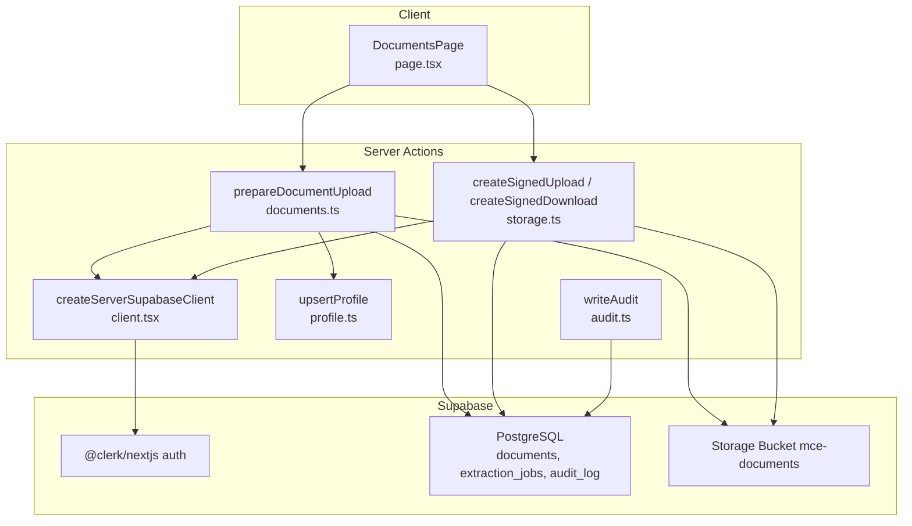
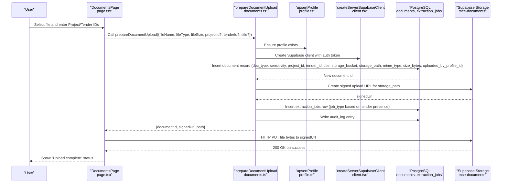
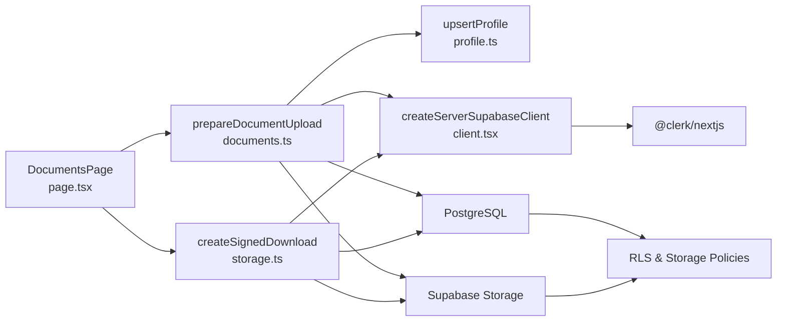

# Document Upload Workflow

<cite>
**Referenced Files in This Document**
- [documents.ts](file://app/ssr/documents.ts)
- [storage.ts](file://app/ssr/storage.ts)
- [client.tsx](file://app/ssr/client.tsx)
- [profile.ts](file://app/ssr/profile.ts)
- [audit.ts](file://app/ssr/audit.ts)
- [page.tsx](file://app/documents/page.tsx)
- [001_day1_schema.sql](file://supabase/migrations/001_day1_schema.sql)
- [002_day1_rls.sql](file://supabase/migrations/002_day1_rls.sql)
- [003_storage_policies.sql](file://supabase/migrations/003_storage_policies.sql)
- [package.json](file://package.json)
</cite>

## Table of Contents
1. [Introduction](#introduction)
2. [Project Structure](#project-structure)
3. [Core Components](#core-components)
4. [Architecture Overview](#architecture-overview)
5. [Detailed Component Analysis](#detailed-component-analysis)
6. [Dependency Analysis](#dependency-analysis)
7. [Performance Considerations](#performance-considerations)
8. [Troubleshooting Guide](#troubleshooting-guide)
9. [Conclusion](#conclusion)

## Introduction
This document explains the complete document upload workflow in the system, from file selection on the frontend to signed URL generation on the backend and direct-to-storage upload via HTTP PUT. It covers the prepareDocumentUpload function parameters, client-side React state management, server-side signed URL generation, HTTP PUT mechanism, error handling strategies, supported file types, file size considerations, and user feedback mechanisms.

## Project Structure
The upload workflow spans client-side UI components and server-side Next.js "use server" actions that integrate with Supabase for authentication, database persistence, storage signing, and audit logging.

**Diagram sources**
- [page.tsx](file://app/documents/page.tsx#L1-L90)
- [documents.ts](file://app/ssr/documents.ts#L1-L114)
- [storage.ts](file://app/ssr/storage.ts#L1-L35)
- [client.tsx](file://app/ssr/client.tsx#L1-L25)
- [profile.ts](file://app/ssr/profile.ts#L1-L31)
- [audit.ts](file://app/ssr/audit.ts#L1-L29)

**Section sources**
- [page.tsx](file://app/documents/page.tsx#L1-L90)
- [documents.ts](file://app/ssr/documents.ts#L1-L114)
- [storage.ts](file://app/ssr/storage.ts#L1-L35)
- [client.tsx](file://app/ssr/client.tsx#L1-L25)
- [profile.ts](file://app/ssr/profile.ts#L1-L31)
- [audit.ts](file://app/ssr/audit.ts#L1-L29)

## Core Components
- Frontend upload UI: DocumentsPage component manages file selection, project/tender identifiers, and upload status.
- Server action prepareDocumentUpload: Creates a document record, generates a signed upload URL, triggers extraction job, and writes audit log.
- Server action createSignedUpload/createSignedDownload: Generates temporary signed URLs for storage operations.
- Supabase integration: Authentication via Clerk, database operations, storage signing, and RLS policies.

Key responsibilities:
- Client: Collects input, invokes server action, performs HTTP PUT to Supabase storage, and displays status.
- Server: Validates context, sanitizes filenames, constructs storage paths, persists metadata, creates signed URLs, enqueues extraction jobs, and logs audit events.

**Section sources**
- [page.tsx](file://app/documents/page.tsx#L6-L36)
- [documents.ts](file://app/ssr/documents.ts#L11-L86)
- [storage.ts](file://app/ssr/storage.ts#L6-L34)

## Architecture Overview
The upload flow uses a two-phase server-side preparation followed by a direct client-to-storage upload.

**Diagram sources**
- [page.tsx](file://app/documents/page.tsx#L12-L36)
- [documents.ts](file://app/ssr/documents.ts#L21-L86)
- [profile.ts](file://app/ssr/profile.ts#L6-L30)
- [client.tsx](file://app/ssr/client.tsx#L4-L14)

## Detailed Component Analysis

### prepareDocumentUpload Function
Purpose: Prepare a document upload by validating context, sanitizing filename, constructing storage path, inserting document metadata, generating a signed upload URL, scheduling extraction, and writing audit.

Parameters:
- fileName: string
- fileType: string (MIME type)
- fileSize: number (bytes)
- projectId: string? (mutually required with tenderId)
- tenderId: string? (mutually required with projectId)
- docType: string?
- sensitivity: "confidential" | "restricted"? (defaults to "confidential")
- title: string? (defaults to fileName)

Processing logic:
- Validates that either projectId or tenderId is provided.
- Sanitizes fileName to ensure safe filesystem-like names.
- Builds storagePath under projects/{projectId}/ or tenders/{tenderId} with timestamp prefix.
- Inserts document record with computed fields and uploaded_by_profile_id.
- Calls Supabase Storage to create a signed upload URL for the path.
- Inserts an extraction job (tender_pack vs document_ingest based on tenderId).
- Writes audit log with path and identifiers.

Error handling:
- Throws descriptive errors if context is missing, document insert fails, signed URL creation fails, or job insertion fails.

Return:
- { documentId, signedUrl, path }

**Section sources**
- [documents.ts](file://app/ssr/documents.ts#L11-L86)

### Client-Side File Handling (React)
Responsibilities:
- Manage React state for selectedFile, projectId, tenderId, and uploadStatus.
- Invoke prepareDocumentUpload with selected file metadata.
- Perform HTTP PUT to the returned signedUrl with Content-Type matching the file type.
- Update uploadStatus based on response.ok.

User feedback:
- Displays "Upload complete" or "Upload failed" based on HTTP response.

Validation:
- Prevents upload if no file is selected.
- Accepts optional tenderId; required projectId for project-scoped uploads.

**Section sources**
- [page.tsx](file://app/documents/page.tsx#L6-L36)

### HTTP PUT Direct-to-Storage Upload
Mechanism:
- The client sends an HTTP PUT request to the signedUrl received from prepareDocumentUpload.
- Headers include Content-Type set to the file's MIME type.
- Body is the raw File content.
- On success, the storage bucket accepts the upload and the document becomes available.

Error handling:
- If response.ok is false, the UI sets uploadStatus to "Upload failed".
- The server action throws if signed URL creation fails.

**Section sources**
- [page.tsx](file://app/documents/page.tsx#L24-L35)
- [documents.ts](file://app/ssr/documents.ts#L57-L63)

### Signed URL Generation (Storage)
Two server actions are available:
- createSignedUpload(filename): Generates a signed upload URL for a generic uploads path.
- createSignedDownload(path): Generates a short-lived signed download URL for a given storage path.

Both rely on createServerSupabaseClient and return { signedUrl }.

**Section sources**
- [storage.ts](file://app/ssr/storage.ts#L6-L34)
- [client.tsx](file://app/ssr/client.tsx#L4-L14)

### Database Schema and Policies
The upload workflow interacts with:
- documents table: stores metadata (doc_type, sensitivity, project_id, tender_id, title, storage_bucket, storage_path, mime_type, size_bytes, uploaded_by_profile_id).
- extraction_jobs table: tracks asynchronous extraction jobs per document.
- audit_log table: records upload actions with metadata.

Row-level security ensures:
- Documents are readable/writable according to project/tender membership and roles.
- Storage objects are accessible only when linked to authorized documents.

**Section sources**
- [001_day1_schema.sql](file://supabase/migrations/001_day1_schema.sql#L164-L191)
- [002_day1_rls.sql](file://supabase/migrations/002_day1_rls.sql#L259-L301)
- [003_storage_policies.sql](file://supabase/migrations/003_storage_policies.sql#L1-L55)

### Authentication and Authorization
- Authentication via Clerk is integrated into the Supabase client, which obtains an access token for server actions.
- upsertProfile ensures a profile record exists and returns profileId for document ownership and audit.
- RLS policies enforce who can view/edit projects/tenders and thus access associated documents.

**Section sources**
- [client.tsx](file://app/ssr/client.tsx#L1-L25)
- [profile.ts](file://app/ssr/profile.ts#L6-L30)
- [002_day1_rls.sql](file://supabase/migrations/002_day1_rls.sql#L37-L113)

## Dependency Analysis
High-level dependencies:
- DocumentsPage depends on prepareDocumentUpload and createSignedDownload.
- prepareDocumentUpload depends on upsertProfile, createServerSupabaseClient, PostgreSQL, and Supabase Storage.
- createSignedUpload/createSignedDownload depend on createServerSupabaseClient and Storage.
- RLS and storage policies depend on document metadata and current profile.

**Diagram sources**
- [page.tsx](file://app/documents/page.tsx#L1-L90)
- [documents.ts](file://app/ssr/documents.ts#L1-L114)
- [storage.ts](file://app/ssr/storage.ts#L1-L35)
- [client.tsx](file://app/ssr/client.tsx#L1-L25)
- [profile.ts](file://app/ssr/profile.ts#L1-L31)
- [002_day1_rls.sql](file://supabase/migrations/002_day1_rls.sql#L259-L301)
- [003_storage_policies.sql](file://supabase/migrations/003_storage_policies.sql#L1-L55)

**Section sources**
- [page.tsx](file://app/documents/page.tsx#L1-L90)
- [documents.ts](file://app/ssr/documents.ts#L1-L114)
- [storage.ts](file://app/ssr/storage.ts#L1-L35)
- [client.tsx](file://app/ssr/client.tsx#L1-L25)
- [profile.ts](file://app/ssr/profile.ts#L1-L31)
- [002_day1_rls.sql](file://supabase/migrations/002_day1_rls.sql#L259-L301)
- [003_storage_policies.sql](file://supabase/migrations/003_storage_policies.sql#L1-L55)

## Performance Considerations
- Direct-to-storage upload via signed URL avoids proxying through the application server, reducing latency and bandwidth usage.
- Asynchronous extraction job processing prevents blocking the upload operation.
- Using timestamp-prefixed storage paths avoids collisions and supports efficient retrieval.
- Keep file sizes reasonable; very large files increase upload time and risk of failure.

## Troubleshooting Guide
Common issues and resolutions:
- Missing project or tender context: The server action requires either projectId or tenderId; ensure at least one is provided.
- Upload failed status: Indicates the HTTP PUT response was not ok; verify network connectivity and signed URL validity.
- Document not found for download: The createSignedDownload lookup uses OR conditions on id/project_id/tender_id; ensure the referenceId matches an existing document.
- Authentication errors: Ensure Clerk authentication is active and the Supabase client can obtain an access token.
- Storage permission denied: Verify RLS policies allow the current profile to edit the associated project/tender.

Operational checks:
- Confirm environment variables for Supabase URL and keys are configured.
- Validate that the storage bucket name matches the configured bucket in the server actions.
- Review audit_log entries for upload actions to confirm successful completion.

**Section sources**
- [documents.ts](file://app/ssr/documents.ts#L26-L28)
- [page.tsx](file://app/documents/page.tsx#L30-L35)
- [documents.ts](file://app/ssr/documents.ts#L92-L102)
- [client.tsx](file://app/ssr/client.tsx#L4-L14)
- [002_day1_rls.sql](file://supabase/migrations/002_day1_rls.sql#L259-L301)
- [003_storage_policies.sql](file://supabase/migrations/003_storage_policies.sql#L22-L39)

## Practical Examples and Scenarios
- Uploading a project document:
  - Provide projectId and optionally docType, sensitivity, title.
  - The system creates a storage path under projects/{projectId}/ and inserts a document record with project_id populated.
- Uploading a tender document:
  - Provide tenderId; the system creates a storage path under tenders/{tenderId}/ and inserts a document record with tender_id populated.
- Supported file types:
  - Any MIME type accepted by the browser File API; the server action passes the provided fileType to the document record and uses it as Content-Type during PUT.
- File size:
  - The server action accepts fileSize; there is no explicit size limit enforced in the server action itself. Consider configuring storage bucket policies or application-level validation if needed.
- Upload progress:
  - The current implementation does not expose progress updates. To add progress, consider uploading via a streaming approach or chunked transfer and integrating a progress indicator in the UI.

## Conclusion
The upload workflow leverages server-side preparation and signed URLs to securely and efficiently upload files directly to Supabase Storage while maintaining document metadata, enforcing authorization via RLS, and recording audit events. The client-side UI integrates seamlessly with server actions to provide a straightforward upload experience with immediate feedback.