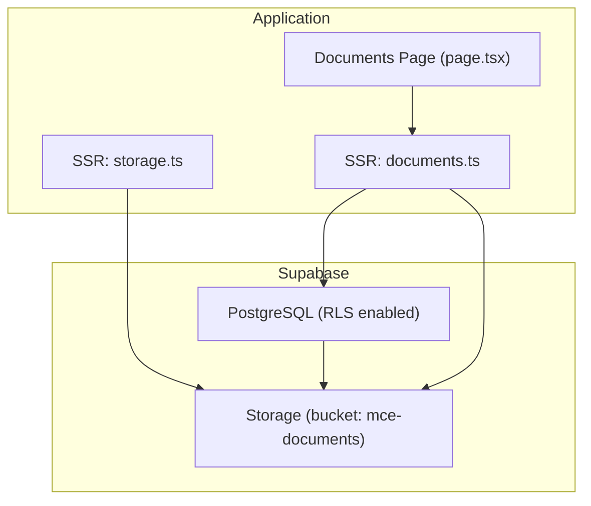
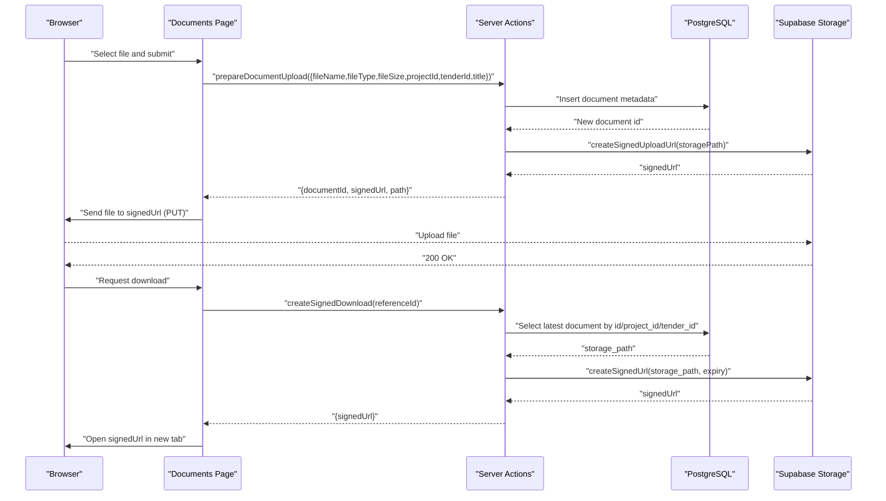
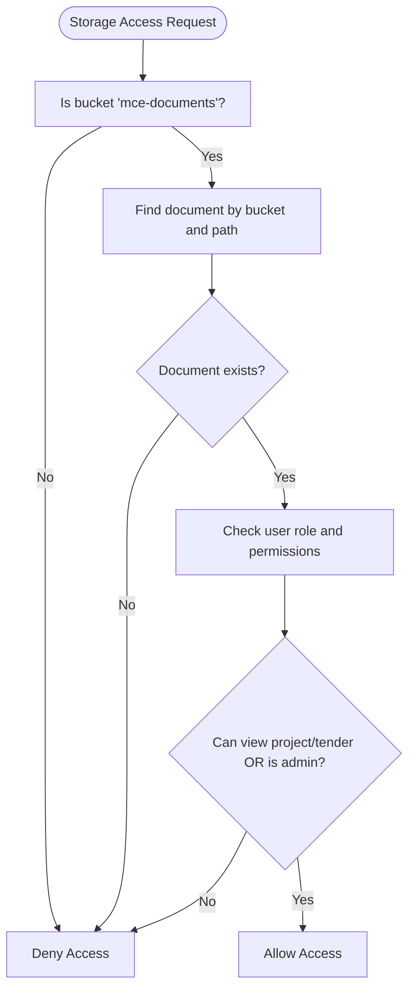
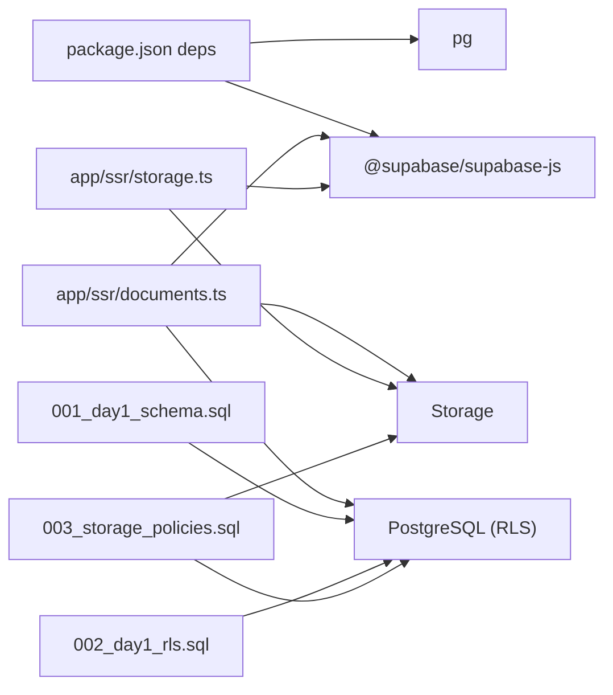

# Storage Integration and Policies

<cite>
**Referenced Files in This Document**
- [README.md](file://README.md)
- [001_day1_schema.sql](file://supabase/migrations/001_day1_schema.sql)
- [002_day1_rls.sql](file://supabase/migrations/002_day1_rls.sql)
- [003_storage_policies.sql](file://supabase/migrations/003_storage_policies.sql)
- [setup-supabase.js](file://scripts/setup-supabase.js)
- [.env.local.example](file://.env.local.example)
- [storage.ts](file://app/ssr/storage.ts)
- [documents.ts](file://app/ssr/documents.ts)
- [page.tsx](file://app/documents/page.tsx)
- [package.json](file://package.json)
</cite>

## Table of Contents
1. [Introduction](#introduction)
2. [Project Structure](#project-structure)
3. [Core Components](#core-components)
4. [Architecture Overview](#architecture-overview)
5. [Detailed Component Analysis](#detailed-component-analysis)
6. [Dependency Analysis](#dependency-analysis)
7. [Performance Considerations](#performance-considerations)
8. [Troubleshooting Guide](#troubleshooting-guide)
9. [Conclusion](#conclusion)
10. [Appendices](#appendices)

## Introduction
This document explains how Supabase Storage is integrated into the application, including bucket setup, file organization strategies, naming conventions, and access policies. It details how storage policies enforce access restrictions, how file size limits and supported formats are configured, and how metadata synchronization works between the database and storage. It also covers lifecycle management (uploads, downloads, signed URLs), configuration examples for different environments, and practical guidance for scaling and performance optimization.

## Project Structure
The storage integration spans several areas:
- Supabase migrations define the schema, RLS, and storage policies.
- A setup script provisions the storage bucket and applies migrations.
- Server-side utilities create signed URLs for secure uploads and downloads.
- The frontend triggers uploads and downloads via server actions.

**Diagram sources**
- [storage.ts](file://app/ssr/storage.ts#L1-L35)
- [documents.ts](file://app/ssr/documents.ts#L1-L114)
- [page.tsx](file://app/documents/page.tsx#L1-L42)
- [001_day1_schema.sql](file://supabase/migrations/001_day1_schema.sql#L164-L180)
- [003_storage_policies.sql](file://supabase/migrations/003_storage_policies.sql#L1-L55)

**Section sources**
- [README.md](file://README.md#L42-L62)
- [setup-supabase.js](file://scripts/setup-supabase.js#L47-L77)
- [package.json](file://package.json#L11-L19)

## Core Components
- Storage bucket “mce-documents” is private and configured with a 10 MB file size limit and allowed MIME types.
- Signed URL creation for uploads and downloads ensures secure, time-limited access.
- Metadata-driven access control ties storage access to database records and user roles.
- Frontend triggers uploads and downloads through server actions.

Key implementation references:
- Bucket creation and limits: [setup-supabase.js](file://scripts/setup-supabase.js#L60-L64)
- Signed upload URL creation: [storage.ts](file://app/ssr/storage.ts#L6-L20), [documents.ts](file://app/ssr/documents.ts#L57-L63)
- Signed download URL creation: [storage.ts](file://app/ssr/storage.ts#L22-L34), [documents.ts](file://app/ssr/documents.ts#L104-L112)
- Access control via policies: [003_storage_policies.sql](file://supabase/migrations/003_storage_policies.sql#L3-L54)

**Section sources**
- [setup-supabase.js](file://scripts/setup-supabase.js#L60-L64)
- [storage.ts](file://app/ssr/storage.ts#L6-L34)
- [documents.ts](file://app/ssr/documents.ts#L57-L112)
- [003_storage_policies.sql](file://supabase/migrations/003_storage_policies.sql#L1-L55)

## Architecture Overview
The storage architecture enforces strict access control by linking storage objects to database records and user roles. Uploads require a pre-existing metadata row in the documents table, and downloads resolve to the latest document record associated with a given identifier.

**Diagram sources**
- [documents.ts](file://app/ssr/documents.ts#L11-L86)
- [documents.ts](file://app/ssr/documents.ts#L88-L113)
- [page.tsx](file://app/documents/page.tsx#L12-L42)
- [001_day1_schema.sql](file://supabase/migrations/001_day1_schema.sql#L164-L180)
- [003_storage_policies.sql](file://supabase/migrations/003_storage_policies.sql#L3-L54)

## Detailed Component Analysis

### Storage Bucket Setup and Configuration
- Bucket name: mce-documents
- Visibility: private
- File size limit: 10 MB
- Allowed MIME types: PDF, PNG, JPEG
- Creation is handled by the setup script using the service role key.

Configuration references:
- Bucket creation and limits: [setup-supabase.js](file://scripts/setup-supabase.js#L60-L64)
- Environment variables required: [README.md](file://README.md#L74-L90), [.env.local.example](file://.env.local.example#L1-L11)

**Section sources**
- [setup-supabase.js](file://scripts/setup-supabase.js#L47-L77)
- [README.md](file://README.md#L56-L62)
- [.env.local.example](file://.env.local.example#L1-L11)

### File Organization Strategies and Naming Conventions
- Uploads are organized under a structured path derived from the entity they belong to:
  - Projects: projects/{projectId}/{timestamp}-{sanitizedFileName}
  - Tenders: tenders/{tenderId}/{timestamp}-{sanitizedFileName}
- A helper sanitizes filenames to ensure safe characters.
- The storage path is stored alongside the document metadata.

References:
- Path construction and sanitization: [documents.ts](file://app/ssr/documents.ts#L30-L34), [documents.ts](file://app/ssr/documents.ts#L7-L9)
- Metadata schema storing bucket and path: [001_day1_schema.sql](file://supabase/migrations/001_day1_schema.sql#L164-L180)

**Section sources**
- [documents.ts](file://app/ssr/documents.ts#L7-L34)
- [001_day1_schema.sql](file://supabase/migrations/001_day1_schema.sql#L164-L180)

### Storage Policies and Access Control
Access to storage objects is governed by policies that:
- Enforce bucket scoping to mce-documents
- Link storage objects to document metadata rows
- Gate access based on user roles and entity membership:
  - Select: admins or users who can view the associated project/tender
  - Insert: authenticated users who can edit the associated project/tender and uploaded by the current profile
  - Delete: only admins

Policy references:
- Policy definitions: [003_storage_policies.sql](file://supabase/migrations/003_storage_policies.sql#L3-L54)
- Supporting role and permission functions: [002_day1_rls.sql](file://supabase/migrations/002_day1_rls.sql#L19-L113)

**Diagram sources**
- [003_storage_policies.sql](file://supabase/migrations/003_storage_policies.sql#L3-L54)
- [002_day1_rls.sql](file://supabase/migrations/002_day1_rls.sql#L19-L113)

**Section sources**
- [003_storage_policies.sql](file://supabase/migrations/003_storage_policies.sql#L1-L55)
- [002_day1_rls.sql](file://supabase/migrations/002_day1_rls.sql#L1-L113)

### Signed URL Lifecycle
- Uploads:
  - Server action inserts a document metadata row and returns a signed upload URL.
  - The client performs a PUT upload to the signed URL.
- Downloads:
  - Server action resolves the latest document by id/project_id/tender_id and returns a signed URL with a short expiry.

References:
- Upload preparation and signed URL: [documents.ts](file://app/ssr/documents.ts#L57-L63)
- Download resolution and signed URL: [documents.ts](file://app/ssr/documents.ts#L88-L112)
- Frontend usage: [page.tsx](file://app/documents/page.tsx#L12-L42)

**Section sources**
- [documents.ts](file://app/ssr/documents.ts#L57-L112)
- [page.tsx](file://app/documents/page.tsx#L12-L42)

### Database Metadata Synchronization
- The documents table stores:
  - Entity linkage (project_id or tender_id)
  - Storage identifiers (storage_bucket, storage_path)
  - Mime type and size
  - Uploaded by profile id
- This enables:
  - Access control checks against the documents row
  - Download resolution by latest document version
  - Audit logging on upload

References:
- Documents table schema: [001_day1_schema.sql](file://supabase/migrations/001_day1_schema.sql#L164-L180)
- Upload metadata insertion: [documents.ts](file://app/ssr/documents.ts#L36-L51)
- Download metadata selection: [documents.ts](file://app/ssr/documents.ts#L92-L98)

**Section sources**
- [001_day1_schema.sql](file://supabase/migrations/001_day1_schema.sql#L164-L180)
- [documents.ts](file://app/ssr/documents.ts#L36-L51)
- [documents.ts](file://app/ssr/documents.ts#L92-L98)

### Storage Lifecycle Management
- Upload lifecycle:
  - Create document metadata row
  - Obtain signed upload URL
  - Perform client-side upload
  - Optionally schedule extraction jobs
- Download lifecycle:
  - Resolve latest document by id/project_id/tender_id
  - Generate signed URL with short expiry
- Deletion lifecycle:
  - Only admins can delete storage objects
  - Deletion is enforced by the storage policy

References:
- Upload flow: [documents.ts](file://app/ssr/documents.ts#L11-L86)
- Download flow: [documents.ts](file://app/ssr/documents.ts#L88-L113)
- Deletion policy: [003_storage_policies.sql](file://supabase/migrations/003_storage_policies.sql#L41-L54)

**Section sources**
- [documents.ts](file://app/ssr/documents.ts#L11-L113)
- [003_storage_policies.sql](file://supabase/migrations/003_storage_policies.sql#L41-L54)

### Configuration Examples and Scaling Considerations
- Local development:
  - Set environment variables as per the example file.
  - Run the setup script to apply migrations and create the bucket.
- Production:
  - Use the same setup script and migrations.
  - Ensure the service role key is kept secret and not exposed to the client.
- Scaling:
  - Increase file size limit and allowed MIME types if needed.
  - Consider CDN integration for downloads to reduce origin load.
  - Monitor storage usage and adjust quotas accordingly.

References:
- Environment variables: [.env.local.example](file://.env.local.example#L1-L11)
- Setup script and bucket creation: [setup-supabase.js](file://scripts/setup-supabase.js#L47-L77)
- Application dependencies: [package.json](file://package.json#L11-L19)

**Section sources**
- [.env.local.example](file://.env.local.example#L1-L11)
- [setup-supabase.js](file://scripts/setup-supabase.js#L47-L77)
- [package.json](file://package.json#L11-L19)

## Dependency Analysis
The storage integration depends on:
- Supabase client libraries for server-side operations
- PostgreSQL RLS for access control
- Storage policies for object-level enforcement
- Frontend server actions to orchestrate uploads and downloads

**Diagram sources**
- [package.json](file://package.json#L11-L19)
- [documents.ts](file://app/ssr/documents.ts#L1-L114)
- [storage.ts](file://app/ssr/storage.ts#L1-L35)
- [001_day1_schema.sql](file://supabase/migrations/001_day1_schema.sql#L164-L180)
- [002_day1_rls.sql](file://supabase/migrations/002_day1_rls.sql#L1-L113)
- [003_storage_policies.sql](file://supabase/migrations/003_storage_policies.sql#L1-L55)

**Section sources**
- [package.json](file://package.json#L11-L19)
- [documents.ts](file://app/ssr/documents.ts#L1-L114)
- [storage.ts](file://app/ssr/storage.ts#L1-L35)
- [001_day1_schema.sql](file://supabase/migrations/001_day1_schema.sql#L164-L180)
- [002_day1_rls.sql](file://supabase/migrations/002_day1_rls.sql#L1-L113)
- [003_storage_policies.sql](file://supabase/migrations/003_storage_policies.sql#L1-L55)

## Performance Considerations
- Use signed URLs with minimal expiry windows to reduce exposure and improve security.
- Offload downloads to a CDN for global distribution and reduced origin bandwidth.
- Consider compression and optimized formats where applicable.
- Monitor storage usage and adjust quotas proactively.
- Batch or queue long-running tasks (e.g., document extraction) to avoid blocking uploads.

[No sources needed since this section provides general guidance]

## Troubleshooting Guide
Common issues and resolutions:
- Build fails due to invalid Clerk keys: ensure Clerk keys are valid and present.
- RLS denied or empty data: confirm the signed-in user has a profiles row and correct role assignments.
- Document upload fails: verify the bucket mce-documents exists, is private, and migrations are applied; ensure the document metadata row exists before upload.
- Signed URL fails: verify storage policies and that the requesting user has access to the linked project/tender.

References:
- Troubleshooting section: [README.md](file://README.md#L141-L158)

**Section sources**
- [README.md](file://README.md#L141-L158)

## Conclusion
The storage integration combines a private bucket with strict access policies, metadata-driven linkage, and signed URL workflows to provide secure, auditable document management. By organizing files under entity-scoped paths, enforcing role-based access, and leveraging server actions for secure operations, the system balances usability with strong governance. For production, consider CDN integration, careful monitoring of quotas, and clear operational procedures for lifecycle events.

[No sources needed since this section summarizes without analyzing specific files]

## Appendices

### Appendix A: Environment Variables
- Required variables for local setup and runtime:
  - NEXT_PUBLIC_CLERK_PUBLISHABLE_KEY
  - CLERK_SECRET_KEY
  - NEXT_PUBLIC_SUPABASE_URL
  - NEXT_PUBLIC_SUPABASE_KEY
  - SUPABASE_SERVICE_ROLE_KEY
  - NEXT_PUBLIC_APP_URL

References:
- Example file: [.env.local.example](file://.env.local.example#L1-L11)
- Notes in README: [README.md](file://README.md#L74-L90)

**Section sources**
- [.env.local.example](file://.env.local.example#L1-L11)
- [README.md](file://README.md#L74-L90)

### Appendix B: Migration and Setup Workflow
- Apply migrations in order:
  - 001_day1_schema.sql
  - 002_day1_rls.sql
  - 003_storage_policies.sql
- Create bucket mce-documents with private visibility and configured limits.

References:
- Setup steps: [README.md](file://README.md#L42-L62)
- Script logic: [setup-supabase.js](file://scripts/setup-supabase.js#L7-L45), [setup-supabase.js](file://scripts/setup-supabase.js#L47-L77)

**Section sources**
- [README.md](file://README.md#L42-L62)
- [setup-supabase.js](file://scripts/setup-supabase.js#L7-L45)
- [setup-supabase.js](file://scripts/setup-supabase.js#L47-L77)