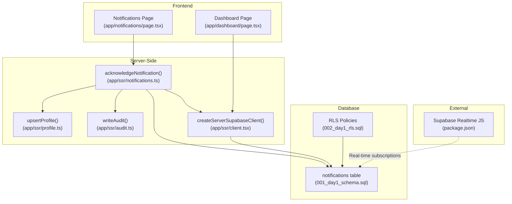
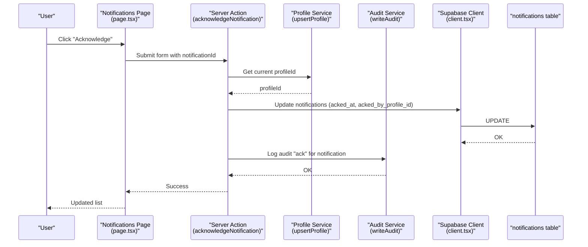
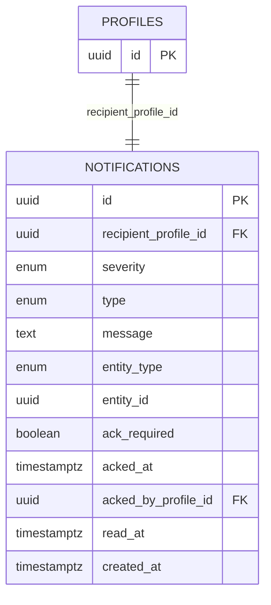
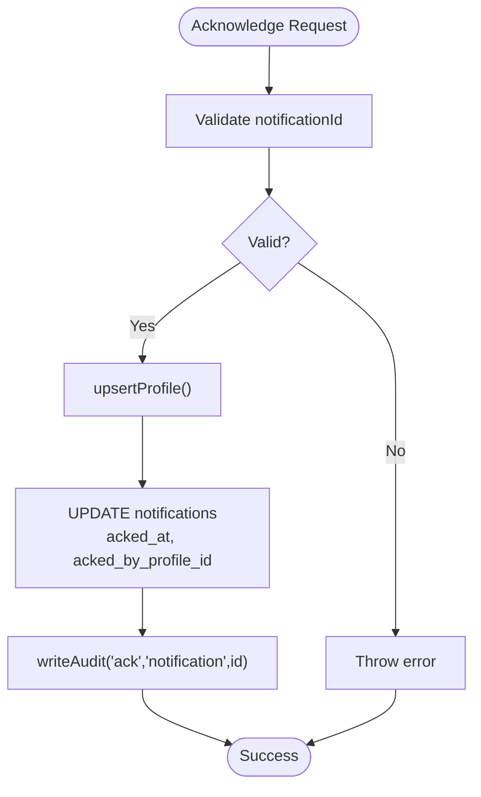
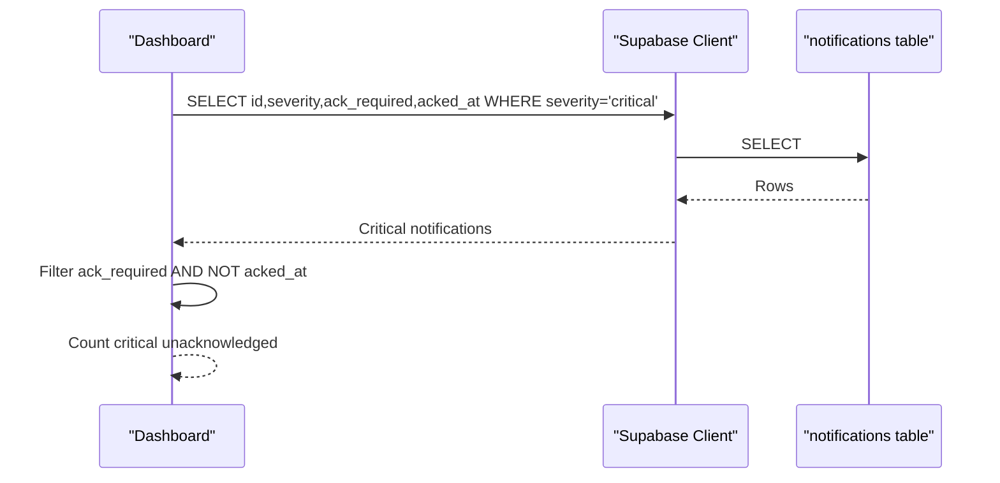
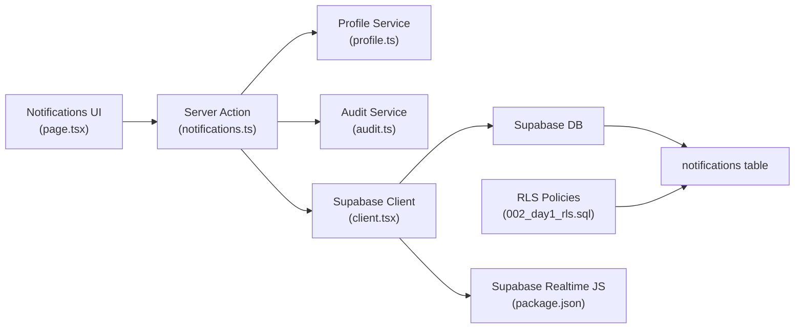

# Notification System

<cite>
**Referenced Files in This Document**
- [README.md](file://README.md)
- [001_day1_schema.sql](file://supabase/migrations/001_day1_schema.sql)
- [002_day1_rls.sql](file://supabase/migrations/002_day1_rls.sql)
- [client.tsx](file://app/ssr/client.tsx)
- [profile.ts](file://app/ssr/profile.ts)
- [audit.ts](file://app/ssr/audit.ts)
- [notifications.ts](file://app/ssr/notifications.ts)
- [page.tsx](file://app/notifications/page.tsx)
- [dashboard.page.tsx](file://app/dashboard/page.tsx)
- [documents.ts](file://app/ssr/documents.ts)
- [comms.ts](file://app/ssr/comms.ts)
- [tenders.ts](file://app/ssr/tenders.ts)
- [package.json](file://package.json)
</cite>

## Table of Contents
1. [Introduction](#introduction)
2. [Project Structure](#project-structure)
3. [Core Components](#core-components)
4. [Architecture Overview](#architecture-overview)
5. [Detailed Component Analysis](#detailed-component-analysis)
6. [Dependency Analysis](#dependency-analysis)
7. [Performance Considerations](#performance-considerations)
8. [Troubleshooting Guide](#troubleshooting-guide)
9. [Conclusion](#conclusion)
10. [Appendices](#appendices)

## Introduction
This document describes the Notification System functionality implemented in the MCE Command Center. It explains how notifications are generated from system events (project milestones, tender deadlines, document uploads, and audit activities), how users acknowledge them, and how they are categorized by severity. It also covers the real-time capabilities via Supabase, integration with the dashboard and user interfaces, notification preferences and user settings, communication history tracking, and the user interface components for viewing and acknowledging notifications. Practical workflows for deadline reminders, project status updates, and compliance alerts are included.

## Project Structure
The notification system spans frontend pages, server-side functions, and backend database schemas and policies:
- Frontend pages: notifications listing and dashboard summary
- Server-side functions: notification acknowledgment, profile management, audit logging
- Database: notifications table, enums for severity and types, row-level security policies
- Real-time: Supabase Realtime client library

**Diagram sources**
- [page.tsx](file://app/notifications/page.tsx#L1-L68)
- [dashboard.page.tsx](file://app/dashboard/page.tsx#L1-L156)
- [notifications.ts](file://app/ssr/notifications.ts#L1-L27)
- [profile.ts](file://app/ssr/profile.ts#L1-L31)
- [audit.ts](file://app/ssr/audit.ts#L1-L29)
- [client.tsx](file://app/ssr/client.tsx#L1-L25)
- [001_day1_schema.sql](file://supabase/migrations/001_day1_schema.sql#L193-L206)
- [002_day1_rls.sql](file://supabase/migrations/002_day1_rls.sql#L303-L317)
- [package.json](file://package.json#L1-L200)

**Section sources**
- [README.md](file://README.md#L1-L62)
- [page.tsx](file://app/notifications/page.tsx#L1-L68)
- [dashboard.page.tsx](file://app/dashboard/page.tsx#L1-L156)
- [notifications.ts](file://app/ssr/notifications.ts#L1-L27)
- [profile.ts](file://app/ssr/profile.ts#L1-L31)
- [audit.ts](file://app/ssr/audit.ts#L1-L29)
- [client.tsx](file://app/ssr/client.tsx#L1-L25)
- [001_day1_schema.sql](file://supabase/migrations/001_day1_schema.sql#L1-L227)
- [002_day1_rls.sql](file://supabase/migrations/002_day1_rls.sql#L1-L348)
- [package.json](file://package.json#L1078-L1080)

## Core Components
- Notifications table with severity levels and acknowledgment fields
- Notification acknowledgment workflow
- Dashboard integration for critical notifications
- Audit trail for notification acknowledgments
- Real-time client library for live updates

Key implementation references:
- Notifications table definition and enums: [001_day1_schema.sql](file://supabase/migrations/001_day1_schema.sql#L46-L57), [001_day1_schema.sql](file://supabase/migrations/001_day1_schema.sql#L193-L206)
- Notification acknowledgment function: [notifications.ts](file://app/ssr/notifications.ts#L7-L26)
- Notifications page UI and form submission: [page.tsx](file://app/notifications/page.tsx#L4-L68)
- Dashboard critical notifications count: [dashboard.page.tsx](file://app/dashboard/page.tsx#L20-L60)
- Audit logging for acknowledgments: [audit.ts](file://app/ssr/audit.ts#L6-L28)
- Supabase client creation: [client.tsx](file://app/ssr/client.tsx#L4-L14)
- Realtime JS dependency: [package.json](file://package.json#L1078-L1080)

**Section sources**
- [001_day1_schema.sql](file://supabase/migrations/001_day1_schema.sql#L46-L57)
- [001_day1_schema.sql](file://supabase/migrations/001_day1_schema.sql#L193-L206)
- [notifications.ts](file://app/ssr/notifications.ts#L7-L26)
- [page.tsx](file://app/notifications/page.tsx#L4-L68)
- [dashboard.page.tsx](file://app/dashboard/page.tsx#L20-L60)
- [audit.ts](file://app/ssr/audit.ts#L6-L28)
- [client.tsx](file://app/ssr/client.tsx#L4-L14)
- [package.json](file://package.json#L1078-L1080)

## Architecture Overview
The notification system follows a server-action pattern:
- UI triggers a server action to acknowledge a notification
- The server action authenticates the user, updates the notifications table, and writes an audit log
- The dashboard queries critical notifications and displays counts
- Real-time subscriptions can be established via Supabase Realtime for live updates

**Diagram sources**
- [page.tsx](file://app/notifications/page.tsx#L11-L18)
- [notifications.ts](file://app/ssr/notifications.ts#L7-L26)
- [profile.ts](file://app/ssr/profile.ts#L6-L30)
- [audit.ts](file://app/ssr/audit.ts#L6-L28)
- [client.tsx](file://app/ssr/client.tsx#L4-L14)
- [001_day1_schema.sql](file://supabase/migrations/001_day1_schema.sql#L193-L206)

## Detailed Component Analysis

### Notifications Table and Enums
The notifications table defines severity levels and types, along with acknowledgment and read tracking fields. Row-level security ensures users only see their own notifications.

**Diagram sources**
- [001_day1_schema.sql](file://supabase/migrations/001_day1_schema.sql#L46-L57)
- [001_day1_schema.sql](file://supabase/migrations/001_day1_schema.sql#L193-L206)
- [002_day1_rls.sql](file://supabase/migrations/002_day1_rls.sql#L303-L317)

**Section sources**
- [001_day1_schema.sql](file://supabase/migrations/001_day1_schema.sql#L46-L57)
- [001_day1_schema.sql](file://supabase/migrations/001_day1_schema.sql#L193-L206)
- [002_day1_rls.sql](file://supabase/migrations/002_day1_rls.sql#L303-L317)

### Acknowledgment Workflow
Users can acknowledge notifications that require acknowledgment. The workflow updates the notification record and logs the action in the audit trail.

**Diagram sources**
- [page.tsx](file://app/notifications/page.tsx#L11-L18)
- [notifications.ts](file://app/ssr/notifications.ts#L7-L26)
- [profile.ts](file://app/ssr/profile.ts#L6-L30)
- [audit.ts](file://app/ssr/audit.ts#L6-L28)

**Section sources**
- [page.tsx](file://app/notifications/page.tsx#L11-L18)
- [notifications.ts](file://app/ssr/notifications.ts#L7-L26)
- [profile.ts](file://app/ssr/profile.ts#L6-L30)
- [audit.ts](file://app/ssr/audit.ts#L6-L28)

### Dashboard Integration
The dashboard fetches critical notifications and counts those requiring acknowledgment but not yet acknowledged, surfacing them prominently.

**Diagram sources**
- [dashboard.page.tsx](file://app/dashboard/page.tsx#L20-L60)
- [001_day1_schema.sql](file://supabase/migrations/001_day1_schema.sql#L193-L206)

**Section sources**
- [dashboard.page.tsx](file://app/dashboard/page.tsx#L20-L60)

### Real-Time Delivery
The project includes the Supabase Realtime JavaScript client, enabling real-time subscriptions to the notifications table. While the current UI does not implement live subscriptions, the client library is available for future enhancements.

**Section sources**
- [package.json](file://package.json#L1078-L1080)
- [client.tsx](file://app/ssr/client.tsx#L1-L25)

### Notification Generation Mechanisms
- Tender deadlines: When tenders are created or deadlines change, the system can generate notifications of type "tender_deadline". See [tenders.ts](file://app/ssr/tenders.ts#L8-L42) and [001_day1_schema.sql](file://supabase/migrations/001_day1_schema.sql#L52-L57).
- Project milestones: When milestones are created or statuses change, notifications of type "milestone_due" can be generated. See [001_day1_schema.sql](file://supabase/migrations/001_day1_schema.sql#L120-L128) and [001_day1_schema.sql](file://supabase/migrations/001_day1_schema.sql#L52-L57).
- Document uploads: Document ingestion jobs trigger notifications of type "document_ingest" after upload preparation. See [documents.ts](file://app/ssr/documents.ts#L65-L73).
- Audit activities: Acknowledging notifications generates audit entries of type "ack" for entity "notification". See [audit.ts](file://app/ssr/audit.ts#L6-L28) and [001_day1_schema.sql](file://supabase/migrations/001_day1_schema.sql#L59-L74).

**Section sources**
- [tenders.ts](file://app/ssr/tenders.ts#L8-L42)
- [documents.ts](file://app/ssr/documents.ts#L65-L73)
- [audit.ts](file://app/ssr/audit.ts#L6-L28)
- [001_day1_schema.sql](file://supabase/migrations/001_day1_schema.sql#L52-L57)
- [001_day1_schema.sql](file://supabase/migrations/001_day1_schema.sql#L120-L128)

### Severity Levels and Categorization
- Severity levels: info, warn, critical
- Types: tender_deadline, milestone_due, followup_due, system

**Section sources**
- [001_day1_schema.sql](file://supabase/migrations/001_day1_schema.sql#L46-L57)

### User Interface Components
- Notifications list page: Displays message, severity, acknowledgment requirement, acknowledgment status, and action button for acknowledgments. See [page.tsx](file://app/notifications/page.tsx#L4-L68).
- Dashboard summary: Shows critical notifications requiring acknowledgment. See [dashboard.page.tsx](file://app/dashboard/page.tsx#L58-L60).

**Section sources**
- [page.tsx](file://app/notifications/page.tsx#L4-L68)
- [dashboard.page.tsx](file://app/dashboard/page.tsx#L58-L60)

### Communication History Tracking
Communication events for tenders are tracked in the tender_comms_events table, with audit logs for create actions. This complements notification tracking for follow-ups and outcomes.

**Section sources**
- [comms.ts](file://app/ssr/comms.ts#L7-L37)
- [001_day1_schema.sql](file://supabase/migrations/001_day1_schema.sql#L153-L162)
- [audit.ts](file://app/ssr/audit.ts#L6-L28)

### Notification Preferences and User Settings
There are no explicit notification preferences or user settings implemented in the current codebase. Users receive notifications based on system events and can acknowledge them individually.

**Section sources**
- [001_day1_schema.sql](file://supabase/migrations/001_day1_schema.sql#L193-L206)

### Scheduling, Bulk Operations, and External Integrations
- Scheduling: No scheduled notification generation is implemented in the current codebase.
- Bulk operations: No bulk acknowledgment or generation functions are present.
- External integrations: No external communication system integrations are implemented; the system relies on internal notifications and audit logs.

**Section sources**
- [README.md](file://README.md#L16-L17)

## Dependency Analysis
The notification system depends on:
- Supabase client for database operations
- Clerk for user authentication
- Row-level security for access control
- Audit service for compliance tracking

**Diagram sources**
- [page.tsx](file://app/notifications/page.tsx#L1-L68)
- [notifications.ts](file://app/ssr/notifications.ts#L1-L27)
- [profile.ts](file://app/ssr/profile.ts#L1-L31)
- [audit.ts](file://app/ssr/audit.ts#L1-L29)
- [client.tsx](file://app/ssr/client.tsx#L1-L25)
- [001_day1_schema.sql](file://supabase/migrations/001_day1_schema.sql#L193-L206)
- [002_day1_rls.sql](file://supabase/migrations/002_day1_rls.sql#L303-L317)
- [package.json](file://package.json#L1078-L1080)

**Section sources**
- [page.tsx](file://app/notifications/page.tsx#L1-L68)
- [notifications.ts](file://app/ssr/notifications.ts#L1-L27)
- [profile.ts](file://app/ssr/profile.ts#L1-L31)
- [audit.ts](file://app/ssr/audit.ts#L1-L29)
- [client.tsx](file://app/ssr/client.tsx#L1-L25)
- [001_day1_schema.sql](file://supabase/migrations/001_day1_schema.sql#L193-L206)
- [002_day1_rls.sql](file://supabase/migrations/002_day1_rls.sql#L303-L317)
- [package.json](file://package.json#L1078-L1080)

## Performance Considerations
- Database indexing: Indexes exist on notifications recipient and audit log entity columns to support efficient filtering and joins.
- Query patterns: The notifications page orders by creation time descending; the dashboard filters by severity and acknowledgment status.
- Real-time: Subscribing to notifications in real-time can reduce polling overhead but requires implementing subscription logic.

**Section sources**
- [001_day1_schema.sql](file://supabase/migrations/001_day1_schema.sql#L225-L226)

## Troubleshooting Guide
Common issues and resolutions:
- Authentication errors: Profile upsert requires a logged-in Clerk user; ensure authentication is configured.
- Authorization errors: RLS policies restrict notifications to recipients; verify the current profile matches the recipient.
- Database errors: Errors during acknowledgment or audit logging are thrown as exceptions; check network connectivity and credentials.
- Real-time not updating: Ensure the Realtime client is initialized and subscribed to the notifications channel.

**Section sources**
- [profile.ts](file://app/ssr/profile.ts#L8-L10)
- [002_day1_rls.sql](file://supabase/migrations/002_day1_rls.sql#L303-L317)
- [notifications.ts](file://app/ssr/notifications.ts#L21-L23)
- [audit.ts](file://app/ssr/audit.ts#L25-L27)
- [client.tsx](file://app/ssr/client.tsx#L4-L14)

## Conclusion
The Notification System provides a solid foundation for event-driven alerts, acknowledgment workflows, and audit tracking. It integrates with the dashboard for visibility and supports real-time capabilities through the Supabase Realtime client. Future enhancements could include scheduled notifications, bulk operations, user preferences, and external communication integrations.

## Appendices

### Practical Workflows

- Deadline reminders
  - Trigger: Tender deadline approaching
  - Type: tender_deadline
  - Severity: warn or critical depending on proximity
  - Action: User acknowledges; system logs audit

- Project status updates
  - Trigger: Milestone status change
  - Type: milestone_due
  - Severity: info or warn
  - Action: User acknowledges; system logs audit

- Compliance alerts
  - Trigger: Audit activity (e.g., notification acknowledgment)
  - Type: system
  - Severity: info
  - Action: Audit trail maintained for compliance review

**Section sources**
- [001_day1_schema.sql](file://supabase/migrations/001_day1_schema.sql#L52-L57)
- [001_day1_schema.sql](file://supabase/migrations/001_day1_schema.sql#L46-L50)
- [audit.ts](file://app/ssr/audit.ts#L6-L28)