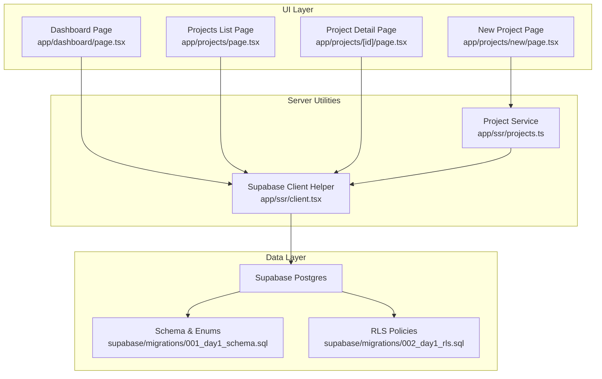
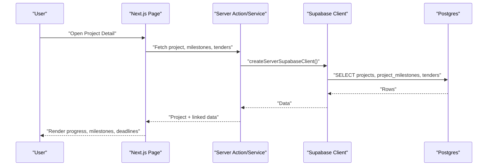
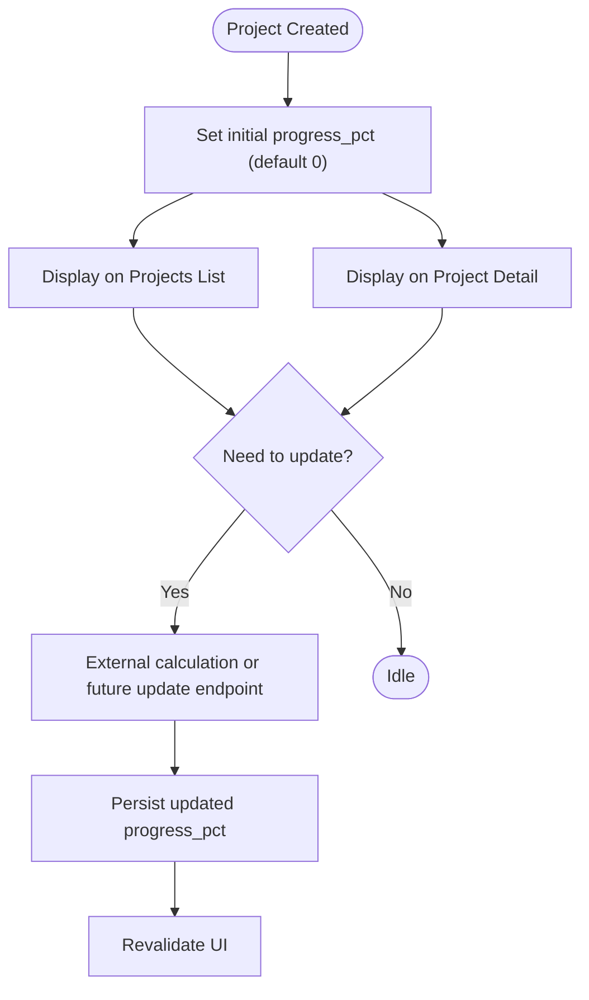
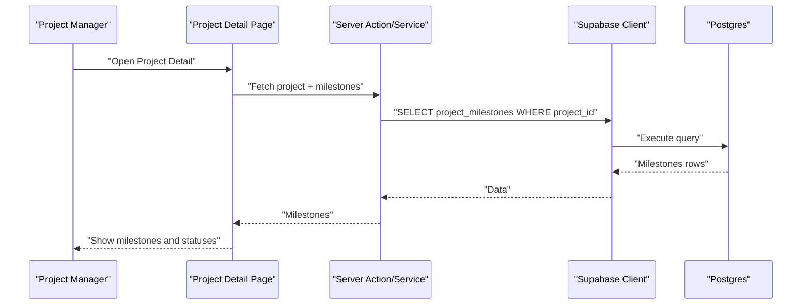
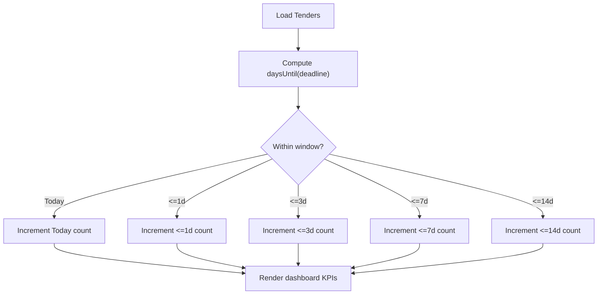
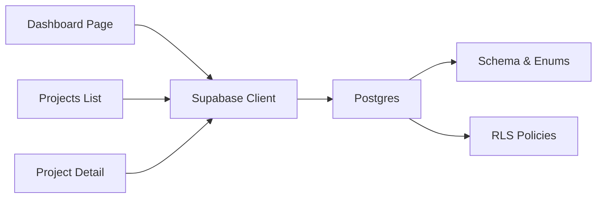

# Progress and Milestone Tracking

<cite>
**Referenced Files in This Document**
- [README.md](file://README.md)
- [001_day1_schema.sql](file://supabase/migrations/001_day1_schema.sql)
- [002_day1_rls.sql](file://supabase/migrations/002_day1_rls.sql)
- [client.tsx](file://app/ssr/client.tsx)
- [projects.ts](file://app/ssr/projects.ts)
- [page.tsx (Dashboard)](file://app/dashboard/page.tsx)
- [page.tsx (Projects List)](file://app/projects/page.tsx)
- [page.tsx (Project Detail)](file://app/projects/[id]/page.tsx)
- [page.tsx (New Project)](file://app/projects/new/page.tsx)
</cite>

## Table of Contents
1. [Introduction](#introduction)
2. [Project Structure](#project-structure)
3. [Core Components](#core-components)
4. [Architecture Overview](#architecture-overview)
5. [Detailed Component Analysis](#detailed-component-analysis)
6. [Dependency Analysis](#dependency-analysis)
7. [Performance Considerations](#performance-considerations)
8. [Troubleshooting Guide](#troubleshooting-guide)
9. [Conclusion](#conclusion)
10. [Appendices](#appendices)

## Introduction
This document explains how progress and milestone tracking are implemented in the Project Management system. It covers:
- How project progress percentage is stored and displayed
- How milestones are modeled, created, and tracked
- How deadlines are managed and timelines monitored
- How progress updates are surfaced and how often they appear
- How milestones relate to overall project progress
- Status indicators, completion tracking, and overdue handling
- Progress reporting and visualization features
- Practical examples for setting up milestones, tracking progress, and managing timelines

## Project Structure
The system is built with Next.js App Router, Clerk for authentication, and Supabase for database, Row Level Security (RLS), and storage. Progress and milestone features are primarily implemented in:
- Database schema and enums for statuses and types
- Server-side data access and caching helpers
- UI pages for dashboard, project list, and project detail

**Diagram sources**
- [page.tsx (Dashboard)](file://app/dashboard/page.tsx#L11-L30)
- [page.tsx (Projects List)](file://app/projects/page.tsx#L4-L9)
- [page.tsx (Project Detail)](file://app/projects/[id]/page.tsx#L10-L18)
- [page.tsx (New Project)](file://app/projects/new/page.tsx#L6-L16)
- [client.tsx](file://app/ssr/client.tsx#L4-L14)
- [projects.ts](file://app/ssr/projects.ts#L8-L42)
- [001_day1_schema.sql](file://supabase/migrations/001_day1_schema.sql#L13-L24)
- [002_day1_rls.sql](file://supabase/migrations/002_day1_rls.sql#L186-L202)

**Section sources**
- [README.md](file://README.md#L1-L158)
- [001_day1_schema.sql](file://supabase/migrations/001_day1_schema.sql#L1-L227)
- [002_day1_rls.sql](file://supabase/migrations/002_day1_rls.sql#L1-L348)
- [client.tsx](file://app/ssr/client.tsx#L1-L25)
- [projects.ts](file://app/ssr/projects.ts#L1-L43)
- [page.tsx (Dashboard)](file://app/dashboard/page.tsx#L1-L157)
- [page.tsx (Projects List)](file://app/projects/page.tsx#L1-L65)
- [page.tsx (Project Detail)](file://app/projects/[id]/page.tsx#L1-L138)
- [page.tsx (New Project)](file://app/projects/new/page.tsx#L1-L68)

## Core Components
- Project progress percentage
  - Stored as an integer field in the projects table and displayed on list and detail views.
- Milestones
  - Stored in a dedicated table with status enum and due dates.
  - Displayed on the project detail page and aggregated on the dashboard.
- Deadlines and timelines
  - Tenders have deadline timestamps; dashboard computes days until due.
  - Milestones have due dates; dashboard shows upcoming milestones.
- Access control
  - RLS policies ensure users can only access projects/milestones they are authorized to view/edit.

Key implementation references:
- Progress field and milestone table definition
- Dashboard computation of days until due and upcoming milestones
- Project list and detail rendering of progress and milestones
- Project creation service

**Section sources**
- [001_day1_schema.sql](file://supabase/migrations/001_day1_schema.sql#L95-L128)
- [page.tsx (Dashboard)](file://app/dashboard/page.tsx#L6-L56)
- [page.tsx (Projects List)](file://app/projects/page.tsx#L6-L44)
- [page.tsx (Project Detail)](file://app/projects/[id]/page.tsx#L12-L92)
- [projects.ts](file://app/ssr/projects.ts#L8-L42)

## Architecture Overview
The progress and milestone tracking architecture combines:
- Data modeling: enums for statuses, integer progress percentage, and date/datetime fields for deadlines/timelines
- Server utilities: Supabase client helpers and server actions/services
- UI rendering: dashboard KPIs, project list, and project detail pages
- Access control: RLS policies on milestones and projects

**Diagram sources**
- [page.tsx (Project Detail)](file://app/projects/[id]/page.tsx#L24-L42)
- [client.tsx](file://app/ssr/client.tsx#L4-L14)
- [001_day1_schema.sql](file://supabase/migrations/001_day1_schema.sql#L95-L144)

## Detailed Component Analysis

### Progress Percentage Calculation and Display
- Storage model
  - Projects table includes an integer progress percentage field.
- Display
  - Projects list shows progress percentage per row.
  - Project detail shows progress percentage in summary.
- Update mechanism
  - The project creation page allows initial project creation; progress percentage is part of the project record.
  - There is no explicit progress update endpoint shown in the current code; progress is typically maintained externally or via future server actions.

**Diagram sources**
- [001_day1_schema.sql](file://supabase/migrations/001_day1_schema.sql#L105)
- [page.tsx (Projects List)](file://app/projects/page.tsx#L44)
- [page.tsx (Project Detail)](file://app/projects/[id]/page.tsx#L69)
- [page.tsx (New Project)](file://app/projects/new/page.tsx#L13-L16)

**Section sources**
- [001_day1_schema.sql](file://supabase/migrations/001_day1_schema.sql#L95-L110)
- [page.tsx (Projects List)](file://app/projects/page.tsx#L44)
- [page.tsx (Project Detail)](file://app/projects/[id]/page.tsx#L69)
- [page.tsx (New Project)](file://app/projects/new/page.tsx#L13-L16)

### Milestone Creation, Management, and Tracking Workflows
- Data model
  - Milestones table includes title, due date, owner, and status enum.
  - Status enum supports lifecycle: not started, in progress, done, blocked.
- Creation
  - The project detail page fetches milestones for a given project; creation likely occurs via a form/page not present in the current snapshot.
- Tracking
  - Project detail lists milestones with titles, due dates, and statuses.
  - Dashboard shows upcoming milestones (next 10) with computed “T-n” indicators.

**Diagram sources**
- [page.tsx (Project Detail)](file://app/projects/[id]/page.tsx#L24-L42)
- [001_day1_schema.sql](file://supabase/migrations/001_day1_schema.sql#L120-L128)
- [002_day1_rls.sql](file://supabase/migrations/002_day1_rls.sql#L186-L202)

**Section sources**
- [001_day1_schema.sql](file://supabase/migrations/001_day1_schema.sql#L19-L24)
- [001_day1_schema.sql](file://supabase/migrations/001_day1_schema.sql#L120-L128)
- [page.tsx (Project Detail)](file://app/projects/[id]/page.tsx#L24-L92)
- [page.tsx (Dashboard)](file://app/dashboard/page.tsx#L50-L56)

### Deadline Management and Timeline Monitoring
- Tender deadlines
  - Tenders have deadline timestamps; dashboard computes days until due and aggregates counts for various windows (today, 1d, 3d, 7d, 14d).
- Milestone deadlines
  - Milestones have due dates; dashboard shows upcoming milestones and computes “T-n” indicators.
- Access control
  - RLS ensures users only see milestones linked to projects they can view.

**Diagram sources**
- [page.tsx (Dashboard)](file://app/dashboard/page.tsx#L32-L48)
- [001_day1_schema.sql](file://supabase/migrations/001_day1_schema.sql#L130-L144)

**Section sources**
- [page.tsx (Dashboard)](file://app/dashboard/page.tsx#L20-L60)
- [001_day1_schema.sql](file://supabase/migrations/001_day1_schema.sql#L130-L144)
- [002_day1_rls.sql](file://supabase/migrations/002_day1_rls.sql#L186-L202)

### Progress Update Interfaces and Frequency
- Current state
  - Project creation page allows saving a project; progress percentage is part of the project record.
  - There is no explicit progress update UI or endpoint visible in the current code snapshot.
- Recommendations
  - Introduce a server action to update progress_pct on projects.
  - Surface a progress update interface on the project detail page.
  - Trigger revalidation after updates to refresh UI.

**Section sources**
- [page.tsx (New Project)](file://app/projects/new/page.tsx#L13-L16)
- [page.tsx (Projects List)](file://app/projects/page.tsx#L44)
- [page.tsx (Project Detail)](file://app/projects/[id]/page.tsx#L69)

### Relationship Between Milestones and Overall Project Progress
- Current implementation
  - The projects table stores a single progress_pct integer.
  - No explicit formula or automatic aggregation of milestone statuses to compute progress_pct is present in the current code.
- Recommended approach
  - Compute progress as a function of milestone statuses (e.g., proportion of “done” milestones).
  - Optionally weight milestones by importance or duration.
  - Expose a server action to recalculate and persist progress_pct.

**Section sources**
- [001_day1_schema.sql](file://supabase/migrations/001_day1_schema.sql#L105)
- [001_day1_schema.sql](file://supabase/migrations/001_schema.sql#L120-L128)

### Milestone Status Indicators, Completion Tracking, and Overdue Handling
- Status indicators
  - Milestones display their status enum values on the project detail page.
- Completion tracking
  - Completion can be inferred from “done” status; future UI could show completion badges or progress bars.
- Overdue handling
  - Dashboard shows upcoming milestones; overdue logic can be derived by comparing due dates to today.
  - RLS ensures visibility only for permitted projects.

**Section sources**
- [page.tsx (Project Detail)](file://app/projects/[id]/page.tsx#L80-L87)
- [page.tsx (Dashboard)](file://app/dashboard/page.tsx#L127-L147)
- [001_day1_schema.sql](file://supabase/migrations/001_day1_schema.sql#L19-L24)

### Progress Reporting Features and Visualization
- Dashboard KPIs
  - Tender due windows (today, 1d, 3d, 7d, 14d) are computed and displayed.
  - Upcoming milestones panel (next 10) is rendered with due dates and “T-n” indicators.
- Project detail
  - Progress percentage is shown in the summary card.
  - Upcoming milestones panel displays titles, due dates, and statuses.

**Section sources**
- [page.tsx (Dashboard)](file://app/dashboard/page.tsx#L32-L60)
- [page.tsx (Dashboard)](file://app/dashboard/page.tsx#L127-L147)
- [page.tsx (Project Detail)](file://app/projects/[id]/page.tsx#L65-L92)

### Practical Examples
- Setting up milestones
  - Create a project via the new project page.
  - Navigate to the project detail page; milestones are fetched and displayed.
  - Create milestones via a form/page not present in the current snapshot.
- Tracking progress
  - Observe progress_pct on the project list and detail pages.
  - Update progress via a future server action and revalidate the UI.
- Managing timelines
  - Monitor upcoming milestones on the dashboard.
  - Track tenders’ deadlines and near-due windows.

**Section sources**
- [page.tsx (New Project)](file://app/projects/new/page.tsx#L13-L16)
- [page.tsx (Project Detail)](file://app/projects/[id]/page.tsx#L24-L42)
- [page.tsx (Dashboard)](file://app/dashboard/page.tsx#L50-L56)

## Dependency Analysis
- UI depends on server utilities to create authenticated Supabase clients.
- Pages query projects, milestones, and tenders; RLS policies guard access.
- Schema defines enums and tables; indexes support queries.

**Diagram sources**
- [page.tsx (Dashboard)](file://app/dashboard/page.tsx#L18-L30)
- [page.tsx (Projects List)](file://app/projects/page.tsx#L5-L9)
- [page.tsx (Project Detail)](file://app/projects/[id]/page.tsx#L10-L18)
- [client.tsx](file://app/ssr/client.tsx#L4-L14)
- [001_day1_schema.sql](file://supabase/migrations/001_day1_schema.sql#L1-L227)
- [002_day1_rls.sql](file://supabase/migrations/002_day1_rls.sql#L186-L202)

**Section sources**
- [client.tsx](file://app/ssr/client.tsx#L1-L25)
- [001_day1_schema.sql](file://supabase/migrations/001_day1_schema.sql#L1-L227)
- [002_day1_rls.sql](file://supabase/migrations/002_day1_rls.sql#L186-L202)
- [page.tsx (Dashboard)](file://app/dashboard/page.tsx#L18-L30)
- [page.tsx (Projects List)](file://app/projects/page.tsx#L5-L9)
- [page.tsx (Project Detail)](file://app/projects/[id]/page.tsx#L10-L18)

## Performance Considerations
- Use indexes on frequently queried columns (e.g., milestones due date, tenders deadline).
- Batch queries for project detail to minimize round-trips.
- Limit the number of displayed milestones and tenders to reduce payload sizes.
- Leverage server-side revalidation to keep cached UI in sync after writes.

[No sources needed since this section provides general guidance]

## Troubleshooting Guide
- Progress not updating
  - Ensure a server action exists to update progress_pct and triggers revalidation.
- Milestones not visible
  - Verify RLS policies allow viewing milestones for the current user’s accessible projects.
- Dashboard counts incorrect
  - Confirm deadline computations and due-date comparisons are performed server-side.

**Section sources**
- [002_day1_rls.sql](file://supabase/migrations/002_day1_rls.sql#L186-L202)
- [page.tsx (Dashboard)](file://app/dashboard/page.tsx#L40-L48)

## Conclusion
The Project Management system currently provides:
- A progress_pct field on projects and displays it across list and detail views.
- A robust milestone model with statuses and due dates, visible on project detail and summarized on the dashboard.
- Deadline monitoring for tenders with near-due aggregations.
To enhance the system:
- Implement a progress update interface and server action.
- Derive progress_pct from milestone statuses and/or weights.
- Expand overdue handling and completion tracking visuals.
- Surface more granular progress reporting on the dashboard.

[No sources needed since this section summarizes without analyzing specific files]

## Appendices
- Enum definitions and table schemas relevant to progress and milestones are defined in the schema migration.
- Access control for milestones is enforced via RLS policies.

**Section sources**
- [001_day1_schema.sql](file://supabase/migrations/001_day1_schema.sql#L13-L24)
- [001_day1_schema.sql](file://supabase/migrations/001_day1_schema.sql#L120-L128)
- [002_day1_rls.sql](file://supabase/migrations/002_day1_rls.sql#L186-L202)