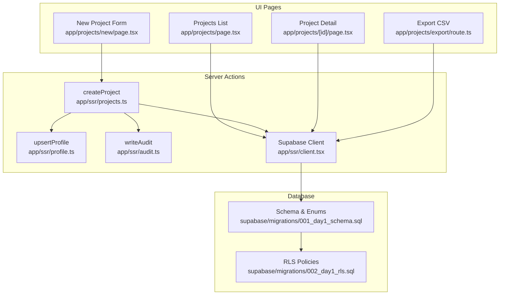
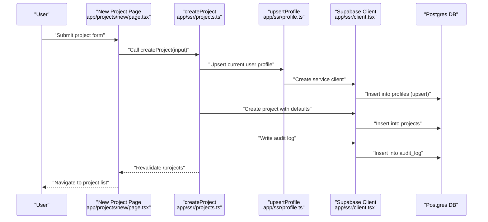
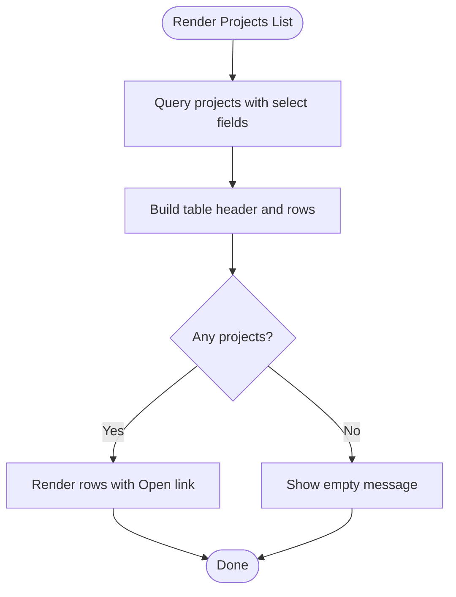
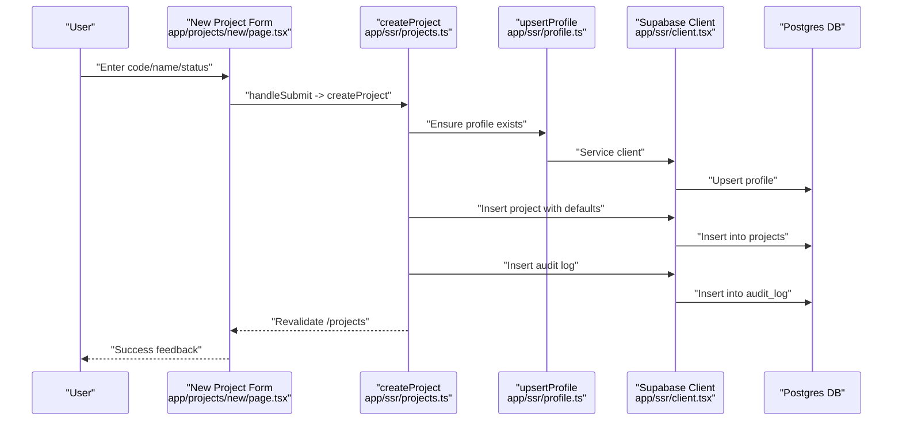
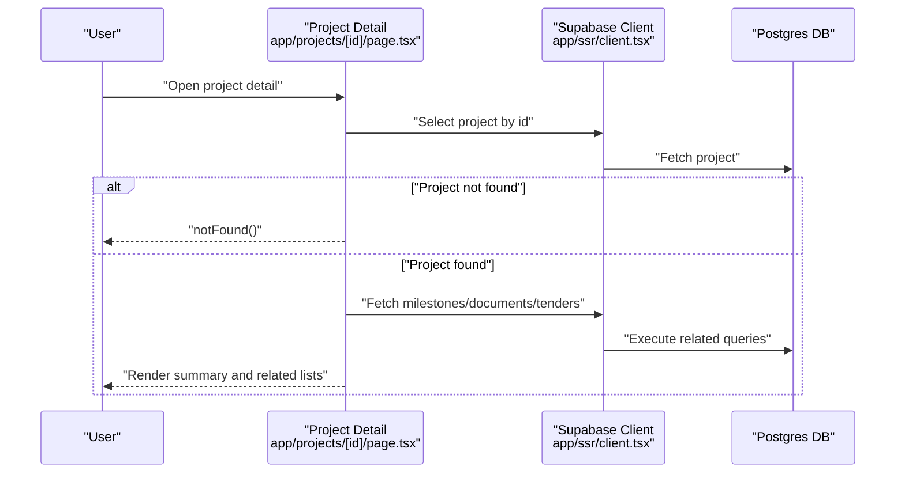
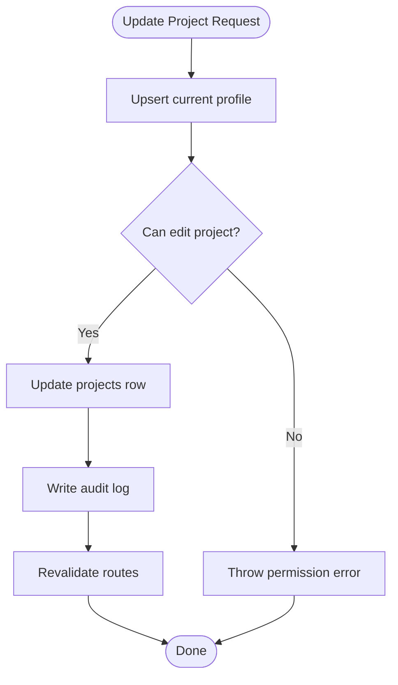
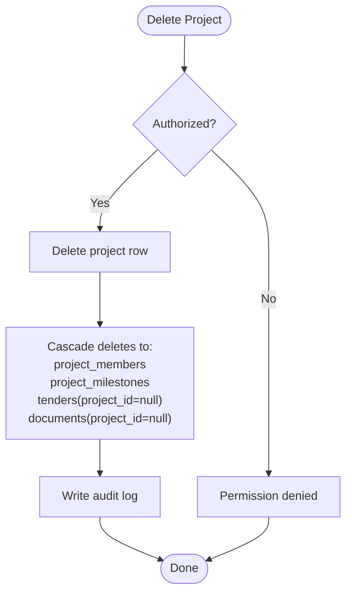
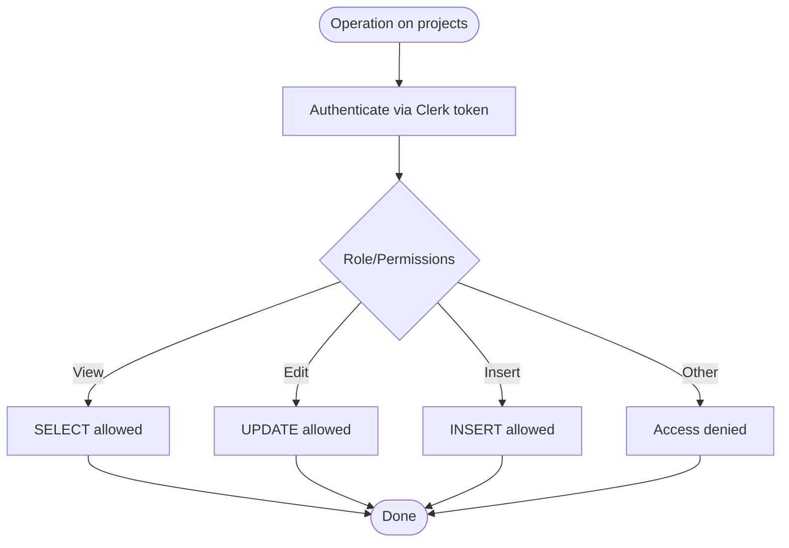
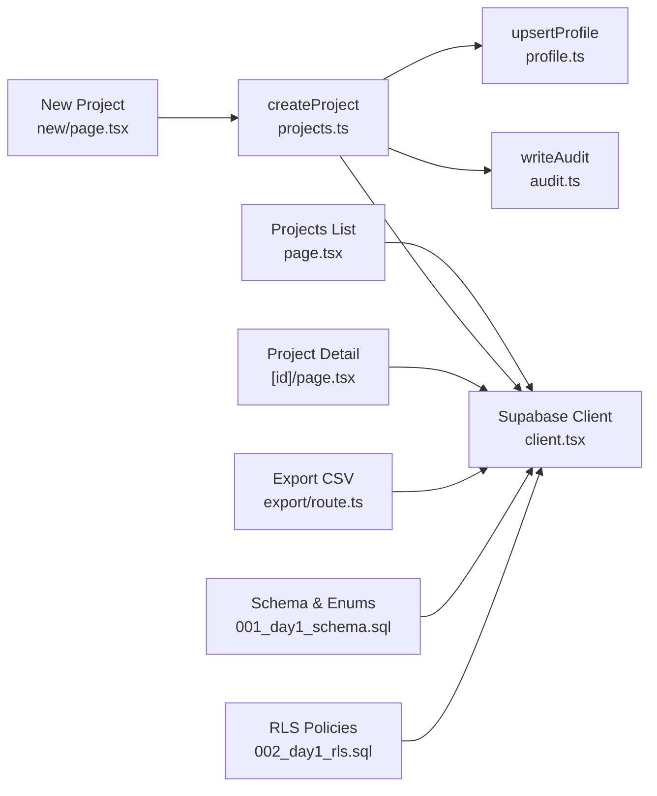

# Project CRUD Operations

<cite>
**Referenced Files in This Document**
- [app/projects/page.tsx](file://app/projects/page.tsx)
- [app/projects/new/page.tsx](file://app/projects/new/page.tsx)
- [app/projects/[id]/page.tsx](file://app/projects/[id]/page.tsx)
- [app/projects/export/route.ts](file://app/projects/export/route.ts)
- [app/ssr/projects.ts](file://app/ssr/projects.ts)
- [app/ssr/profile.ts](file://app/ssr/profile.ts)
- [app/ssr/audit.ts](file://app/ssr/audit.ts)
- [app/ssr/client.tsx](file://app/ssr/client.tsx)
- [supabase/migrations/001_day1_schema.sql](file://supabase/migrations/001_day1_schema.sql)
- [supabase/migrations/002_day1_rls.sql](file://supabase/migrations/002_day1_rls.sql)
</cite>

## Table of Contents
1. [Introduction](#introduction)
2. [Project Structure](#project-structure)
3. [Core Components](#core-components)
4. [Architecture Overview](#architecture-overview)
5. [Detailed Component Analysis](#detailed-component-analysis)
6. [Dependency Analysis](#dependency-analysis)
7. [Performance Considerations](#performance-considerations)
8. [Troubleshooting Guide](#troubleshooting-guide)
9. [Conclusion](#conclusion)

## Introduction
This document explains the complete Project CRUD lifecycle in the Project Management system, covering creation, reading, updating, and deletion. It details the project listing interface, the creation form workflow, the project detail view, update mechanisms, deletion behavior, access controls, validation, and error handling. Practical scenarios and best practices are included to guide effective project data management.

## Project Structure
The project management feature spans UI pages, server-side actions, and database schema with Row Level Security (RLS) policies.

- Listing and navigation: Projects list page queries and renders project metadata.
- Creation: New project form posts to a server action that inserts a project and audits the operation.
- Detail: Project detail page fetches project data and related entities (milestones, documents, tenders).
- Export: CSV export endpoint retrieves selected project fields for download.
- Backend services: Supabase client initialization, profile upsert, and audit logging.
- Database: Projects table, enums, and RLS policies define data model and access control.

**Diagram sources**
- [app/projects/page.tsx](file://app/projects/page.tsx#L1-L65)
- [app/projects/new/page.tsx](file://app/projects/new/page.tsx#L1-L68)
- [app/projects/[id]/page.tsx](file://app/projects/[id]/page.tsx#L1-L138)
- [app/projects/export/route.ts](file://app/projects/export/route.ts#L1-L26)
- [app/ssr/projects.ts](file://app/ssr/projects.ts#L1-L43)
- [app/ssr/profile.ts](file://app/ssr/profile.ts#L1-L31)
- [app/ssr/audit.ts](file://app/ssr/audit.ts#L1-L29)
- [app/ssr/client.tsx](file://app/ssr/client.tsx#L1-L25)
- [supabase/migrations/001_day1_schema.sql](file://supabase/migrations/001_day1_schema.sql#L95-L110)
- [supabase/migrations/002_day1_rls.sql](file://supabase/migrations/002_day1_rls.sql#L147-L163)

**Section sources**
- [app/projects/page.tsx](file://app/projects/page.tsx#L1-L65)
- [app/projects/new/page.tsx](file://app/projects/new/page.tsx#L1-L68)
- [app/projects/[id]/page.tsx](file://app/projects/[id]/page.tsx#L1-L138)
- [app/projects/export/route.ts](file://app/projects/export/route.ts#L1-L26)
- [app/ssr/projects.ts](file://app/ssr/projects.ts#L1-L43)
- [app/ssr/profile.ts](file://app/ssr/profile.ts#L1-L31)
- [app/ssr/audit.ts](file://app/ssr/audit.ts#L1-L29)
- [app/ssr/client.tsx](file://app/ssr/client.tsx#L1-L25)
- [supabase/migrations/001_day1_schema.sql](file://supabase/migrations/001_day1_schema.sql#L95-L110)
- [supabase/migrations/002_day1_rls.sql](file://supabase/migrations/002_day1_rls.sql#L147-L163)

## Core Components
- Projects list page: Fetches and displays project code, name, status, progress percentage, and links to detail view. Includes navigation to create and export.
- New project form: Captures project code, name, and status; submits to a server action to create the project.
- Project detail page: Loads project summary and related data (milestones, recent documents, linked tenders).
- Server action createProject: Upserts the current user’s profile, creates the project with defaults, writes audit log, and triggers cache revalidation.
- Supabase client: Initializes a Supabase client using Clerk auth tokens for secure server-side operations.
- Audit and profile services: Provide audit logging and profile synchronization for authenticated users.
- Database schema and RLS: Defines project table, enums, foreign keys, and access policies for view/edit permissions.

**Section sources**
- [app/projects/page.tsx](file://app/projects/page.tsx#L4-L65)
- [app/projects/new/page.tsx](file://app/projects/new/page.tsx#L6-L68)
- [app/projects/[id]/page.tsx](file://app/projects/[id]/page.tsx#L5-L138)
- [app/ssr/projects.ts](file://app/ssr/projects.ts#L8-L42)
- [app/ssr/client.tsx](file://app/ssr/client.tsx#L4-L14)
- [app/ssr/profile.ts](file://app/ssr/profile.ts#L6-L30)
- [app/ssr/audit.ts](file://app/ssr/audit.ts#L6-L28)
- [supabase/migrations/001_day1_schema.sql](file://supabase/migrations/001_day1_schema.sql#L95-L110)
- [supabase/migrations/002_day1_rls.sql](file://supabase/migrations/002_day1_rls.sql#L147-L163)

## Architecture Overview
The system uses Next.js App Router with server actions and Supabase for data persistence. Authentication is handled via Clerk; server actions use a Supabase client initialized with Clerk JWT tokens. Access control is enforced by Postgres RLS policies.

**Diagram sources**
- [app/projects/new/page.tsx](file://app/projects/new/page.tsx#L13-L16)
- [app/ssr/projects.ts](file://app/ssr/projects.ts#L13-L42)
- [app/ssr/profile.ts](file://app/ssr/profile.ts#L15-L23)
- [app/ssr/client.tsx](file://app/ssr/client.tsx#L16-L24)
- [supabase/migrations/001_day1_schema.sql](file://supabase/migrations/001_day1_schema.sql#L95-L110)
- [supabase/migrations/002_day1_rls.sql](file://supabase/migrations/002_day1_rls.sql#L147-L163)

## Detailed Component Analysis

### Projects Listing Interface
- Purpose: Display a paginated-like table of projects with essential metadata.
- Data fetched: Project code, name, status, progress percentage, and project manager display name.
- Controls: Links to create a new project and export to CSV.
- Behavior: Orders by creation date descending; shows “No projects yet” when empty.

**Diagram sources**
- [app/projects/page.tsx](file://app/projects/page.tsx#L6-L9)
- [app/projects/page.tsx](file://app/projects/page.tsx#L26-L61)

**Section sources**
- [app/projects/page.tsx](file://app/projects/page.tsx#L4-L65)

### Project Creation Form Workflow
- Fields: Project Code (required), Project Name (required), Status (dropdown with active/on_hold/completed).
- Defaults: Status defaults to active; PM is set to the current authenticated profile.
- Validation: HTML required attributes on code and name; server action validates presence of profile and handles errors.
- Submission: On submit, the server action upserts the profile, inserts the project with defaults, writes audit, and revalidates the list.

**Diagram sources**
- [app/projects/new/page.tsx](file://app/projects/new/page.tsx#L13-L16)
- [app/ssr/projects.ts](file://app/ssr/projects.ts#L13-L42)
- [app/ssr/profile.ts](file://app/ssr/profile.ts#L15-L23)
- [app/ssr/audit.ts](file://app/ssr/audit.ts#L17-L23)

**Section sources**
- [app/projects/new/page.tsx](file://app/projects/new/page.tsx#L6-L68)
- [app/ssr/projects.ts](file://app/ssr/projects.ts#L8-L42)
- [app/ssr/profile.ts](file://app/ssr/profile.ts#L6-L30)
- [app/ssr/audit.ts](file://app/ssr/audit.ts#L6-L28)

### Project Detail View
- Purpose: Present comprehensive project information and related entities.
- Data loaded: Project summary fields, linked client and PM display names, upcoming milestones, linked tenders, and recent documents.
- Navigation: Links to upload documents and back to projects list.
- Error handling: Returns a 404 if the project does not exist.

**Diagram sources**
- [app/projects/[id]/page.tsx](file://app/projects/[id]/page.tsx#L10-L22)
- [app/projects/[id]/page.tsx](file://app/projects/[id]/page.tsx#L24-L42)

**Section sources**
- [app/projects/[id]/page.tsx](file://app/projects/[id]/page.tsx#L5-L138)

### Project Update Process
- Access control: Update is permitted for super_admin, chairman_vp, dept_head, pm roles, or the project manager (pm_profile_id).
- Implementation: The server action pattern follows the existing createProject structure. To update, call a server action that:
  - Upserts the current profile
  - Validates edit permissions via RLS
  - Updates the projects row with provided fields
  - Writes audit log
  - Revalidates affected routes

**Diagram sources**
- [app/ssr/projects.ts](file://app/ssr/projects.ts#L13-L42)
- [supabase/migrations/002_day1_rls.sql](file://supabase/migrations/002_day1_rls.sql#L59-L73)

**Section sources**
- [app/ssr/projects.ts](file://app/ssr/projects.ts#L1-L43)
- [supabase/migrations/002_day1_rls.sql](file://supabase/migrations/002_day1_rls.sql#L59-L73)

### Project Deletion and Cascade Effects
- Access control: Deletion is governed by RLS policies; only authorized roles or owners can delete.
- Cascade behavior: Deleting a project cascades to dependent entities:
  - project_members (member rows removed)
  - project_milestones (milestones removed)
  - tenders (tenders linked to the project are set to have project_id null)
  - documents (documents linked to the project are set to have project_id null)
- Audit trail: Write audit log entries for delete actions.

**Diagram sources**
- [supabase/migrations/001_day1_schema.sql](file://supabase/migrations/001_day1_schema.sql#L112-L128)
- [supabase/migrations/001_day1_schema.sql](file://supabase/migrations/001_day1_schema.sql#L130-L144)
- [supabase/migrations/001_day1_schema.sql](file://supabase/migrations/001_day1_schema.sql#L164-L180)
- [app/ssr/audit.ts](file://app/ssr/audit.ts#L17-L23)

**Section sources**
- [supabase/migrations/001_day1_schema.sql](file://supabase/migrations/001_day1_schema.sql#L112-L128)
- [supabase/migrations/001_day1_schema.sql](file://supabase/migrations/001_day1_schema.sql#L130-L144)
- [supabase/migrations/001_day1_schema.sql](file://supabase/migrations/001_day1_schema.sql#L164-L180)
- [app/ssr/audit.ts](file://app/ssr/audit.ts#L6-L28)

### Project Access Controls and Data Validation
- Authentication: Supabase client uses Clerk JWT tokens to authenticate server requests.
- Authorization:
  - View projects: super_admin, chairman_vp, dept_head, pm, engineer, viewer; or project members; or project manager.
  - Edit projects: super_admin, chairman_vp, dept_head, pm; or project manager.
  - Insert projects: super_admin, chairman_vp, dept_head, pm.
- Data validation:
  - Frontend: required fields for code and name.
  - Backend: profile existence check; error propagation on insert failure.
  - Database: unique code constraint; enums for status; default values for progress and status.

**Diagram sources**
- [app/ssr/client.tsx](file://app/ssr/client.tsx#L4-L14)
- [supabase/migrations/002_day1_rls.sql](file://supabase/migrations/002_day1_rls.sql#L37-L73)
- [supabase/migrations/002_day1_rls.sql](file://supabase/migrations/002_day1_rls.sql#L147-L163)
- [supabase/migrations/001_day1_schema.sql](file://supabase/migrations/001_day1_schema.sql#L97-L109)

**Section sources**
- [app/ssr/client.tsx](file://app/ssr/client.tsx#L1-L25)
- [supabase/migrations/002_day1_rls.sql](file://supabase/migrations/002_day1_rls.sql#L37-L73)
- [supabase/migrations/002_day1_rls.sql](file://supabase/migrations/002_day1_rls.sql#L147-L163)
- [supabase/migrations/001_day1_schema.sql](file://supabase/migrations/001_day1_schema.sql#L97-L109)

### Error Handling
- Profile not found during creation: thrown as an error.
- Insert failures: propagate error messages from Supabase.
- Project not found in detail view: triggers a 404 response.
- Audit/write failures: thrown as errors to surface issues.

**Section sources**
- [app/ssr/projects.ts](file://app/ssr/projects.ts#L21-L38)
- [app/projects/[id]/page.tsx](file://app/projects/[id]/page.tsx#L20-L22)
- [app/ssr/audit.ts](file://app/ssr/audit.ts#L25-L27)

### Practical Scenarios and Best Practices
- Create a project:
  - Fill code and name; choose status; submit. The system sets PM to the current user and defaults progress to 0.
- Update a project:
  - Use the update mechanism with proper permissions; update only required fields; verify audit logs.
- Delete a project:
  - Confirm cascade effects; ensure no unintended data loss; verify audit trail.
- Export projects:
  - Use the export endpoint to download a CSV of essential fields.

**Section sources**
- [app/projects/new/page.tsx](file://app/projects/new/page.tsx#L6-L68)
- [app/projects/export/route.ts](file://app/projects/export/route.ts#L4-L25)
- [app/ssr/projects.ts](file://app/ssr/projects.ts#L25-L38)

## Dependency Analysis
- UI depends on server actions for mutations and Supabase client for data access.
- Server actions depend on profile upsert and audit services.
- Database schema defines foreign keys and enums; RLS policies govern access.

**Diagram sources**
- [app/projects/page.tsx](file://app/projects/page.tsx#L2-L9)
- [app/projects/new/page.tsx](file://app/projects/new/page.tsx#L4)
- [app/ssr/projects.ts](file://app/ssr/projects.ts#L3-L6)
- [app/ssr/profile.ts](file://app/ssr/profile.ts#L3-L4)
- [app/ssr/audit.ts](file://app/ssr/audit.ts#L3-L4)
- [app/projects/[id]/page.tsx](file://app/projects/[id]/page.tsx#L3)
- [app/projects/export/route.ts](file://app/projects/export/route.ts#L2)
- [supabase/migrations/001_day1_schema.sql](file://supabase/migrations/001_day1_schema.sql#L95-L110)
- [supabase/migrations/002_day1_rls.sql](file://supabase/migrations/002_day1_rls.sql#L147-L163)

**Section sources**
- [app/projects/page.tsx](file://app/projects/page.tsx#L1-L65)
- [app/projects/new/page.tsx](file://app/projects/new/page.tsx#L1-L68)
- [app/projects/[id]/page.tsx](file://app/projects/[id]/page.tsx#L1-L138)
- [app/projects/export/route.ts](file://app/projects/export/route.ts#L1-L26)
- [app/ssr/projects.ts](file://app/ssr/projects.ts#L1-L43)
- [app/ssr/profile.ts](file://app/ssr/profile.ts#L1-L31)
- [app/ssr/audit.ts](file://app/ssr/audit.ts#L1-L29)
- [app/ssr/client.tsx](file://app/ssr/client.tsx#L1-L25)
- [supabase/migrations/001_day1_schema.sql](file://supabase/migrations/001_day1_schema.sql#L95-L110)
- [supabase/migrations/002_day1_rls.sql](file://supabase/migrations/002_day1_rls.sql#L147-L163)

## Performance Considerations
- Use targeted SELECT queries with only required columns to minimize payload.
- Apply LIMIT and ORDER clauses for related lists (e.g., recent documents).
- Leverage database indexes on frequently filtered columns (e.g., created_at, project_id).
- Revalidate only affected paths after mutations to reduce unnecessary cache invalidation.

## Troubleshooting Guide
- Authentication errors: Verify Clerk token retrieval in the Supabase client initializer.
- Permission denied: Confirm user role and relationship to the project (PM or member).
- Insert failures: Check unique constraints (e.g., project code) and required fields.
- Audit failures: Ensure the current profile exists and audit insertion succeeds.

**Section sources**
- [app/ssr/client.tsx](file://app/ssr/client.tsx#L4-L14)
- [supabase/migrations/002_day1_rls.sql](file://supabase/migrations/002_day1_rls.sql#L37-L73)
- [supabase/migrations/001_day1_schema.sql](file://supabase/migrations/001_day1_schema.sql#L97-L98)
- [app/ssr/audit.ts](file://app/ssr/audit.ts#L25-L27)

## Conclusion
The Project Management system implements a robust CRUD lifecycle with clear separation of concerns between UI, server actions, and database services. Access control is enforced via RLS, and audit logging ensures traceability. Following the outlined patterns and best practices will help maintain data integrity and a secure, efficient project management experience.