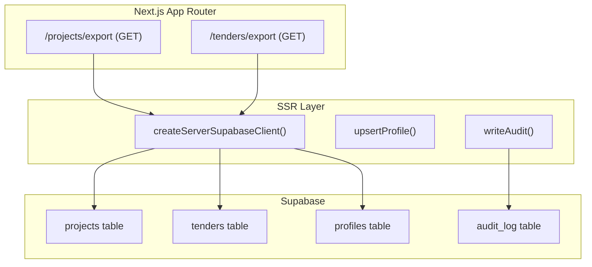
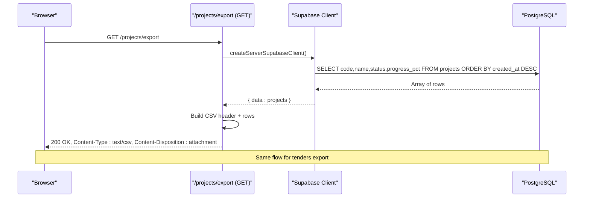
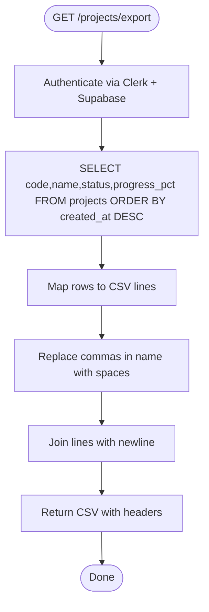
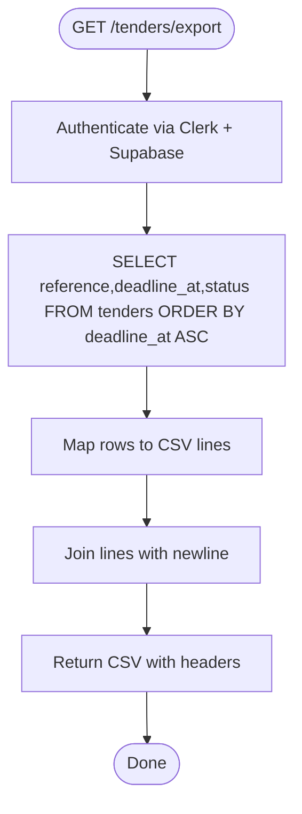
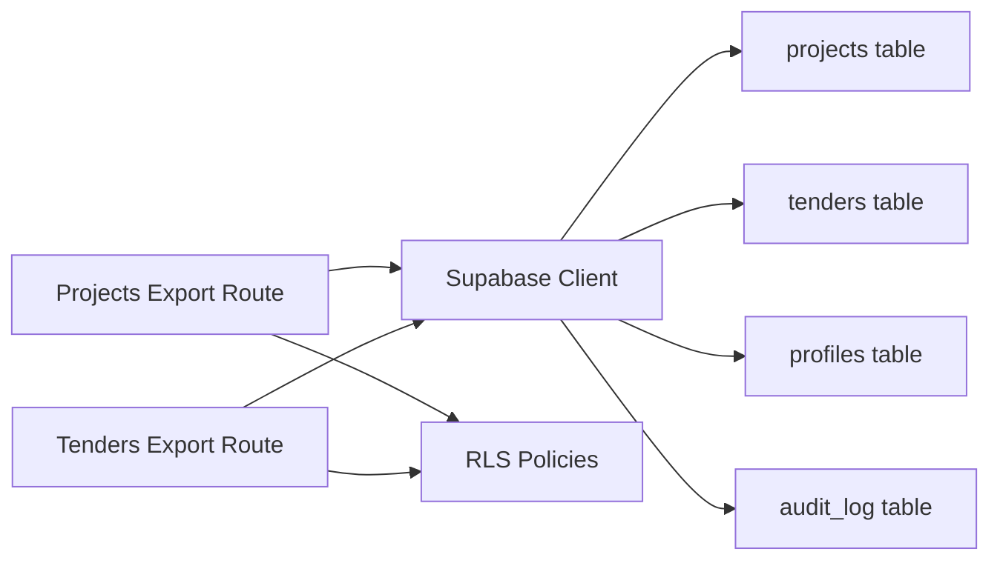
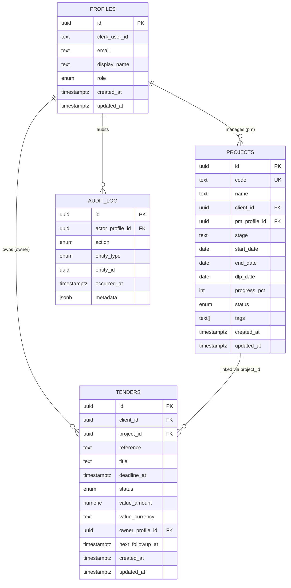

# Project Export and Data Management

<cite>
**Referenced Files in This Document**
- [README.md](file://README.md)
- [route.ts (Projects Export)](file://app/projects/export/route.ts)
- [route.ts (Tenders Export)](file://app/tenders/export/route.ts)
- [client.tsx (Supabase Client)](file://app/ssr/client.tsx)
- [projects.ts (Server Actions)](file://app/ssr/projects.ts)
- [tenders.ts (Server Actions)](file://app/ssr/tenders.ts)
- [audit.ts (Audit Logging)](file://app/ssr/audit.ts)
- [profile.ts (Profile Management)](file://app/ssr/profile.ts)
- [001_day1_schema.sql](file://supabase/migrations/001_day1_schema.sql)
- [002_day1_rls.sql](file://supabase/migrations/002_day1_rls.sql)
- [003_storage_policies.sql](file://supabase/migrations/003_storage_policies.sql)
- [Projects Page](file://app/projects/page.tsx)
- [Tenders Page](file://app/tenders/page.tsx)
</cite>

## Table of Contents
1. [Introduction](#introduction)
2. [Project Structure](#project-structure)
3. [Core Components](#core-components)
4. [Architecture Overview](#architecture-overview)
5. [Detailed Component Analysis](#detailed-component-analysis)
6. [Dependency Analysis](#dependency-analysis)
7. [Performance Considerations](#performance-considerations)
8. [Troubleshooting Guide](#troubleshooting-guide)
9. [Conclusion](#conclusion)
10. [Appendices](#appendices)

## Introduction
This document explains the project export and data management functionality of the MCE Command Center. It focuses on the CSV export process for projects and tenders, detailing which fields are exported, how data is retrieved and formatted, filtering and ordering behavior, integration with reporting systems, performance considerations for large datasets, scheduling capabilities, and alignment with data governance requirements.

## Project Structure
The export feature is implemented as Next.js App Router API routes under each domain resource:
- Projects export: app/projects/export/route.ts
- Tenders export: app/tenders/export/route.ts

Both routes:
- Authenticate and authorize via Clerk and Supabase
- Query the respective database tables with explicit field selection
- Order results for deterministic output
- Render CSV content with appropriate headers and filename

**Diagram sources**
- [route.ts (Projects Export)](file://app/projects/export/route.ts#L1-L26)
- [route.ts (Tenders Export)](file://app/tenders/export/route.ts#L1-L25)
- [client.tsx (Supabase Client)](file://app/ssr/client.tsx#L1-L25)
- [profile.ts (Profile Management)](file://app/ssr/profile.ts#L1-L31)
- [audit.ts (Audit Logging)](file://app/ssr/audit.ts#L1-L29)

**Section sources**
- [README.md](file://README.md#L124-L127)
- [route.ts (Projects Export)](file://app/projects/export/route.ts#L1-L26)
- [route.ts (Tenders Export)](file://app/tenders/export/route.ts#L1-L25)
- [client.tsx (Supabase Client)](file://app/ssr/client.tsx#L1-L25)

## Core Components
- Projects export route
  - Selects code, name, status, progress_pct
  - Orders by created_at descending
  - Produces CSV with header row and comma-separated values
- Tenders export route
  - Selects reference, deadline_at, status
  - Orders by deadline_at ascending
  - Produces CSV with header row and comma-separated values
- Authentication and authorization
  - Supabase client configured with Clerk JWT access tokens
  - Row-level security policies govern visibility of projects and tenders
- Data governance
  - Audit logging records create actions
  - Profile upsert ensures actor identity for audit trails

Key export fields and formatting:
- Projects: code, name, status, progress_pct
- Tenders: reference, deadline_at, status
- CSV formatting: header row followed by rows; commas separate fields; no quotes or escaping for special characters

**Section sources**
- [route.ts (Projects Export)](file://app/projects/export/route.ts#L4-L25)
- [route.ts (Tenders Export)](file://app/tenders/export/route.ts#L4-L24)
- [client.tsx (Supabase Client)](file://app/ssr/client.tsx#L4-L14)
- [002_day1_rls.sql](file://supabase/migrations/002_day1_rls.sql#L147-L162)
- [002_day1_rls.sql](file://supabase/migrations/002_day1_rls.sql#L203-L221)
- [audit.ts (Audit Logging)](file://app/ssr/audit.ts#L6-L28)
- [profile.ts (Profile Management)](file://app/ssr/profile.ts#L6-L30)

## Architecture Overview
The export flow connects the browser to the server-side route, which authenticates the user, queries the database with explicit column selection, applies ordering, and streams a CSV response.

**Diagram sources**
- [route.ts (Projects Export)](file://app/projects/export/route.ts#L4-L25)
- [client.tsx (Supabase Client)](file://app/ssr/client.tsx#L4-L14)
- [001_day1_schema.sql](file://supabase/migrations/001_day1_schema.sql#L95-L110)
- [001_day1_schema.sql](file://supabase/migrations/001_day1_schema.sql#L130-L144)

## Detailed Component Analysis

### Projects Export Route
- Data retrieval
  - Uses Supabase client configured with Clerk JWT
  - Queries projects table selecting code, name, status, progress_pct
  - Orders by created_at descending to show newest first
- CSV formatting
  - Header row: code,name,status,progress_pct
  - Each data row: comma-separated values
  - Name field replaces commas with spaces to avoid CSV parsing issues
- Response
  - Returns CSV with Content-Type text/csv and a filename attachment header

**Diagram sources**
- [route.ts (Projects Export)](file://app/projects/export/route.ts#L4-L25)

**Section sources**
- [route.ts (Projects Export)](file://app/projects/export/route.ts#L4-L25)

### Tenders Export Route
- Data retrieval
  - Uses Supabase client configured with Clerk JWT
  - Queries tenders table selecting reference, deadline_at, status
  - Orders by deadline_at ascending to show nearest deadlines first
- CSV formatting
  - Header row: reference,deadline_at,status
  - Each data row: comma-separated values
- Response
  - Returns CSV with Content-Type text/csv and a filename attachment header

**Diagram sources**
- [route.ts (Tenders Export)](file://app/tenders/export/route.ts#L4-L24)

**Section sources**
- [route.ts (Tenders Export)](file://app/tenders/export/route.ts#L4-L24)

### Data Filtering and Selection Criteria
- Projects
  - Explicit column selection: code, name, status, progress_pct
  - Ordering: created_at DESC
  - Access control: governed by RLS policies; users see only permitted projects
- Tenders
  - Explicit column selection: reference, deadline_at, status
  - Ordering: deadline_at ASC
  - Access control: governed by RLS policies; users see only permitted tenders
- No additional filters (e.g., status, date range) are applied in current routes

**Section sources**
- [route.ts (Projects Export)](file://app/projects/export/route.ts#L6-L9)
- [route.ts (Tenders Export)](file://app/tenders/export/route.ts#L6-L9)
- [002_day1_rls.sql](file://supabase/migrations/002_day1_rls.sql#L147-L162)
- [002_day1_rls.sql](file://supabase/migrations/002_day1_rls.sql#L203-L221)

### Integration with Reporting Systems and BI Tools
- CSV output is compatible with spreadsheet applications and BI tools
- Field names align with common business terminology:
  - Projects: code, name, status, progress_pct
  - Tenders: reference, deadline_at, status
- Recommendations for downstream processing:
  - Import CSV into BI tools (e.g., spreadsheets, Power BI, Tableau)
  - Use status enums and numeric progress_pct for filtering and aggregation
  - Convert deadline_at to local timezone as needed

[No sources needed since this section provides general guidance]

### Relationship to Data Governance Requirements
- Authentication and authorization
  - Clerk-based authentication supplies the user identity
  - Supabase RLS enforces per-record access rules
- Audit logging
  - Create actions are recorded in audit_log with actor, entity, and metadata
- Data minimization
  - Routes select only necessary fields for export
- Append-only audit trail
  - Prevents updates/deletes to audit_log and tender_comms_events

**Section sources**
- [client.tsx (Supabase Client)](file://app/ssr/client.tsx#L4-L14)
- [002_day1_rls.sql](file://supabase/migrations/002_day1_rls.sql#L37-L57)
- [002_day1_rls.sql](file://supabase/migrations/002_day1_rls.sql#L75-L96)
- [audit.ts (Audit Logging)](file://app/ssr/audit.ts#L6-L28)
- [002_day1_rls.sql](file://supabase/migrations/002_day1_rls.sql#L332-L347)

## Dependency Analysis
- Export routes depend on:
  - Supabase client configured with Clerk JWT
  - Database tables: projects, tenders, profiles, audit_log
  - RLS policies for access control
- UI integration:
  - Projects and tenders pages link to their respective export endpoints

**Diagram sources**
- [route.ts (Projects Export)](file://app/projects/export/route.ts#L4-L25)
- [route.ts (Tenders Export)](file://app/tenders/export/route.ts#L4-L24)
- [client.tsx (Supabase Client)](file://app/ssr/client.tsx#L4-L14)
- [001_day1_schema.sql](file://supabase/migrations/001_day1_schema.sql#L95-L110)
- [001_day1_schema.sql](file://supabase/migrations/001_day1_schema.sql#L130-L144)
- [002_day1_rls.sql](file://supabase/migrations/002_day1_rls.sql#L147-L162)

**Section sources**
- [Projects Page](file://app/projects/page.tsx#L19-L21)
- [Tenders Page](file://app/tenders/page.tsx#L19-L21)

## Performance Considerations
- Current implementation
  - Fetches all visible rows and constructs CSV in memory
  - No pagination or streaming response
- Limitations for large datasets
  - Memory usage grows linearly with row count
  - Large exports may timeout or cause high latency
- Recommended optimizations
  - Add pagination to limit batch size
  - Stream CSV rows incrementally to reduce peak memory
  - Add server-side filtering parameters (e.g., date range, status)
  - Implement server-side compression for large exports
  - Consider asynchronous export jobs with download links

[No sources needed since this section provides general guidance]

## Troubleshooting Guide
- Empty or unauthorized data
  - Ensure the user has a profiles row and proper role assignment
  - Verify RLS policies allow viewing the relevant projects/tenders
- CSV formatting issues
  - Names containing commas are normalized; confirm expected normalization
  - Check that dates/time fields render as expected in target tools
- Export endpoint not found
  - Confirm the route exists at /projects/export and /tenders/export
- Authentication failures
  - Verify Clerk integration and Supabase client configuration

**Section sources**
- [README.md](file://README.md#L146-L157)
- [route.ts (Projects Export)](file://app/projects/export/route.ts#L11-L17)
- [route.ts (Tenders Export)](file://app/tenders/export/route.ts#L11-L16)
- [client.tsx (Supabase Client)](file://app/ssr/client.tsx#L4-L14)
- [002_day1_rls.sql](file://supabase/migrations/002_day1_rls.sql#L147-L162)

## Conclusion
The export functionality provides a straightforward, secure mechanism to produce CSV reports for projects and tenders. It leverages Clerk and Supabase for authentication and RLS for access control, and it records audit events for create actions. While the current implementation is efficient for moderate volumes, enhancements such as pagination, streaming, and filtering would improve scalability and usability for larger datasets and automated reporting workflows.

[No sources needed since this section summarizes without analyzing specific files]

## Appendices

### Export Workflows and Business Intelligence Use Cases
- Workflow example: Download projects CSV, import into spreadsheet, filter by status, pivot by progress_pct
- Workflow example: Download tenders CSV, import into BI tool, sort by deadline_at, create alerts for upcoming deadlines
- Schedule exports: Use external automation to call export endpoints periodically and store results in shared locations

[No sources needed since this section provides general guidance]

### Data Model Overview (Relevant Tables)

**Diagram sources**
- [001_day1_schema.sql](file://supabase/migrations/001_day1_schema.sql#L76-L84)
- [001_day1_schema.sql](file://supabase/migrations/001_day1_schema.sql#L95-L110)
- [001_day1_schema.sql](file://supabase/migrations/001_day1_schema.sql#L130-L144)
- [001_day1_schema.sql](file://supabase/migrations/001_day1_schema.sql#L208-L216)