# Project Management

<cite>
**Referenced Files in This Document**
- [app/projects/page.tsx](file://app/projects/page.tsx)
- [app/projects/[id]/page.tsx](file://app/projects/[id]/page.tsx)
- [app/projects/new/page.tsx](file://app/projects/new/page.tsx)
- [app/projects/export/route.ts](file://app/projects/export/route.ts)
- [app/ssr/projects.ts](file://app/ssr/projects.ts)
- [app/ssr/client.tsx](file://app/ssr/client.tsx)
- [app/ssr/profile.ts](file://app/ssr/profile.ts)
- [app/ssr/audit.ts](file://app/ssr/audit.ts)
- [app/ssr/documents.ts](file://app/ssr/documents.ts)
- [app/ssr/comms.ts](file://app/ssr/comms.ts)
- [app/ssr/notifications.ts](file://app/ssr/notifications.ts)
- [app/tenders/page.tsx](file://app/tenders/page.tsx)
- [app/tenders/new/page.tsx](file://app/tenders/new/page.tsx)
- [supabase/migrations/001_day1_schema.sql](file://supabase/migrations/001_day1_schema.sql)
</cite>

## Table of Contents
1. [Introduction](#introduction)
2. [Project Structure](#project-structure)
3. [Core Components](#core-components)
4. [Architecture Overview](#architecture-overview)
5. [Detailed Component Analysis](#detailed-component-analysis)
6. [Dependency Analysis](#dependency-analysis)
7. [Performance Considerations](#performance-considerations)
8. [Troubleshooting Guide](#troubleshooting-guide)
9. [Conclusion](#conclusion)
10. [Appendices](#appendices)

## Introduction
This document describes the Project Management system, focusing on the end-to-end project lifecycle from creation to completion. It covers project CRUD operations, team assignment, progress tracking, milestone management, export capabilities, UI components, access controls, notifications, and audit trails. Practical scenarios and best practices for managing construction and engineering projects are included.

## Project Structure
The Project Management feature is implemented as a Next.js App Router application with server-side rendering and Supabase integration:
- Project listing, detail, creation, and export routes under app/projects
- Tender linkage and listing under app/tenders
- Shared SSR utilities for database access, authentication, auditing, and notifications
- Database schema and enums defined in Supabase migrations

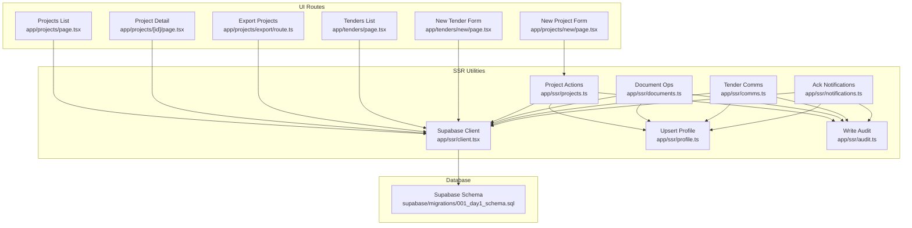

**Diagram sources**
- [app/projects/page.tsx](file://app/projects/page.tsx#L1-L65)
- [app/projects/[id]/page.tsx](file://app/projects/[id]/page.tsx#L1-L138)
- [app/projects/new/page.tsx](file://app/projects/new/page.tsx#L1-L68)
- [app/projects/export/route.ts](file://app/projects/export/route.ts#L1-L26)
- [app/tenders/page.tsx](file://app/tenders/page.tsx#L1-L65)
- [app/tenders/new/page.tsx](file://app/tenders/new/page.tsx#L1-L71)
- [app/ssr/projects.ts](file://app/ssr/projects.ts#L1-L43)
- [app/ssr/client.tsx](file://app/ssr/client.tsx#L1-L25)
- [app/ssr/profile.ts](file://app/ssr/profile.ts#L1-L31)
- [app/ssr/audit.ts](file://app/ssr/audit.ts#L1-L29)
- [app/ssr/documents.ts](file://app/ssr/documents.ts#L1-L114)
- [app/ssr/comms.ts](file://app/ssr/comms.ts#L1-L38)
- [app/ssr/notifications.ts](file://app/ssr/notifications.ts#L1-L27)
- [supabase/migrations/001_day1_schema.sql](file://supabase/migrations/001_day1_schema.sql#L1-L227)

**Section sources**
- [app/projects/page.tsx](file://app/projects/page.tsx#L1-L65)
- [app/projects/[id]/page.tsx](file://app/projects/[id]/page.tsx#L1-L138)
- [app/projects/new/page.tsx](file://app/projects/new/page.tsx#L1-L68)
- [app/projects/export/route.ts](file://app/projects/export/route.ts#L1-L26)
- [app/tenders/page.tsx](file://app/tenders/page.tsx#L1-L65)
- [app/tenders/new/page.tsx](file://app/tenders/new/page.tsx#L1-L71)
- [app/ssr/projects.ts](file://app/ssr/projects.ts#L1-L43)
- [app/ssr/client.tsx](file://app/ssr/client.tsx#L1-L25)
- [app/ssr/profile.ts](file://app/ssr/profile.ts#L1-L31)
- [app/ssr/audit.ts](file://app/ssr/audit.ts#L1-L29)
- [app/ssr/documents.ts](file://app/ssr/documents.ts#L1-L114)
- [app/ssr/comms.ts](file://app/ssr/comms.ts#L1-L38)
- [app/ssr/notifications.ts](file://app/ssr/notifications.ts#L1-L27)
- [supabase/migrations/001_day1_schema.sql](file://supabase/migrations/001_day1_schema.sql#L1-L227)

## Core Components
- Project listing and filtering: fetches projects with selected fields and orders by creation date.
- Project detail view: renders summary, upcoming milestones, linked tenders, and recent documents.
- New project form: captures code, name, and status; submits to server action.
- Project export: generates CSV of selected project attributes.
- Server-side project creation: upserts current user profile, inserts project with PM relationship, writes audit, and revalidates cache.
- Team assignment: project_members table enables assigning profiles to projects with roles.
- Progress tracking: projects include status and progress percentage; milestones define due dates and statuses.
- Milestone management: project_milestones table supports creation and status updates.
- Tender linkage: tenders link to projects and are visible from project detail.
- Document integration: documents can be associated with projects or tenders; upload preparation and download signing supported.
- Notifications and acknowledgments: notifications table supports read/acknowledgment workflows.
- Audit trail: audit_log records actor, action, entity, and metadata.

**Section sources**
- [app/projects/page.tsx](file://app/projects/page.tsx#L1-L65)
- [app/projects/[id]/page.tsx](file://app/projects/[id]/page.tsx#L1-L138)
- [app/projects/new/page.tsx](file://app/projects/new/page.tsx#L1-L68)
- [app/projects/export/route.ts](file://app/projects/export/route.ts#L1-L26)
- [app/ssr/projects.ts](file://app/ssr/projects.ts#L1-L43)
- [supabase/migrations/001_day1_schema.sql](file://supabase/migrations/001_day1_schema.sql#L95-L128)
- [app/ssr/documents.ts](file://app/ssr/documents.ts#L1-L114)
- [app/ssr/notifications.ts](file://app/ssr/notifications.ts#L1-L27)
- [app/ssr/audit.ts](file://app/ssr/audit.ts#L1-L29)

## Architecture Overview
The system integrates Clerk for authentication and Supabase for database and storage. Server actions encapsulate data mutations, while shared utilities handle client instantiation, profile upsert, and audit logging. UI routes render server-fetched data and delegate creation/editing to server actions.

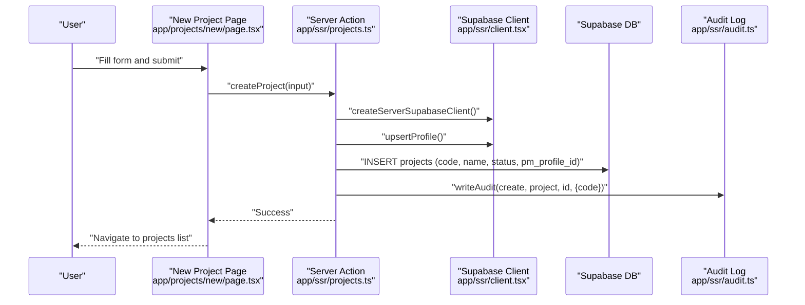

**Diagram sources**
- [app/projects/new/page.tsx](file://app/projects/new/page.tsx#L1-L68)
- [app/ssr/projects.ts](file://app/ssr/projects.ts#L1-L43)
- [app/ssr/client.tsx](file://app/ssr/client.tsx#L1-L25)
- [app/ssr/audit.ts](file://app/ssr/audit.ts#L1-L29)

## Detailed Component Analysis

### Project Lifecycle and CRUD Operations
- Creation: The new project form posts to a server action that upserts the current profile, inserts a project record, sets the current user as project manager via pm_profile_id, writes an audit entry, and triggers cache revalidation.
- Retrieval: Listing queries projects with essential fields; detail view fetches project plus related milestones, documents, and tenders.
- Editing: The current implementation focuses on creation and export. Editing endpoints and UI are not present in the referenced files; updates would require analogous server actions mirroring createProject’s pattern.

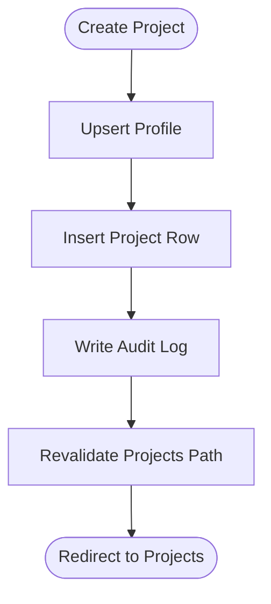

**Diagram sources**
- [app/ssr/projects.ts](file://app/ssr/projects.ts#L1-L43)
- [app/ssr/profile.ts](file://app/ssr/profile.ts#L1-L31)
- [app/ssr/audit.ts](file://app/ssr/audit.ts#L1-L29)

**Section sources**
- [app/projects/new/page.tsx](file://app/projects/new/page.tsx#L1-L68)
- [app/ssr/projects.ts](file://app/ssr/projects.ts#L1-L43)
- [app/projects/page.tsx](file://app/projects/page.tsx#L1-L65)
- [app/projects/[id]/page.tsx](file://app/projects/[id]/page.tsx#L1-L138)

### Team Assignment System
Team assignment is modeled by the project_members junction table linking projects to profiles with a member_role. The schema defines profile_role enumeration including pm, engineer, finance, and viewer. While the project detail view does not currently render assigned members, the underlying data model supports assigning stakeholders to projects.

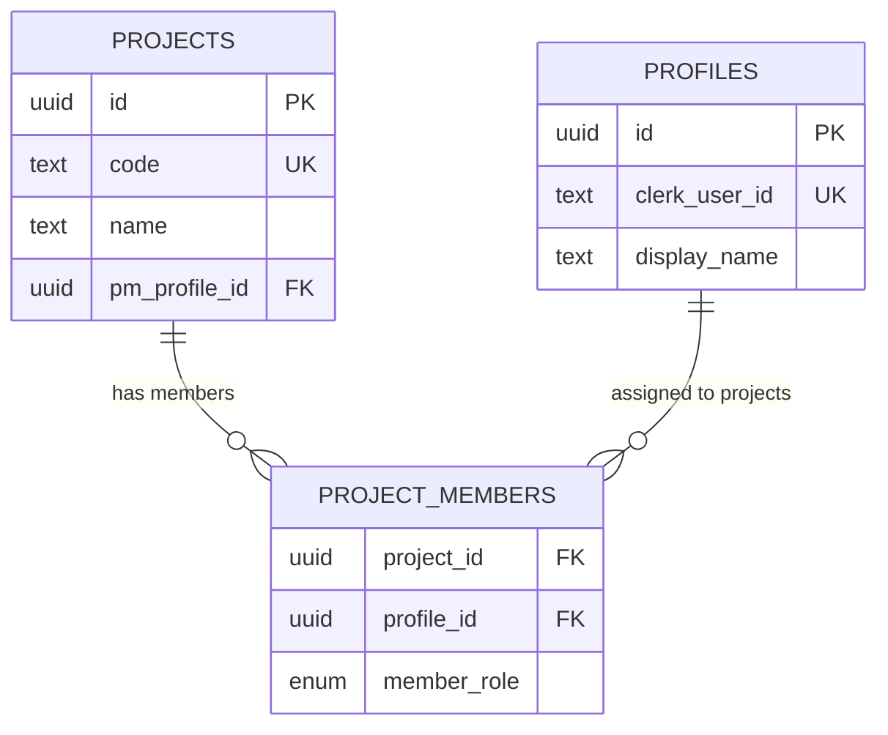

**Diagram sources**
- [supabase/migrations/001_day1_schema.sql](file://supabase/migrations/001_day1_schema.sql#L95-L118)

**Section sources**
- [supabase/migrations/001_day1_schema.sql](file://supabase/migrations/001_day1_schema.sql#L95-L118)
- [app/projects/[id]/page.tsx](file://app/projects/[id]/page.tsx#L1-L138)

### Progress Tracking and Milestone Management
Progress tracking is represented by project progress_pct and status. Milestones are stored in project_milestones with due_date and status. The project detail view lists upcoming milestones, enabling visibility into deadlines and status.

```mermaid
erDiagram
PROJECTS {
uuid id PK
integer progress_pct
enum project_status status
}
PROJECT_MILESTONES {
uuid id PK
uuid project_id FK
text title
date due_date
enum milestone_status status
}
PROJECTS ||--o{ PROJECT_MILESTONES : "contains"
```

**Diagram sources**
- [supabase/migrations/001_day1_schema.sql](file://supabase/migrations/001_day1_schema.sql#L95-L128)
- [app/projects/[id]/page.tsx](file://app/projects/[id]/page.tsx#L24-L42)

**Section sources**
- [supabase/migrations/001_day1_schema.sql](file://supabase/migrations/001_day1_schema.sql#L13-L24)
- [app/projects/[id]/page.tsx](file://app/projects/[id]/page.tsx#L78-L93)

### Project Creation Workflow
- Required fields: code, name, status.
- Validation: form marks code and name as required; status defaults to active.
- Default configurations: progress_pct defaults to 0; status defaults to active; PM is set to the current authenticated profile.
- Submission: server action persists the project and records an audit entry.

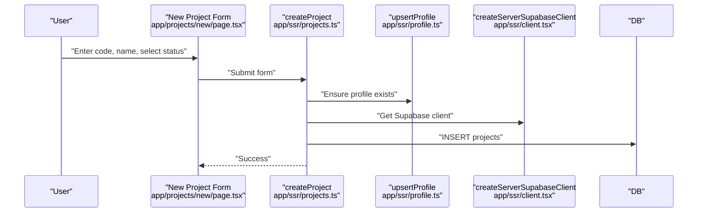

**Diagram sources**
- [app/projects/new/page.tsx](file://app/projects/new/page.tsx#L1-L68)
- [app/ssr/projects.ts](file://app/ssr/projects.ts#L1-L43)
- [app/ssr/profile.ts](file://app/ssr/profile.ts#L1-L31)
- [app/ssr/client.tsx](file://app/ssr/client.tsx#L1-L25)

**Section sources**
- [app/projects/new/page.tsx](file://app/projects/new/page.tsx#L1-L68)
- [app/ssr/projects.ts](file://app/ssr/projects.ts#L1-L43)
- [app/ssr/profile.ts](file://app/ssr/profile.ts#L1-L31)

### Project Editing Capabilities
- Current state: No explicit edit endpoints or forms are present in the referenced files.
- Recommended pattern: Mirror createProject’s server action approach for updates, ensuring upsertProfile, Supabase mutation, audit logging, and cache revalidation.

[No sources needed since this section provides recommended implementation guidance]

### Export Functionality and Reporting Integration
- Export endpoint: GET /projects/export returns CSV with code, name, status, progress_pct ordered by created_at descending.
- Integration: CSV can be imported into external reporting systems for dashboards and analytics.

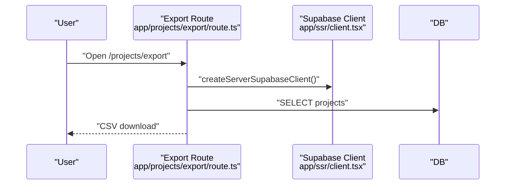

**Diagram sources**
- [app/projects/export/route.ts](file://app/projects/export/route.ts#L1-L26)
- [app/ssr/client.tsx](file://app/ssr/client.tsx#L1-L25)

**Section sources**
- [app/projects/export/route.ts](file://app/projects/export/route.ts#L1-L26)

### User Interface Components
- Projects list: Displays code, name, PM placeholder, status, progress, and action links; includes “New Project” and “Export CSV” buttons.
- Project detail: Shows summary cards, upcoming milestones, linked tenders, and recent documents.
- New project form: Inputs for code, name, and status with save button.
- Tenders list/detail: Related to project management; tenders can be linked to projects and accessed from project detail.

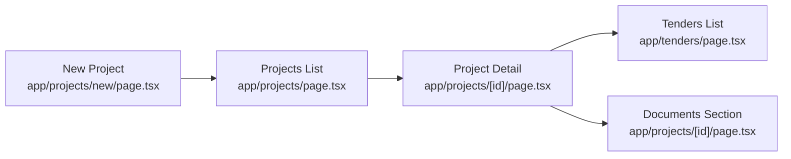

**Diagram sources**
- [app/projects/page.tsx](file://app/projects/page.tsx#L1-L65)
- [app/projects/[id]/page.tsx](file://app/projects/[id]/page.tsx#L1-L138)
- [app/projects/new/page.tsx](file://app/projects/new/page.tsx#L1-L68)
- [app/tenders/page.tsx](file://app/tenders/page.tsx#L1-L65)

**Section sources**
- [app/projects/page.tsx](file://app/projects/page.tsx#L1-L65)
- [app/projects/[id]/page.tsx](file://app/projects/[id]/page.tsx#L1-L138)
- [app/projects/new/page.tsx](file://app/projects/new/page.tsx#L1-L68)
- [app/tenders/page.tsx](file://app/tenders/page.tsx#L1-L65)

### Access Controls and Authentication
- Clerk integration: Authentication handled by Clerk; server utilities retrieve tokens for Supabase client.
- Supabase service role client: Dedicated client for privileged operations using service role key.
- Profile upsert: Ensures authenticated user has a profiles record with clerk_user_id, email, and display_name.

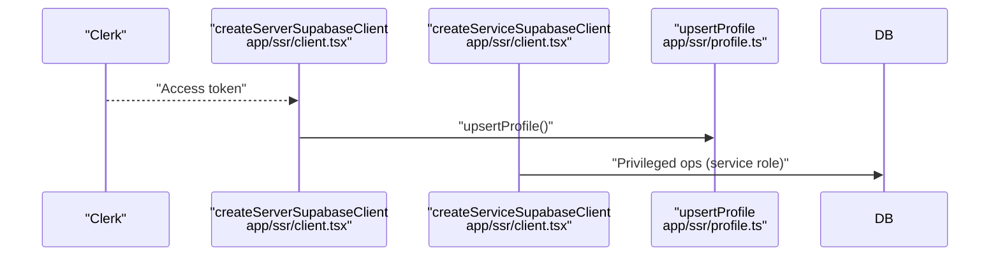

**Diagram sources**
- [app/ssr/client.tsx](file://app/ssr/client.tsx#L1-L25)
- [app/ssr/profile.ts](file://app/ssr/profile.ts#L1-L31)

**Section sources**
- [app/ssr/client.tsx](file://app/ssr/client.tsx#L1-L25)
- [app/ssr/profile.ts](file://app/ssr/profile.ts#L1-L31)

### Notification Workflows and Acknowledgment
- Notifications table supports severity, type, message, and acknowledgment fields.
- Acknowledgment action updates acked_at and acked_by_profile_id and logs an audit entry.

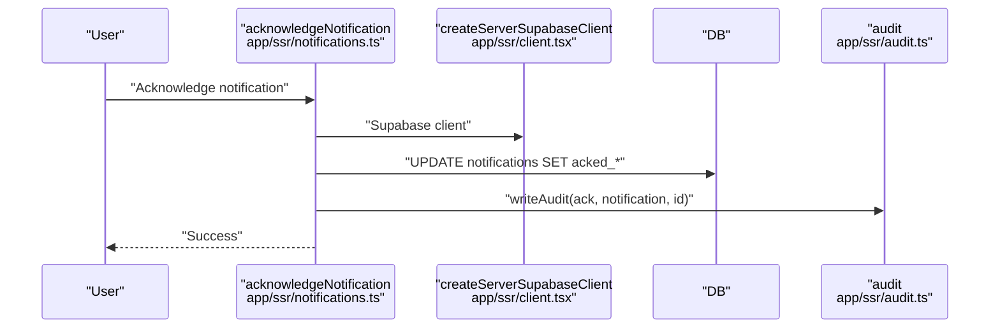

**Diagram sources**
- [app/ssr/notifications.ts](file://app/ssr/notifications.ts#L1-L27)
- [app/ssr/audit.ts](file://app/ssr/audit.ts#L1-L29)
- [app/ssr/client.tsx](file://app/ssr/client.tsx#L1-L25)

**Section sources**
- [app/ssr/notifications.ts](file://app/ssr/notifications.ts#L1-L27)
- [app/ssr/audit.ts](file://app/ssr/audit.ts#L1-L29)

### Audit Trail for Project Modifications
- Audit log captures actor_profile_id, action, entity_type, entity_id, occurred_at, and metadata.
- Projects create events include metadata such as code.

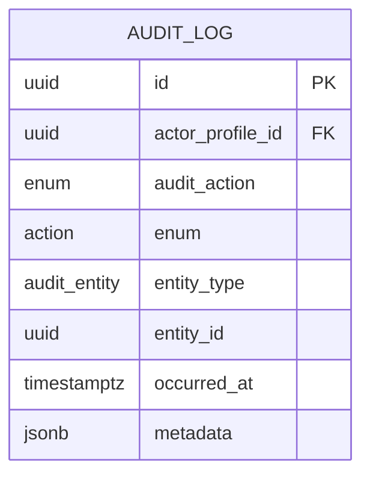

**Diagram sources**
- [supabase/migrations/001_day1_schema.sql](file://supabase/migrations/001_day1_schema.sql#L208-L216)
- [app/ssr/audit.ts](file://app/ssr/audit.ts#L1-L29)

**Section sources**
- [app/ssr/audit.ts](file://app/ssr/audit.ts#L1-L29)
- [supabase/migrations/001_day1_schema.sql](file://supabase/migrations/001_day1_schema.sql#L59-L74)

### Document Integration and Storage
- Document preparation: Creates a document record and signed upload URL for cloud storage; schedules extraction jobs; writes audit.
- Download signing: Generates short-lived signed URLs for retrieval.
- Association: Documents can be linked to projects or tenders.

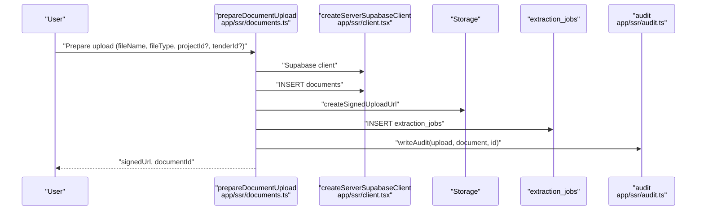

**Diagram sources**
- [app/ssr/documents.ts](file://app/ssr/documents.ts#L1-L114)
- [app/ssr/audit.ts](file://app/ssr/audit.ts#L1-L29)
- [app/ssr/client.tsx](file://app/ssr/client.tsx#L1-L25)

**Section sources**
- [app/ssr/documents.ts](file://app/ssr/documents.ts#L1-L114)

### Tender Linkage and Communication Events
- Tenders can be linked to projects and viewed from project detail.
- Tender communication events capture channel, outcome, and notes; audited on creation.

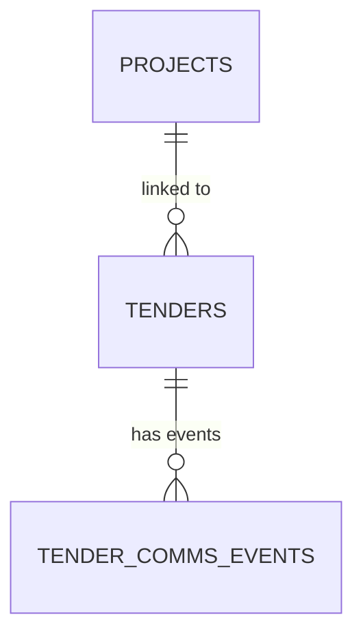

**Diagram sources**
- [supabase/migrations/001_day1_schema.sql](file://supabase/migrations/001_day1_schema.sql#L130-L162)
- [app/projects/[id]/page.tsx](file://app/projects/[id]/page.tsx#L37-L41)
- [app/ssr/comms.ts](file://app/ssr/comms.ts#L1-L38)

**Section sources**
- [app/projects/[id]/page.tsx](file://app/projects/[id]/page.tsx#L37-L41)
- [app/ssr/comms.ts](file://app/ssr/comms.ts#L1-L38)

## Dependency Analysis
- UI routes depend on SSR utilities for data access and mutations.
- Server actions depend on Supabase client and profile upsert.
- Audit logging is centralized and reused across actions.
- Database schema defines relationships and constraints for projects, milestones, tenders, documents, and notifications.

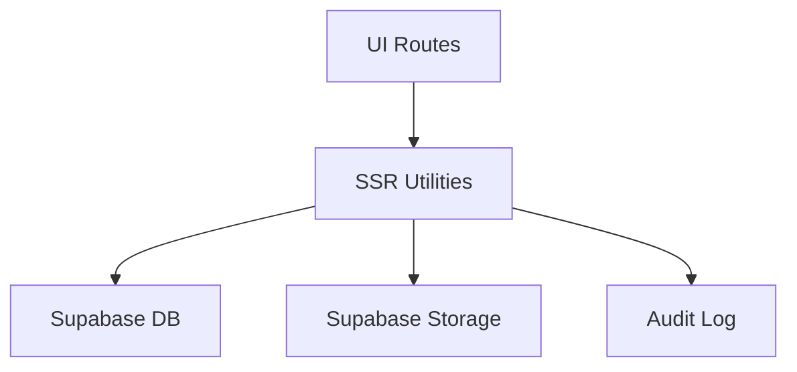

**Diagram sources**
- [app/projects/page.tsx](file://app/projects/page.tsx#L1-L65)
- [app/ssr/projects.ts](file://app/ssr/projects.ts#L1-L43)
- [app/ssr/client.tsx](file://app/ssr/client.tsx#L1-L25)
- [app/ssr/audit.ts](file://app/ssr/audit.ts#L1-L29)

**Section sources**
- [app/projects/page.tsx](file://app/projects/page.tsx#L1-L65)
- [app/ssr/projects.ts](file://app/ssr/projects.ts#L1-L43)
- [app/ssr/client.tsx](file://app/ssr/client.tsx#L1-L25)
- [app/ssr/audit.ts](file://app/ssr/audit.ts#L1-L29)

## Performance Considerations
- Use database indexes on frequently filtered/sorted columns (e.g., projects(pm), milestones(due_date), tenders(deadline)).
- Batch reads/writes where possible; the project detail page already uses Promise.all for related queries.
- Prefer server actions for mutations to minimize client-server round trips.
- Limit result sets (e.g., recent documents limit) to reduce payload sizes.

[No sources needed since this section provides general guidance]

## Troubleshooting Guide
- Authentication failures: Ensure Clerk is configured and NEXT_PUBLIC_SUPABASE_URL/NEXT_PUBLIC_SUPABASE_KEY are set; verify access token retrieval in the Supabase client.
- Profile not found during project creation: Confirm upsertProfile executes before project insert; check Clerk user session.
- Audit write errors: Verify audit_log table permissions and that actor_profile_id resolves to an existing profile.
- Document upload failures: Confirm storage bucket name matches and service role key grants permission; check extraction_jobs insertion.
- Notification acknowledgment errors: Validate notification exists and user has permission to acknowledge.

**Section sources**
- [app/ssr/client.tsx](file://app/ssr/client.tsx#L1-L25)
- [app/ssr/profile.ts](file://app/ssr/profile.ts#L1-L31)
- [app/ssr/audit.ts](file://app/ssr/audit.ts#L1-L29)
- [app/ssr/documents.ts](file://app/ssr/documents.ts#L1-L114)
- [app/ssr/notifications.ts](file://app/ssr/notifications.ts#L1-L27)

## Conclusion
The Project Management system provides a solid foundation for managing construction and engineering projects with clear separation of concerns across UI, server actions, and database models. Core capabilities include project creation, listing, detail views, export, team assignment, milestones, and document integration. Extending the system to support editing, comprehensive progress tracking, and advanced notifications follows established patterns in the codebase.

## Appendices

### Practical Scenarios and Best Practices
- Creating a new project: Use the new project form; ensure unique project code; assign PM automatically via authenticated profile; set initial status to active.
- Managing team assignments: Assign engineers, finance, and other stakeholders via project_members; leverage member_role for access control.
- Tracking progress: Set progress_pct and update status; define milestones with due dates and statuses; monitor upcoming milestones from project detail.
- Deadline management: Link tenders to projects; monitor deadlines and communicate outcomes; use communication events to track interactions.
- Reporting: Export projects as CSV for dashboards; integrate with BI tools for KPIs and trends.
- Document control: Use document upload preparation for secure ingestion; apply sensitivity levels; schedule extraction jobs for searchable content.

[No sources needed since this section provides general guidance]