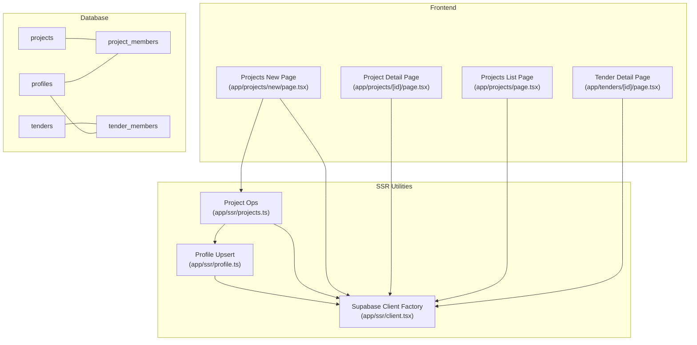
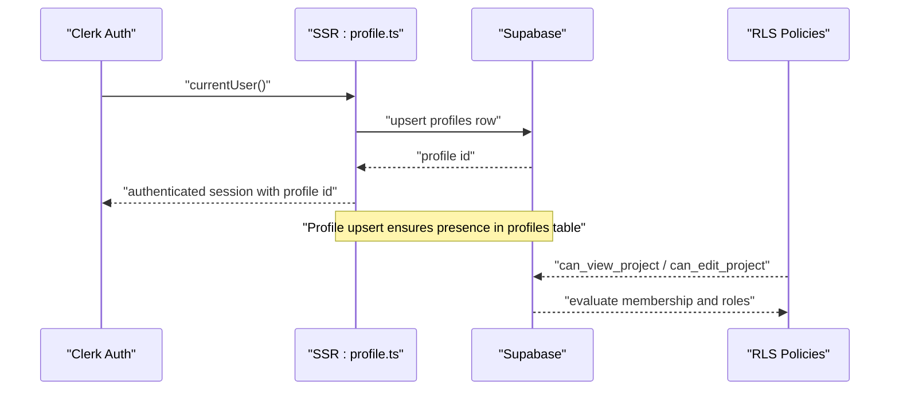
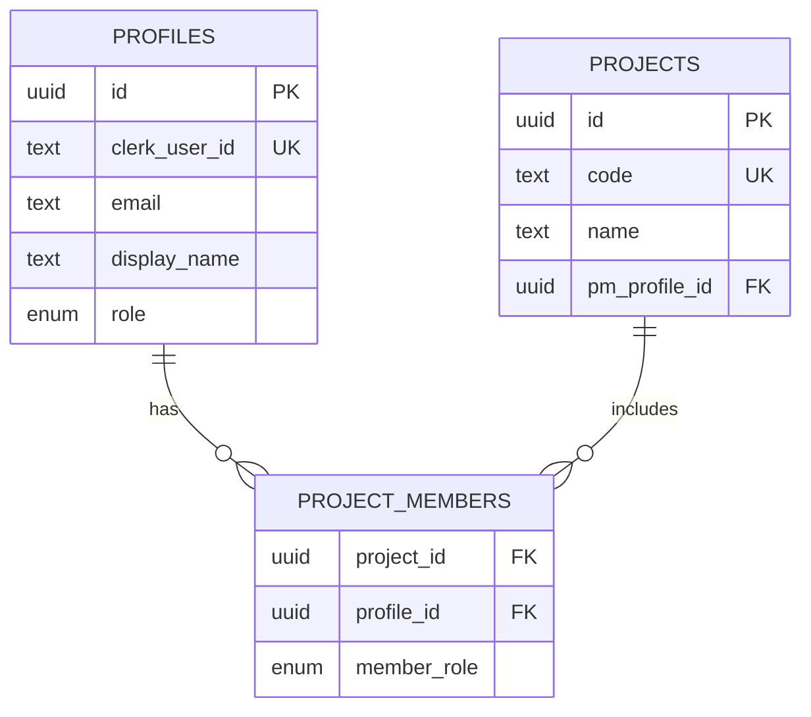
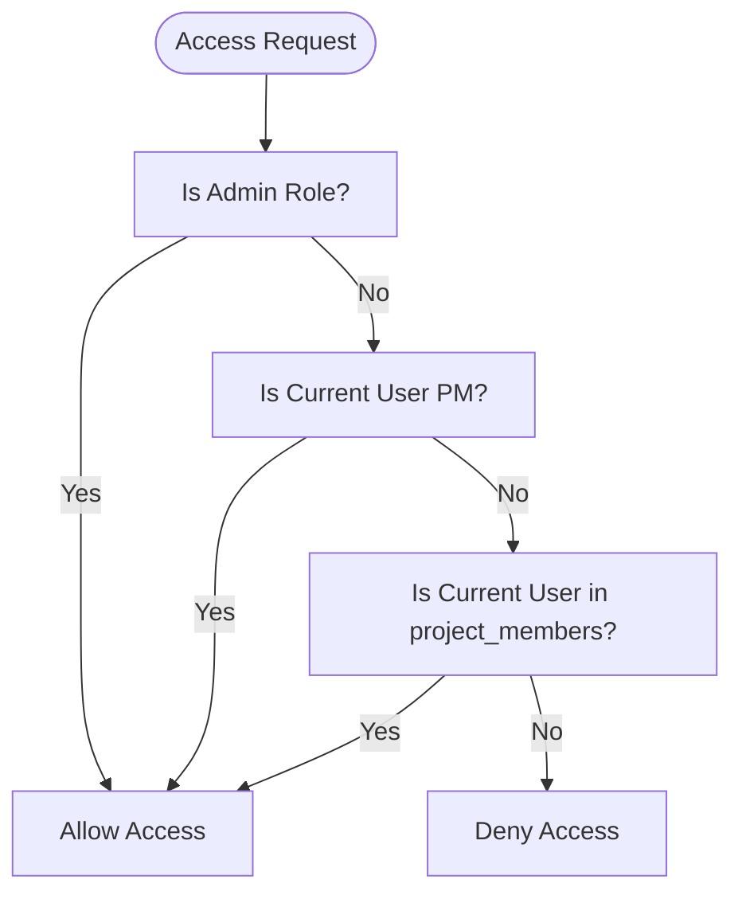
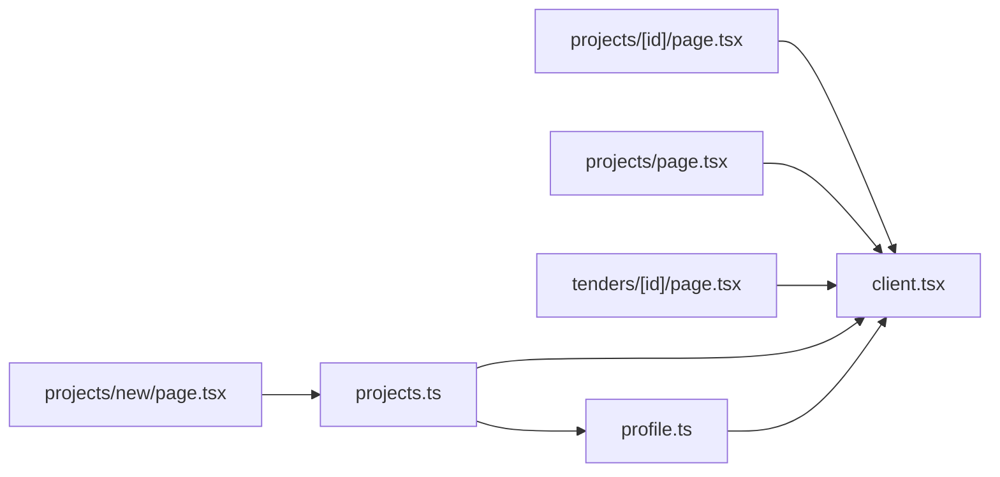

# Team Assignment and Management

<cite>
**Referenced Files in This Document**
- [README.md](file://README.md)
- [001_day1_schema.sql](file://supabase/migrations/001_day1_schema.sql)
- [002_day1_rls.sql](file://supabase/migrations/002_day1_rls.sql)
- [client.tsx](file://app/ssr/client.tsx)
- [profile.ts](file://app/ssr/profile.ts)
- [projects.ts](file://app/ssr/projects.ts)
- [projects/[id]/page.tsx](file://app/projects/[id]/page.tsx)
- [projects/page.tsx](file://app/projects/page.tsx)
- [projects/new/page.tsx](file://app/projects/new/page.tsx)
- [tenders/[id]/page.tsx](file://app/tenders/[id]/page.tsx)
</cite>

## Table of Contents
1. [Introduction](#introduction)
2. [Project Structure](#project-structure)
3. [Core Components](#core-components)
4. [Architecture Overview](#architecture-overview)
5. [Detailed Component Analysis](#detailed-component-analysis)
6. [Dependency Analysis](#dependency-analysis)
7. [Performance Considerations](#performance-considerations)
8. [Troubleshooting Guide](#troubleshooting-guide)
9. [Conclusion](#conclusion)
10. [Appendices](#appendices)

## Introduction
This document explains the team assignment and management system for projects within the project management application. It focuses on how project managers can assign engineers, finance personnel, and other stakeholders to projects, how team membership is represented in the database, and how access permissions are enforced via Row Level Security (RLS). It also outlines the current state of the user interface for project creation and viewing, and highlights where team assignment functionality would integrate with the existing backend.

## Project Structure
The team assignment capability is primarily defined by database tables and RLS policies. The frontend pages demonstrate project creation and detail views but do not currently include explicit team assignment UI. The backend relies on Supabase for authentication (Clerk), database (Postgres), and RLS enforcement.

**Diagram sources**
- [projects/new/page.tsx](file://app/projects/new/page.tsx#L1-L68)
- [projects/[id]/page.tsx](file://app/projects/[id]/page.tsx#L1-L138)
- [projects/page.tsx](file://app/projects/page.tsx#L1-L64)
- [tenders/[id]/page.tsx](file://app/tenders/[id]/page.tsx#L1-L130)
- [client.tsx](file://app/ssr/client.tsx#L1-L25)
- [profile.ts](file://app/ssr/profile.ts#L1-L31)
- [projects.ts](file://app/ssr/projects.ts#L1-L43)
- [001_day1_schema.sql](file://supabase/migrations/001_day1_schema.sql#L76-L118)
- [002_day1_rls.sql](file://supabase/migrations/002_day1_rls.sql#L147-L185)

**Section sources**
- [projects/new/page.tsx](file://app/projects/new/page.tsx#L1-L68)
- [projects/[id]/page.tsx](file://app/projects/[id]/page.tsx#L1-L138)
- [projects/page.tsx](file://app/projects/page.tsx#L1-L64)
- [tenders/[id]/page.tsx](file://app/tenders/[id]/page.tsx#L1-L130)
- [client.tsx](file://app/ssr/client.tsx#L1-L25)
- [profile.ts](file://app/ssr/profile.ts#L1-L31)
- [projects.ts](file://app/ssr/projects.ts#L1-L43)
- [001_day1_schema.sql](file://supabase/migrations/001_day1_schema.sql#L76-L118)
- [002_day1_rls.sql](file://supabase/migrations/002_day1_rls.sql#L147-L185)

## Core Components
- Profiles table: Stores user identity and role. The application upserts a profile row per authenticated Clerk user.
- Projects table: Contains project metadata and a foreign key to the project manager’s profile.
- Project team membership: Managed via the project_members junction table linking profiles to projects with a member role.
- Access control: Enforced by RLS policies that compute visibility and edit permissions based on roles and membership.

Key implementation references:
- Profiles and project_members schema: [001_day1_schema.sql](file://supabase/migrations/001_day1_schema.sql#L76-L118)
- Project membership RLS policies: [002_day1_rls.sql](file://supabase/migrations/002_day1_rls.sql#L147-L185)
- Profile upsert and Supabase client utilities: [profile.ts](file://app/ssr/profile.ts#L1-L31), [client.tsx](file://app/ssr/client.tsx#L1-L25)
- Project creation flow (PM assignment): [projects.ts](file://app/ssr/projects.ts#L1-L43)

**Section sources**
- [001_day1_schema.sql](file://supabase/migrations/001_day1_schema.sql#L76-L118)
- [002_day1_rls.sql](file://supabase/migrations/002_day1_rls.sql#L147-L185)
- [profile.ts](file://app/ssr/profile.ts#L1-L31)
- [client.tsx](file://app/ssr/client.tsx#L1-L25)
- [projects.ts](file://app/ssr/projects.ts#L1-L43)

## Architecture Overview
The team assignment architecture centers on:
- Authentication: Clerk-managed sessions.
- Identity: Supabase profiles mapped to Clerk user IDs.
- Team membership: project_members records define who participates in a project and with what role.
- Visibility and editing: RLS functions and policies compute access based on roles and membership.

**Diagram sources**
- [profile.ts](file://app/ssr/profile.ts#L1-L31)
- [002_day1_rls.sql](file://supabase/migrations/002_day1_rls.sql#L37-L73)
- [client.tsx](file://app/ssr/client.tsx#L1-L25)

## Detailed Component Analysis

### Profiles and Roles
- Profiles store Clerk user identifiers, display names, and roles. Roles include super_admin, chairman_vp, dept_head, pm, engineer, finance, viewer.
- The application upserts a profile row for each authenticated user, ensuring downstream RLS and membership checks can resolve identities.

References:
- Enum definition and profiles table: [001_day1_schema.sql](file://supabase/migrations/001_day1_schema.sql#L3-L11), [001_day1_schema.sql](file://supabase/migrations/001_day1_schema.sql#L76-L84)
- Profile upsert logic: [profile.ts](file://app/ssr/profile.ts#L1-L31)

**Section sources**
- [001_day1_schema.sql](file://supabase/migrations/001_day1_schema.sql#L3-L11)
- [001_day1_schema.sql](file://supabase/migrations/001_day1_schema.sql#L76-L84)
- [profile.ts](file://app/ssr/profile.ts#L1-L31)

### Project Team Membership Model
- Projects are owned by a PM via pm_profile_id.
- project_members links profiles to projects with a member_role field defaulting to viewer.
- RLS policies gate visibility and edits based on roles and membership.

References:
- Projects and project_members schema: [001_day1_schema.sql](file://supabase/migrations/001_day1_schema.sql#L95-L118)
- Project membership RLS: [002_day1_rls.sql](file://supabase/migrations/002_day1_rls.sql#L147-L185)

**Diagram sources**
- [001_day1_schema.sql](file://supabase/migrations/001_day1_schema.sql#L76-L118)

**Section sources**
- [001_day1_schema.sql](file://supabase/migrations/001_day1_schema.sql#L95-L118)
- [002_day1_rls.sql](file://supabase/migrations/002_day1_rls.sql#L147-L185)

### Access Control and Permissions
- can_view_project: Grants access to admins, the project manager, or anyone listed in project_members.
- can_edit_project: Grants edit rights to super_admin, chairman_vp, dept_head, pm, or the project manager.
- Project membership RLS policies enforce select/manage/update/delete on project_members.

References:
- Access functions and policies: [002_day1_rls.sql](file://supabase/migrations/002_day1_rls.sql#L37-L73), [002_day1_rls.sql](file://supabase/migrations/002_day1_rls.sql#L164-L184)

**Diagram sources**
- [002_day1_rls.sql](file://supabase/migrations/002_day1_rls.sql#L37-L73)

**Section sources**
- [002_day1_rls.sql](file://supabase/migrations/002_day1_rls.sql#L37-L73)
- [002_day1_rls.sql](file://supabase/migrations/002_day1_rls.sql#L164-L184)

### Project Creation and PM Assignment
- Project creation sets the authenticated profile as the project manager (pm_profile_id).
- The profile upsert occurs before insertion to ensure the profile exists.

References:
- Profile upsert and project creation: [projects.ts](file://app/ssr/projects.ts#L1-L43), [profile.ts](file://app/ssr/profile.ts#L1-L31)

**Section sources**
- [projects.ts](file://app/ssr/projects.ts#L1-L43)
- [profile.ts](file://app/ssr/profile.ts#L1-L31)

### Current UI and Team Assignment Gaps
- Project list/detail pages show project metadata and related resources but do not include a dedicated team assignment interface.
- Tender detail pages similarly lack a team assignment UI.
- The project creation form does not include a team assignment step.

References:
- Project list/detail pages: [projects/page.tsx](file://app/projects/page.tsx#L1-L64), [projects/[id]/page.tsx](file://app/projects/[id]/page.tsx#L1-L138)
- Tender detail page: [tenders/[id]/page.tsx](file://app/tenders/[id]/page.tsx#L1-L130)
- Project creation form: [projects/new/page.tsx](file://app/projects/new/page.tsx#L1-L68)

**Section sources**
- [projects/page.tsx](file://app/projects/page.tsx#L1-L64)
- [projects/[id]/page.tsx](file://app/projects/[id]/page.tsx#L1-L138)
- [tenders/[id]/page.tsx](file://app/tenders/[id]/page.tsx#L1-L130)
- [projects/new/page.tsx](file://app/projects/new/page.tsx#L1-L68)

## Dependency Analysis
- Frontend pages depend on SSR utilities for authenticated Supabase access.
- SSR utilities depend on Clerk for authentication and environment variables for Supabase credentials.
- Database dependencies: profiles and project_members define the membership model; RLS policies enforce access.

**Diagram sources**
- [projects/new/page.tsx](file://app/projects/new/page.tsx#L1-L68)
- [projects/[id]/page.tsx](file://app/projects/[id]/page.tsx#L1-L138)
- [projects/page.tsx](file://app/projects/page.tsx#L1-L64)
- [tenders/[id]/page.tsx](file://app/tenders/[id]/page.tsx#L1-L130)
- [projects.ts](file://app/ssr/projects.ts#L1-L43)
- [profile.ts](file://app/ssr/profile.ts#L1-L31)
- [client.tsx](file://app/ssr/client.tsx#L1-L25)

**Section sources**
- [projects/new/page.tsx](file://app/projects/new/page.tsx#L1-L68)
- [projects/[id]/page.tsx](file://app/projects/[id]/page.tsx#L1-L138)
- [projects/page.tsx](file://app/projects/page.tsx#L1-L64)
- [tenders/[id]/page.tsx](file://app/tenders/[id]/page.tsx#L1-L130)
- [projects.ts](file://app/ssr/projects.ts#L1-L43)
- [profile.ts](file://app/ssr/profile.ts#L1-L31)
- [client.tsx](file://app/ssr/client.tsx#L1-L25)

## Performance Considerations
- RLS evaluation occurs per-row; keep membership lists concise and avoid excessive joins in queries.
- Use indexes on foreign keys (e.g., project_id, profile_id) to optimize membership lookups.
- Batch operations for adding/removing multiple members can reduce round-trips.

[No sources needed since this section provides general guidance]

## Troubleshooting Guide
Common issues and resolutions:
- Profile not found during project creation: Ensure the profile upsert succeeds before inserting projects.
- RLS denied access: Verify the current user has a profiles row and appropriate role or membership.
- Manual role assignment: The README documents manual role updates via SQL for Day-1.

References:
- Profile upsert and project creation: [profile.ts](file://app/ssr/profile.ts#L1-L31), [projects.ts](file://app/ssr/projects.ts#L1-L43)
- RLS troubleshooting notes: [README.md](file://README.md#L146-L148)

**Section sources**
- [profile.ts](file://app/ssr/profile.ts#L1-L31)
- [projects.ts](file://app/ssr/projects.ts#L1-L43)
- [README.md](file://README.md#L146-L148)

## Conclusion
The team assignment system is defined by the profiles and project_members tables with robust RLS policies governing access. Project creation assigns the authenticated user as PM, while project_members enables broader team participation. The current UI lacks a dedicated team assignment interface; extending the project detail page to manage members would align with the existing backend model.

[No sources needed since this section summarizes without analyzing specific files]

## Appendices

### Practical Examples and Best Practices
- Assigning an engineer to a project:
  - Add a record to project_members with the engineer’s profile_id and member_role set to engineer.
  - Ensure the requester has edit permissions per can_edit_project.
- Adding finance personnel:
  - Insert a project_members record with member_role set to finance.
- Removing a team member:
  - Delete the project_members record for the profile_id and project_id combination.
- Updating a team member’s role:
  - Update the member_role in project_members.
- Conflict resolution:
  - If a user cannot view a project, confirm their role or membership; RLS denies access otherwise.
- Best practices for construction/engineering contexts:
  - Use distinct member roles (engineer, finance) to control access to sensitive documents and financial data.
  - Keep team lists current; remove former members promptly to maintain least-privilege access.

[No sources needed since this section provides general guidance]