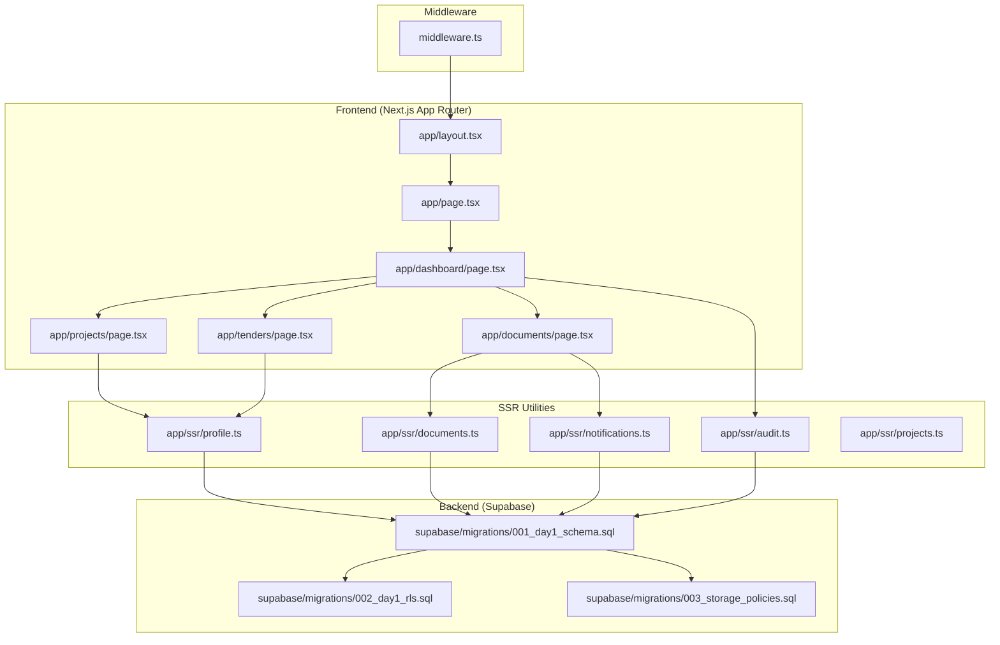
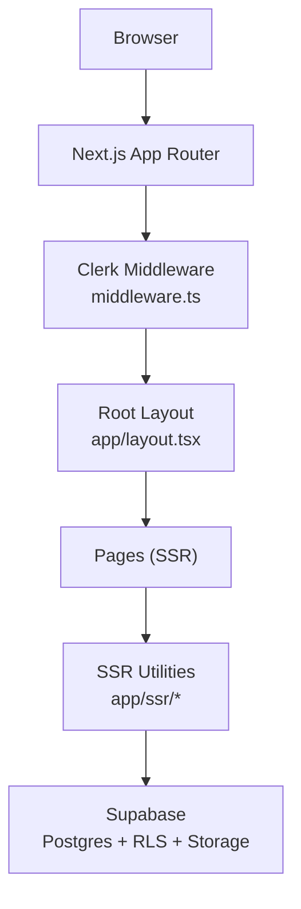
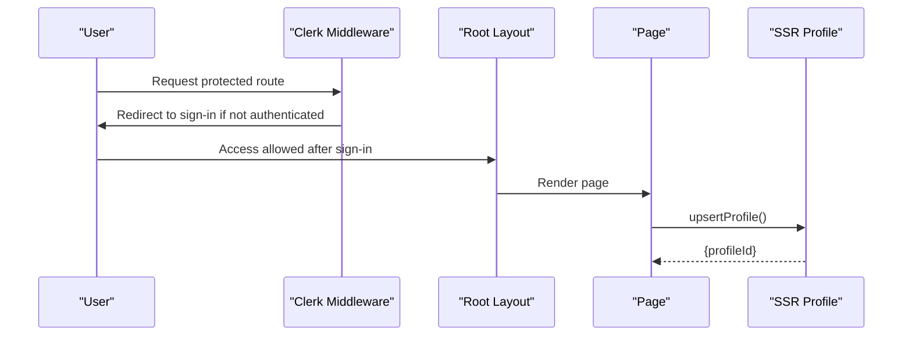
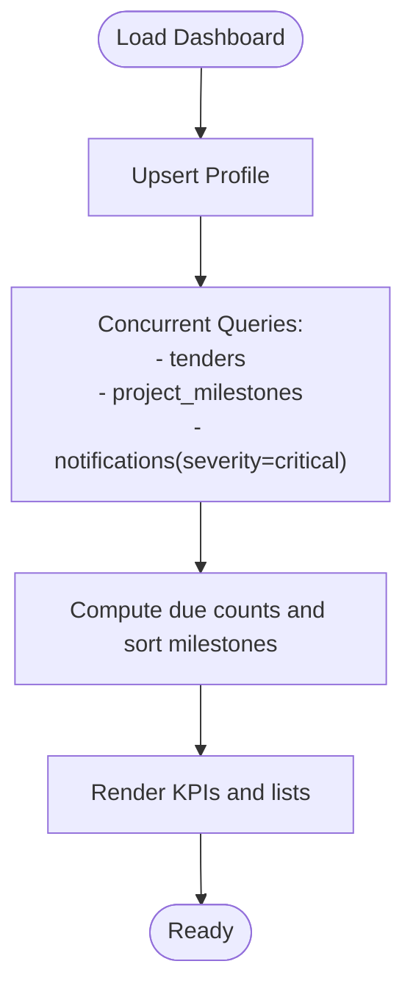
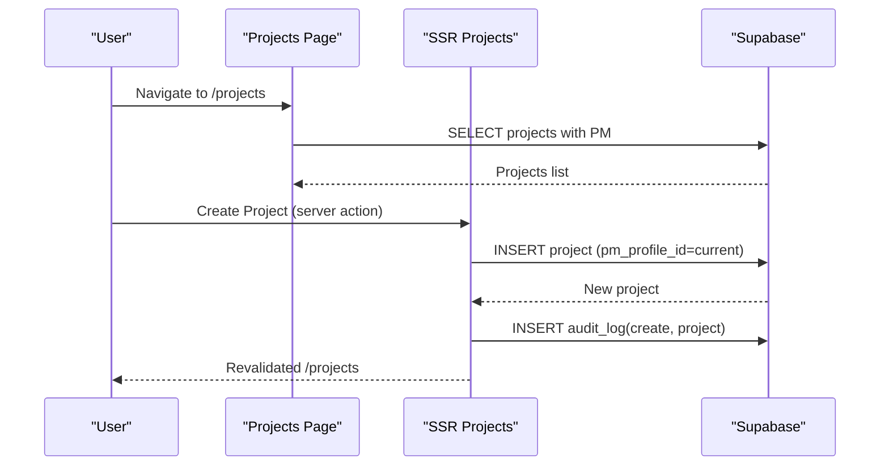
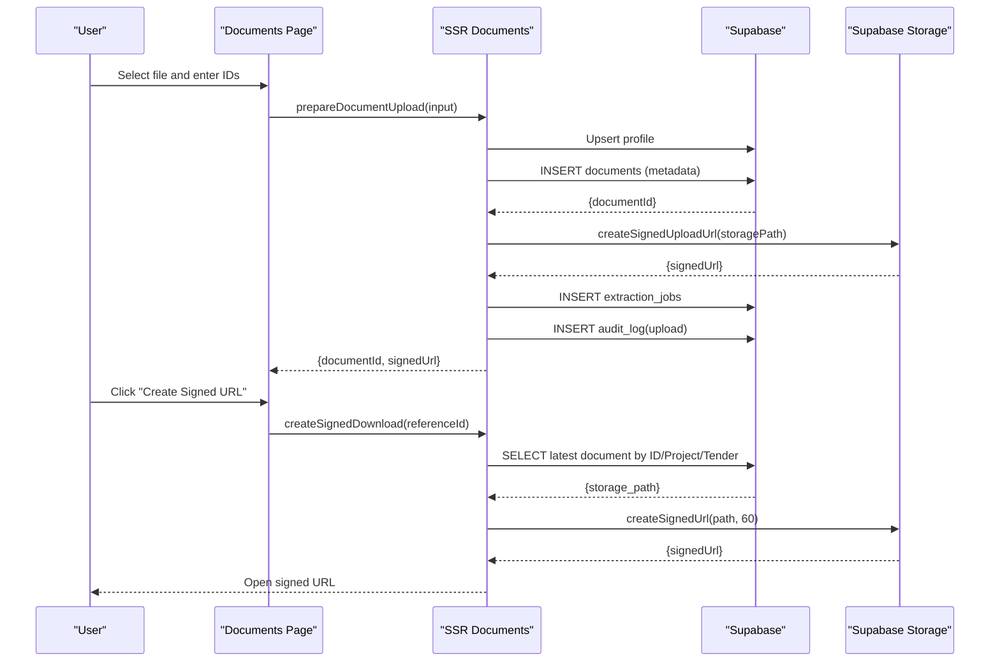
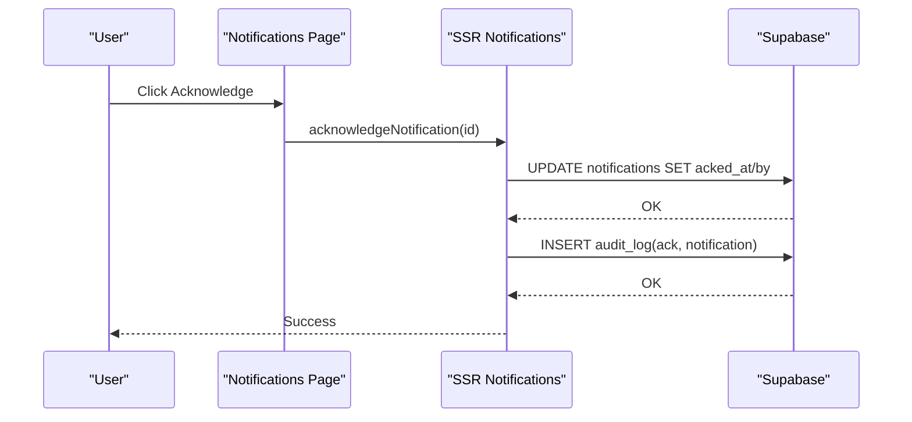
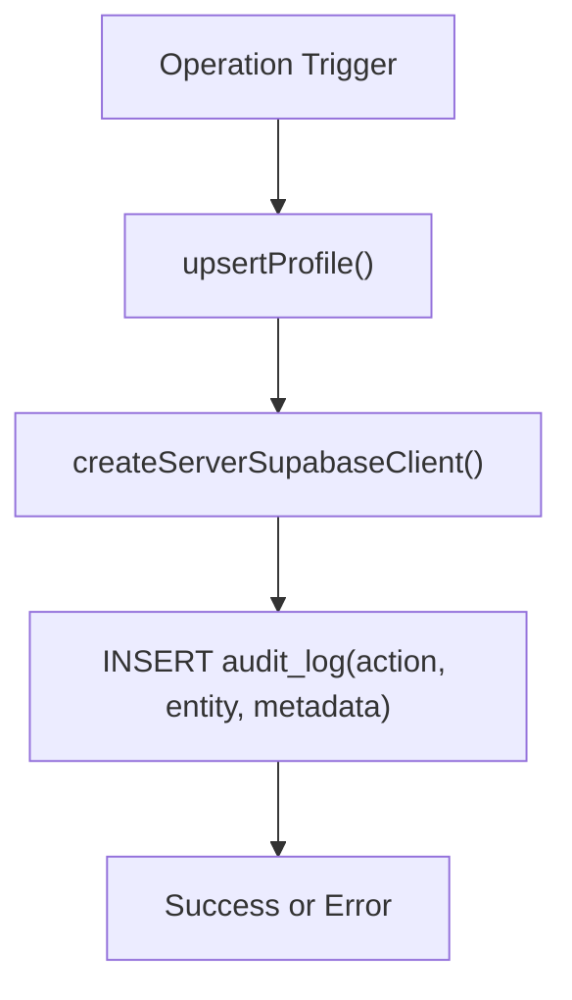
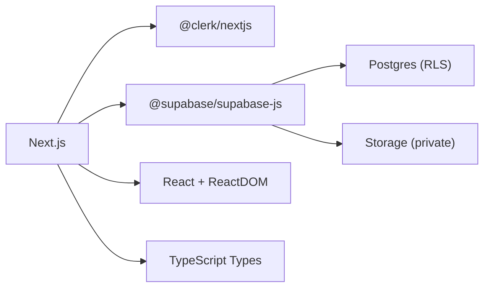

# Project Overview

<cite>
**Referenced Files in This Document**
- [README.md](file://README.md)
- [package.json](file://package.json)
- [middleware.ts](file://middleware.ts)
- [app/layout.tsx](file://app/layout.tsx)
- [app/page.tsx](file://app/page.tsx)
- [app/dashboard/page.tsx](file://app/dashboard/page.tsx)
- [app/projects/page.tsx](file://app/projects/page.tsx)
- [app/tenders/page.tsx](file://app/tenders/page.tsx)
- [app/documents/page.tsx](file://app/documents/page.tsx)
- [app/ssr/profile.ts](file://app/ssr/profile.ts)
- [app/ssr/documents.ts](file://app/ssr/documents.ts)
- [app/ssr/audit.ts](file://app/ssr/audit.ts)
- [app/ssr/notifications.ts](file://app/ssr/notifications.ts)
- [app/ssr/projects.ts](file://app/ssr/projects.ts)
- [supabase/migrations/001_day1_schema.sql](file://supabase/migrations/001_day1_schema.sql)
- [supabase/migrations/002_day1_rls.sql](file://supabase/migrations/002_day1_rls.sql)
- [supabase/migrations/003_storage_policies.sql](file://supabase/migrations/003_storage_policies.sql)
</cite>

## Table of Contents
1. [Introduction](#introduction)
2. [Project Structure](#project-structure)
3. [Core Components](#core-components)
4. [Architecture Overview](#architecture-overview)
5. [Detailed Component Analysis](#detailed-component-analysis)
6. [Dependency Analysis](#dependency-analysis)
7. [Performance Considerations](#performance-considerations)
8. [Troubleshooting Guide](#troubleshooting-guide)
9. [Conclusion](#conclusion)
10. [Appendices](#appendices)

## Introduction
MCE Command Center is a production-credible internal application designed for construction and engineering organizations. It provides a centralized platform to track Projects, Tenders, Documents, and Notifications. Built with modern web technologies, it emphasizes secure authentication, role-based access control enforced by database row-level security (RLS), and practical operational workflows such as document upload with signed URLs, milestone tracking, notifications with acknowledgments, and audit logging.

Target audience:
- Construction and engineering firms managing multiple concurrent projects and tenders
- Project managers, engineers, procurement teams, and administrative staff requiring visibility and control over project lifecycles
- Organizations needing secure, auditable, and scalable internal tracking systems

## Project Structure
The application follows Next.js App Router conventions with a clear separation between client-side pages, server-side utilities (SSR), and database schema and policies. Authentication is handled by Clerk, while Supabase provides the Postgres database, RLS, and Storage services.

**Diagram sources**
- [app/layout.tsx](file://app/layout.tsx#L1-L46)
- [app/page.tsx](file://app/page.tsx#L1-L29)
- [app/dashboard/page.tsx](file://app/dashboard/page.tsx#L1-L157)
- [app/projects/page.tsx](file://app/projects/page.tsx#L1-L65)
- [app/tenders/page.tsx](file://app/tenders/page.tsx#L1-L65)
- [app/documents/page.tsx](file://app/documents/page.tsx#L1-L90)
- [app/ssr/profile.ts](file://app/ssr/profile.ts#L1-L31)
- [app/ssr/documents.ts](file://app/ssr/documents.ts#L1-L114)
- [app/ssr/audit.ts](file://app/ssr/audit.ts#L1-L29)
- [app/ssr/notifications.ts](file://app/ssr/notifications.ts#L1-L27)
- [app/ssr/projects.ts](file://app/ssr/projects.ts#L1-L43)
- [middleware.ts](file://middleware.ts#L1-L20)
- [supabase/migrations/001_day1_schema.sql](file://supabase/migrations/001_day1_schema.sql#L1-L227)
- [supabase/migrations/002_day1_rls.sql](file://supabase/migrations/002_day1_rls.sql#L1-L348)
- [supabase/migrations/003_storage_policies.sql](file://supabase/migrations/003_storage_policies.sql)

**Section sources**
- [README.md](file://README.md#L1-L158)
- [package.json](file://package.json#L1-L32)
- [middleware.ts](file://middleware.ts#L1-L20)
- [app/layout.tsx](file://app/layout.tsx#L1-L46)

## Core Components
- Authentication and session management via Clerk with server middleware enforcing protected routes
- SSR utilities for database interactions, profile synchronization, document lifecycle, notifications, and audit logging
- Day-1 feature coverage: secure auth + RLS, Projects/Tenders CRUD, document upload with signed URLs, milestones panel, notifications with acknowledgments, and audit logs
- Non-goals (not implemented yet): background extraction, email escalation, RAG/finance/HR dashboards

Key capabilities mapped to code:
- Secure auth + RLS enforced access control: Clerk middleware and Supabase RLS policies
- Projects and Tenders CRUD: server actions for creation and data retrieval
- Document upload + signed URLs: server utilities to create document metadata and signed URLs
- Milestones panel: dashboard queries for upcoming milestones
- Notifications with acknowledgments: server action to mark notifications as acknowledged
- Audit log: server action to record create/upload/ack events

**Section sources**
- [README.md](file://README.md#L6-L16)
- [middleware.ts](file://middleware.ts#L1-L20)
- [app/ssr/profile.ts](file://app/ssr/profile.ts#L1-L31)
- [app/ssr/documents.ts](file://app/ssr/documents.ts#L1-L114)
- [app/ssr/audit.ts](file://app/ssr/audit.ts#L1-L29)
- [app/ssr/notifications.ts](file://app/ssr/notifications.ts#L1-L27)
- [app/ssr/projects.ts](file://app/ssr/projects.ts#L1-L43)
- [app/dashboard/page.tsx](file://app/dashboard/page.tsx#L1-L157)

## Architecture Overview
The system integrates Clerk for authentication and Next.js App Router for routing, with Supabase as the backend for database, RLS, and storage. Middleware ensures non-public routes require authentication. SSR utilities encapsulate database operations and enforce RLS by leveraging the current user’s profile.

**Diagram sources**
- [middleware.ts](file://middleware.ts#L1-L20)
- [app/layout.tsx](file://app/layout.tsx#L1-L46)
- [app/ssr/profile.ts](file://app/ssr/profile.ts#L1-L31)
- [app/ssr/documents.ts](file://app/ssr/documents.ts#L1-L114)
- [app/ssr/audit.ts](file://app/ssr/audit.ts#L1-L29)
- [app/ssr/notifications.ts](file://app/ssr/notifications.ts#L1-L27)
- [supabase/migrations/001_day1_schema.sql](file://supabase/migrations/001_day1_schema.sql#L1-L227)
- [supabase/migrations/002_day1_rls.sql](file://supabase/migrations/002_day1_rls.sql#L1-L348)
- [supabase/migrations/003_storage_policies.sql](file://supabase/migrations/003_storage_policies.sql)

## Detailed Component Analysis

### Authentication and Authorization
- Clerk middleware enforces authentication for non-public routes and redirects unauthenticated users to sign-in
- Root layout wraps the app with Clerk provider and renders user button for signed-in users
- SSR profile upsert synchronizes Clerk user info to the profiles table and derives the current profile ID used by RLS policies

**Diagram sources**
- [middleware.ts](file://middleware.ts#L1-L20)
- [app/layout.tsx](file://app/layout.tsx#L1-L46)
- [app/page.tsx](file://app/page.tsx#L1-L29)
- [app/ssr/profile.ts](file://app/ssr/profile.ts#L1-L31)

**Section sources**
- [middleware.ts](file://middleware.ts#L1-L20)
- [app/layout.tsx](file://app/layout.tsx#L1-L46)
- [app/page.tsx](file://app/page.tsx#L1-L29)
- [app/ssr/profile.ts](file://app/ssr/profile.ts#L1-L31)

### Dashboard: Milestones Panel and Notifications
- Dashboard queries tenders, project milestones, and critical notifications
- Computes due counts across 14-day windows, sorts upcoming milestones, and counts unacknowledged critical notifications
- Provides quick navigation to create resources and manage documents/notifications

**Diagram sources**
- [app/dashboard/page.tsx](file://app/dashboard/page.tsx#L1-L157)

**Section sources**
- [app/dashboard/page.tsx](file://app/dashboard/page.tsx#L1-L157)

### Projects and Tenders CRUD
- Projects list page retrieves projects with PM display name and supports export
- Tenders list page retrieves tenders ordered by deadline and supports export
- Project creation is implemented via a server action that inserts a project under the current profile as project manager and writes an audit event

**Diagram sources**
- [app/projects/page.tsx](file://app/projects/page.tsx#L1-L65)
- [app/ssr/projects.ts](file://app/ssr/projects.ts#L1-L43)
- [supabase/migrations/001_day1_schema.sql](file://supabase/migrations/001_day1_schema.sql#L95-L110)
- [supabase/migrations/002_day1_rls.sql](file://supabase/migrations/002_day1_rls.sql#L147-L162)

**Section sources**
- [app/projects/page.tsx](file://app/projects/page.tsx#L1-L65)
- [app/tenders/page.tsx](file://app/tenders/page.tsx#L1-L65)
- [app/ssr/projects.ts](file://app/ssr/projects.ts#L1-L43)

### Document Upload with Signed URLs
- Documents page collects optional Project/Tender IDs, selects a file, and triggers a server action to:
  - Upsert profile
  - Insert a document metadata row with storage path and ownership
  - Create a signed upload URL from Supabase Storage
  - Enqueue an extraction job
  - Write an audit event for upload
- Download flow resolves the latest document by ID or by Project/Tender link and generates a short-lived signed download URL

**Diagram sources**
- [app/documents/page.tsx](file://app/documents/page.tsx#L1-L90)
- [app/ssr/documents.ts](file://app/ssr/documents.ts#L1-L114)
- [app/ssr/audit.ts](file://app/ssr/audit.ts#L1-L29)
- [supabase/migrations/001_day1_schema.sql](file://supabase/migrations/001_day1_schema.sql#L164-L181)
- [supabase/migrations/003_storage_policies.sql](file://supabase/migrations/003_storage_policies.sql)

**Section sources**
- [app/documents/page.tsx](file://app/documents/page.tsx#L1-L90)
- [app/ssr/documents.ts](file://app/ssr/documents.ts#L1-L114)
- [app/ssr/audit.ts](file://app/ssr/audit.ts#L1-L29)

### Notifications with Acknowledgments
- Notification acknowledgment is performed via a server action that updates the notification with acknowledgment timestamp and actor, then writes an audit event for ack

**Diagram sources**
- [app/ssr/notifications.ts](file://app/ssr/notifications.ts#L1-L27)
- [supabase/migrations/001_day1_schema.sql](file://supabase/migrations/001_day1_schema.sql#L193-L206)
- [supabase/migrations/002_day1_rls.sql](file://supabase/migrations/002_day1_rls.sql#L303-L316)

**Section sources**
- [app/ssr/notifications.ts](file://app/ssr/notifications.ts#L1-L27)

### Audit Logging
- Audit events are written for create, upload, and ack operations, capturing actor, action, entity, and metadata
- Append-only enforcement prevents updates/deletes to audit records

**Diagram sources**
- [app/ssr/audit.ts](file://app/ssr/audit.ts#L1-L29)
- [supabase/migrations/001_day1_schema.sql](file://supabase/migrations/001_day1_schema.sql#L208-L216)
- [supabase/migrations/002_day1_rls.sql](file://supabase/migrations/002_day1_rls.sql#L318-L347)

**Section sources**
- [app/ssr/audit.ts](file://app/ssr/audit.ts#L1-L29)

## Dependency Analysis
Technology stack and external integrations:
- Next.js App Router for routing and SSR
- Clerk for authentication and user management
- Supabase for Postgres database, RLS, and Storage
- Tailwind CSS for styling (configured via next.config.js and tailwind.config.ts)

**Diagram sources**
- [package.json](file://package.json#L11-L19)
- [next.config.js](file://next.config.js#L1-L7)

**Section sources**
- [package.json](file://package.json#L1-L32)
- [next.config.js](file://next.config.js#L1-L7)

## Performance Considerations
- Use concurrent queries on the dashboard to minimize load time
- Prefer server actions for sensitive operations to keep secrets server-only
- Keep signed URL lifetimes minimal (as configured in download flow)
- Indexes on frequently filtered columns (e.g., tenders deadline, milestones due_date) improve query performance
- Revalidation strategies avoid stale data after mutations

[No sources needed since this section provides general guidance]

## Troubleshooting Guide
Common issues and resolutions:
- Build fails due to invalid Clerk keys: verify environment variables for Clerk publishable and secret keys
- RLS denied or empty data: confirm the signed-in user has a profiles row and proper role assignment
- Document upload fails: ensure the storage bucket exists, is private, and storage policies are applied; verify document metadata row exists before upload
- Signed URL fails: confirm storage policies and that the requesting user has access to the linked project/tender

**Section sources**
- [README.md](file://README.md#L141-L158)

## Conclusion
MCE Command Center delivers a production-credible foundation for construction and engineering organizations to manage Projects, Tenders, Documents, and Notifications securely and efficiently. Its architecture leverages Next.js, Clerk, and Supabase to provide robust authentication, fine-grained access control via RLS, practical workflows for document management, and comprehensive auditability. The day-1 scope establishes a solid baseline, with non-goals clearly defined for future enhancements.

[No sources needed since this section summarizes without analyzing specific files]

## Appendices

### Day-1 Scope and Non-Goals
- Day-1 scope includes secure auth + RLS, Projects/Tenders CRUD, document upload with signed URLs, milestones panel, notifications with acknowledgments, and audit logs
- Non-goals (not implemented yet): background extraction, email escalation, RAG/finance/HR dashboards

**Section sources**
- [README.md](file://README.md#L8-L16)

### Database Schema Overview
- Profiles, Clients, Projects, Project Members, Project Milestones, Tenders, Tender Members, Tender Comms Events, Documents, Extraction Jobs, Notifications, Audit Log
- Enum types for roles, statuses, channels, sensitivity, severity, types, and audit actions/entities
- Indexes on key foreign keys and date fields for efficient queries

**Section sources**
- [supabase/migrations/001_day1_schema.sql](file://supabase/migrations/001_day1_schema.sql#L1-L227)

### Role-Based Access Control (RLS)
- Helper functions to derive current Clerk user ID, profile ID, and role
- Policies for select/update/delete across tables with admin overrides and resource-level checks
- Append-only enforcement for sensitive tables

**Section sources**
- [supabase/migrations/002_day1_rls.sql](file://supabase/migrations/002_day1_rls.sql#L1-L348)