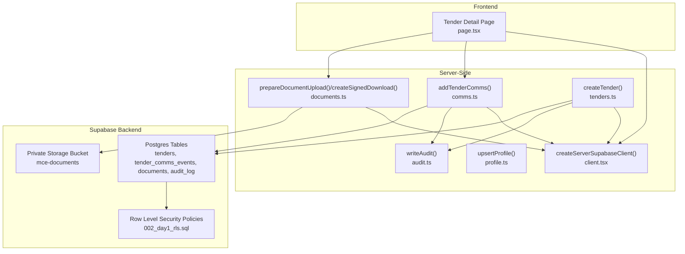
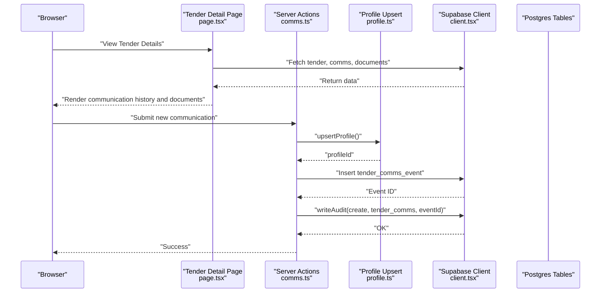
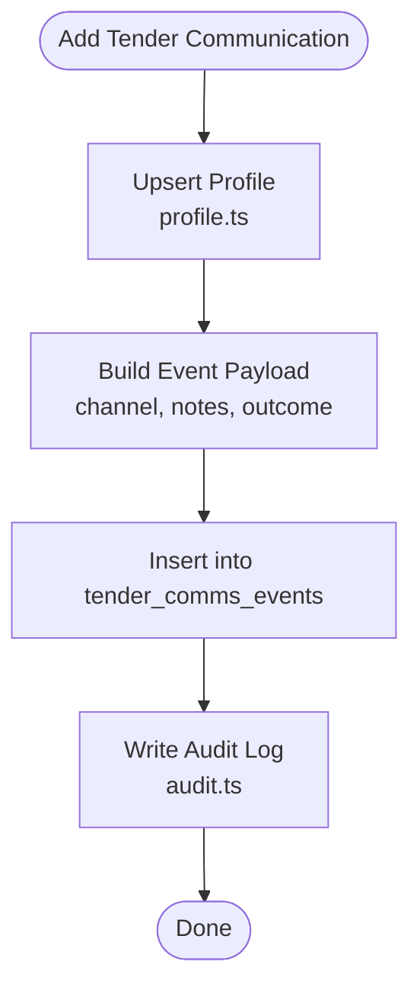
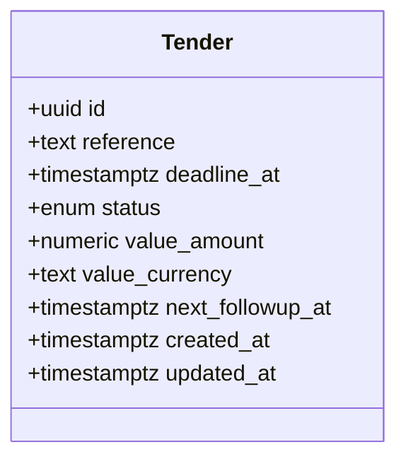
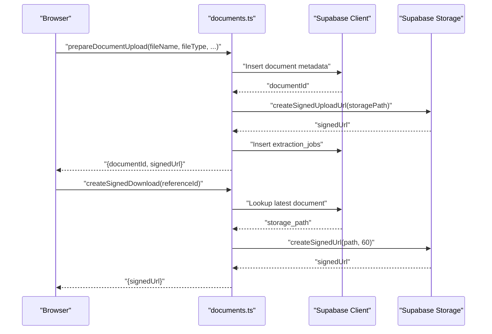
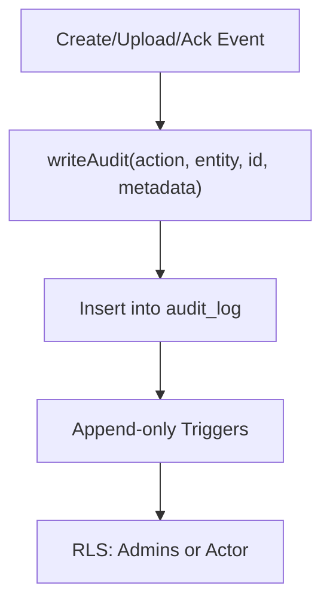
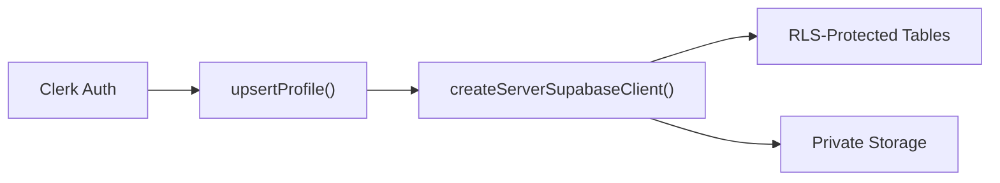
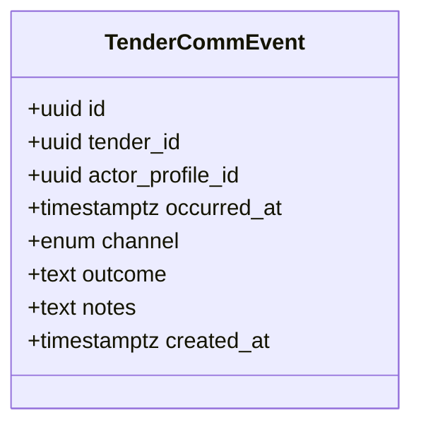
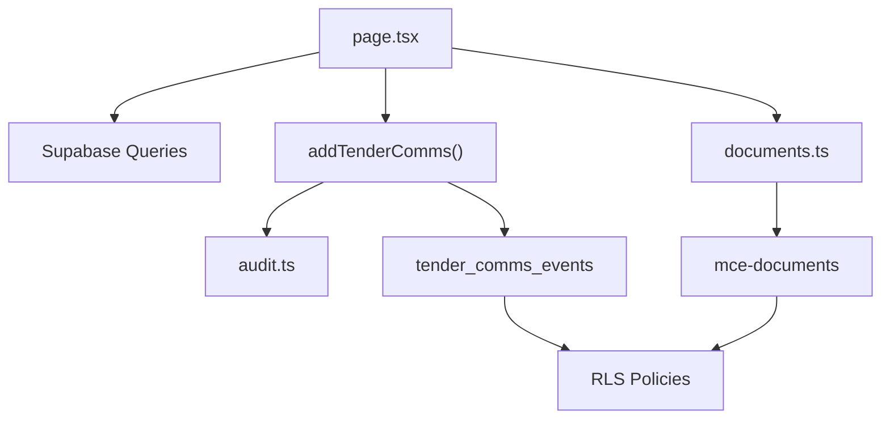
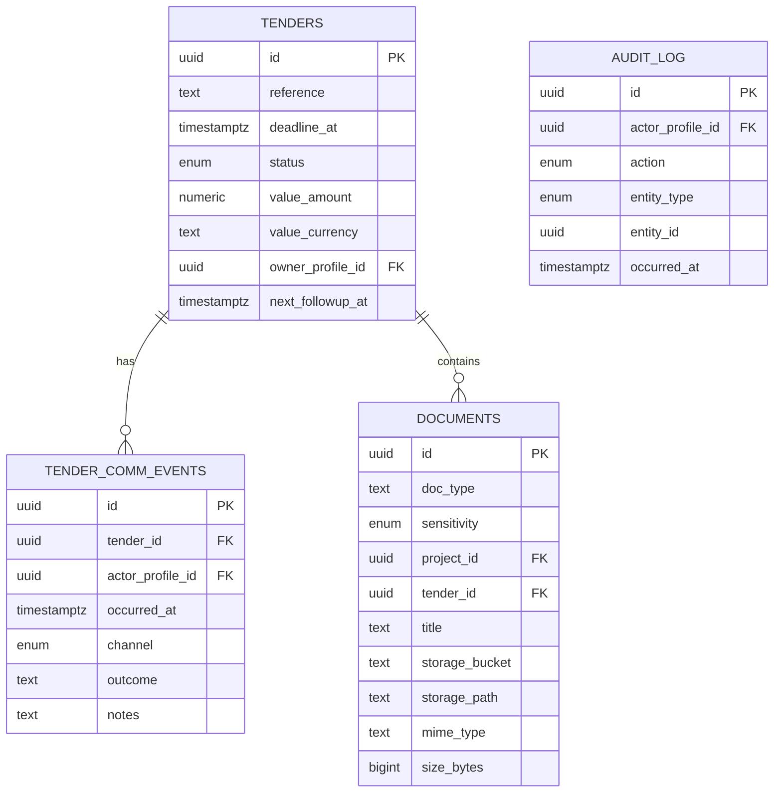

# Communication and Follow-up Tracking

<cite>
**Referenced Files in This Document**
- [comms.ts](file://app/ssr/comms.ts)
- [tenders.ts](file://app/ssr/tenders.ts)
- [audit.ts](file://app/ssr/audit.ts)
- [documents.ts](file://app/ssr/documents.ts)
- [profile.ts](file://app/ssr/profile.ts)
- [client.tsx](file://app/ssr/client.tsx)
- [page.tsx](file://app/tenders/[id]/page.tsx)
- [001_day1_schema.sql](file://supabase/migrations/001_day1_schema.sql)
- [002_day1_rls.sql](file://supabase/migrations/002_day1_rls.sql)
- [README.md](file://README.md)
</cite>

## Table of Contents
1. [Introduction](#introduction)
2. [Project Structure](#project-structure)
3. [Core Components](#core-components)
4. [Architecture Overview](#architecture-overview)
5. [Detailed Component Analysis](#detailed-component-analysis)
6. [Dependency Analysis](#dependency-analysis)
7. [Performance Considerations](#performance-considerations)
8. [Troubleshooting Guide](#troubleshooting-guide)
9. [Conclusion](#conclusion)
10. [Appendices](#appendices)

## Introduction
This document explains the communication and follow-up tracking system for tender management in the Command Center. It covers how communication history is recorded (email logs, meeting notes, and outcomes), how follow-up scheduling is represented via next follow-up dates, how documents are attached and tracked, and how audit trails maintain compliance. It also outlines privacy and security controls enforced by the backend and describes how the frontend surfaces communication history and document attachments for each tender.

## Project Structure
The system is built with Next.js App Router, Clerk for authentication, and Supabase for Postgres, Row Level Security (RLS), and Storage. The tender detail page aggregates communication events and documents for a given tender. Server-side functions handle secure inserts and audits, while client-side helpers manage authentication tokens and Supabase connections.

**Diagram sources**
- [page.tsx](file://app/tenders/[id]/page.tsx#L10-L129)
- [client.tsx](file://app/ssr/client.tsx#L4-L24)
- [profile.ts](file://app/ssr/profile.ts#L6-L30)
- [audit.ts](file://app/ssr/audit.ts#L6-L28)
- [comms.ts](file://app/ssr/comms.ts#L7-L37)
- [documents.ts](file://app/ssr/documents.ts#L11-L113)
- [tenders.ts](file://app/ssr/tenders.ts#L8-L42)
- [001_day1_schema.sql](file://supabase/migrations/001_day1_schema.sql#L130-L180)
- [002_day1_rls.sql](file://supabase/migrations/002_day1_rls.sql#L245-L257)

**Section sources**
- [README.md](file://README.md#L1-L62)
- [page.tsx](file://app/tenders/[id]/page.tsx#L10-L129)
- [client.tsx](file://app/ssr/client.tsx#L4-L24)

## Core Components
- Communication logging: Adds a communication event to the tender with channel, notes, and outcome, and records an audit entry.
- Tender creation: Creates a tender and writes an audit entry.
- Document management: Prepares document metadata, generates signed upload URLs, enqueues extraction jobs, and supports signed downloads.
- Authentication and identity: Upserts the current Clerk user into the profiles table and resolves the current profile ID.
- Frontend display: Renders communication history and document list for a tender.

**Section sources**
- [comms.ts](file://app/ssr/comms.ts#L7-L37)
- [tenders.ts](file://app/ssr/tenders.ts#L8-L42)
- [documents.ts](file://app/ssr/documents.ts#L11-L113)
- [profile.ts](file://app/ssr/profile.ts#L6-L30)
- [page.tsx](file://app/tenders/[id]/page.tsx#L17-L40)

## Architecture Overview
The communication and follow-up tracking architecture centers around:
- Tender-centric communication events stored in a dedicated table with channel and outcome fields.
- Document metadata stored per tender with private storage integration.
- Audit trail for create/upload/ack events.
- RLS policies ensuring only authorized users can view or insert communication events and documents linked to a tender.

**Diagram sources**
- [page.tsx](file://app/tenders/[id]/page.tsx#L17-L40)
- [comms.ts](file://app/ssr/comms.ts#L7-L37)
- [profile.ts](file://app/ssr/profile.ts#L6-L30)
- [client.tsx](file://app/ssr/client.tsx#L4-L24)
- [audit.ts](file://app/ssr/audit.ts#L6-L28)

## Detailed Component Analysis

### Communication History Functionality
- Purpose: Capture all stakeholder interactions related to a tender, including email logs, meeting notes, and outcomes.
- Data model: Events include occurred timestamp, channel, outcome, and notes, linked to the tender and the acting profile.
- Access control: RLS ensures only users who can view the tender can see its communication events; inserts require view permission and actor profile match.

**Diagram sources**
- [comms.ts](file://app/ssr/comms.ts#L7-L37)
- [profile.ts](file://app/ssr/profile.ts#L6-L30)
- [audit.ts](file://app/ssr/audit.ts#L6-L28)

**Section sources**
- [comms.ts](file://app/ssr/comms.ts#L7-L37)
- [001_day1_schema.sql](file://supabase/migrations/001_day1_schema.sql#L153-L162)
- [002_day1_rls.sql](file://supabase/migrations/002_day1_rls.sql#L245-L257)

### Follow-up Scheduling System
- Representation: The tender table includes a next follow-up date field to track callback dates and related activities.
- Frontend display: The tender detail page shows the next follow-up date alongside other summary metrics.
- Practical usage: Teams can update this field to schedule reminders for callbacks, site visits, or proposal submissions.

**Diagram sources**
- [001_day1_schema.sql](file://supabase/migrations/001_day1_schema.sql#L130-L144)
- [page.tsx](file://app/tenders/[id]/page.tsx#L70-L78)

**Section sources**
- [001_day1_schema.sql](file://supabase/migrations/001_day1_schema.sql#L130-L144)
- [page.tsx](file://app/tenders/[id]/page.tsx#L70-L78)

### Document Attachment Workflows
- Metadata creation: The system creates a document metadata row with type, sensitivity, optional title, and storage location.
- Signed upload URL: A pre-signed URL is generated for secure upload to private storage.
- Extraction job: An extraction job is enqueued for downstream processing.
- Download access: Signed download URLs are generated for retrieval with time-limited validity.

**Diagram sources**
- [documents.ts](file://app/ssr/documents.ts#L11-L113)
- [client.tsx](file://app/ssr/client.tsx#L4-L24)
- [001_day1_schema.sql](file://supabase/migrations/001_day1_schema.sql#L164-L191)

**Section sources**
- [documents.ts](file://app/ssr/documents.ts#L11-L113)
- [001_day1_schema.sql](file://supabase/migrations/001_day1_schema.sql#L164-L191)

### Audit Trail and Compliance
- Audit entries capture create, upload, and ack actions with actor, entity type/id, and metadata.
- Append-only triggers prevent updates/deletes to sensitive tables, supporting compliance.
- Access to audit logs is restricted to admins or the actor profile.

**Diagram sources**
- [audit.ts](file://app/ssr/audit.ts#L6-L28)
- [001_day1_schema.sql](file://supabase/migrations/001_day1_schema.sql#L208-L216)
- [002_day1_rls.sql](file://supabase/migrations/002_day1_rls.sql#L332-L348)

**Section sources**
- [audit.ts](file://app/ssr/audit.ts#L6-L28)
- [001_day1_schema.sql](file://supabase/migrations/001_day1_schema.sql#L208-L216)
- [002_day1_rls.sql](file://supabase/migrations/002_day1_rls.sql#L332-L348)

### Privacy and Security Controls
- Authentication: Clerk-managed sessions with Supabase client configured to use JWT tokens.
- Identity sync: Current Clerk user is upserted into profiles with display name and email.
- Storage: Private bucket with signed URLs; storage policies enforce access.
- Access control: RLS policies restrict reads/writes to permitted users; append-only enforcement for key tables.

**Diagram sources**
- [profile.ts](file://app/ssr/profile.ts#L6-L30)
- [client.tsx](file://app/ssr/client.tsx#L4-L24)
- [002_day1_rls.sql](file://supabase/migrations/002_day1_rls.sql#L115-L128)
- [README.md](file://README.md#L56-L62)

**Section sources**
- [profile.ts](file://app/ssr/profile.ts#L6-L30)
- [client.tsx](file://app/ssr/client.tsx#L4-L24)
- [002_day1_rls.sql](file://supabase/migrations/002_day1_rls.sql#L115-L128)
- [README.md](file://README.md#L56-L62)

### Standard Messaging Workflows and Templates
- Channel taxonomy: Email, call, meeting, and other channels are supported for communication events.
- Outcome and notes: Use outcome to summarize results and notes for detailed descriptions.
- Workflow pattern: Add a communication event after each client contact, meeting, or milestone touchpoint.

**Diagram sources**
- [001_day1_schema.sql](file://supabase/migrations/001_day1_schema.sql#L153-L162)
- [comms.ts](file://app/ssr/comms.ts#L7-L12)

**Section sources**
- [001_day1_schema.sql](file://supabase/migrations/001_day1_schema.sql#L34-L39)
- [comms.ts](file://app/ssr/comms.ts#L7-L12)

### External Communication Channels and Integration Notes
- Email logs: Logged as communication events with channel set to email.
- Meeting notes: Captured via notes and outcome fields; optionally link to meeting minutes as documents.
- Escalation and reminders: The system supports next follow-up dates; escalation can be modeled by updating deadlines and status while recording outcomes in communication events.

[No sources needed since this section provides conceptual guidance]

### Practical Examples
- Coordinating with clients: After a client call, add a communication event with channel “call,” outcome summarizing decisions, and notes capturing action items.
- Managing subcontractor communications: Record subcontractor emails and meetings as separate events; attach supporting documents (e.g., agreements, schedules) with appropriate sensitivity.
- Maintaining audit trails: Every create, upload, and ack action is audited; use audit logs to reconstruct timelines and responsibilities.

**Section sources**
- [comms.ts](file://app/ssr/comms.ts#L7-L37)
- [documents.ts](file://app/ssr/documents.ts#L11-L113)
- [audit.ts](file://app/ssr/audit.ts#L6-L28)

## Dependency Analysis
- Tender detail page depends on Supabase queries for tender, communication events, and documents.
- Communication insertion depends on profile upsert and audit logging.
- Document upload depends on storage policies and extraction job creation.
- RLS policies govern access to tenders, communication events, and documents.

**Diagram sources**
- [page.tsx](file://app/tenders/[id]/page.tsx#L17-L40)
- [comms.ts](file://app/ssr/comms.ts#L7-L37)
- [documents.ts](file://app/ssr/documents.ts#L11-L113)
- [002_day1_rls.sql](file://supabase/migrations/002_day1_rls.sql#L245-L257)

**Section sources**
- [page.tsx](file://app/tenders/[id]/page.tsx#L17-L40)
- [comms.ts](file://app/ssr/comms.ts#L7-L37)
- [documents.ts](file://app/ssr/documents.ts#L11-L113)
- [002_day1_rls.sql](file://supabase/migrations/002_day1_rls.sql#L245-L257)

## Performance Considerations
- Batch queries: The tender detail page uses concurrent queries for communications and documents to minimize latency.
- Indexes: Database indexes on tenders, documents, and audit entities improve lookup performance.
- Signed URLs: Short-lived signed URLs reduce server-side load and enable efficient file transfers.

[No sources needed since this section provides general guidance]

## Troubleshooting Guide
- Authentication errors: Ensure Clerk session is present and the Supabase client is configured to use the current JWT token.
- Authorization failures: Verify RLS policies allow the current profile to view or edit the target tender and associated resources.
- Upload failures: Confirm the document metadata insert succeeds before attempting signed upload; check storage bucket permissions.
- Audit discrepancies: Review audit logs for create/upload/ack events and confirm actor profile alignment.

**Section sources**
- [client.tsx](file://app/ssr/client.tsx#L4-L24)
- [002_day1_rls.sql](file://supabase/migrations/002_day1_rls.sql#L245-L257)
- [documents.ts](file://app/ssr/documents.ts#L36-L63)
- [audit.ts](file://app/ssr/audit.ts#L6-L28)

## Conclusion
The Command Center’s communication and follow-up tracking system provides a robust, auditable foundation for tender management. It captures stakeholder interactions, tracks follow-ups, manages document attachments securely, and enforces strong privacy and compliance controls through RLS and audit logs. The modular server-side actions and clear data models support scalable enhancements for templates, escalation, and integrations.

## Appendices
- Data model overview for communication events, documents, tenders, and audit logs.

**Diagram sources**
- [001_day1_schema.sql](file://supabase/migrations/001_day1_schema.sql#L130-L180)
- [001_day1_schema.sql](file://supabase/migrations/001_day1_schema.sql#L208-L216)