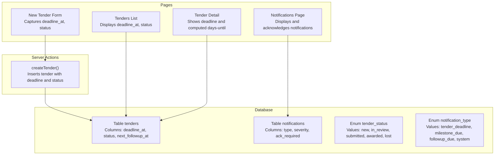
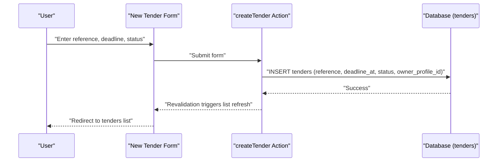
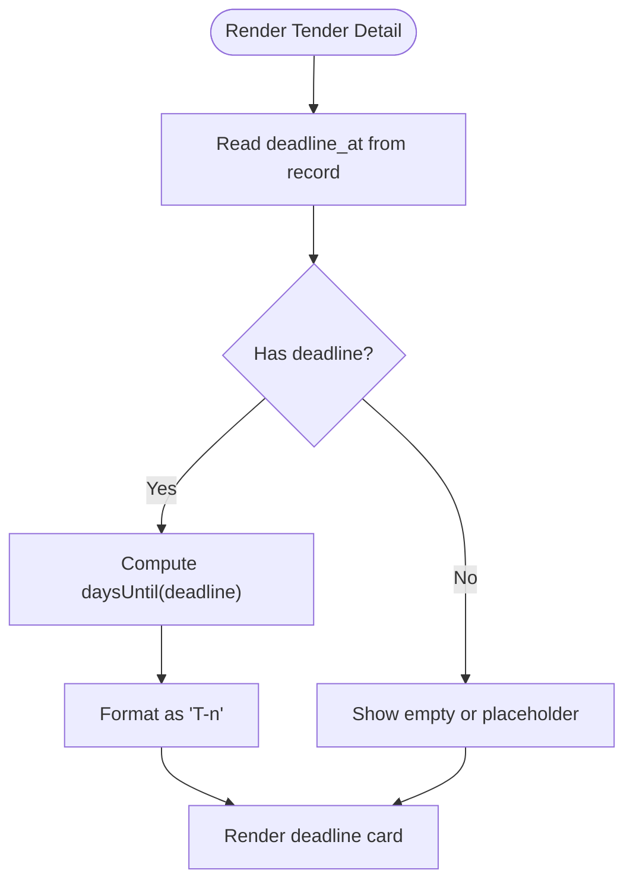
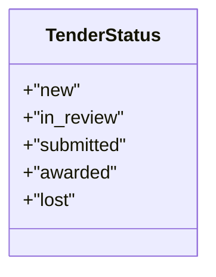
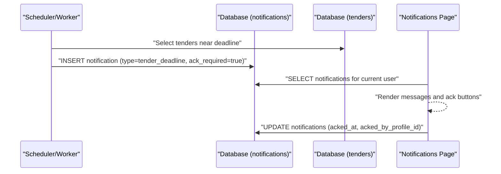
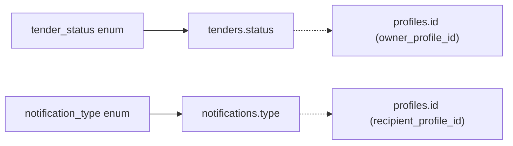

# Deadline and Status Management

<cite>
**Referenced Files in This Document**
- [README.md](file://README.md)
- [001_day1_schema.sql](file://supabase/migrations/001_day1_schema.sql)
- [tenders.ts](file://app/ssr/tenders.ts)
- [tenders/page.tsx](file://app/tenders/page.tsx)
- [tenders/[id]/page.tsx](file://app/tenders/[id]/page.tsx)
- [tenders/new/page.tsx](file://app/tenders/new/page.tsx)
- [notifications/page.tsx](file://app/notifications/page.tsx)
- [ssr/notifications.ts](file://app/ssr/notifications.ts)
</cite>

## Table of Contents
1. [Introduction](#introduction)
2. [Project Structure](#project-structure)
3. [Core Components](#core-components)
4. [Architecture Overview](#architecture-overview)
5. [Detailed Component Analysis](#detailed-component-analysis)
6. [Dependency Analysis](#dependency-analysis)
7. [Performance Considerations](#performance-considerations)
8. [Troubleshooting Guide](#troubleshooting-guide)
9. [Conclusion](#conclusion)
10. [Appendices](#appendices)

## Introduction
This document explains the deadline and status management system within tender operations. It covers how deadlines are stored and displayed, how status values are modeled, and how the UI surfaces deadlines and statuses. It also outlines the current notification acknowledgment flow and highlights areas where automated deadline reminders and escalations would integrate with the existing notification infrastructure.

## Project Structure
The tender deadline and status system spans database schema definitions, server-side actions, and Next.js pages:
- Database schema defines enums for tender status and notification types, and stores deadlines and follow-up timestamps.
- Server actions encapsulate creation and updates.
- Pages render lists and details, formatting deadlines and statuses for users.

**Diagram sources**
- [001_day1_schema.sql](file://supabase/migrations/001_day1_schema.sql#L130-L144)
- [001_day1_schema.sql](file://supabase/migrations/001_day1_schema.sql#L26-L32)
- [001_day1_schema.sql](file://supabase/migrations/001_day1_schema.sql#L193-L206)
- [tenders.ts](file://app/ssr/tenders.ts#L8-L42)
- [tenders/page.tsx](file://app/tenders/page.tsx#L4-L64)
- [tenders/[id]/page.tsx](file://app/tenders/[id]/page.tsx#L10-L68)
- [tenders/new/page.tsx](file://app/tenders/new/page.tsx#L6-L69)
- [notifications/page.tsx](file://app/notifications/page.tsx#L4-L67)

**Section sources**
- [README.md](file://README.md#L1-L158)
- [001_day1_schema.sql](file://supabase/migrations/001_day1_schema.sql#L1-L227)

## Core Components
- Tender model and deadline storage
  - Deadlines are stored as timestamptz in the tenders table.
  - Follow-up tracking is supported via next_followup_at.
- Status enumeration
  - Tender statuses are constrained to a fixed set of values.
- UI rendering
  - Tenders list shows deadlines and statuses.
  - Tender detail computes and displays days until deadline.
- Creation flow
  - New tender form posts deadline and status to a server action that inserts into the database.

**Section sources**
- [001_day1_schema.sql](file://supabase/migrations/001_day1_schema.sql#L130-L144)
- [001_day1_schema.sql](file://supabase/migrations/001_day1_schema.sql#L26-L32)
- [tenders/page.tsx](file://app/tenders/page.tsx#L4-L64)
- [tenders/[id]/page.tsx](file://app/tenders/[id]/page.tsx#L5-L8)
- [tenders/new/page.tsx](file://app/tenders/new/page.tsx#L6-L69)
- [tenders.ts](file://app/ssr/tenders.ts#L8-L42)

## Architecture Overview
The system follows a simple pattern:
- Client-side forms submit to server actions.
- Server actions insert or update records in the database.
- Pages query the database and render data, including computed deadline deltas.

**Diagram sources**
- [tenders/new/page.tsx](file://app/tenders/new/page.tsx#L13-L16)
- [tenders.ts](file://app/ssr/tenders.ts#L25-L34)
- [tenders/page.tsx](file://app/tenders/page.tsx#L4-L64)

## Detailed Component Analysis

### Tender Deadline Storage and Display
- Storage
  - The tenders table includes deadline_at as timestamptz, enabling precise deadline tracking across sessions/timezones.
- Listing
  - The tenders list page selects deadline_at and renders it as a localized string.
- Detail view
  - The detail page computes days until the deadline using a helper that compares the deadline to the current time and formats a T-n display.

**Diagram sources**
- [tenders/[id]/page.tsx](file://app/tenders/[id]/page.tsx#L17-L23)
- [tenders/[id]/page.tsx](file://app/tenders/[id]/page.tsx#L5-L8)
- [tenders/[id]/page.tsx](file://app/tenders/[id]/page.tsx#L42-L44)
- [tenders/[id]/page.tsx](file://app/tenders/[id]/page.tsx#L63-L68)

**Section sources**
- [001_day1_schema.sql](file://supabase/migrations/001_day1_schema.sql#L130-L144)
- [tenders/page.tsx](file://app/tenders/page.tsx#L40-L42)
- [tenders/[id]/page.tsx](file://app/tenders/[id]/page.tsx#L5-L8)
- [tenders/[id]/page.tsx](file://app/tenders/[id]/page.tsx#L42-L44)

### Status Enumeration and Construction Industry Context
- Tender statuses are modeled as an enum with values: new, in_review, submitted, awarded, lost.
- These values align with typical construction tender lifecycle stages:
  - new: Newly created, not yet under review.
  - in_review: Under internal review.
  - submitted: Formal submission made to client.
  - awarded: Contract awarded.
  - lost: Tender not successful.

**Diagram sources**
- [001_day1_schema.sql](file://supabase/migrations/001_day1_schema.sql#L26-L32)

**Section sources**
- [001_day1_schema.sql](file://supabase/migrations/001_day1_schema.sql#L26-L32)

### Status Transition Rules and Approval Workflows
- Current state
  - Tender creation accepts an initial status value from the client.
  - There is no dedicated server action for changing status in the reviewed code.
- Recommended transitions (conceptual)
  - new → in_review → submitted → awarded or lost.
  - Transitions should be governed by business rules and approvals, which are not present in the current codebase.
- Implementation note
  - To enforce transitions, add a server action that validates the proposed status against a transition matrix and updates the record.

[No sources needed since this section provides conceptual guidance]

### Deadline Visualization in Tender Listing
- The listing page displays deadline_at and status for each tender.
- Color-coding for overdue, upcoming, and completed is not implemented in the current code.
- Recommendation
  - Compare deadline_at to current time and apply CSS classes to rows or cells for visual cues.

**Section sources**
- [tenders/page.tsx](file://app/tenders/page.tsx#L4-L64)

### Notification Integration for Reminders and Alerts
- Notification model
  - The notifications table includes type and severity, with a dedicated type for tender_deadline.
- Acknowledgment flow
  - Users can acknowledge notifications via the notifications page, which calls a server action to mark acked_at and acked_by_profile_id.
- Integration opportunity
  - Automated reminders could create notifications of type tender_deadline with appropriate severity and ack requirements.
  - The existing acknowledgment UI supports follow-up actions after reminders.

**Diagram sources**
- [001_day1_schema.sql](file://supabase/migrations/001_day1_schema.sql#L193-L206)
- [001_day1_schema.sql](file://supabase/migrations/001_day1_schema.sql#L52-L57)
- [ssr/notifications.ts](file://app/ssr/notifications.ts#L7-L26)
- [notifications/page.tsx](file://app/notifications/page.tsx#L4-L67)

**Section sources**
- [001_day1_schema.sql](file://supabase/migrations/001_day1_schema.sql#L193-L206)
- [001_day1_schema.sql](file://supabase/migrations/001_day1_schema.sql#L52-L57)
- [ssr/notifications.ts](file://app/ssr/notifications.ts#L7-L26)
- [notifications/page.tsx](file://app/notifications/page.tsx#L4-L67)

### Practical Examples of Deadline Management Scenarios
- Setting follow-up dates
  - Use next_followup_at to track follow-ups; the detail page exposes this field for display.
- Tracking bid submission deadlines
  - deadline_at stores the hard deadline; the detail page computes days until deadline for quick visibility.
- Managing contract award timelines
  - After submission, update status to in_review, then to submitted, and finally to awarded or lost.

**Section sources**
- [001_day1_schema.sql](file://supabase/migrations/001_day1_schema.sql#L130-L144)
- [tenders/[id]/page.tsx](file://app/tenders/[id]/page.tsx#L77-L77)
- [tenders/[id]/page.tsx](file://app/tenders/[id]/page.tsx#L75-L75)

### Deadline Calculation Algorithms and Timezone Considerations
- Days-until calculation
  - The helper computes the difference between deadline_at and the current time, converting to days.
- Timezone handling
  - deadline_at is stored as timestamptz, preserving timezone-awareness.
  - Rendering uses the browser’s local time conversion; consider explicit timezone formatting if global teams are involved.

**Section sources**
- [tenders/[id]/page.tsx](file://app/tenders/[id]/page.tsx#L5-L8)
- [001_day1_schema.sql](file://supabase/migrations/001_day1_schema.sql#L130-L144)

### Status Validation Rules
- Status values are constrained by the tender_status enum.
- Creation allows specifying an initial status; enforcement of valid transitions requires additional server-side validation.

**Section sources**
- [001_day1_schema.sql](file://supabase/migrations/001_day1_schema.sql#L26-L32)
- [tenders.ts](file://app/ssr/tenders.ts#L25-L34)

## Dependency Analysis
- Database dependencies
  - tenders depends on profiles for ownership.
  - notifications depends on profiles for recipients.
- Frontend dependencies
  - Pages depend on server actions for mutations and on database queries for reads.
- Enum dependencies
  - Tender status and notification type enums constrain values across the system.

**Diagram sources**
- [001_day1_schema.sql](file://supabase/migrations/001_day1_schema.sql#L26-L32)
- [001_day1_schema.sql](file://supabase/migrations/001_day1_schema.sql#L52-L57)
- [001_day1_schema.sql](file://supabase/migrations/001_day1_schema.sql#L130-L144)
- [001_day1_schema.sql](file://supabase/migrations/001_day1_schema.sql#L193-L206)

**Section sources**
- [001_day1_schema.sql](file://supabase/migrations/001_day1_schema.sql#L130-L144)
- [001_day1_schema.sql](file://supabase/migrations/001_day1_schema.sql#L193-L206)

## Performance Considerations
- Indexing
  - deadline_at is indexed, supporting efficient sorting and filtering of tenders by deadline.
- Rendering
  - Converting timestamptz to locale strings on the server is acceptable for small-to-medium datasets; consider server-side formatting or caching for very large lists.
- Notifications
  - Acknowledgment updates are single-row writes; ensure indexes on recipient and created_at support fast retrieval.

**Section sources**
- [001_day1_schema.sql](file://supabase/migrations/001_day1_schema.sql#L221-L227)
- [ssr/notifications.ts](file://app/ssr/notifications.ts#L13-L19)

## Troubleshooting Guide
- Tender creation errors
  - If creation fails, the action throws an error with the underlying message; verify that the profile exists and that inputs are valid.
- Deadline display issues
  - If deadlines appear incorrect, confirm the deadline_at value stored and the browser’s timezone settings.
- Notification acknowledgment
  - If acknowledging fails, check for errors returned by the server action and ensure the notification exists and belongs to the current user.

**Section sources**
- [tenders.ts](file://app/ssr/tenders.ts#L36-L38)
- [ssr/notifications.ts](file://app/ssr/notifications.ts#L21-L23)
- [tenders/[id]/page.tsx](file://app/tenders/[id]/page.tsx#L6-L8)

## Conclusion
The tender deadline and status system provides a solid foundation with deadline_at storage, status enumeration, and basic UI rendering. To complete the solution, implement:
- Automated deadline reminders and escalations via notifications of type tender_deadline.
- Status transition validation and approval workflows.
- Visual indicators for overdue/upcoming/completed tenders in the listing.
- Optional enhancements: explicit timezone handling and batch processing for reminders.

[No sources needed since this section summarizes without analyzing specific files]

## Appendices

### Appendix A: Tender Status Reference
- new: Newly created, not yet under review.
- in_review: Under internal review.
- submitted: Formal submission made to client.
- awarded: Contract awarded.
- lost: Tender not successful.

**Section sources**
- [001_day1_schema.sql](file://supabase/migrations/001_day1_schema.sql#L26-L32)