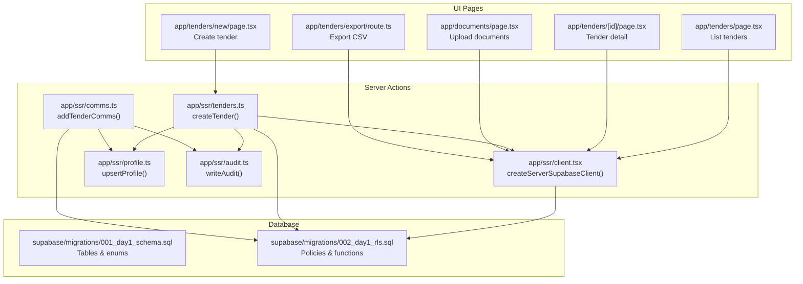
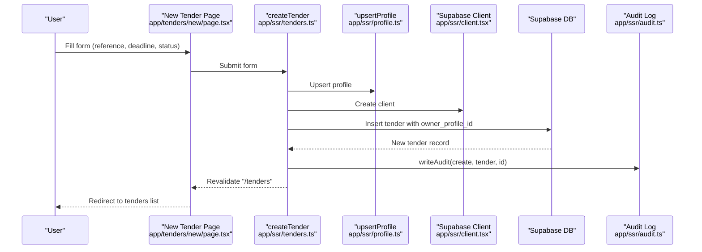
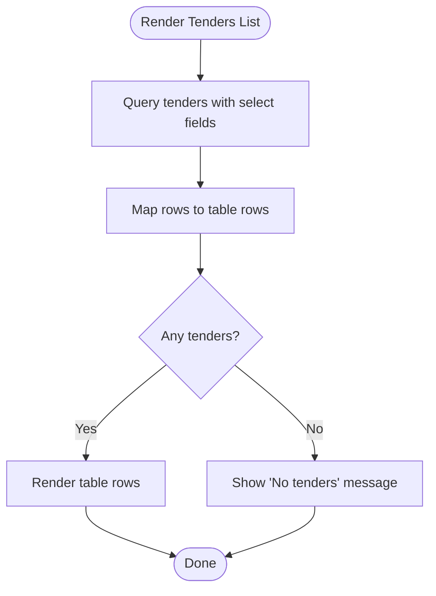
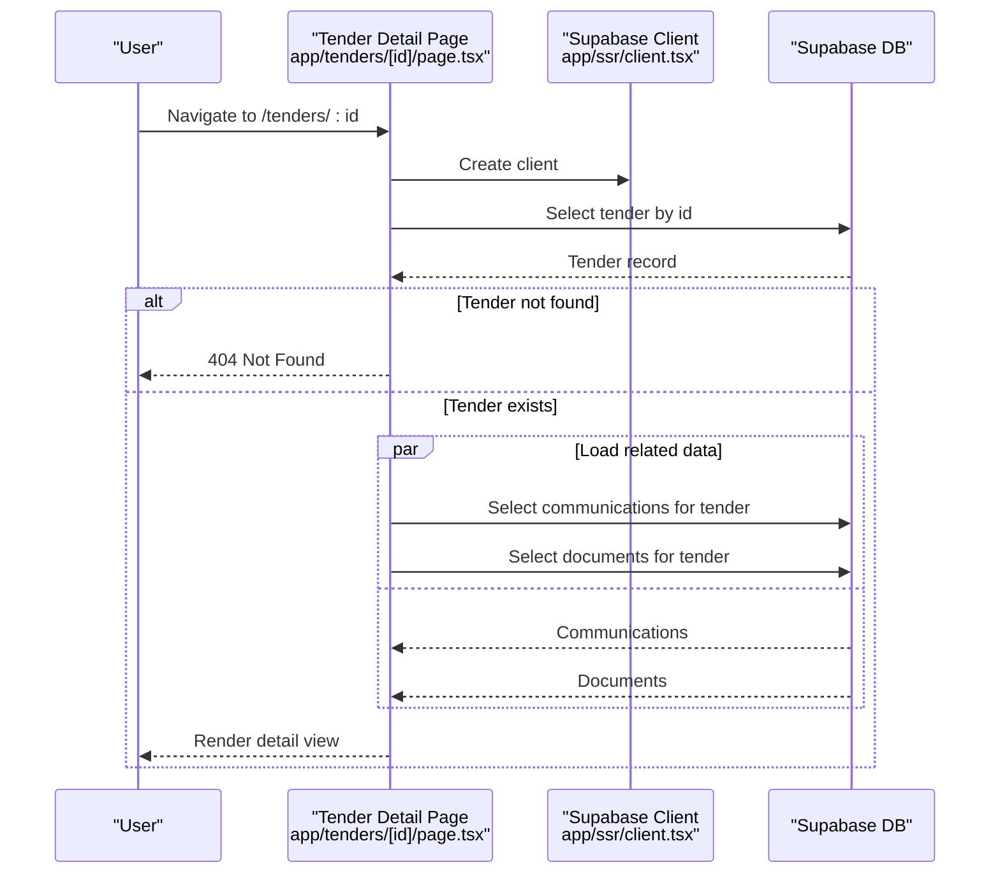
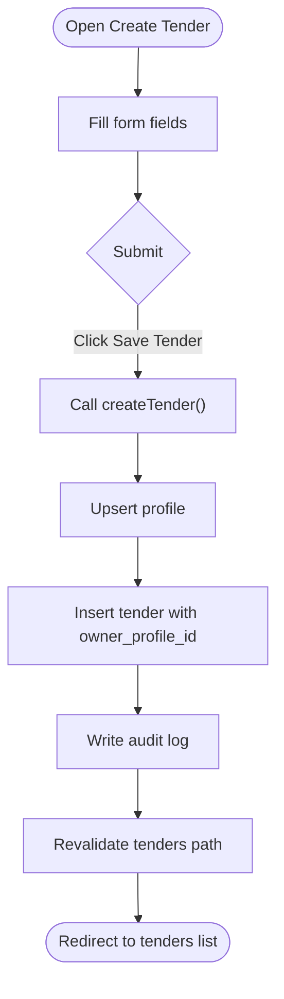
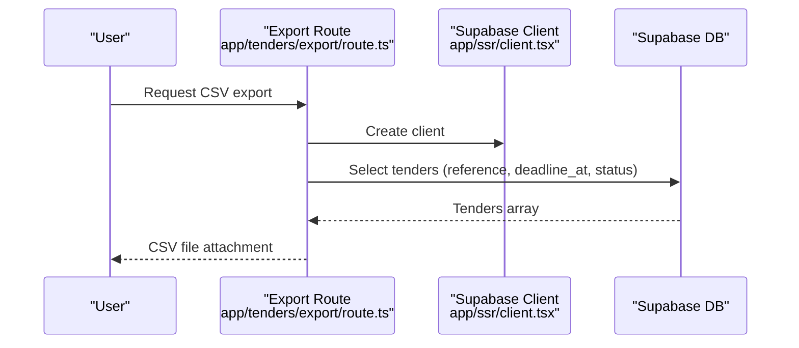
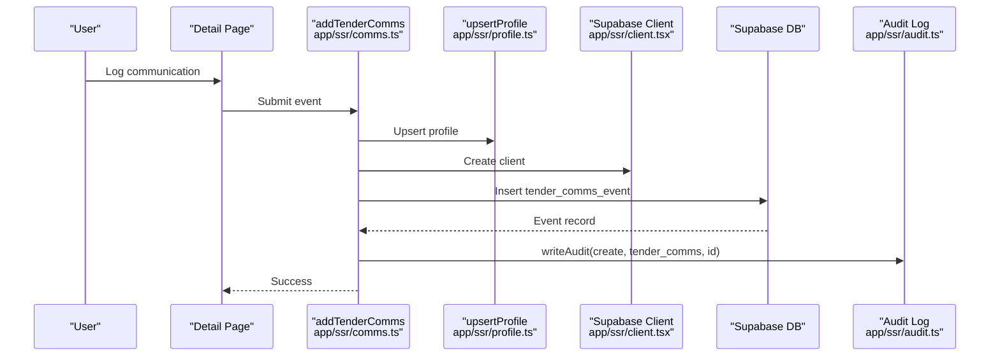
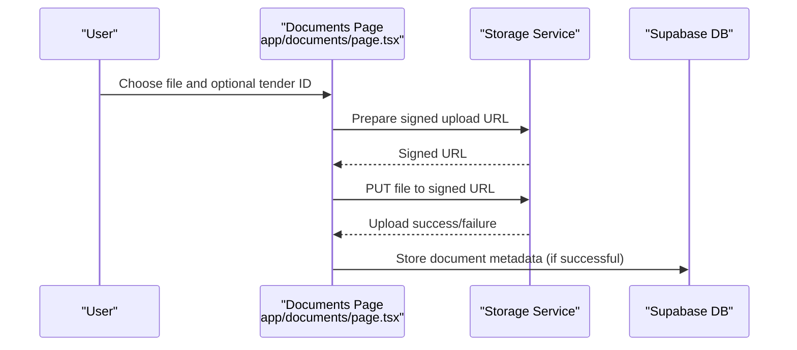
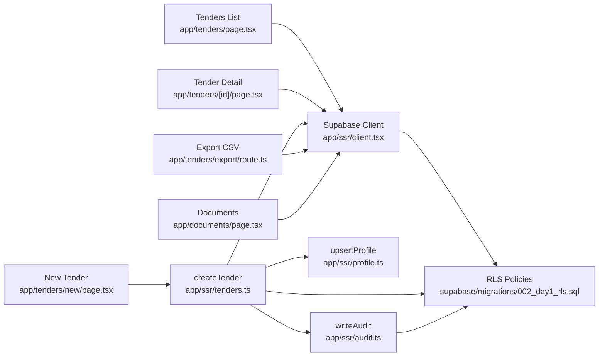
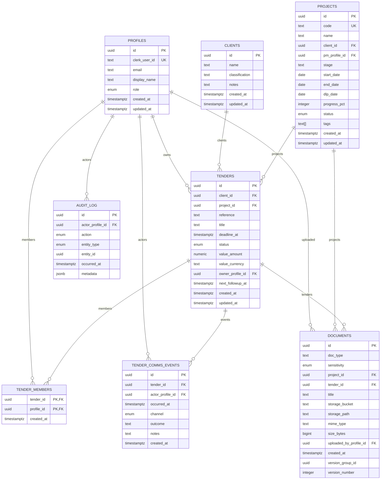

# Tender CRUD Operations

<cite>
**Referenced Files in This Document**
- [app/tenders/page.tsx](file://app/tenders/page.tsx)
- [app/tenders/[id]/page.tsx](file://app/tenders/[id]/page.tsx)
- [app/tenders/new/page.tsx](file://app/tenders/new/page.tsx)
- [app/tenders/export/route.ts](file://app/tenders/export/route.ts)
- [app/ssr/tenders.ts](file://app/ssr/tenders.ts)
- [app/ssr/client.tsx](file://app/ssr/client.tsx)
- [app/ssr/profile.ts](file://app/ssr/profile.ts)
- [app/ssr/audit.ts](file://app/ssr/audit.ts)
- [app/ssr/comms.ts](file://app/ssr/comms.ts)
- [app/documents/page.tsx](file://app/documents/page.tsx)
- [supabase/migrations/001_day1_schema.sql](file://supabase/migrations/001_day1_schema.sql)
- [supabase/migrations/002_day1_rls.sql](file://supabase/migrations/002_day1_rls.sql)
</cite>

## Table of Contents
1. [Introduction](#introduction)
2. [Project Structure](#project-structure)
3. [Core Components](#core-components)
4. [Architecture Overview](#architecture-overview)
5. [Detailed Component Analysis](#detailed-component-analysis)
6. [Dependency Analysis](#dependency-analysis)
7. [Performance Considerations](#performance-considerations)
8. [Troubleshooting Guide](#troubleshooting-guide)
9. [Conclusion](#conclusion)
10. [Appendices](#appendices)

## Introduction
This document describes the tender CRUD operations in the MCE Command Center system. It covers the complete tender lifecycle: listing, viewing, creating, modifying, and exporting. It also documents the tender detail view, the new tender creation form, modification workflows, access controls, and audit logging. Practical scenarios illustrate adding opportunities, updating statuses, and managing tenders.

## Project Structure
The tender feature spans Next.js app router pages, server-side actions, and Supabase database tables with Row Level Security (RLS) policies.

**Diagram sources**
- [app/tenders/page.tsx](file://app/tenders/page.tsx#L1-L65)
- [app/tenders/[id]/page.tsx](file://app/tenders/[id]/page.tsx#L1-L130)
- [app/tenders/new/page.tsx](file://app/tenders/new/page.tsx#L1-L71)
- [app/tenders/export/route.ts](file://app/tenders/export/route.ts#L1-L25)
- [app/ssr/tenders.ts](file://app/ssr/tenders.ts#L1-L43)
- [app/ssr/client.tsx](file://app/ssr/client.tsx#L1-L25)
- [app/ssr/profile.ts](file://app/ssr/profile.ts#L1-L31)
- [app/ssr/audit.ts](file://app/ssr/audit.ts#L1-L29)
- [app/ssr/comms.ts](file://app/ssr/comms.ts#L1-L38)
- [app/documents/page.tsx](file://app/documents/page.tsx#L1-L90)
- [supabase/migrations/001_day1_schema.sql](file://supabase/migrations/001_day1_schema.sql#L1-L227)
- [supabase/migrations/002_day1_rls.sql](file://supabase/migrations/002_day1_rls.sql#L1-L348)

**Section sources**
- [app/tenders/page.tsx](file://app/tenders/page.tsx#L1-L65)
- [app/tenders/[id]/page.tsx](file://app/tenders/[id]/page.tsx#L1-L130)
- [app/tenders/new/page.tsx](file://app/tenders/new/page.tsx#L1-L71)
- [app/tenders/export/route.ts](file://app/tenders/export/route.ts#L1-L25)
- [app/ssr/tenders.ts](file://app/ssr/tenders.ts#L1-L43)
- [app/ssr/client.tsx](file://app/ssr/client.tsx#L1-L25)
- [app/ssr/profile.ts](file://app/ssr/profile.ts#L1-L31)
- [app/ssr/audit.ts](file://app/ssr/audit.ts#L1-L29)
- [app/ssr/comms.ts](file://app/ssr/comms.ts#L1-L38)
- [app/documents/page.tsx](file://app/documents/page.tsx#L1-L90)
- [supabase/migrations/001_day1_schema.sql](file://supabase/migrations/001_day1_schema.sql#L1-L227)
- [supabase/migrations/002_day1_rls.sql](file://supabase/migrations/002_day1_rls.sql#L1-L348)

## Core Components
- Tender listing page: Fetches and displays tenders with reference, deadline, status, and owner placeholder.
- Tender detail page: Loads a single tender and related communications and documents.
- New tender form: Client-side form to capture reference, deadline, and status; submits via server action.
- Server action createTender: Upserts profile, inserts tender, writes audit, and revalidates cache.
- Export endpoint: Generates CSV of tenders for download.
- Access control: RLS policies and helper functions govern visibility and editing.
- Audit trail: Centralized writeAudit service records all tender-related actions.

**Section sources**
- [app/tenders/page.tsx](file://app/tenders/page.tsx#L1-L65)
- [app/tenders/[id]/page.tsx](file://app/tenders/[id]/page.tsx#L1-L130)
- [app/tenders/new/page.tsx](file://app/tenders/new/page.tsx#L1-L71)
- [app/ssr/tenders.ts](file://app/ssr/tenders.ts#L1-L43)
- [app/tenders/export/route.ts](file://app/tenders/export/route.ts#L1-L25)
- [app/ssr/audit.ts](file://app/ssr/audit.ts#L1-L29)
- [supabase/migrations/002_day1_rls.sql](file://supabase/migrations/002_day1_rls.sql#L75-L113)

## Architecture Overview
The system integrates Clerk authentication with Supabase for data persistence and RLS. Server actions encapsulate sensitive operations and enforce permissions. The UI is rendered by Next.js app router pages, with server actions invoked from client components.

**Diagram sources**
- [app/tenders/new/page.tsx](file://app/tenders/new/page.tsx#L1-L71)
- [app/ssr/tenders.ts](file://app/ssr/tenders.ts#L1-L43)
- [app/ssr/profile.ts](file://app/ssr/profile.ts#L1-L31)
- [app/ssr/client.tsx](file://app/ssr/client.tsx#L1-L25)
- [app/ssr/audit.ts](file://app/ssr/audit.ts#L1-L29)

## Detailed Component Analysis

### Tender Listing Interface
- Purpose: Display a paginated-like table of tenders sorted by deadline.
- Columns: Reference, Deadline, Status, Owner placeholder, Actions.
- Actions: Open link to detail view; Export CSV button; New Tender button.
- Data source: Selects id, reference, deadline_at, status, and owner display_name.
- Behavior: Shows empty state when no tenders.

**Diagram sources**
- [app/tenders/page.tsx](file://app/tenders/page.tsx#L1-L65)

**Section sources**
- [app/tenders/page.tsx](file://app/tenders/page.tsx#L1-L65)

### Tender Detail View
- Purpose: Present comprehensive tender information and related data.
- Data loaded:
  - Tender summary: id, reference, title, deadline_at, status, value fields, next_followup_at, owner display_name.
  - Related communications: channel, outcome/notes, occurred_at, actor display_name.
  - Related documents: title, doc_type, sensitivity, created_at.
- UX: Back to tenders and upload document buttons; T-N countdown indicator.
- Error handling: Returns notFound if tender does not exist.

**Diagram sources**
- [app/tenders/[id]/page.tsx](file://app/tenders/[id]/page.tsx#L1-L130)
- [app/ssr/client.tsx](file://app/ssr/client.tsx#L1-L25)

**Section sources**
- [app/tenders/[id]/page.tsx](file://app/tenders/[id]/page.tsx#L1-L130)

### New Tender Creation Form
- Purpose: Allow authorized users to create a new tender.
- Fields:
  - Reference (required)
  - Deadline (required, datetime-local)
  - Status (dropdown with predefined enum values)
- Submission: Client component posts to server action createTender.
- Validation: Basic HTML required attributes; server action validates and persists.

**Diagram sources**
- [app/tenders/new/page.tsx](file://app/tenders/new/page.tsx#L1-L71)
- [app/ssr/tenders.ts](file://app/ssr/tenders.ts#L1-L43)
- [app/ssr/profile.ts](file://app/ssr/profile.ts#L1-L31)
- [app/ssr/audit.ts](file://app/ssr/audit.ts#L1-L29)

**Section sources**
- [app/tenders/new/page.tsx](file://app/tenders/new/page.tsx#L1-L71)
- [app/ssr/tenders.ts](file://app/ssr/tenders.ts#L1-L43)

### Tender Modification Workflows
- Current state: The UI surfaces a detail view and related data but does not expose edit forms for status, deadline, or owner in the provided files.
- Access control: RLS policies define who can edit tenders (admin roles, project editors, or owners).
- Audit trail: All create operations are audited; updates would similarly be audited if implemented.

Practical scenarios:
- Adding new opportunities: Use the new tender form to create entries; the system assigns the current authenticated user as owner.
- Updating tender statuses: If an update form were present, it would require appropriate permissions per RLS and trigger audit logging.
- Managing tender archives: Not implemented in the provided files; would require additional UI and backend logic aligned with RLS and audit.

**Section sources**
- [supabase/migrations/002_day1_rls.sql](file://supabase/migrations/002_day1_rls.sql#L98-L113)
- [app/ssr/audit.ts](file://app/ssr/audit.ts#L1-L29)

### Tender Deletion Procedures
- Current state: No explicit deletion UI or server action was identified in the provided files.
- Access control: RLS policies govern visibility and editing; deletion would require appropriate permissions.
- Audit trail: Deletion would be audited if implemented.
- Data cleanup: Cascading deletes apply to related communications and documents as per schema.

**Section sources**
- [supabase/migrations/001_day1_schema.sql](file://supabase/migrations/001_day1_schema.sql#L153-L162)
- [supabase/migrations/001_day1_schema.sql](file://supabase/migrations/001_day1_schema.sql#L164-L180)
- [supabase/migrations/002_day1_rls.sql](file://supabase/migrations/002_day1_rls.sql#L203-L222)

### Tender Export Functionality
- Purpose: Download a CSV of tenders containing reference, deadline, and status.
- Implementation: Server route queries tenders, formats CSV rows, and returns a downloadable file.

**Diagram sources**
- [app/tenders/export/route.ts](file://app/tenders/export/route.ts#L1-L25)
- [app/ssr/client.tsx](file://app/ssr/client.tsx#L1-L25)

**Section sources**
- [app/tenders/export/route.ts](file://app/tenders/export/route.ts#L1-L25)

### Tender Communication Logging
- Purpose: Record communications events against a tender (e.g., notes, outcomes).
- Implementation: Server action adds a communication event with channel, notes, and outcome; audits the event.

**Diagram sources**
- [app/ssr/comms.ts](file://app/ssr/comms.ts#L1-L38)
- [app/ssr/profile.ts](file://app/ssr/profile.ts#L1-L31)
- [app/ssr/client.tsx](file://app/ssr/client.tsx#L1-L25)
- [app/ssr/audit.ts](file://app/ssr/audit.ts#L1-L29)

**Section sources**
- [app/ssr/comms.ts](file://app/ssr/comms.ts#L1-L38)

### Document Upload Integration
- Purpose: Attach documents to tenders or projects via signed uploads.
- Implementation: Documents page supports selecting a tender ID and uploading files; the upload uses a signed URL.

**Diagram sources**
- [app/documents/page.tsx](file://app/documents/page.tsx#L1-L90)

**Section sources**
- [app/documents/page.tsx](file://app/documents/page.tsx#L1-L90)

## Dependency Analysis
- UI depends on server actions for mutations and on Supabase client for queries.
- Server actions depend on profile upsert, Supabase client, and audit logging.
- Database enforces access control via RLS policies and helper functions.
- Enumerations and constraints are defined in schema migrations.

**Diagram sources**
- [app/tenders/page.tsx](file://app/tenders/page.tsx#L1-L65)
- [app/tenders/[id]/page.tsx](file://app/tenders/[id]/page.tsx#L1-L130)
- [app/tenders/new/page.tsx](file://app/tenders/new/page.tsx#L1-L71)
- [app/tenders/export/route.ts](file://app/tenders/export/route.ts#L1-L25)
- [app/ssr/tenders.ts](file://app/ssr/tenders.ts#L1-L43)
- [app/ssr/client.tsx](file://app/ssr/client.tsx#L1-L25)
- [app/ssr/profile.ts](file://app/ssr/profile.ts#L1-L31)
- [app/ssr/audit.ts](file://app/ssr/audit.ts#L1-L29)
- [app/documents/page.tsx](file://app/documents/page.tsx#L1-L90)
- [supabase/migrations/002_day1_rls.sql](file://supabase/migrations/002_day1_rls.sql#L1-L348)

**Section sources**
- [supabase/migrations/001_day1_schema.sql](file://supabase/migrations/001_day1_schema.sql#L1-L227)
- [supabase/migrations/002_day1_rls.sql](file://supabase/migrations/002_day1_rls.sql#L1-L348)

## Performance Considerations
- Queries: The listing and detail pages use targeted selects and single-row retrieval to minimize payload sizes.
- Parallelization: Detail page loads communications and documents concurrently to reduce latency.
- Indexes: Schema includes indexes on tenders deadline and owner for efficient sorting and filtering.
- Revalidation: Server action triggers path revalidation after creation to keep cached lists fresh.

[No sources needed since this section provides general guidance]

## Troubleshooting Guide
- Authentication errors: Profile upsert requires an authenticated Clerk user; ensure Clerk session is active.
- Permission denied: RLS policies restrict access; verify user role and ownership or membership.
- Audit failures: writeAudit requires a valid profile; confirm audit insertion succeeds.
- Export issues: Ensure the export route can query tenders and that the browser accepts downloads.

**Section sources**
- [app/ssr/profile.ts](file://app/ssr/profile.ts#L1-L31)
- [app/ssr/audit.ts](file://app/ssr/audit.ts#L1-L29)
- [supabase/migrations/002_day1_rls.sql](file://supabase/migrations/002_day1_rls.sql#L75-L113)

## Conclusion
The MCE Command Center implements a clear, secure tender lifecycle with robust access controls and audit logging. The listing and detail views provide essential information, while the creation flow ensures proper ownership and compliance. Future enhancements could include dedicated update and delete interfaces, expanded status transitions, and archive management, all aligned with existing RLS and audit mechanisms.

[No sources needed since this section summarizes without analyzing specific files]

## Appendices

### Data Model Overview
The tender feature relies on several core tables and enumerations defined in the schema.

**Diagram sources**
- [supabase/migrations/001_day1_schema.sql](file://supabase/migrations/001_day1_schema.sql#L76-L227)

### Access Control Matrix (Selected)
- Tender view/edit: Admin roles, project editors, or owners; members inherit permissions via project membership.
- Tender creation: Requires admin roles and sets current user as owner.
- Communication logging: Requires viewer-level access to tender and actor identity.
- Document operations: Require appropriate project or tender permissions plus uploader identity.

**Section sources**
- [supabase/migrations/002_day1_rls.sql](file://supabase/migrations/002_day1_rls.sql#L75-L113)
- [supabase/migrations/002_day1_rls.sql](file://supabase/migrations/002_day1_rls.sql#L203-L222)
- [supabase/migrations/002_day1_rls.sql](file://supabase/migrations/002_day1_rls.sql#L245-L257)