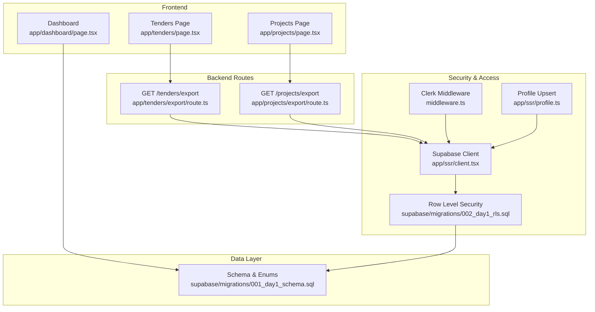
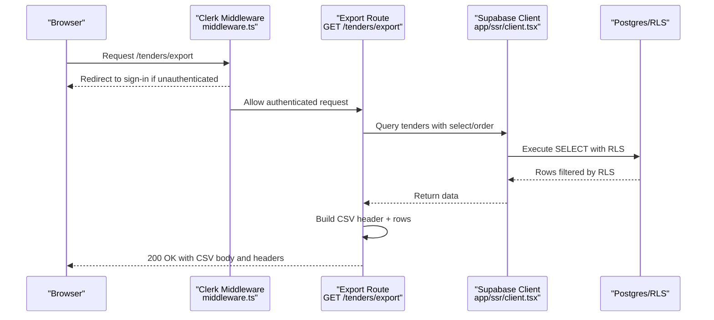
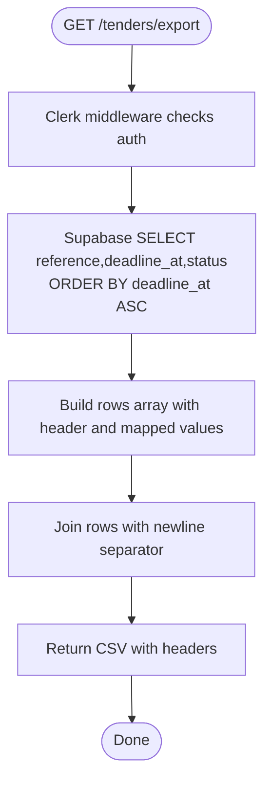
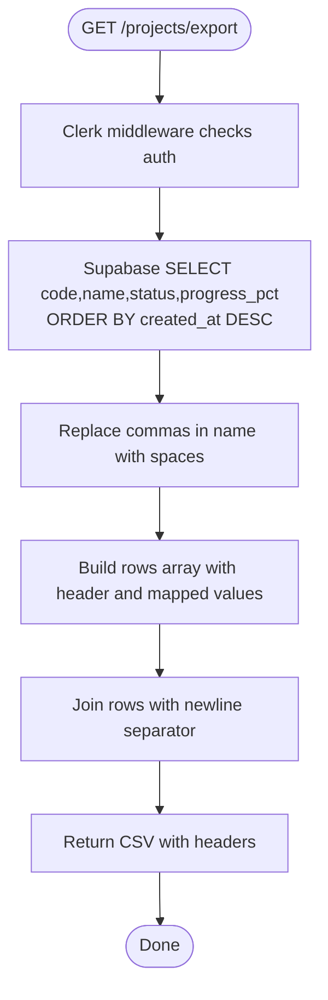
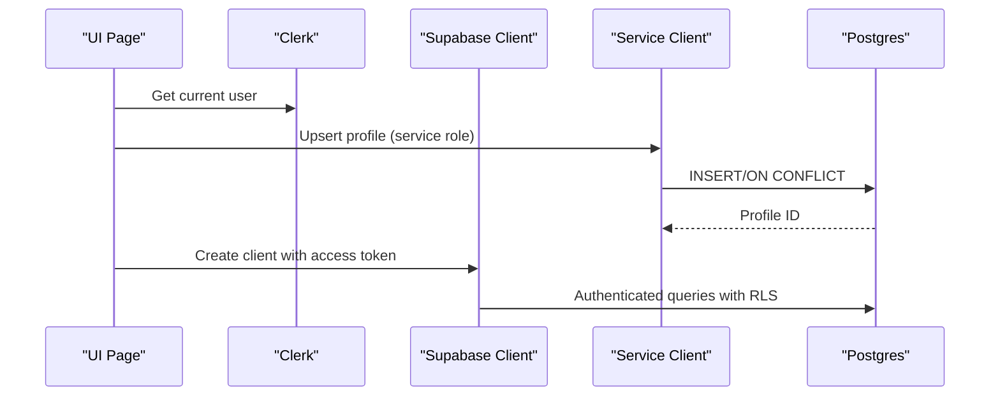
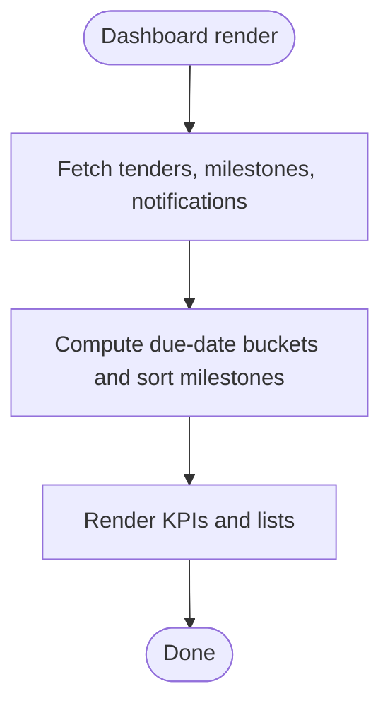
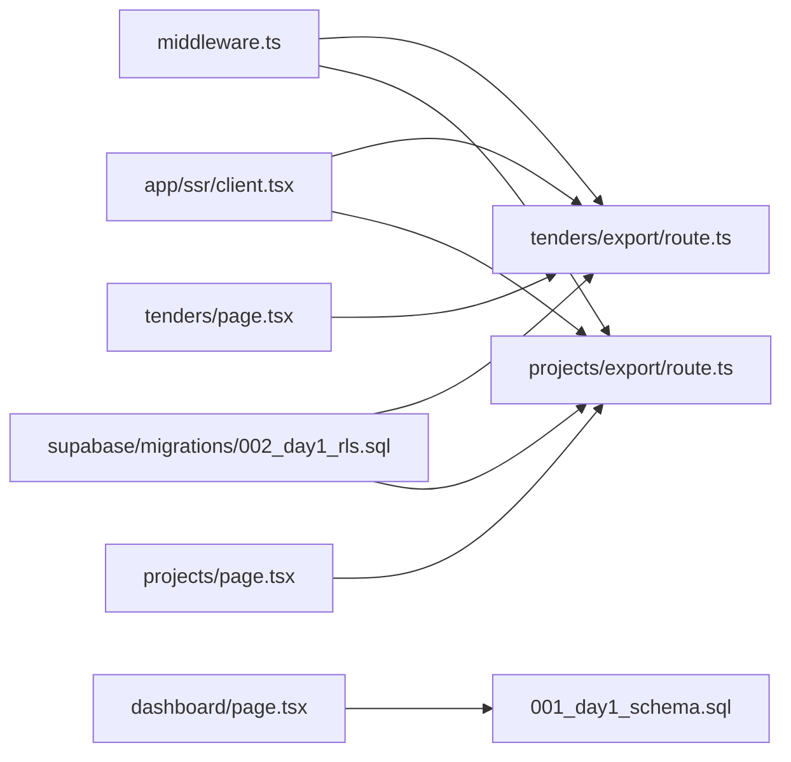

# Tender Data Export and Reporting

<cite>
**Referenced Files in This Document**
- [app/tenders/export/route.ts](file://app/tenders/export/route.ts)
- [app/projects/export/route.ts](file://app/projects/export/route.ts)
- [app/ssr/client.tsx](file://app/ssr/client.tsx)
- [middleware.ts](file://middleware.ts)
- [supabase/migrations/001_day1_schema.sql](file://supabase/migrations/001_day1_schema.sql)
- [supabase/migrations/002_day1_rls.sql](file://supabase/migrations/002_day1_rls.sql)
- [app/tenders/page.tsx](file://app/tenders/page.tsx)
- [app/projects/page.tsx](file://app/projects/page.tsx)
- [app/dashboard/page.tsx](file://app/dashboard/page.tsx)
- [app/ssr/profile.ts](file://app/ssr/profile.ts)
</cite>

## Table of Contents
1. [Introduction](#introduction)
2. [Project Structure](#project-structure)
3. [Core Components](#core-components)
4. [Architecture Overview](#architecture-overview)
5. [Detailed Component Analysis](#detailed-component-analysis)
6. [Dependency Analysis](#dependency-analysis)
7. [Performance Considerations](#performance-considerations)
8. [Troubleshooting Guide](#troubleshooting-guide)
9. [Conclusion](#conclusion)
10. [Appendices](#appendices)

## Introduction
This document explains the tender data export and reporting capabilities implemented in the system. It covers:
- CSV export mechanics for tenders and projects, including data formatting, field mappings, and response headers
- Export route implementation and security posture for authorized access
- Report generation capabilities present in the codebase (dashboards and counts)
- Data export permissions and access controls enforced via Row Level Security (RLS)
- Export data schema derived from database tables
- Practical export scenarios such as bid reports, management dashboards, and regulatory submissions
- Performance considerations for large datasets and potential extensions for additional export formats

## Project Structure
The export functionality is implemented as Next.js App Router API routes under the tenders and projects sections. The routes:
- Query data from Supabase
- Format it as CSV
- Return a downloadable file with appropriate headers

Key locations:
- Tender export route: app/tenders/export/route.ts
- Project export route: app/projects/export/route.ts
- Supabase client integration: app/ssr/client.tsx
- Authentication and middleware: middleware.ts
- Database schema and RLS: supabase/migrations/001_day1_schema.sql, supabase/migrations/002_day1_rls.sql
- UI triggers for export: app/tenders/page.tsx, app/projects/page.tsx
- Dashboard reporting: app/dashboard/page.tsx
- Profile upsert for user context: app/ssr/profile.ts

**Diagram sources**
- [app/tenders/export/route.ts](file://app/tenders/export/route.ts#L1-L25)
- [app/projects/export/route.ts](file://app/projects/export/route.ts#L1-L26)
- [app/ssr/client.tsx](file://app/ssr/client.tsx#L1-L25)
- [middleware.ts](file://middleware.ts#L1-L20)
- [supabase/migrations/001_day1_schema.sql](file://supabase/migrations/001_day1_schema.sql#L1-L227)
- [supabase/migrations/002_day1_rls.sql](file://supabase/migrations/002_day1_rls.sql#L1-L348)
- [app/tenders/page.tsx](file://app/tenders/page.tsx#L1-L65)
- [app/projects/page.tsx](file://app/projects/page.tsx#L1-L65)
- [app/dashboard/page.tsx](file://app/dashboard/page.tsx#L1-L157)
- [app/ssr/profile.ts](file://app/ssr/profile.ts#L1-L31)

**Section sources**
- [app/tenders/export/route.ts](file://app/tenders/export/route.ts#L1-L25)
- [app/projects/export/route.ts](file://app/projects/export/route.ts#L1-L26)
- [app/ssr/client.tsx](file://app/ssr/client.tsx#L1-L25)
- [middleware.ts](file://middleware.ts#L1-L20)
- [supabase/migrations/001_day1_schema.sql](file://supabase/migrations/001_day1_schema.sql#L1-L227)
- [supabase/migrations/002_day1_rls.sql](file://supabase/migrations/002_day1_rls.sql#L1-L348)
- [app/tenders/page.tsx](file://app/tenders/page.tsx#L1-L65)
- [app/projects/page.tsx](file://app/projects/page.tsx#L1-L65)
- [app/dashboard/page.tsx](file://app/dashboard/page.tsx#L1-L157)
- [app/ssr/profile.ts](file://app/ssr/profile.ts#L1-L31)

## Core Components
- Tender export route: Returns a CSV stream containing selected tender fields with a CSV Content-Type header and a filename attachment.
- Project export route: Returns a CSV stream containing selected project fields with a CSV Content-Type header and a filename attachment.
- Supabase client: Integrates Clerk JWT tokens to authenticate requests and enforces RLS policies server-side.
- Middleware: Enforces Clerk authentication for protected routes.
- Dashboard reporting: Provides counts and lists used for management dashboards and ad-hoc reporting.

**Section sources**
- [app/tenders/export/route.ts](file://app/tenders/export/route.ts#L1-L25)
- [app/projects/export/route.ts](file://app/projects/export/route.ts#L1-L26)
- [app/ssr/client.tsx](file://app/ssr/client.tsx#L1-L25)
- [middleware.ts](file://middleware.ts#L1-L20)
- [app/dashboard/page.tsx](file://app/dashboard/page.tsx#L1-L157)

## Architecture Overview
The export pipeline follows a secure, server-side flow:
- Clerk middleware ensures the user is authenticated for non-public routes.
- The Supabase client injects the current user’s access token.
- RLS policies govern which records the user can access.
- Export routes query the database, format CSV rows, and return a downloadable file.

**Diagram sources**
- [middleware.ts](file://middleware.ts#L1-L20)
- [app/tenders/export/route.ts](file://app/tenders/export/route.ts#L1-L25)
- [app/ssr/client.tsx](file://app/ssr/client.tsx#L1-L25)
- [supabase/migrations/002_day1_rls.sql](file://supabase/migrations/002_day1_rls.sql#L203-L221)

## Detailed Component Analysis

### Tender Export Route
- Purpose: Serve a CSV file of tenders for download.
- Data selection: reference, deadline_at, status.
- Sorting: ordered by deadline_at ascending.
- CSV formatting: header row plus comma-separated values per record; empty fields are treated as empty strings.
- Response: text/csv with Content-Disposition attachment and filename tenders.csv.

**Diagram sources**
- [app/tenders/export/route.ts](file://app/tenders/export/route.ts#L4-L24)
- [middleware.ts](file://middleware.ts#L5-L12)

**Section sources**
- [app/tenders/export/route.ts](file://app/tenders/export/route.ts#L1-L25)

### Project Export Route
- Purpose: Serve a CSV file of projects for download.
- Data selection: code, name, status, progress_pct.
- Sorting: ordered by created_at descending.
- CSV formatting: header row plus comma-separated values per record; commas in name are replaced with spaces to avoid CSV parsing issues.
- Response: text/csv with Content-Disposition attachment and filename projects.csv.

**Diagram sources**
- [app/projects/export/route.ts](file://app/projects/export/route.ts#L4-L24)
- [middleware.ts](file://middleware.ts#L5-L12)

**Section sources**
- [app/projects/export/route.ts](file://app/projects/export/route.ts#L1-L26)

### Supabase Client and Authentication
- The server-side Supabase client injects the current Clerk access token for authenticated requests.
- A service role client is also available for privileged operations server-side.
- The profile upsert ensures the current Clerk user has a corresponding profile record.

**Diagram sources**
- [app/ssr/client.tsx](file://app/ssr/client.tsx#L4-L14)
- [app/ssr/profile.ts](file://app/ssr/profile.ts#L6-L30)

**Section sources**
- [app/ssr/client.tsx](file://app/ssr/client.tsx#L1-L25)
- [app/ssr/profile.ts](file://app/ssr/profile.ts#L1-L31)

### Dashboard Reporting
- The dashboard aggregates counts for tenders due in various windows (today, 1d, 3d, 7d, 14d) and displays upcoming milestones and critical notifications.
- These counts and lists serve as built-in reporting views for management dashboards.

**Diagram sources**
- [app/dashboard/page.tsx](file://app/dashboard/page.tsx#L20-L60)

**Section sources**
- [app/dashboard/page.tsx](file://app/dashboard/page.tsx#L1-L157)

## Dependency Analysis
- Export routes depend on:
  - Clerk middleware for authentication
  - Supabase client for authenticated database access
  - RLS policies for access control
- UI pages link to export routes and also provide dashboard reporting.

**Diagram sources**
- [middleware.ts](file://middleware.ts#L1-L20)
- [app/tenders/export/route.ts](file://app/tenders/export/route.ts#L1-L25)
- [app/projects/export/route.ts](file://app/projects/export/route.ts#L1-L26)
- [app/ssr/client.tsx](file://app/ssr/client.tsx#L1-L25)
- [supabase/migrations/002_day1_rls.sql](file://supabase/migrations/002_day1_rls.sql#L203-L221)
- [app/tenders/page.tsx](file://app/tenders/page.tsx#L19-L21)
- [app/projects/page.tsx](file://app/projects/page.tsx#L19-L21)
- [app/dashboard/page.tsx](file://app/dashboard/page.tsx#L20-L30)
- [supabase/migrations/001_day1_schema.sql](file://supabase/migrations/001_day1_schema.sql#L130-L144)

**Section sources**
- [middleware.ts](file://middleware.ts#L1-L20)
- [app/tenders/export/route.ts](file://app/tenders/export/route.ts#L1-L25)
- [app/projects/export/route.ts](file://app/projects/export/route.ts#L1-L26)
- [app/ssr/client.tsx](file://app/ssr/client.tsx#L1-L25)
- [supabase/migrations/002_day1_rls.sql](file://supabase/migrations/002_day1_rls.sql#L203-L221)
- [app/tenders/page.tsx](file://app/tenders/page.tsx#L19-L21)
- [app/projects/page.tsx](file://app/projects/page.tsx#L19-L21)
- [app/dashboard/page.tsx](file://app/dashboard/page.tsx#L20-L30)
- [supabase/migrations/001_day1_schema.sql](file://supabase/migrations/001_day1_schema.sql#L130-L144)

## Performance Considerations
- Current implementation builds CSV in memory and streams it as a single response. For very large datasets, consider:
  - Pagination and streaming chunks to reduce memory pressure
  - Server-side export jobs with queued delivery links
  - Compression (gzip) for large CSV payloads
  - Index utilization: tenders and projects routes use indexed columns (deadline_at, created_at) to optimize sorting and filtering
- Export filters are not implemented in the current routes; adding filters would require extending the route handlers and ensuring RLS compatibility.

[No sources needed since this section provides general guidance]

## Troubleshooting Guide
- Authentication failures:
  - Ensure Clerk middleware is active and users are redirected to sign-in when accessing protected routes.
- Authorization failures:
  - Verify RLS policies for tenders and projects; users must meet view criteria (admin roles, ownership, project membership, or tender membership).
- Empty or missing data:
  - Confirm that the authenticated user has records matching the RLS view policy for the requested resource.
- CSV formatting issues:
  - For project names containing commas, the export route replaces commas with spaces to prevent CSV parsing errors.

**Section sources**
- [middleware.ts](file://middleware.ts#L5-L12)
- [supabase/migrations/002_day1_rls.sql](file://supabase/migrations/002_day1_rls.sql#L75-L96)
- [app/projects/export/route.ts](file://app/projects/export/route.ts#L11-L17)

## Conclusion
The system provides secure, server-rendered CSV exports for tenders and projects with clear field mappings and response headers. Access is governed by Clerk authentication and Supabase RLS policies. Dashboard reporting offers built-in KPIs and lists for management insights. Future enhancements could include export filters, background jobs, and additional formats (e.g., Excel) while maintaining strong access controls.

[No sources needed since this section summarizes without analyzing specific files]

## Appendices

### Export Data Schema and Field Mappings
- Tender export fields:
  - reference
  - deadline_at
  - status
- Project export fields:
  - code
  - name
  - status
  - progress_pct

These fields are derived from the tenders and projects tables and enums defined in the schema.

**Section sources**
- [supabase/migrations/001_day1_schema.sql](file://supabase/migrations/001_day1_schema.sql#L130-L144)
- [supabase/migrations/001_day1_schema.sql](file://supabase/migrations/001_day1_schema.sql#L95-L110)
- [app/tenders/export/route.ts](file://app/tenders/export/route.ts#L6-L9)
- [app/projects/export/route.ts](file://app/projects/export/route.ts#L6-L9)

### Security and Permissions
- Authentication: Clerk middleware enforces sign-in for protected routes.
- Authorization: RLS policies define who can view tenders and projects based on roles, ownership, and memberships.
- Access control matrix (high level):
  - Tender view: super_admin/chairman_vp/dept_head/pm/owner/project-viewer/member
  - Project view: super_admin/chairman_vp/dept_head/pm/project-viewer/member
  - Insert/update/delete: restricted to admin/pm roles and owners/editors

**Section sources**
- [middleware.ts](file://middleware.ts#L5-L12)
- [supabase/migrations/002_day1_rls.sql](file://supabase/migrations/002_day1_rls.sql#L75-L113)
- [supabase/migrations/002_day1_rls.sql](file://supabase/migrations/002_day1_rls.sql#L147-L162)

### Practical Export Scenarios
- Bid reports:
  - Use the tender export to obtain deadlines, statuses, and references for follow-up and reporting.
- Management dashboards:
  - Combine dashboard computations (due-date buckets, milestones, critical notifications) with export data for executive summaries.
- Regulatory submissions:
  - Export project data (codes, names, statuses, progress) for compliance reporting; ensure only authorized users can access sensitive project information via RLS.

**Section sources**
- [app/dashboard/page.tsx](file://app/dashboard/page.tsx#L32-L60)
- [app/tenders/export/route.ts](file://app/tenders/export/route.ts#L6-L9)
- [app/projects/export/route.ts](file://app/projects/export/route.ts#L6-L9)