# Tender Management

<cite>
**Referenced Files in This Document**
- [app/tenders/page.tsx](file://app/tenders/page.tsx)
- [app/tenders/[id]/page.tsx](file://app/tenders/[id]/page.tsx)
- [app/tenders/new/page.tsx](file://app/tenders/new/page.tsx)
- [app/tenders/export/route.ts](file://app/tenders/export/route.ts)
- [app/ssr/tenders.ts](file://app/ssr/tenders.ts)
- [app/ssr/comms.ts](file://app/ssr/comms.ts)
- [app/ssr/documents.ts](file://app/ssr/documents.ts)
- [app/ssr/audit.ts](file://app/ssr/audit.ts)
- [app/ssr/profile.ts](file://app/ssr/profile.ts)
- [app/ssr/client.tsx](file://app/ssr/client.tsx)
- [app/ssr/storage.ts](file://app/ssr/storage.ts)
- [app/ssr/notifications.ts](file://app/ssr/notifications.ts)
- [app/notifications/page.tsx](file://app/notifications/page.tsx)
- [supabase/migrations/001_day1_schema.sql](file://supabase/migrations/001_day1_schema.sql)
- [supabase/migrations/002_day1_rls.sql](file://supabase/migrations/002_day1_rls.sql)
</cite>

## Table of Contents
1. [Introduction](#introduction)
2. [Project Structure](#project-structure)
3. [Core Components](#core-components)
4. [Architecture Overview](#architecture-overview)
5. [Detailed Component Analysis](#detailed-component-analysis)
6. [Dependency Analysis](#dependency-analysis)
7. [Performance Considerations](#performance-considerations)
8. [Troubleshooting Guide](#troubleshooting-guide)
9. [Conclusion](#conclusion)
10. [Appendices](#appendices)

## Introduction
This document describes the Tender Management system, focusing on the end-to-end lifecycle from opportunity identification through contract award. It covers tender creation via the new tender form, listing and detail views, tracking capabilities (follow-ups, communications, and documents), deadline management, export/reporting, access controls, notifications, and audit trails. Practical scenarios illustrate competitive bidding processes and stakeholder coordination.

## Project Structure
The Tender Management feature spans UI pages under the tenders route, server-side actions for data mutations, and Supabase-backed data models with Row Level Security (RLS) policies.

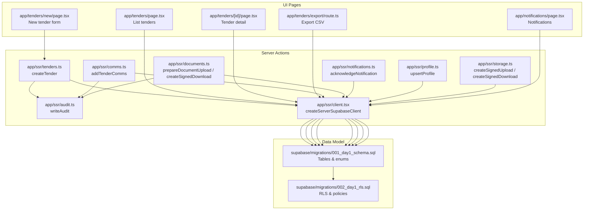

**Diagram sources**
- [app/tenders/page.tsx](file://app/tenders/page.tsx#L1-L65)
- [app/tenders/[id]/page.tsx](file://app/tenders/[id]/page.tsx#L1-L130)
- [app/tenders/new/page.tsx](file://app/tenders/new/page.tsx#L1-L71)
- [app/tenders/export/route.ts](file://app/tenders/export/route.ts#L1-L25)
- [app/ssr/tenders.ts](file://app/ssr/tenders.ts#L1-L43)
- [app/ssr/comms.ts](file://app/ssr/comms.ts#L1-L38)
- [app/ssr/documents.ts](file://app/ssr/documents.ts#L1-L114)
- [app/ssr/audit.ts](file://app/ssr/audit.ts#L1-L29)
- [app/ssr/profile.ts](file://app/ssr/profile.ts#L1-L31)
- [app/ssr/client.tsx](file://app/ssr/client.tsx#L1-L25)
- [app/ssr/storage.ts](file://app/ssr/storage.ts#L1-L35)
- [app/ssr/notifications.ts](file://app/ssr/notifications.ts#L1-L27)
- [app/notifications/page.tsx](file://app/notifications/page.tsx#L1-L68)
- [supabase/migrations/001_day1_schema.sql](file://supabase/migrations/001_day1_schema.sql#L1-L227)
- [supabase/migrations/002_day1_rls.sql](file://supabase/migrations/002_day1_rls.sql#L1-L348)

**Section sources**
- [app/tenders/page.tsx](file://app/tenders/page.tsx#L1-L65)
- [app/tenders/[id]/page.tsx](file://app/tenders/[id]/page.tsx#L1-L130)
- [app/tenders/new/page.tsx](file://app/tenders/new/page.tsx#L1-L71)
- [app/tenders/export/route.ts](file://app/tenders/export/route.ts#L1-L25)
- [app/ssr/tenders.ts](file://app/ssr/tenders.ts#L1-L43)
- [app/ssr/comms.ts](file://app/ssr/comms.ts#L1-L38)
- [app/ssr/documents.ts](file://app/ssr/documents.ts#L1-L114)
- [app/ssr/audit.ts](file://app/ssr/audit.ts#L1-L29)
- [app/ssr/profile.ts](file://app/ssr/profile.ts#L1-L31)
- [app/ssr/client.tsx](file://app/ssr/client.tsx#L1-L25)
- [app/ssr/storage.ts](file://app/ssr/storage.ts#L1-L35)
- [app/ssr/notifications.ts](file://app/ssr/notifications.ts#L1-L27)
- [app/notifications/page.tsx](file://app/notifications/page.tsx#L1-L68)
- [supabase/migrations/001_day1_schema.sql](file://supabase/migrations/001_day1_schema.sql#L1-L227)
- [supabase/migrations/002_day1_rls.sql](file://supabase/migrations/002_day1_rls.sql#L1-L348)

## Core Components
- Tender listing and navigation: renders a sortable table of tenders with actions to create and export.
- Tender detail view: displays deadlines, status, value, follow-up, communications, and documents.
- New tender form: captures reference, deadline, and initial status; submits to server action.
- Server actions: create tender, add communications, manage documents, write audit logs, and acknowledge notifications.
- Data model: typed statuses, channels, and entities; RLS policies govern visibility and edits.
- Notifications: display and acknowledgment flow.
- Export: CSV endpoint for tenders.

**Section sources**
- [app/tenders/page.tsx](file://app/tenders/page.tsx#L1-L65)
- [app/tenders/[id]/page.tsx](file://app/tenders/[id]/page.tsx#L1-L130)
- [app/tenders/new/page.tsx](file://app/tenders/new/page.tsx#L1-L71)
- [app/ssr/tenders.ts](file://app/ssr/tenders.ts#L1-L43)
- [app/ssr/comms.ts](file://app/ssr/comms.ts#L1-L38)
- [app/ssr/documents.ts](file://app/ssr/documents.ts#L1-L114)
- [app/ssr/audit.ts](file://app/ssr/audit.ts#L1-L29)
- [app/ssr/notifications.ts](file://app/ssr/notifications.ts#L1-L27)
- [app/tenders/export/route.ts](file://app/tenders/export/route.ts#L1-L25)
- [supabase/migrations/001_day1_schema.sql](file://supabase/migrations/001_day1_schema.sql#L26-L32)
- [supabase/migrations/002_day1_rls.sql](file://supabase/migrations/002_day1_rls.sql#L75-L113)

## Architecture Overview
The system uses Next.js App Router with server actions for data mutations. Clerk handles authentication; Supabase provides the database and storage. RLS policies enforce access control. Audit logging tracks changes. Notifications support acknowledgments.

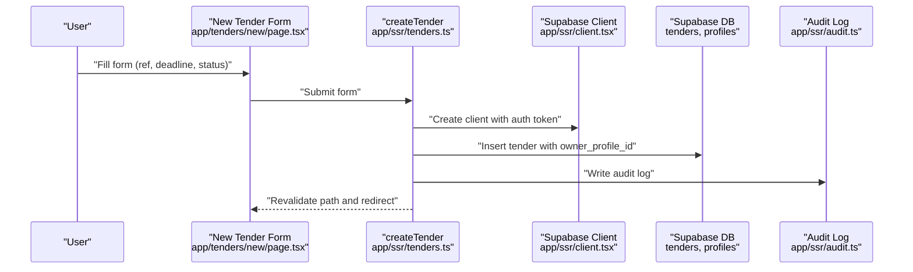

**Diagram sources**
- [app/tenders/new/page.tsx](file://app/tenders/new/page.tsx#L1-L71)
- [app/ssr/tenders.ts](file://app/ssr/tenders.ts#L1-L43)
- [app/ssr/client.tsx](file://app/ssr/client.tsx#L1-L25)
- [app/ssr/audit.ts](file://app/ssr/audit.ts#L1-L29)
- [supabase/migrations/001_day1_schema.sql](file://supabase/migrations/001_day1_schema.sql#L130-L144)

## Detailed Component Analysis

### Tender Creation Workflow
- Form fields: reference, deadline (datetime-local), status (dropdown).
- Submission triggers a server action that:
  - Upserts the current user’s profile.
  - Inserts a new tender with owner_profile_id set to the current profile.
  - Writes an audit log entry.
  - Revalidates the tenders list.

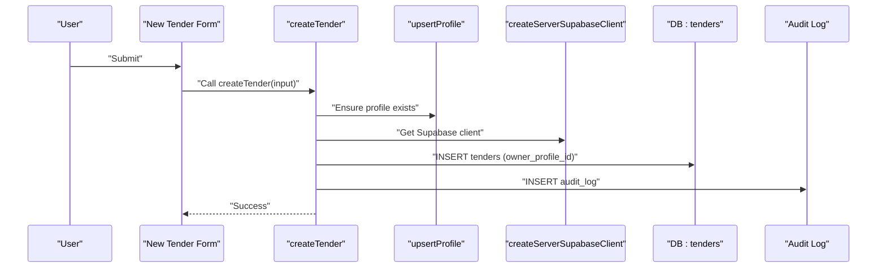

**Diagram sources**
- [app/tenders/new/page.tsx](file://app/tenders/new/page.tsx#L13-L16)
- [app/ssr/tenders.ts](file://app/ssr/tenders.ts#L8-L42)
- [app/ssr/profile.ts](file://app/ssr/profile.ts#L6-L30)
- [app/ssr/client.tsx](file://app/ssr/client.tsx#L4-L14)
- [app/ssr/audit.ts](file://app/ssr/audit.ts#L6-L28)

**Section sources**
- [app/tenders/new/page.tsx](file://app/tenders/new/page.tsx#L6-L16)
- [app/ssr/tenders.ts](file://app/ssr/tenders.ts#L8-L42)
- [app/ssr/profile.ts](file://app/ssr/profile.ts#L6-L30)
- [app/ssr/audit.ts](file://app/ssr/audit.ts#L6-L28)

### Tender Listing and Detail Views
- Listing page fetches tenders, orders by deadline, and renders a table with owner display and actions.
- Detail page:
  - Loads tender with summary fields including status, value, and next follow-up.
  - Computes deadline delta (T-N).
  - Fetches communications and documents concurrently.
  - Provides navigation to upload and back.

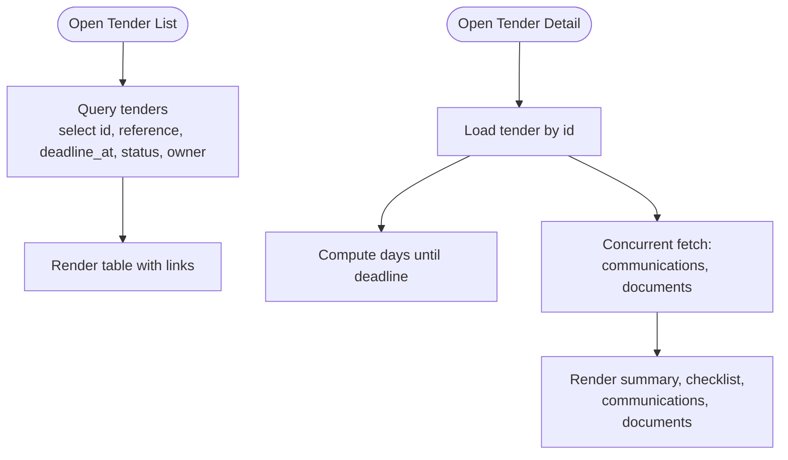

**Diagram sources**
- [app/tenders/page.tsx](file://app/tenders/page.tsx#L4-L64)
- [app/tenders/[id]/page.tsx](file://app/tenders/[id]/page.tsx#L10-L44)
- [app/tenders/[id]/page.tsx](file://app/tenders/[id]/page.tsx#L29-L40)

**Section sources**
- [app/tenders/page.tsx](file://app/tenders/page.tsx#L4-L64)
- [app/tenders/[id]/page.tsx](file://app/tenders/[id]/page.tsx#L10-L44)
- [app/tenders/[id]/page.tsx](file://app/tenders/[id]/page.tsx#L29-L40)

### Tracking Capabilities: Communications and Documents
- Communications:
  - Server action inserts a communication event linked to a tender and the current actor.
  - Audit log records the event.
- Documents:
  - Document preparation creates a storage path and signed upload URL.
  - An extraction job is enqueued for the document.
  - Audit log records the upload.

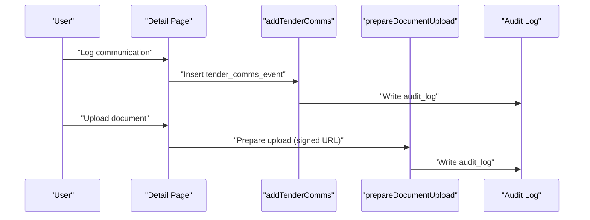

**Diagram sources**
- [app/ssr/comms.ts](file://app/ssr/comms.ts#L7-L37)
- [app/ssr/documents.ts](file://app/ssr/documents.ts#L11-L86)
- [app/ssr/audit.ts](file://app/ssr/audit.ts#L6-L28)

**Section sources**
- [app/ssr/comms.ts](file://app/ssr/comms.ts#L7-L37)
- [app/ssr/documents.ts](file://app/ssr/documents.ts#L11-L86)
- [app/tenders/[id]/page.tsx](file://app/tenders/[id]/page.tsx#L91-L126)

### Deadline Management and Notifications
- Deadline display computes days remaining and shows a T-N label.
- Notification acknowledgment is supported via a dedicated server action and UI page.
- While explicit deadline-triggered notifications are not shown in the referenced code, the data model supports notification types including tender deadlines.

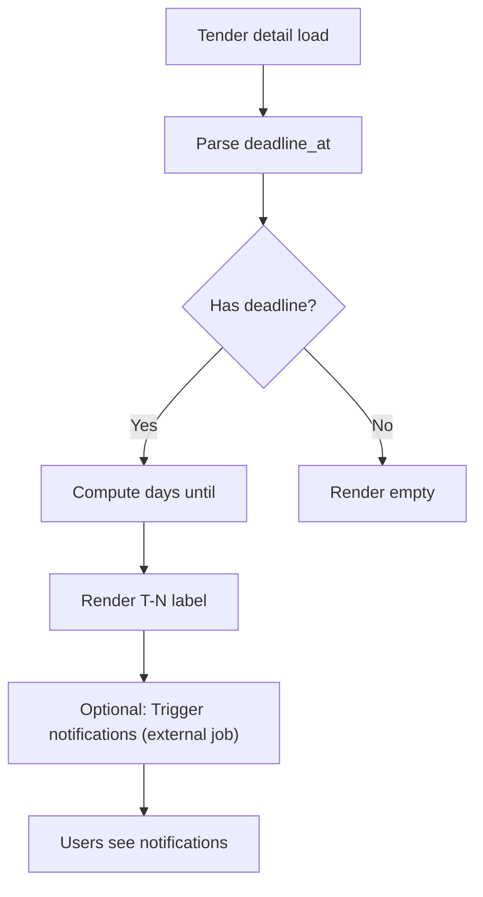

**Diagram sources**
- [app/tenders/[id]/page.tsx](file://app/tenders/[id]/page.tsx#L5-L8)
- [app/tenders/[id]/page.tsx](file://app/tenders/[id]/page.tsx#L42-L44)
- [app/notifications/page.tsx](file://app/notifications/page.tsx#L1-L68)
- [app/ssr/notifications.ts](file://app/ssr/notifications.ts#L7-L26)
- [supabase/migrations/001_day1_schema.sql](file://supabase/migrations/001_day1_schema.sql#L52-L57)

**Section sources**
- [app/tenders/[id]/page.tsx](file://app/tenders/[id]/page.tsx#L5-L8)
- [app/tenders/[id]/page.tsx](file://app/tenders/[id]/page.tsx#L42-L44)
- [app/notifications/page.tsx](file://app/notifications/page.tsx#L1-L68)
- [app/ssr/notifications.ts](file://app/ssr/notifications.ts#L7-L26)
- [supabase/migrations/001_day1_schema.sql](file://supabase/migrations/001_day1_schema.sql#L52-L57)

### Export and Reporting
- CSV export endpoint queries tenders and streams a CSV with headers and rows.
- UI provides an Export CSV link on the tenders list.

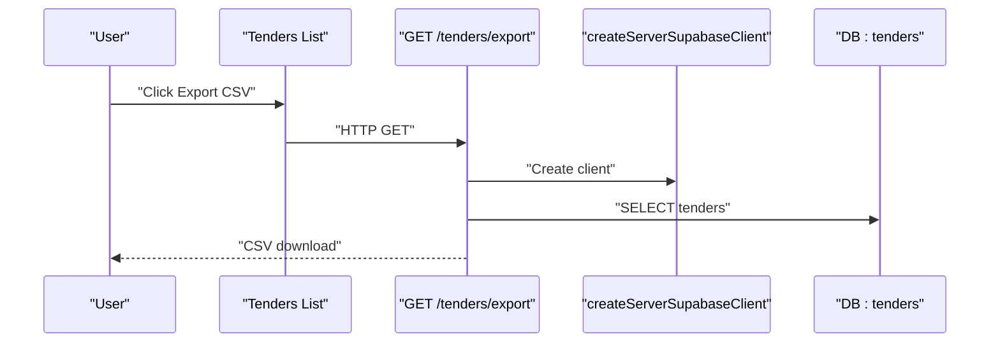

**Diagram sources**
- [app/tenders/page.tsx](file://app/tenders/page.tsx#L19-L21)
- [app/tenders/export/route.ts](file://app/tenders/export/route.ts#L4-L24)
- [app/ssr/client.tsx](file://app/ssr/client.tsx#L4-L14)

**Section sources**
- [app/tenders/page.tsx](file://app/tenders/page.tsx#L19-L21)
- [app/tenders/export/route.ts](file://app/tenders/export/route.ts#L4-L24)

### Access Controls and Audit Trail
- Access control:
  - RLS policies define who can view/edit tenders based on roles, ownership, or membership.
  - Profile upsert ensures current Clerk user maps to a Supabase profile.
- Audit trail:
  - All create/update/delete/upload/ack actions are recorded with actor, entity, and metadata.

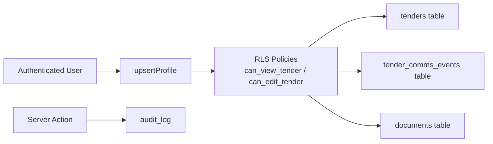

**Diagram sources**
- [app/ssr/profile.ts](file://app/ssr/profile.ts#L6-L30)
- [supabase/migrations/002_day1_rls.sql](file://supabase/migrations/002_day1_rls.sql#L75-L113)
- [app/ssr/audit.ts](file://app/ssr/audit.ts#L6-L28)
- [supabase/migrations/001_day1_schema.sql](file://supabase/migrations/001_day1_schema.sql#L208-L216)

**Section sources**
- [app/ssr/profile.ts](file://app/ssr/profile.ts#L6-L30)
- [supabase/migrations/002_day1_rls.sql](file://supabase/migrations/002_day1_rls.sql#L75-L113)
- [app/ssr/audit.ts](file://app/ssr/audit.ts#L6-L28)

### Practical Scenarios

#### Competitive Bidding Process
- Opportunity identification: create a new tender with a reference and deadline.
- Internal coordination: add communications (notes/outcome) and attach supporting documents.
- Stakeholder engagement: track deadlines and send reminders via notifications (acknowledgment supported).
- Outcome: update status to submitted, awarded, or lost; maintain audit trail.

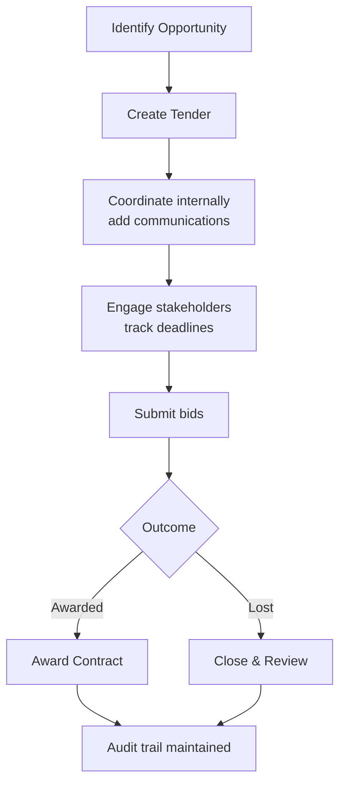

[No sources needed since this diagram shows conceptual workflow, not actual code structure]

#### Stakeholder Coordination
- Use the detail view to monitor deadlines and next follow-ups.
- Log communications per interaction channel.
- Upload relevant documents and track extraction jobs.
- Acknowledge notifications to confirm receipt.

[No sources needed since this section doesn't analyze specific source files]

## Dependency Analysis
Key dependencies and relationships:
- UI pages depend on server actions for mutations and Supabase client for database access.
- Server actions depend on profile upsert, Supabase client, and audit logging.
- Data model defines enums and tables; RLS policies govern access.
- Storage utilities support signed URLs for uploads/downloads.

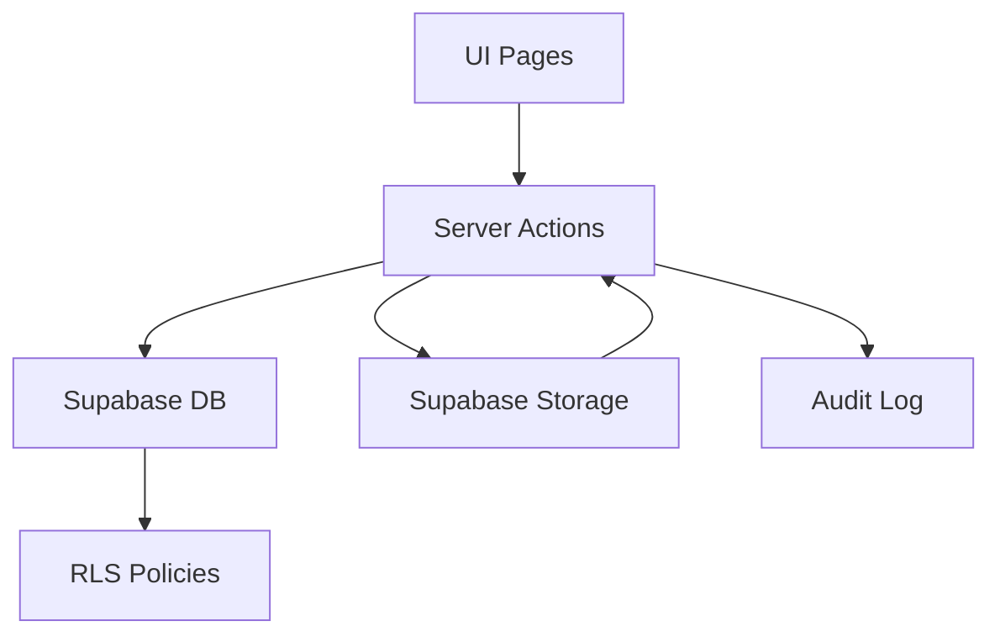

**Diagram sources**
- [app/tenders/page.tsx](file://app/tenders/page.tsx#L1-L65)
- [app/ssr/tenders.ts](file://app/ssr/tenders.ts#L1-L43)
- [app/ssr/client.tsx](file://app/ssr/client.tsx#L1-L25)
- [app/ssr/storage.ts](file://app/ssr/storage.ts#L1-L35)
- [app/ssr/audit.ts](file://app/ssr/audit.ts#L1-L29)
- [supabase/migrations/002_day1_rls.sql](file://supabase/migrations/002_day1_rls.sql#L203-L222)

**Section sources**
- [app/ssr/tenders.ts](file://app/ssr/tenders.ts#L1-L43)
- [app/ssr/client.tsx](file://app/ssr/client.tsx#L1-L25)
- [app/ssr/storage.ts](file://app/ssr/storage.ts#L1-L35)
- [app/ssr/audit.ts](file://app/ssr/audit.ts#L1-L29)
- [supabase/migrations/002_day1_rls.sql](file://supabase/migrations/002_day1_rls.sql#L203-L222)

## Performance Considerations
- Use concurrent queries for detail view communications and documents to reduce latency.
- Indexes on tenders deadline and owner improve listing and filtering performance.
- Prefer server actions for mutations to minimize client-server round trips.
- Signed URLs for storage reduce server bandwidth and improve upload/download throughput.

[No sources needed since this section provides general guidance]

## Troubleshooting Guide
- Authentication errors: ensure Clerk user is present; profile upsert requires an authenticated user.
- RLS access denied: verify roles, ownership, or membership for the tender.
- Audit failures: check audit insertion permissions and metadata correctness.
- Notification acknowledgment: ensure the notification belongs to the current user and is unacknowledged.

**Section sources**
- [app/ssr/profile.ts](file://app/ssr/profile.ts#L8-L10)
- [supabase/migrations/002_day1_rls.sql](file://supabase/migrations/002_day1_rls.sql#L203-L222)
- [app/ssr/audit.ts](file://app/ssr/audit.ts#L25-L27)
- [app/ssr/notifications.ts](file://app/ssr/notifications.ts#L13-L23)

## Conclusion
The Tender Management system provides a clear lifecycle from creation to award, with robust access controls, auditability, and tracking capabilities. The UI offers efficient listing, detail, and form experiences, while server actions encapsulate data mutations and integrations with storage and audit systems. Export and notifications support reporting and stakeholder awareness.

## Appendices

### Data Model Overview
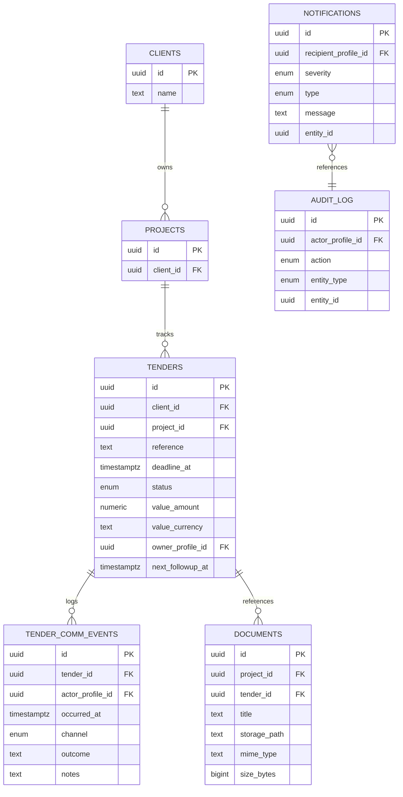

**Diagram sources**
- [supabase/migrations/001_day1_schema.sql](file://supabase/migrations/001_day1_schema.sql#L86-L180)