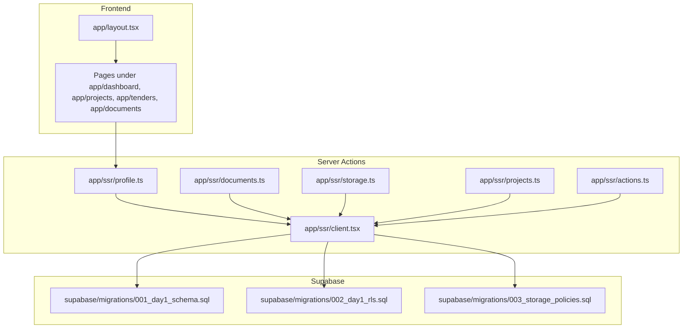
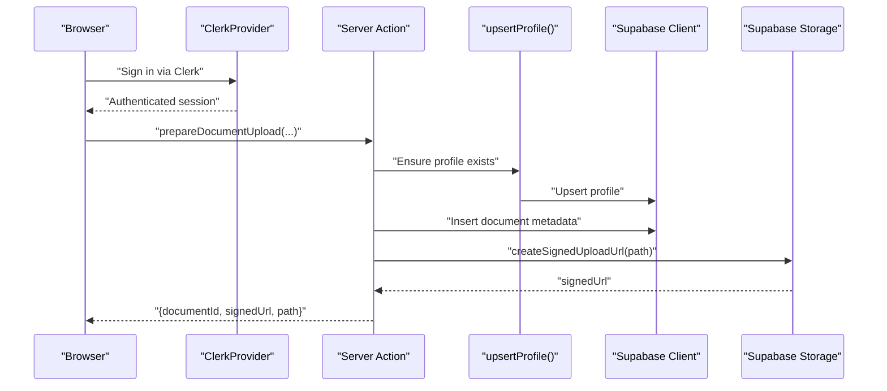
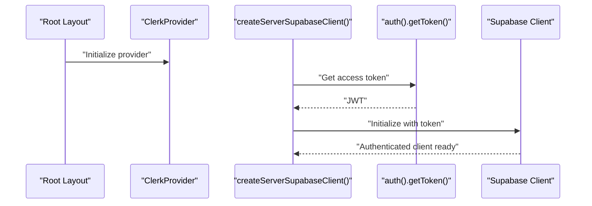
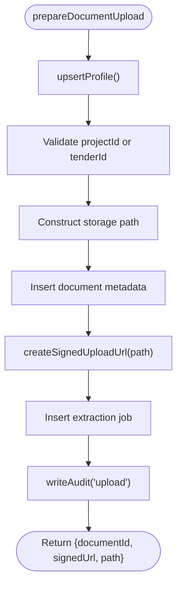
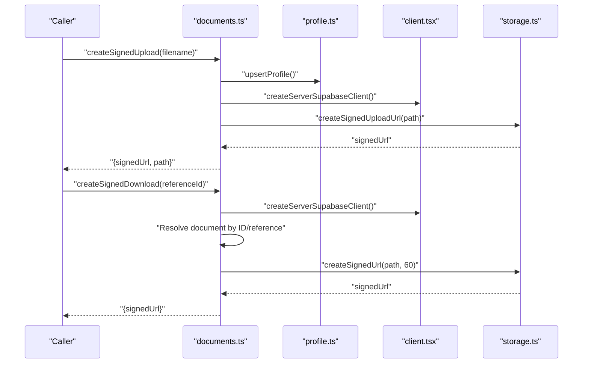
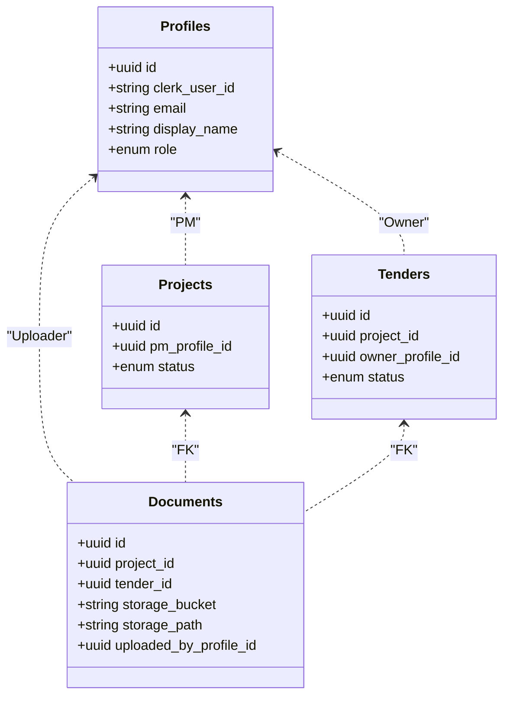
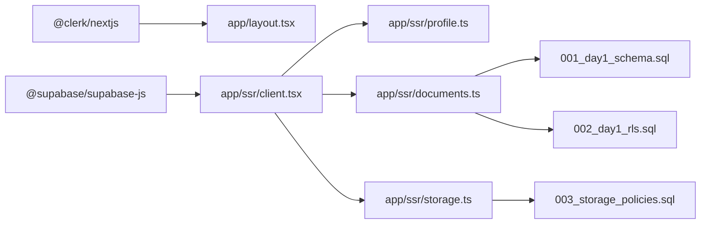

# Troubleshooting and FAQ

<cite>
**Referenced Files in This Document**
- [README.md](file://README.md)
- [.env.local.example](file://.env.local.example)
- [package.json](file://package.json)
- [app/layout.tsx](file://app/layout.tsx)
- [app/ssr/client.tsx](file://app/ssr/client.tsx)
- [app/ssr/profile.ts](file://app/ssr/profile.ts)
- [app/ssr/storage.ts](file://app/ssr/storage.ts)
- [app/ssr/documents.ts](file://app/ssr/documents.ts)
- [app/ssr/projects.ts](file://app/ssr/projects.ts)
- [app/ssr/actions.ts](file://app/ssr/actions.ts)
- [supabase/migrations/001_day1_schema.sql](file://supabase/migrations/001_day1_schema.sql)
- [supabase/migrations/002_day1_rls.sql](file://supabase/migrations/002_day1_rls.sql)
- [supabase/migrations/003_storage_policies.sql](file://supabase/migrations/003_storage_policies.sql)
</cite>

## Table of Contents
1. [Introduction](#introduction)
2. [Project Structure](#project-structure)
3. [Core Components](#core-components)
4. [Architecture Overview](#architecture-overview)
5. [Detailed Component Analysis](#detailed-component-analysis)
6. [Dependency Analysis](#dependency-analysis)
7. [Performance Considerations](#performance-considerations)
8. [Troubleshooting Guide](#troubleshooting-guide)
9. [FAQ](#faq)
10. [Debugging Techniques](#debugging-techniques)
11. [Security Troubleshooting](#security-troubleshooting)
12. [System Maintenance](#system-maintenance)
13. [Escalation Procedures](#escalation-procedures)
14. [Known Limitations and Workarounds](#known-limitations-and-workarounds)
15. [Conclusion](#conclusion)

## Introduction
This document provides comprehensive troubleshooting and FAQ guidance for MCE Command Center. It focuses on resolving build failures due to invalid Clerk keys, RLS access denials causing empty data, document upload failures, and signed URL generation issues. It also includes step-by-step resolution procedures for authentication issues, database connectivity problems, and storage access errors. Guidance is provided for performance tuning, debugging techniques across development and production environments, security troubleshooting, maintenance tasks, escalation procedures, and known limitations.

## Project Structure
The application is a Next.js App Router application integrating Clerk for authentication and Supabase for Postgres, Row Level Security (RLS), and Storage. Key areas relevant to troubleshooting include:
- Authentication and session bridging via Clerk and Supabase
- Database schema and RLS policies
- Storage bucket policies and signed URL generation
- Server-side actions for uploads, downloads, and CRUD operations

**Diagram sources**
- [app/layout.tsx](file://app/layout.tsx#L1-L46)
- [app/ssr/profile.ts](file://app/ssr/profile.ts#L1-L31)
- [app/ssr/client.tsx](file://app/ssr/client.tsx#L1-L25)
- [app/ssr/storage.ts](file://app/ssr/storage.ts#L1-L35)
- [app/ssr/documents.ts](file://app/ssr/documents.ts#L1-L114)
- [app/ssr/projects.ts](file://app/ssr/projects.ts#L1-L43)
- [app/ssr/actions.ts](file://app/ssr/actions.ts#L1-L19)
- [supabase/migrations/001_day1_schema.sql](file://supabase/migrations/001_day1_schema.sql#L1-L227)
- [supabase/migrations/002_day1_rls.sql](file://supabase/migrations/002_day1_rls.sql#L1-L348)
- [supabase/migrations/003_storage_policies.sql](file://supabase/migrations/003_storage_policies.sql#L1-L55)

**Section sources**
- [README.md](file://README.md#L1-L158)
- [package.json](file://package.json#L1-L32)
- [app/layout.tsx](file://app/layout.tsx#L1-L46)

## Core Components
- Authentication and session bridging:
  - ClerkProvider wraps the app and exposes authentication state.
  - Server-side client creation bridges Clerk JWT to Supabase client via access token hook.
  - Profile upsert ensures a user’s profile exists and is mapped to Clerk identity.
- Database and RLS:
  - Schema defines core entities and indexes.
  - RLS policies enforce visibility and edit permissions based on roles and relationships.
- Storage:
  - Private bucket “mce-documents” with policies enforcing access based on document ownership and associated project/tender visibility.
  - Signed URL generation for uploads and downloads.
- Server actions:
  - Document upload preparation, signed URL creation, download URL generation.
  - Project creation and generic task insertion with logging and cache revalidation.

**Section sources**
- [app/layout.tsx](file://app/layout.tsx#L1-L46)
- [app/ssr/client.tsx](file://app/ssr/client.tsx#L1-L25)
- [app/ssr/profile.ts](file://app/ssr/profile.ts#L1-L31)
- [app/ssr/storage.ts](file://app/ssr/storage.ts#L1-L35)
- [app/ssr/documents.ts](file://app/ssr/documents.ts#L1-L114)
- [app/ssr/projects.ts](file://app/ssr/projects.ts#L1-L43)
- [app/ssr/actions.ts](file://app/ssr/actions.ts#L1-L19)
- [supabase/migrations/001_day1_schema.sql](file://supabase/migrations/001_day1_schema.sql#L1-L227)
- [supabase/migrations/002_day1_rls.sql](file://supabase/migrations/002_day1_rls.sql#L1-L348)
- [supabase/migrations/003_storage_policies.sql](file://supabase/migrations/003_storage_policies.sql#L1-L55)

## Architecture Overview
The system integrates Clerk for authentication and Supabase for data and storage. The server-side client obtains an access token from Clerk and uses it to authenticate with Supabase. Profile upsert ensures the user exists in the profiles table. Document operations create metadata rows before generating signed URLs for upload and download.

**Diagram sources**
- [app/layout.tsx](file://app/layout.tsx#L1-L46)
- [app/ssr/profile.ts](file://app/ssr/profile.ts#L1-L31)
- [app/ssr/documents.ts](file://app/ssr/documents.ts#L1-L114)
- [app/ssr/client.tsx](file://app/ssr/client.tsx#L1-L25)
- [supabase/migrations/003_storage_policies.sql](file://supabase/migrations/003_storage_policies.sql#L1-L55)

## Detailed Component Analysis

### Authentication and Session Bridging
- ClerkProvider initializes authentication at the root layout.
- Server-side client uses Clerk’s token to authenticate with Supabase.
- Profile upsert ensures a row exists for the authenticated Clerk user.

**Diagram sources**
- [app/layout.tsx](file://app/layout.tsx#L1-L46)
- [app/ssr/client.tsx](file://app/ssr/client.tsx#L1-L25)

**Section sources**
- [app/layout.tsx](file://app/layout.tsx#L1-L46)
- [app/ssr/client.tsx](file://app/ssr/client.tsx#L1-L25)
- [app/ssr/profile.ts](file://app/ssr/profile.ts#L1-L31)

### Document Upload Pipeline
- Sanitizes filename and constructs storage path.
- Upserts profile, inserts document metadata, generates signed upload URL, and enqueues extraction job.
- Throws descriptive errors on failures.

**Diagram sources**
- [app/ssr/documents.ts](file://app/ssr/documents.ts#L1-L114)
- [app/ssr/profile.ts](file://app/ssr/profile.ts#L1-L31)
- [app/ssr/client.tsx](file://app/ssr/client.tsx#L1-L25)

**Section sources**
- [app/ssr/documents.ts](file://app/ssr/documents.ts#L1-L114)
- [app/ssr/storage.ts](file://app/ssr/storage.ts#L1-L35)
- [app/ssr/profile.ts](file://app/ssr/profile.ts#L1-L31)

### Signed URL Generation
- Upload URL creation requires a pre-existing document metadata row.
- Download URL generation resolves document by ID/reference and creates a short-lived signed URL.

**Diagram sources**
- [app/ssr/documents.ts](file://app/ssr/documents.ts#L1-L114)
- [app/ssr/storage.ts](file://app/ssr/storage.ts#L1-L35)
- [app/ssr/profile.ts](file://app/ssr/profile.ts#L1-L31)
- [app/ssr/client.tsx](file://app/ssr/client.tsx#L1-L25)

**Section sources**
- [app/ssr/documents.ts](file://app/ssr/documents.ts#L1-L114)
- [app/ssr/storage.ts](file://app/ssr/storage.ts#L1-L35)

### Database Connectivity and RLS
- Supabase client initialization uses either public/anon key for browser requests or service role key for server-only operations.
- RLS policies govern access to projects, tenders, documents, and notifications based on roles and relationships.

**Diagram sources**
- [supabase/migrations/001_day1_schema.sql](file://supabase/migrations/001_day1_schema.sql#L76-L180)
- [supabase/migrations/002_day1_rls.sql](file://supabase/migrations/002_day1_rls.sql#L115-L348)

**Section sources**
- [app/ssr/client.tsx](file://app/ssr/client.tsx#L1-L25)
- [supabase/migrations/001_day1_schema.sql](file://supabase/migrations/001_day1_schema.sql#L1-L227)
- [supabase/migrations/002_day1_rls.sql](file://supabase/migrations/002_day1_rls.sql#L1-L348)

## Dependency Analysis
- Frontend depends on ClerkProvider for authentication state.
- Server actions depend on the server-side Supabase client and profile upsert.
- Database and storage policies depend on schema definitions and RLS functions.
- Build-time validation depends on Clerk keys being present and valid.

**Diagram sources**
- [package.json](file://package.json#L11-L19)
- [app/layout.tsx](file://app/layout.tsx#L1-L46)
- [app/ssr/client.tsx](file://app/ssr/client.tsx#L1-L25)
- [app/ssr/documents.ts](file://app/ssr/documents.ts#L1-L114)
- [app/ssr/storage.ts](file://app/ssr/storage.ts#L1-L35)
- [supabase/migrations/001_day1_schema.sql](file://supabase/migrations/001_day1_schema.sql#L1-L227)
- [supabase/migrations/002_day1_rls.sql](file://supabase/migrations/002_day1_rls.sql#L1-L348)
- [supabase/migrations/003_storage_policies.sql](file://supabase/migrations/003_storage_policies.sql#L1-L55)

**Section sources**
- [package.json](file://package.json#L1-L32)
- [README.md](file://README.md#L105-L105)

## Performance Considerations
- Database optimization
  - Leverage existing indexes on frequently queried columns (e.g., projects PM, tenders deadlines, documents project/tender).
  - Keep queries selective and avoid wide scans; use filters on indexed columns.
- Caching strategies
  - Revalidate paths after mutations (e.g., project creation triggers revalidation).
  - Use Next.js cache controls judiciously for read-heavy pages.
- Frontend performance improvements
  - Lazy load heavy components.
  - Optimize image rendering and pagination for lists.
  - Minimize unnecessary re-renders by passing stable props and memoizing derived data.

[No sources needed since this section provides general guidance]

## Troubleshooting Guide

### Build Failures Due to Invalid Clerk Keys
Symptoms:
- Build fails with errors indicating invalid or missing Clerk keys.

Resolution steps:
1. Copy the example environment file to the local environment file.
2. Fill in the Clerk publishable and secret keys.
3. Ensure the application URL matches configured Clerk redirect URLs.
4. Re-run the build.

**Section sources**
- [README.md](file://README.md#L29-L30)
- [README.md](file://README.md#L105-L105)
- [README.md](file://README.md#L143-L144)
- [.env.local.example](file://.env.local.example#L1-L11)

### RLS Access Denials Resulting in Empty Data
Symptoms:
- Queries return empty results despite data being present.

Resolution steps:
1. Confirm the signed-in user has a profile row.
2. Verify the user’s role assignment in the profiles table.
3. Ensure the requested entity belongs to a project/tender the user can view.
4. Check that RLS policies are enabled and applied in the correct order.

**Section sources**
- [README.md](file://README.md#L146-L148)
- [supabase/migrations/002_day1_rls.sql](file://supabase/migrations/002_day1_rls.sql#L115-L348)
- [supabase/migrations/001_day1_schema.sql](file://supabase/migrations/001_day1_schema.sql#L76-L84)

### Document Upload Failures
Symptoms:
- Upload fails during signed URL creation or metadata insertion.

Resolution steps:
1. Verify the private bucket “mce-documents” exists and is configured correctly.
2. Ensure migrations are applied in order.
3. Confirm a document metadata row is created before requesting a signed upload URL.
4. Check that the uploader has permission to edit the associated project or tender.

**Section sources**
- [README.md](file://README.md#L150-L153)
- [app/ssr/documents.ts](file://app/ssr/documents.ts#L57-L63)
- [supabase/migrations/003_storage_policies.sql](file://supabase/migrations/003_storage_policies.sql#L22-L39)

### Signed URL Generation Problems
Symptoms:
- Signed URL creation fails or returns unauthorized.

Resolution steps:
1. Verify storage policies are applied.
2. Ensure the requesting user has access to the linked project or tender.
3. Confirm the document metadata row exists and matches the storage path.

**Section sources**
- [README.md](file://README.md#L155-L157)
- [app/ssr/documents.ts](file://app/ssr/documents.ts#L88-L113)
- [supabase/migrations/003_storage_policies.sql](file://supabase/migrations/003_storage_policies.sql#L3-L20)

### Authentication Issues
Symptoms:
- Users cannot sign in or session tokens are rejected.

Resolution steps:
1. Confirm Clerk publishable and secret keys are set.
2. Ensure redirect URLs match the application URL.
3. Verify the Supabase integration is enabled in Clerk.
4. Check that the server-side client is obtaining and using the access token.

**Section sources**
- [README.md](file://README.md#L64-L72)
- [README.md](file://README.md#L143-L144)
- [app/ssr/client.tsx](file://app/ssr/client.tsx#L9-L11)
- [app/layout.tsx](file://app/layout.tsx#L17-L17)

### Database Connectivity Problems
Symptoms:
- Queries fail due to connection or authentication errors.

Resolution steps:
1. Verify Supabase URL and keys are set correctly.
2. Ensure the service role key is used only for server-side operations.
3. Confirm the database is reachable and migrations are applied.

**Section sources**
- [README.md](file://README.md#L78-L89)
- [app/ssr/client.tsx](file://app/ssr/client.tsx#L16-L24)

### Storage Access Errors
Symptoms:
- Uploads or downloads fail due to bucket or policy issues.

Resolution steps:
1. Confirm the bucket is private and named “mce-documents”.
2. Ensure storage RLS policies are applied.
3. Validate that the user has permission to insert/delete based on document ownership and project/tender visibility.

**Section sources**
- [README.md](file://README.md#L56-L60)
- [supabase/migrations/003_storage_policies.sql](file://supabase/migrations/003_storage_policies.sql#L1-L55)

## FAQ

Q: How do I assign user roles?
A: Roles are assigned manually via SQL updates to the profiles table. Valid roles include super_admin, chairman_vp, dept_head, pm, engineer, finance, viewer.

Q: Why do I see empty data for projects or tenders?
A: Ensure your profile exists and has a valid role. Check that the requested entity belongs to a project/tender you can view according to RLS policies.

Q: Can I upload documents without creating metadata first?
A: No. The application creates a document metadata row before generating a signed upload URL.

Q: What bucket must I use for document storage?
A: Use the private bucket named “mce-documents”.

Q: How do I export projects or tenders?
A: Use the export routes under projects and tenders.

Q: What environment variables are required?
A: Required variables include Clerk publishable and secret keys, Supabase URL and keys, and application URL.

**Section sources**
- [README.md](file://README.md#L128-L139)
- [README.md](file://README.md#L146-L148)
- [README.md](file://README.md#L150-L153)
- [README.md](file://README.md#L56-L60)
- [README.md](file://README.md#L124-L126)
- [README.md](file://README.md#L74-L90)
- [.env.local.example](file://.env.local.example#L1-L11)

## Debugging Techniques

### Development Environment
- Inspect server action logs printed to the console.
- Verify environment variables are loaded and accessible in server actions.
- Use browser developer tools to inspect network requests and response bodies.

**Section sources**
- [app/ssr/actions.ts](file://app/ssr/actions.ts#L14-L16)

### Production Environment
- Review platform logs (e.g., Vercel logs) for build and runtime errors.
- Monitor Supabase dashboard for query performance and policy violations.
- Enable structured logging for server actions and track error messages.

[No sources needed since this section provides general guidance]

## Security Troubleshooting

### RLS Policy Issues
Symptoms:
- Unexpected access denials or privilege escalations.

Resolution steps:
1. Confirm RLS is enabled on all relevant tables.
2. Verify policy conditions align with intended roles and relationships.
3. Test with a known admin or PM account to isolate policy scope.

**Section sources**
- [supabase/migrations/002_day1_rls.sql](file://supabase/migrations/002_day1_rls.sql#L115-L348)

### Access Control Problems
Symptoms:
- Users cannot view or edit records they should have access to.

Resolution steps:
1. Check the current profile role and membership in projects/tenders.
2. Validate that project members or tender members are correctly recorded.
3. Confirm ownership fields (PM, owner) match the current profile.

**Section sources**
- [supabase/migrations/002_day1_rls.sql](file://supabase/migrations/002_day1_rls.sql#L37-L113)
- [supabase/migrations/001_day1_schema.sql](file://supabase/migrations/001_day1_schema.sql#L95-L151)

### Compliance Validation
- Ensure sensitive documents are stored in the private “mce-documents” bucket.
- Confirm storage policies restrict access based on document ownership and associated entity visibility.
- Audit audit_log entries for create/upload/ack events.

**Section sources**
- [README.md](file://README.md#L56-L60)
- [supabase/migrations/003_storage_policies.sql](file://supabase/migrations/003_storage_policies.sql#L1-L55)
- [supabase/migrations/001_day1_schema.sql](file://supabase/migrations/001_day1_schema.sql#L208-L216)

## System Maintenance

### Database Cleanup
- Archive or purge old audit_log entries periodically.
- Remove orphaned records where linked entities no longer exist (if applicable).

[No sources needed since this section provides general guidance]

### Audit Log Management
- Monitor audit_log for upload, create, and acknowledgment events.
- Set retention policies aligned with compliance requirements.

**Section sources**
- [supabase/migrations/001_day1_schema.sql](file://supabase/migrations/001_day1_schema.sql#L208-L216)

### Backup Verification
- Regularly verify Supabase backups and test restoration procedures.
- Confirm that environment variables and migrations are included in backup artifacts.

[No sources needed since this section provides general guidance]

## Escalation Procedures
- For build failures related to Clerk keys, verify environment configuration and redirect URLs.
- For RLS-related access issues, escalate to administrators who can review and adjust policies or roles.
- For storage access problems, escalate to administrators who can validate bucket policies and metadata linkage.
- For database connectivity issues, escalate to infrastructure or Supabase support with logs and error traces.

[No sources needed since this section provides general guidance]

## Known Limitations and Workarounds
- Non-goals (not implemented yet): background extraction, email escalation, RAG/finance/HR dashboards.
- Workaround for missing metadata: ensure the application creates the metadata row before generating signed URLs.
- Workaround for RLS denials: confirm profile existence and role assignments; adjust roles or memberships as needed.

**Section sources**
- [README.md](file://README.md#L16-L16)
- [README.md](file://README.md#L150-L153)
- [README.md](file://README.md#L146-L148)

## Conclusion
This guide consolidates troubleshooting procedures, FAQs, performance tips, security checks, maintenance tasks, and escalation pathways for MCE Command Center. By validating environment configuration, ensuring proper RLS and storage policies, and following the step-by-step resolutions, most issues can be quickly identified and resolved. For persistent problems, leverage debugging techniques and escalate to appropriate administrators or support channels.